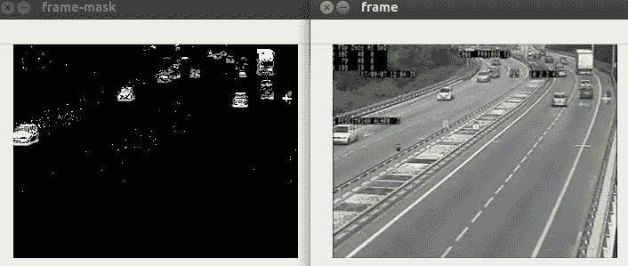

# 建造一个物体追踪器(一):建造/测试一个追踪器

> 原文：<https://dev.to/mandrewcito/building-an-object-tracker-i-building-testing-a-tracker-k39>

这一系列文章将展示一些“如何做”。用于使用 opencv 构建对象跟踪器。

# 设置环境

设置非常简单，只需创建一个虚拟环境并安装 opencv。

```
python3 -m venv venv
source venv/bin/activate
pip install opencv-contrib-python
pip install opencv-python 
```

Enter fullscreen mode Exit fullscreen mode

# 我们‘探测到’的物体

我已经为任何类型的检测创建了一个基本对象，具有公共属性。位置、检测矩形和唯一标识符。

```
class BaseObject(object):
    identifier = None
    position = None
    positions = []
    rectangle = None
    modified = None
    detections = [] 
```

Enter fullscreen mode Exit fullscreen mode

# 追踪者

跟踪器有一个“跟踪”方法来管理新的检测，必要时将其与以前的检测相关联。

那个关联将被委托给被检测对象的‘equals’魔法方法(在下面的帖子中实现)

```
 class ObjectTracker(object):
    def __init__(self):
        self.objects = []
        self._current_id = 1

    def track(self, obj):
        match = self.get(obj)
        if match is None:
            return self.insert(obj)
        else:
            return self.update(obj)

    def get(self, obj):
        matches = list(
            filter(
                lambda x: x == obj,
                self.objects))
        return matches[0] if len(matches) > 0 else None

    def insert(self, obj):
        obj.identifier = self._current_id
        obj.modified = datetime.now()
        obj.detections.append(obj.modified)
        obj.positions = [obj.position]
        self.objects.append(obj)
        self._current_id += 1
        return obj

    def update(self, obj):
        entity = self.get(obj)
        self.objects = list(
            filter(
                lambda x: x.identifier != entity.identifier,
                self.objects))
        entity.position = obj.position
        entity.positions.append(obj.position)
        entity.modified = datetime.now()
        entity.detections.append(entity.modified)
        self.objects.append(entity)
        return entity 
```

Enter fullscreen mode Exit fullscreen mode

# 测试一下！

在测试之前，我们创建一个对象，用与我们的检测相关的属性(汽车属性、人属性、用 SIFT/SURF 检测的一些关键点)初始化它...)任何您认为相关的值或对象的独特特征。

## 我的自定义对象

```
class MycustomObjectClass(BaseObject):
    my_unique_field = None

    def __repr__(self):
        return "{0} {1}".format(self.identifier, self.my_unique_field)

    def __eq__(self, other):
        return self.my_unique_field == other.my_unique_field 
```

Enter fullscreen mode Exit fullscreen mode

## 测试

现在我们测试我们的跟踪类，插入和更新方法将是需要测试的。

```
 class ObjectTrackerTest(unittest.TestCase):
    def setUp(self):
        self.tracker = ObjectTracker()

    def tearDown(self):
        pass

    @classmethod
    def setUpClass(cls):
        pass

    @classmethod
    def tearDownClass(cls):
        pass

    def test_insert(self):
        obj = MycustomObjectClass()
        obj.my_unique_field = "secret"
        obj.position = 1
        self.tracker.track(obj)
        self.assertEquals(len(self.tracker.objects), 1)

    def test_update(self):
        obj = MycustomObjectClass()
        obj.my_unique_field = "secret"
        obj.position = 1

        obj2 = MycustomObjectClass()
        obj2.my_unique_field = "asdf"
        obj2.position = 2

        obj3 = MycustomObjectClass()
        obj3.my_unique_field = "secret"
        obj3.position = 3

        self.tracker.track(obj)
        self.tracker.track(obj2)
        self.assertEquals(len(self.tracker.objects), 2)
        self.tracker.track(obj3)
        self.assertEquals(len(self.tracker.objects), 2) 
```

Enter fullscreen mode Exit fullscreen mode

# 特性

在 [opencv 教程](https://docs.opencv.org/3.0-beta/doc/py_tutorials/py_feature2d/py_table_of_contents_feature2d/py_table_of_contents_feature2d.html)中，有一些很好的特征提取(以及特征匹配)的例子，可以用于你的玩具特征提取器。

## 划定我们的 ROI

但是如果你玩的是视频。你会更喜欢界定感兴趣区域，因为处理所有的图像将是昂贵的，你可以应用的一种技术是背景减法；在这个例子中，你可以看到一个血糖减去的结果，给你一个函数输出的概念。

```
import cv2

video_path = "video/video.avi"

cap = cv2.VideoCapture(video_path)

fgbg = cv2.createBackgroundSubtractorMOG2()

while(1):
    ret, frame = cap.read()
    fgmask = fgbg.apply(frame)
    cv2.imshow('frame-mask', fgmask)
    cv2.imshow('frame', frame)

    k = cv2.waitKey(30) & 0xff
    if k == 27:
        break

cap.release()
cv2.destroyAllWindows() 
```

Enter fullscreen mode Exit fullscreen mode

[](https://res.cloudinary.com/practicaldev/image/fetch/s--4ZoCz52X--/c_limit%2Cf_auto%2Cfl_progressive%2Cq_auto%2Cw_880/https://thepracticaldev.s3.amazonaws.com/i/vm105f1v6v654vh432hh.png)

该功能的结果很简单，将是基于屏幕的先前状态的移动的遮罩。输入框架上的更改将被“标记”。因此，您可以使用该函数的结果来遮罩当前帧。

# 下一集...

我们将检测目标并从中提取一些特征。检测到目标后，我们将它放入跟踪器中，并沿着视频跟踪它。