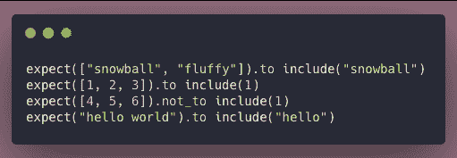
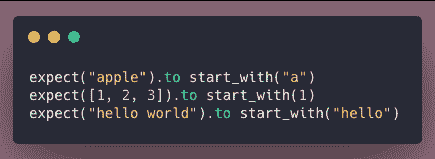

# 用 Ruby 构建测试:期望和匹配器

> 原文：<https://dev.to/torianne02/building-ruby-tests-expectations-and-matchers-2ed6>

在这个博客系列的第一篇[文章](https://dev.to/torianne02/building-tests-in-ruby-the-basics-59mo)中，我讨论了用 Ruby 构建测试所需的基本组件。我简单地讨论了关键字`expect`,并指出我们将在以后的文章中进一步详细讨论它。好了，我们到了！

### 期望

当用 Ruby 构建测试时，`expectations`是一个非常重要的组件。它们允许你设置函数、方法、类等的预期结果。你在测试。我们在 Ruby 测试中设置`expectations`的方式是使用`expect("some code").to`或者相反的`expect("some code").not_to`。

如果你认为这些代码片段似乎没有完成，那你就对了。完成一个`expect`语句还需要另外一个组件:`matchers`。

### 赛者

RSpec 自带内置的`matchers`，可以和`expect().to`一起使用。当构建测试时，你会*期望*预期结果*与`matcher`的意图*相匹配。如果你以前从未见过`matcher`，这可能看起来很奇怪，但不要担心，因为它们很容易解释。正如我在本系列的第一部分中所说的，让您的测试易于阅读是很重要的，RSpec 为我们提供了实现这一点的工具。

我将在这篇文章的剩余部分讨论一些常见的问题，但是应该注意的是，还有很多问题我没有涉及到。

#### `include`

您可能希望使用`include`匹配器来测试集合*是否包含传递给`expect().to`的*。如果“给定集合的任何对象通过了指定的匹配器”，测试将通过

#### `start_with`

你可以使用`start_with`来测试一个字符串或者数组*是否以传递给`expect().to`的*开始。

#### `end_with`

或者，还有一个`end_with`匹配器。这个匹配器用于测试一个字符串或数组*是否以传递给`expect().to`的代码*结束。

### 最后的想法

我们已经复习了`expect().to`和`matchers`。我讨论了三个常用的`matchers`。请在这篇文章之后花一点时间在谷歌上搜索所有不同的`matchers`(有一大堆！).

请始终记住，在构建 RSpec 测试时，您希望它们尽可能对读者友好。它们应该读起来像一个句子，RSpec 给了我们所有这些令人惊讶的工具，比如`expect`关键字和`matchers`，让我们变得简单。

编码快乐！

注意:本周的封面图片是我在加州伍德赛德的温德里奇县公园徒步旅行时拍摄的。

#### 来源

[内置匹配器](https://relishapp.com/rspec/rspec-expectations/docs/built-in-matchers)
[模块:RSpec::Matchers](https://www.rubydoc.info/gems/rspec-expectations/RSpec/Matchers)