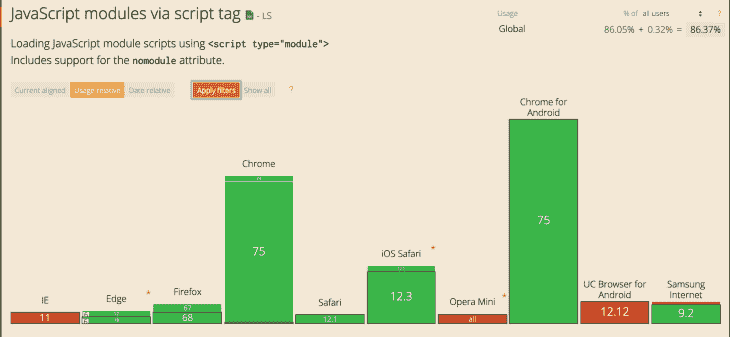

# 无捆绑构建:如何事半功倍

> 原文：<https://dev.to/bnevilleoneill/building-without-bundling-how-to-do-more-with-less-42mp>

**由[弗雷德·肖特](https://blog.logrocket.com/author/fredschott/)撰写** ✏️

您对代码库进行了更改。你点击了保存。你等着…等着…等着。

Web 开发过去都是关于即时反馈的。但是随着 Webpack 和 Parcel 等 web bundlers 的引入，web 开发不再是保存和刷新浏览器那么简单。

当你使用 bundler 时，每次你只改变一行代码，你就不得不等待应用程序的整个部分重新构建。

我们要等这些捆扎机多久？这是我最近开始思考的事情。这让我很困扰，所以我决定弄清楚。

我在笔记本电脑上重温了旧网站，联系了以前的同事，得到了我在过去 3 年中参与的四个主要应用程序的一些硬统计数据。

结果如下:

[](https://res.cloudinary.com/practicaldev/image/fetch/s--TnxXz7g3--/c_limit%2Cf_auto%2Cfl_progressive%2Cq_auto%2Cw_880/https://i2.wp.com/blog.logrocket.com/wp-content/uploads/2019/09/Real-World-Dev-Performance-png.png%3Fresize%3D730%252C390%26ssl%3D1)

好吧，让我们做一些快速的数学运算。

平均来说，假设你每小时测试 10 次浏览器的变化，每 3 小时启动一次应用程序(改变分支，检测新文件等)。

因此，如果你连续一周不间断地使用 App #3 (37 秒的启动时间，2.5 秒的重新编译时间)，那么一周 40 个小时将会引入大约 25 分钟的不间断等待时间。

对于 App #1 (42 秒的启动时间，11 秒的重新编译时间),同样的计算会让你每周在你的开发环境中等待超过 1 小时(约 82 分钟)。

现在，将它乘以几年——这是花费在等待工具上的大量时间。当您考虑到 JavaScript 是一种浏览器已经理解的语言时，这个数字尤其令人沮丧。

我们这里不是编译 Java。在很大程度上，我们正在编写浏览器友好的 JavaScript。

[](https://logrocket.com/signup/)

### 收回你的时间

有没有可能去掉捆绑器，完全跳过这个开发者体验的噩梦？简单的演示在没有捆绑的情况下已经很好了，但是构建一个真正的、全功能的 web 应用程序怎么样呢？你能做到吗？

原来可以。现代的“非捆绑”开发不仅是可能的，而且它给你一个显著更快的开发者体验。

不再需要 1000 多个依赖文件夹，不再需要等待缓慢的启动，也不再需要重建阻碍发展的捆绑包。

为了向您展示我的意思，让我们来看一看今天在没有 bundler 的情况下构建一个现代 web 应用程序是什么样子的。

### 最小可行构建工具

你最少需要的工具是什么？浏览器不能直接从你的计算机上加载文件，所以你首先需要一个本地静态资产服务器。

[Serve](https://www.npmjs.com/package/serve) 是一个流行的、简单的 CLI，可以为你机器上的任何目录提供服务。它还带来了一些额外的好处，比如单页应用程序(SPA)支持和每当文件改变时自动实时重载。

通过在你的开发目录中运行`npx serve`，你可以很容易地在本地建立一个服务 CSS、HTML & JavaScript 的基本站点:

```
<!-- Glitch EMBED -->
<div class="glitch-embed-wrap" style="height: 420px; width: 100%;">
  <iframe
    src="https://glitch.com/embed/#!/embed/laced-newsprint-1?path=&previewSize=0"
    title="undefined on Glitch"
    allow="geolocation; microphone; camera; midi; vr; encrypted-media"
    style="height: 100%; width: 100%; border: 0;">
  </iframe>
</div> 
```

Enter fullscreen mode Exit fullscreen mode

光靠这一套你就能走得很远。多亏了本地的 [ES 模块(ESM)](https://developer.mozilla.org/en-US/docs/Web/JavaScript/Guide/Modules) 语法(在过去 1 年多的时间里，所有现代浏览器都支持该语法)，您可以使用`type="module"`脚本属性本地导入和导出 JavaScript。

您可以用这种方式加载整个应用程序，完全不需要任何额外的工具或配置。

然而，在某些时候，您会想要从 npm 获取一些代码。因此，让我们尝试使用其中一个本地导入来加载 React 框架，以便在我们的应用程序中使用。

### 路障:NPM

```
import React from 'react';

/* TypeError: Failed to resolve module specifier 'react' */ 
```

Enter fullscreen mode Exit fullscreen mode

“嗯……真奇怪。这在 Webpack 上总是有效的…”

**未捆绑的路障#1** :浏览器还不支持通过包名导入(即通过“裸模块说明符”导入)。

Bundlers 通过在构建时自动解析像“react”这样的说明符到正确的入口点文件，使现代 web 开发成为可能。

浏览器不知道“react”文件位于何处，也不知道 node_modules 目录位于服务器的哪个位置。

若要继续，您需要按包的真实文件路径导入包。

```
import React from '/node_modules/react/index.js';

/* ReferenceError: process is not defined */ 
```

Enter fullscreen mode Exit fullscreen mode

“呃，现在怎么办？”

**未捆绑的路障#2** :大多数 npm 包——甚至主要是以 web 为中心的包——需要一个类似 Node.js 的环境，并且会在浏览器中失败。

您会看到一个“process is not defined”错误，因为 React 做的第一件事是检查`process.env.NODE_ENV`，这是一个 Node.js 专用的全局变量，通常也由 bundler 处理。

重要的是要记住，npm 是作为 Node.js 生态系统开始的，它的包应该像 Node.js 上写的那样直接运行。

Bundlers 为浏览器提供了这些节点机制，但代价是我们上面强调的所有这些额外的工具和等待时间。

即使大多数 web 友好的包也仍然会对任何依赖项使用相同的“裸模块说明符”模式，因为 npm 包没有办法知道它的依赖项将相对安装在哪里。

一些 npm 包(Preact、lit-html 等)被编写为在安装后直接提供服务，但是您或多或少会受限于那些没有依赖关系并且仅由少数有思想的包维护者创作的包。

### 重新定义捆绑器

所以我们已经看到了为什么 npm 包在没有捆绑器的情况下不能在浏览器中运行。但是在之前的部分中，我们也看到我们自己的源代码在浏览器中运行得很好。

仅仅为了解决我们的依赖关系中的一个问题，就让我们的整个应用程序在每次变更时都通过一个耗时的开发管道，这看起来是不是有点过头了？

我开始 [@pika/web](https://github.com/pikapkg/web) 进行实验:如果现代 JavaScript 已经发展到拥有原生模块系统的地步，我们就不再需要通过捆绑器来运行它。在这种情况下，您能否重新确定捆绑销售的范围，只关注 npm 中的剩余问题？

依赖关系改变的频率要低得多——这个新工具只需要在 npm/yarn 安装后在您的`node_modules/`文件夹中运行，而不是在每次改变后。

@pika/web 将任何 npm 包安装到在浏览器中运行的单个 JavaScript 文件中。当它运行时，内部包导入被解析为浏览器能够理解的内容，任何坏的节点-ism 都被转换为在浏览器中运行。

[](https://res.cloudinary.com/practicaldev/image/fetch/s--HMeXZbmC--/c_limit%2Cf_auto%2Cfl_progressive%2Cq_auto%2Cw_880/https://i2.wp.com/blog.logrocket.com/wp-content/uploads/2019/09/pika-web.png%3Fresize%3D730%252C233%26ssl%3D1)

它是一个只关注依赖项的安装时工具，不需要任何其他的应用程序构建步骤。

为了获得最佳效果，您应该使用包含本机 ESM 语法的现代软件包。

NPM 有超过 70，000 个这样的现代包装。现在，您可能已经在 web 应用程序中使用了一些。您可以访问 [pika.dev](https://www.pika.dev/) 来搜索并找到任何用例的版本。

如果你找不到你想要的包，@pika/web 也可以处理大多数非 ESM 的传统 NPM 包。

### 鼠兔快速入门

让我们用@pika/web 安装更小的 ESM 替代 React: Preact。在新项目中，运行以下命令:

```
npm init                     # Create an empty package.json, if you haven't already
npm install preact --save    # Install preact to your node_modules directory
npx @pika/web                # Install preact.js to a new web_modules directory
serve .                      # Serve your application 
```

Enter fullscreen mode Exit fullscreen mode

现在，您的应用程序可以在浏览器中直接使用下面的导入，而无需构建步骤:

```
import {h, render} from '/web_modules/preact.js';
render(h('h1', null, 'Hello, Preact!'), document.body); /* <h1>Hello, Preact!</h1> */ 
```

Enter fullscreen mode Exit fullscreen mode

试着在你的浏览器中运行一下，自己看看。继续添加依赖项，根据需要将它们导入到您的应用程序中，然后观看`serve`实时重新加载您的站点以查看即时反映的更改。

### 行动中的鼠兔

没有人喜欢直接使用 raw `h()`调用。JSX 是 React & Preact 的一个流行的语法扩展，但它需要一个像 Babel 或 TypeScript 这样的构建步骤才能在浏览器中工作。

幸运的是，Preact 的杰森·米勒创造了一个可以直接在浏览器中运行的替代 JSX 的网站，名为`htm`

```
import {h, render} from '/web_modules/preact.js';
import htm from '/web_modules/htm.js';
const html = htm.bind(h);
render(html`<h1>Hello, ${"Preact!"}</h1>`, document.body) 
```

Enter fullscreen mode Exit fullscreen mode

同样，如果你想将 CSS 应用到你的 UI 组件中，你可以使用一个 web 原生的 CSS 库，比如 CSZ:

```
import css from '/web_modules/csz.js';
// Loads style.css onto the page, scoped to the returned class name
const className = css`/style.css`;
// Apply that class name to your component to apply those styles
render(html`<h1 class=${headerClass}>Hello, ${"Preact!"}</h1>`, document.body); 
```

Enter fullscreen mode Exit fullscreen mode

### 我想念我的构建工具

围绕这个“未建成”的开发项目，人们越来越兴奋。如果您使用@pika/web 来安装现代 npm 包，您将不再需要等待构建步骤或重新编译步骤。

您唯一需要等待的是本地开发服务器上 10-20 毫秒的实时重新加载时间。

您仍然可以像 Babel 一样选择添加一个**构建**步骤，甚至可以不添加一个**捆绑**步骤。

构建工具能够在几毫秒内编译单个文件的更改，TypeScript 甚至有一个`--incremental`模式，通过从您上次停止的地方继续来保持启动时间快速。

```
/* JavaScript + Babel */
import {h, render} from '/web_modules/preact.js';
render(<h1>Hello, Preact!</h1>, document.body);
/* CLI */
babel src/ --out-dir js/ --watch 
```

Enter fullscreen mode Exit fullscreen mode

有了 Babel，您还可以获得@pika/web Babel 插件，它可以自动处理裸模块说明符转换(" preact" → "web_modules/preact.js ")。

```
/* JavaScript + Babel + "@pika/web/assets/babel-plugin.js" */
    import {h, render} from 'preact';
    render(<h1>Hello, Preact!</h1>, document.body); 
```

Enter fullscreen mode Exit fullscreen mode

我们最终的代码片段与您在捆绑的 web 应用程序中看到的没有什么区别。

但是通过移除捆绑器，我们能够从我们的构建管道中拉出数百个依赖项，从而实现巨大的开发时迭代加速。

此外，@pika/web README 为那些对使用 React 而不是 Preact 感兴趣的人提供了说明。

### CDNs——完全避免依赖管理

内容交付网络(cdn)能够为公众消费提供资产，这意味着它们也能够为我们修复糟糕的 npm 包。

cdn 对于完全依赖管理越来越受欢迎，一些项目如 Deno 将它们用于所有依赖管理。

在浏览器中直接运行 npm 软件包时，有两个选项值得一试:

*   UNPKG:一个流行的 CDN，提供任何 npm 包的逐文件内容。附带了一个非常简洁的`?module`标志，它将从裸说明符(例如:“lodash-es”)到相对 UNPKG URLs(例如:“/lodash-es/v3.1.0/lodash.js”)的导入重写。
*   Pika CDN:Pika 项目也有一个 CDN，但是它不是为单个文件服务，而是为整个单个文件包服务。把它想象成一个托管的@pika/web。这些单文件包的加载速度比 UNPKG 快得多，CDN 足够智能，可以为您提供浏览器所需的最少数量的聚合填充/传输。但是缺点是不能通过内部包文件导入——目前，只能导入整个包。

### 遗留浏览器呢？

围绕非捆绑 web 开发的最大担忧是它只能在现代浏览器上运行。Caniuse.com 报告称，全球 86%的用户支持这种现代 ESM 语法，包括过去 1-2 年发布的所有主流浏览器。

但仍有 14%的用户使用 IE11 或 UC 浏览器(一种在亚洲流行的网络浏览器)等传统浏览器。

[](https://res.cloudinary.com/practicaldev/image/fetch/s--3PJ_Hh3j--/c_limit%2Cf_auto%2Cfl_progressive%2Cq_auto%2Cw_880/https://i1.wp.com/blog.logrocket.com/wp-content/uploads/2019/09/JavaScript-modules-via-script-tag.png%3Fresize%3D730%252C337%26ssl%3D1)

对于一些网站——尤其是那些专注于移动和非企业用户的网站——这可能没问题。例如，https://www.pika.dev 通常拥有更现代的用户群，在过去一年的运营中，我们只收到过一次关于使用现代 JavaScript 的投诉。

但是，如果您需要针对遗留浏览器或者担心加载性能，那么没有什么可以阻止您在生产中使用 bundler。事实上，这种设置可以让你两全其美:

一个让您快速迭代的本地开发环境，以及一个由 Webpack 或 package 提供支持的较慢的生产构建管道，它面向较旧的浏览器。

```
<!-- Modern browsers load the unbundled application -->
 <script type="module" src="/js/unbundled-app-entrypoint.js"></script>
 <!-- Legac browsers load the legacy bundled application -->
 <script nomodule src="/dist/bundled-app-entrypoint.js"></script> 
```

Enter fullscreen mode Exit fullscreen mode

### 结论

很长时间以来，你第一次可以选择是否使用捆绑器。

像 Pika 这样的项目和@pika/web 这样的工具都是为了让您重新拥有这种选择。他们让每个人都有这样的选择，尤其是那些对 JavaScript、bundler 配置、1000 多个依赖项安装或 bundler 插件生态系统中出现的所有突破性变化和奇怪的东西还不太有信心的人。

我预计未来几年的 web 开发将会非常简单:为高级用户提供高级工具支持，同时降低其他人的门槛。

* * *

**编者按:**看到这个帖子有问题？你可以在这里找到正确的版本。

## Plug: [LogRocket](https://logrocket.com/signup/) ，一款适用于网络应用的 DVR

[](https://res.cloudinary.com/practicaldev/image/fetch/s--6FG5kvEL--/c_limit%2Cf_auto%2Cfl_progressive%2Cq_auto%2Cw_880/https://i2.wp.com/blog.logrocket.com/wp-content/uploads/2017/03/1d0cd-1s_rmyo6nbrasp-xtvbaxfg.png%3Fresize%3D1200%252C677%26ssl%3D1)

[log rocket](https://logrocket.com/signup/)是一个前端日志工具，让你重放问题，就像它们发生在你自己的浏览器中一样。LogRocket 不需要猜测错误发生的原因，也不需要向用户询问截图和日志转储，而是让您重放会话以快速了解哪里出错了。它可以与任何应用程序完美配合，不管是什么框架，并且有插件可以记录来自 Redux、Vuex 和@ngrx/store 的额外上下文。

除了记录 Redux 动作和状态，LogRocket 还记录控制台日志、JavaScript 错误、stacktraces、带有头+体的网络请求/响应、浏览器元数据、自定义日志。它还使用 DOM 来记录页面上的 HTML 和 CSS，甚至为最复杂的单页面应用程序重新创建像素级完美视频。

[免费试用](https://logrocket.com/signup/)。

* * *

帖子[没有捆绑的建筑:如何少花钱多办事](https://blog.logrocket.com/building-without-bundling/)最先出现在[博客](https://blog.logrocket.com)上。