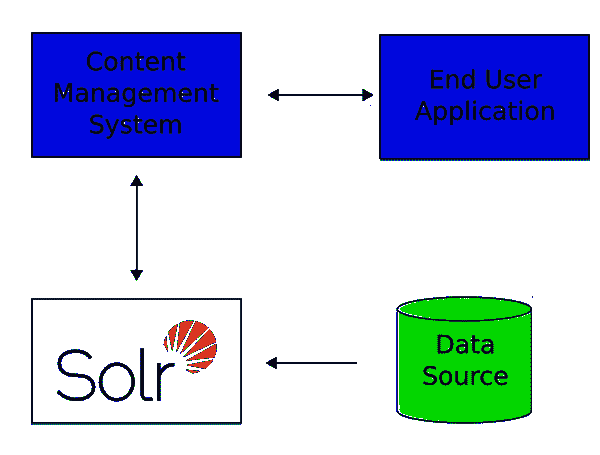
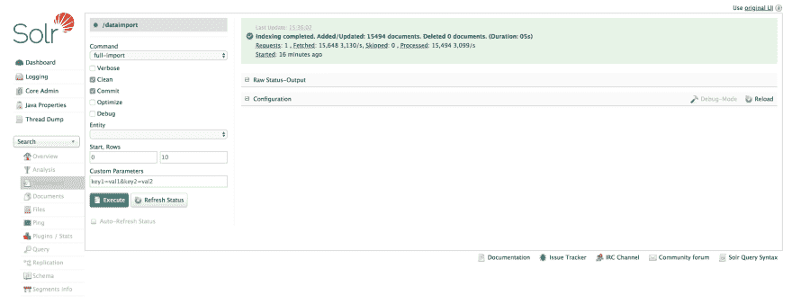

# CakePHP 和 Solr 集成

> 原文：<https://dev.to/danvoyce/cakephp-and-solr-integration-417e>

最近，我不得不在 CakePHP 3 中用 Apache Solr 开发本地 CMS 的全文搜索，这是一次多么大的冒险啊！原因在于，用户能够在我们的[位置智能和消费者参与平台(local Engage)](https://locally.io/products/engage)
中搜索与位置和印象相关的所有信息非常重要。如果 Solr 对您来说是一个全新的世界，就像我开始开发这个项目时对我来说一样，Solr 项目提供了一个关于 Solr(发音为“Solar”)的快速定义:

> Solr 具有高度的可靠性、可伸缩性和容错性，提供分布式索引、复制和负载平衡查询、自动故障转移和恢复、集中式配置等。Solr 为许多世界上最大的互联网网站的搜索和导航功能提供了动力。

## Solr 与 CakePHP 集成

[](https://res.cloudinary.com/practicaldev/image/fetch/s--bKl40Qp1--/c_limit%2Cf_auto%2Cfl_progressive%2Cq_auto%2Cw_880/https://thepracticaldev.s3.amazonaws.com/i/04rmat7cwm8c5s535eba.png)

上面的图表完美地说明了我在这个任务中必须做的事情。因此，为了将 Solr 与其他搜索服务器应用程序(如本地 CMS)集成，基本上我们必须:

*   定义模式

*   部署 Solr

*   向 Solr“输入”用户将要搜索的文档

*   通过 Solarium PHP Solr 客户端库创建 Solr 和 CakePHP 之间的链接

*   在 CMS 中实现搜索

关于我为完成这个任务所做的一切，我有很多东西要分享，所以我将把它分成几篇博文。在今天的帖子中，我将谈论 6.6 版的 Solr 核心配置，当 Solr 配置为与多核一起工作时。

**全文搜索:单核还是多核？**
当你有一个关系数据库时，也许你的第一选择是拥有多个内核，每个内核对应我们数据库中的一个可搜索表，这很有意义。但是，在做出这个选择之前，我们需要考虑一些事情:

*   Solr 不是关系型的，所有可搜索的单词都存储在一个“反向索引”中，这是它如此快速的原因；

*   多核意味着多重配置、指数化和维护；

*   如果您使用多个内核，在某个阶段您可能需要“连接”您的数据。

我们在本地的决定是只配置一个核心“搜索”。因此，我们的数据库表提供的所有可搜索数据都是使用数据导入请求处理程序作为文档导入 Solr 的。

## 单核配置

Solr 是使用 XML 文件配置的。为了在 Solr 中创建单个内核，必须预先配置一些文件，基本上是:solrconfig.xml、schema.xml 和 data-config.xml。一旦 solrconfig.xml 文件可以很好地与 Solr 默认配置一起工作，并且该任务不需要任何更改，我就不会详细介绍它了。

## [T1】data-config . XML](#dataconfigxml)

这个文件是我们指定文档来源的地方，正如我之前提到的，这是使用数据导入请求处理程序从 MySQL 表中获取索引的。所有的配置必须在标签之间。

指定文档的数据源，一个简单的与 MySQL 的 JDBC 连接。

```
<dataSource type="JdbcDataSource" 
               driver="com.mysql.jdbc.Driver" 
               url="jdbc:mysql://HOST/DATABASE" 
               user="USER" 
               password="PASSWORD" /> 
```

对于实体和字段配置，我使用了一个数据库视图，而不是指定多个表及其所有字段，因为我们已经决定使用单个核心。此外，您不希望任何人搜索带有敏感信息的领域，如密码、信用卡和令牌，对吗？！所以，也是出于安全考虑，我选择了观景。

在标记之间，我们指定另一个标记，其中我们在属性名中指定表名(在我们的例子中是视图),在属性 pk 中指定主键，在属性查询中，可以通知 SQL 查询。

在标记中，我们指定了查询的字段，这些字段将在索引文档后在 Solr 中可见。属性列和名称是必不可少的。

这是这种配置的一个例子。

```
<document>
        <entity name="MyView"
                pk="id"
                query="SELECT * FROM MyView">
            <!-- Fields that will be returned by the query -->
            <field column="id" name="id"/>
            <field column="name" name="name"/>
            <field column="created" name="created"/>
            <field column="modified" name="modified"/>
            ...
        </entity>
    </document> 
```

以及 data-config.xml 的完整示例

```
<dataConfig>
   <dataSource type="JdbcDataSource" 
               driver="com.mysql.jdbc.Driver" 
               url="jdbc:mysql://HOST/DATABASE" 
               user="USER" 
               password="PASSWORD" />
   <document>
      <entity name="MyView" pk="id" query="SELECT * FROM MyView">
         <!-- Fields that will be returned by the query -->
         <field column="id" name="id" />
         <field column="name" name="name" />
         <field column="created" name="created" />
         <field column="modified" name="modified" />
         ...
      </entity>
   </document>
</dataConfig> 
```

## schema.xml

这是另一个具有默认配置的文件，但我要强调一些特定的点，它们对于配置全文搜索是必不可少的。

这个文件是这样开始的:

```
<?xml version="1.0" encoding="UTF-8"?>
<schema name="example-data-driven-schema" version="1.6">
  <uniqueKey>id</uniqueKey>
  ...
  </schema> 
```

本文档的第一个要点是，必须指定标签 id。这与`<entity name="MyView" pk="id"></entity>`和`<field column="id" name="id" />`中指定的字段相同。

我们实体(查询)的其他字段以此格式通知:

```
 <!-- Query Fields -->
    <field name="id"  type="int" indexed="true" stored="true"  />
    <field type="string" indexed="true" stored="true" name="name" />
    <field type="date"  indexed="true" stored="true"  name="created" />
    <field type="date"  indexed="true" stored="true"  name="modified" /> 
```

为了允许全文搜索，这意味着能够在我们的文档的任何字段中进行搜索，可以通知一个特殊的字段，在我们的情况下，字段名 *text* 将起作用，该字段是 text_general 类型，它是多值的，这允许该字段接收不同格式和类型的多个值，并且不被存储。在这之后，我们可以使用一个由标签定义的 copyField，这相当于对 Solr 说:

对于找到的任何索引(source="* ")，将结果复制到字段(dest=" *text* ")并返回结果。

```
<field name="_text_" type="text_general" multiValued="true" indexed="true" stored="false"/>
<copyField source="*" dest="_text_"/> 
```

## 在 Solr 中创建核心

配置好文件后，我们需要在 Solr 服务器中创建以下文件夹，其中“Search”是我们核心的名称:

```
/path/to/solr/data/Search

/path/to/solr/data/Search/conf

/path/to/solr/data/Search/data 
```

在`/path/to/solr/data/Search/conf`中，我们将放置我们的 3 个文件:`solrconfig.xml`、`schema.xml`和`data-config.xml`以及任何其他配置文件，如`currency.xml`、`elevate.xml`等。

现在，在 Solr 服务器的核心 Admin 中，创建一个名为“Search”的新核心:

[](https://res.cloudinary.com/practicaldev/image/fetch/s--uhAdvwOu--/c_limit%2Cf_auto%2Cfl_progressive%2Cq_auto%2Cw_880/https://thepracticaldev.s3.amazonaws.com/i/8mqvofffz2lbzclreihv.png)

之后，选择在核心选择器中创建的核心，导航到数据导入并执行完全导入，为此，选择命令“完全导入”并单击按钮“执行”，然后单击“刷新状态”。或者，您也可以选中“自动刷新状态”字段，然后不必单击“刷新状态”。响应应该类似于以下内容:

[](https://res.cloudinary.com/practicaldev/image/fetch/s---4aRnUB8--/c_limit%2Cf_auto%2Cfl_progressive%2Cq_auto%2Cw_880/https://thepracticaldev.s3.amazonaws.com/i/076l4gsd8lzvu2wkmnmc.png)

执行简单查询:

[](https://res.cloudinary.com/practicaldev/image/fetch/s--uz8EsK0h--/c_limit%2Cf_auto%2Cfl_progressive%2Cq_auto%2Cw_880/https://thepracticaldev.s3.amazonaws.com/i/8untm8m4ixaqj2jaais5.png)

这个帖子到此为止！

在接下来的博客文章中，我将继续讨论以下几点:

*   Solarium PHP Solr 客户端库:连接，搜索选项，返回结果。

*   CakePHP Solr 行为:执行搜索，添加，删除文档。

*   在你的前端显示 Solr 搜索结果。

|  | **Lorena Santana -平台开发商**在过去的+8 年中，使用不同的技术和方法进行系统分析师/Web 开发。有 ERP，CMS 和框架的经验，如 CakePHP，Bootstrap 和 Wordpress。全栈开发人员，自学，擅长数据库建模和维护，也擅长需求收集。有敏捷方法的经验，能在压力下很好地工作。实习生经验。 |