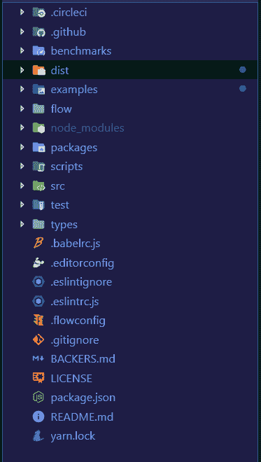
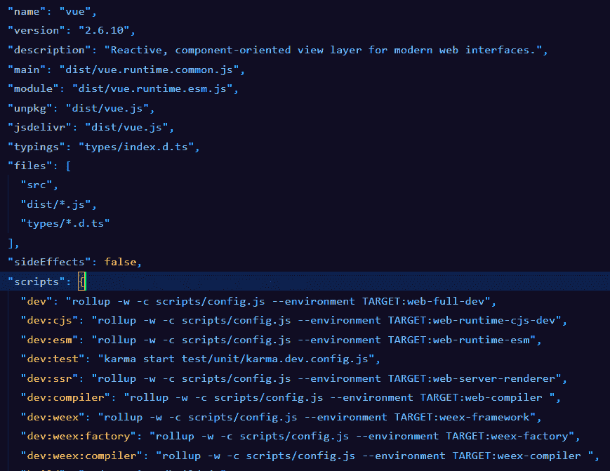
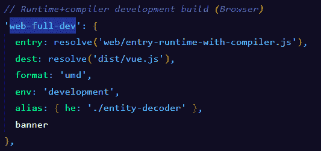

# VueJS 爱好者能理解 VueJS 在幕后是如何工作的吗[第一部分]

> 原文：<https://dev.to/jsbaguette/can-i-understand-all-in-vuejs-part-1-2bmh>

# 亲爱的朋友们，你们好

背景:

我想帮助 VueJS 项目，并试图帮助解决一些问题，但很沮丧，因为我没有真正的技术背景知识。

所以我决定开始这个系列，也许它会帮助人们理解 VueJS 背后发生的事情。也许你会帮我加速旅行。

## 安装

从分叉或克隆 vue 项目开始

```
 git clone https://github.com/vuejs/vue

  cd vue

  yarn 
```

Enter fullscreen mode Exit fullscreen mode

为什么是纱线？

事实上有一个故事。锁这就是为什么😄

## 开发环境

此时，我将尝试理解开发环境。

[](https://res.cloudinary.com/practicaldev/image/fetch/s--yCeD-g2v--/c_limit%2Cf_auto%2Cfl_progressive%2Cq_auto%2Cw_880/https://thepracticaldev.s3.amazonaws.com/i/trzyiq08a84g9kiuiw1l.PNG)

首先，我将关注 package.json 来理解如何启动开发环境。

[](https://res.cloudinary.com/practicaldev/image/fetch/s--zZ9zlqkG--/c_limit%2Cf_auto%2Cfl_progressive%2Cq_auto%2Cw_880/https://thepracticaldev.s3.amazonaws.com/i/5rvb1e3lqe7nzg80sezz.PNG)

不要害怕！我们会一步一步来。

首先关注文件。

这里的 files 键告诉 npm 应该将哪个文件数组显式地添加到 npm 包中。

如果你想反过来。应该使用. npmignore。

因此，在这里，我们将了解一下类型和 src

### -类型-

实际上 VueJS 使用的是流类型和类型脚本。我不会告诉更多，因为我现在不需要更多关于打字配置的信息。但是我所知道的是，vue 3 通常只使用类型脚本和函数基础组件，而不使用类来进行更简单的类型推断

检查 [RFC](https://github.com/vuejs/rfcs/blob/function-apis/active-rfcs/0000-function-api.md#type-inference)

### - SRC -

我们将在后面谈到 src，请记住这是源代码。

### -config-

基本上我们现在只关注

`yarn run dev`

我们也能看到

```
 yarn run dev:cjs

  # and

  yarn run dev:esm 
```

Enter fullscreen mode Exit fullscreen mode

由于我无法解释它们之间所有的具体差异，我将不得不为接下来的文章做更多的研究。

所以`yarn run dev`会用`TARGET:web-full-dev`启动 scripts/config.js

是的，我知道 config.js 很重，但是不要放弃，我们已经接近第一篇文章的结尾了！

在 web-full-dev 上，你会看到这个:

[](https://res.cloudinary.com/practicaldev/image/fetch/s--eGXKAYXZ--/c_limit%2Cf_auto%2Cfl_progressive%2Cq_auto%2Cw_880/https://thepracticaldev.s3.amazonaws.com/i/ft5sryykq16ndtkfwufp.PNG)

*   条目:我们将开始播放的第一个文件！
*   不含编译器的 vuejs 运行时(实际上我不能解释什么是运行时和编译器，但是相信我，在本系列的最后我们会解释的！)
*   格式:umd(通用模块定义。我知道一些关于它的事情，但是作为 esm 和 T2 cjs 给我时间写一篇完整的文章(如果你知道的话，请在评论中告诉我😄).
*   发展(感谢夏洛克！)
*   别名:在 vuejs src 文件中你会看到这样的东西`import config from 'core/config'`我所知道的是使用 vue js[roll up-plugin-alias](https://www.npmjs.com/package/rollup-plugin-alias)

它允许你使用`'core/config'`来代替写`'../../../'`。我真的不确定这发生在配置的什么地方，但它确实在这里。(如果你能很好地解释，请在评论中告诉我，我会更新这一部分)

*   横幅:正在修改日志

太酷了！！现在我们知道会发生什么了:

但是等等，你给我解释一下我想开发的配置。

### -运行开发-

好的，运行`yarn run dev`

它会在`dist/`文件夹中生成 vue.js(运行时+编译器)。

如果您在 src 中更改文件，该命令会监视更改并更新文件。

### -使用示例-

现在您已经运行了 dev 命令。

看一看范例文件夹。你会有很多例子，但我会选择最好的 todomvc 文件夹。

全局安装 http-server 或其他。

`npm i -g http-server`

并在根项目文件夹中运行它！

`http-server .`

为什么在根文件夹上？因为你在 index.html 有相对进口

在浏览器中打开`http://localhost:8080/examples/todomvc/index.html`

然后**瞧**这个项目正在运行，但是没有使用我们正在构建的 vue.js。

前往`index.html`并更换

`<script src="../../dist/vue.min.js"></script>`

经过

`<script src="../../dist/vue.js"></script>`

正如我们之前看到的，我们没有构建缩小版。

重新加载页面，现在项目正在使用好的 js 文件。

要测试它是否真的在工作，请转到`src\platforms\web\entry-runtime-with-compiler.js`并在导入之后添加一些 console.log

`l.12 console.log("asdjasdkjlajsdlkadls");`

在浏览器中按 Ctrl + Shift + R 进行硬重新加载并删除缓存，或者在 chrome 浏览器中按 Ctrl + R 禁用缓存。

您应该在控制台中看到日志！你现在已经准备好帮助 VueJS 项目了。是的，这是很多信息，但我希望你还在这里！

# 结论:

最后，我有两个问题需要回答:

*   清楚了解 cjs、esm 和 umd 之间的具体差异(重要)。
*   清楚了解`scripts/config.js`(中/低)上的别名配置。

欢迎在评论中帮助我😄。

我希望你会喜欢这个系列，我会每两周写一篇文章。

我现在正在等待你的评论！下一篇文章再见。