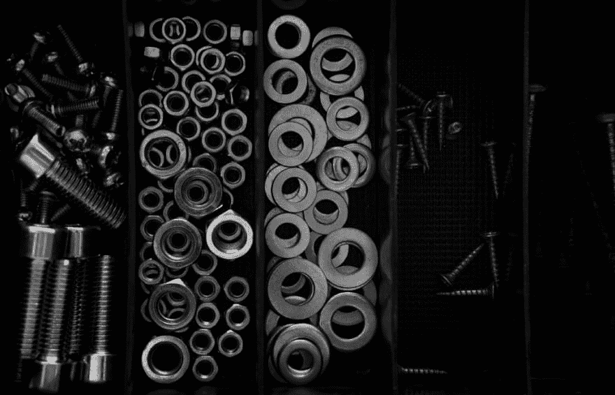
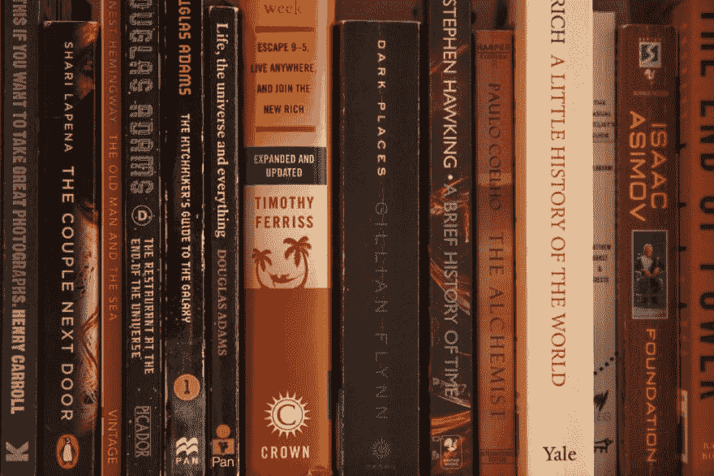

# Chingu 内容创作者指南

> 原文：<https://dev.to/chingu/chingu-content-creators-guide-3k6h>

通过与他人分享你所知道的来提升自己

### 简介

冒名顶替综合症实际上是所有开发人员都面临的问题。其核心是，下面的图表(见[开发者:如何克服冒名顶替综合症](https://medium.com/learn-love-code/developers-how-to-overcome-imposter-syndrome-48edee803cf4))非常准确简洁地总结了这一综合症。

<figure> 

<figcaption></figcaption>

</figure>

冒名顶替综合症的影响在于，它影响了你对自己拥有值得分享的知识和经验的信念。但是振作起来！尽管上图的左边是你可能的感觉，但右边更接近现实。

克服冒名顶替综合症的一个方法，同时提高你的知识，就是在文章或视频中与他人分享。您将从中获得的优势包括:

1.  从你为文章或视频所做的研究中增加你对主题的了解。
2.  你的文章或视频可以添加到你的文件夹和简历中，向同事和未来的雇主展示你的专业知识
3.  回馈广大的开发者社区

#### 例子

Chingu 社区成员创作的文章和视频示例如下:

*   [写好自述的关键](https://medium.com/chingu/keys-to-a-well-written-readme-55c53d34fe6d)
*   [了解 Redux 中间件](https://medium.com/chingu/understanding-redux-middleware-5d8fe63aabfb)

[https://www.youtube.com/embed/6TsFBW-c6to](https://www.youtube.com/embed/6TsFBW-c6to)

[https://www.youtube.com/embed/aXGsLI13lF4](https://www.youtube.com/embed/aXGsLI13lF4)

#### 该开始了！

以下是帮助您创建相关、易于理解且格式专业的内容的指南。当您创建内容时，这些可以用作您的清单:

1.  选择一个主题
2.  研究和收集参考资料
3.  组织您的演示
4.  写你的文章或剧本
5.  发布您的作品

在本文中，我们将使用通用术语*内容*来指代文章和视频。

### 选择话题

<figure> 

<figcaption>照片由[罗伯特·阿纳奇](https://unsplash.com/@diesektion?utm_source=unsplash&utm_medium=referral&utm_content=creditCopyText)上[下](https://unsplash.com/search/photos/choice?utm_source=unsplash&utm_medium=referral&utm_content=creditCopyText)</figcaption>

</figure>

创作文章或视频的第一步是选择主题。无论你心中已经有了一个主题，或者你想创建一个主题，但不知道如何开始，下面的内容都会有所帮助。

#### 寻找话题

要找到一个你想写的主题，最好从思考你自己的经历开始。

*   你觉得困难的是什么？
*   你发现了哪些让事情变得简单的技巧或建议？
*   你犯了哪些别人可以从中吸取教训的错误？
*   你发现了哪些提高工作速度和/或质量的技巧？
*   你对什么事情充满热情？

灵感的其他来源可以来自:

*   Chingu Discord 频道的帖子，尤其是 Chingu Discord 服务器上的#ask-cohort-n-code-questions 频道。
*   在工作或学校与同事的问题和对话。
*   在诸如 [StackOverflow](https://stackoverflow.com/) 和 [Reddit](https://www.reddit.com/) 等网站上的帖子。
*   文章或视频概述了一个有趣的主题，但没有深入到你认为需要的深度。
*   你所看到的文章或视频，你认为是不完整的，过于简化，或包含错误。

#### 提炼你的话题

一旦你选择了一个主题，后退一步，问自己“这是为谁而创作的，它是否有正确的关注度？”是否宽泛到它对于读者或观众的价值会被稀释？是不是窄到变得深奥了？你可能会决定一个宽泛或狭窄的主题是你想要涵盖的，但请记住，拥有正确的关注度将提高你的内容对目标受众的价值。

例如，假设您想为有经验的 React 开发人员创建一篇文章，标题为“Parameter Passing in React”。在这种情况下，这篇文章可能太宽泛了，因为有经验的 React 开发人员很可能已经知道参数在组件之间传递的不同方式。如果这是对参数传递的不同方式的概述，这可能更适合刚刚开始使用 React 的人。

对于有经验的开发人员来说，一篇更有针对性的文章详细解释如何使用特定的技术在组件之间传递参数会更有帮助。在这种情况下，你的选择是要么改变文章的重点，要么改变它的目标受众。

这听起来可能过于简单，但是对你的主题和它的读者有一个清晰的理解会微妙地影响你写的东西，你如何写作，以及它对读者或观众的价值。

如果你不确定你选择的主题，或者你只是想得到反馈，那么向你的同伴寻求建议和意见吧！

#### 复杂程度

重要的是要记住，你不应该以对待正式论文的方式对待你创作的内容(如文章或视频)。最好的内容不一定要复杂。通常情况下，最有用的内容解决了你遇到的影响他人的情况或问题。想一想你在开发工作流程中遇到的可能影响其他开发人员的障碍类型。

比如，如何将一个 app 部署到一个托管平台？什么是跨来源请求共享(CORS)？如何保护敏感的环境变量？事件如何影响 HTML 页面中的属性以及拦截和处理它们所需的 Javascript 逻辑？React 应用程序中的“道具”是什么？为什么它们很重要？什么是开发工作流，它与敏捷方法有什么关系？

重点不是复杂的话题不好。你的观众会发现最有帮助的内容是从回答开发者经常遇到的简单问题开始的。在现实中，你有时会发现一个看似简单的话题可以演变成更复杂的事情，所以从一个简单的起点开始是明智的。

### 研究和收集参考资料

<figure> 

<figcaption>照片由[丹·迪莫克](https://unsplash.com/@dandimmock?utm_source=unsplash&utm_medium=referral&utm_content=creditCopyText)上[下](https://unsplash.com/search/photos/research?utm_source=unsplash&utm_medium=referral&utm_content=creditCopyText)</figcaption>

</figure>

一旦你决定了一个主题，是时候寻找包含信息的资源来帮助你支持你正在创造的主题，并帮助你增加对主题的理解。

当你找到相关资源时，保留一份参考文献列表是很重要的，这样你就可以在工作中引用它们。许多抄袭的例子都不是故意的。它们是忽视正确引用参考文献和草率或不存在源材料验证的结果。

对于每个参考，该列表应包括:

*   标题
*   URL / ISBN 出版号和日期
*   (可选)关于您打算如何使用此参考的注释

尽管这被定义为内容创建过程中的“第二”步，但它不会只发生一次。你会发现，这是一个从你开始准备内容到发布的持续努力。

### 组织你的演示

<figure> 

<figcaption>图片由[阿纳托利·伊万诺夫](https://unsplash.com/@obamabombama?utm_source=unsplash&utm_medium=referral&utm_content=creditCopyText)上传 [Unsplash](https://unsplash.com/search/photos/outline?utm_source=unsplash&utm_medium=referral&utm_content=creditCopyText)</figcaption>

</figure>

你现在可以开始写作了！！！嗯，还没有。首先，你需要想一想你将如何对你要涵盖的子主题进行分类，以及它们出现的顺序。

创建一个大纲是帮助你实现这个目标的有效工具。这可能是传统的大纲形式，也可能是你添加注释和评论的标题列表。把大纲想象成你文章的“草图”,就像艺术家在开始画肖像之前先画草图一样。

每篇文章或视频包含三个独特的部分。你可以从这些开始你的大纲，并添加你认为合适的额外的部分和小节。当你的大纲完成时，你通常会发现新的章节和小节取代了正文。

1.  *简介* —定义文章/视频的目标、目标受众以及它的重要性
2.  正文(Body)——你可以在这里详细解释什么、为什么、在哪里、什么时候以及如何解决这个话题。你将希望以一种合乎逻辑的方式进行，展示问题是什么，解决问题的替代方法，解释不同技术的优点和缺点，以及首选技术的细节。
3.  *结论* —总结正文中的关键点，重复为什么这很重要，并鼓励目标受众提出问题并自行尝试，以此作为结束语。

写作从来都不是一件容易的事，但是在你坐下来写之前有一个提纲会让写作变得更简单，更重要的是，会让内容有一个逻辑顺序，更容易阅读和浏览。

还要记住，回顾和修改你的大纲不只是一次，而是直到其中的概念和想法以一种逻辑和完整的方式流动，这一点很重要。

### 写你的文章/剧本

<figure> 

<figcaption>照片由 [Kat Stokes](https://unsplash.com/@katstokes_?utm_source=unsplash&utm_medium=referral&utm_content=creditCopyText) 上 [Unsplash](https://unsplash.com/search/photos/writing?utm_source=unsplash&utm_medium=referral&utm_content=creditCopyText)</figcaption>

</figure>

一旦你的大纲完成，或接近完成，你就可以开始把它翻译成散文了。首先为大纲中的每一部分创建一个标题。然后开始将大纲中的注释翻译成每一部分的句子和段落。

写作不仅仅是把笔记翻译成句子和段落。这些元素是如何组成的，以及它们如何流动来支持你的中心论点是很重要的。同样重要的是，遵循公认的规则和指导方针，以提高你所创造的东西的清晰度以及它是如何被接受的。

如果你要与同事和未来的雇主分享你的工作，这些尤其重要，因为写得好的内容显示了你的专业水平和你对工作的关心。

*   *使用好的语法*——遵守你的书面语言规则的重要性，无论是[英语](https://www.englishclub.com/grammar/rules.htm)还是[印地语](https://www.quora.com/What-are-a-couple-grammatical-rules-of-Hindi-and-what-is-the-Hindi-sentence-structure)，都不会被过分强调。良好的语法有助于用户快速清晰地理解你所说的内容。糟糕的语法还会分散注意力，导致误解，或者让你的读者或观众放弃，继续前进。
*   写得简单些——不要试图用复杂的单词或短语来打动你的读者。用简单的风格写作几乎总能提高清晰度和可读性。这也包括确保你使用的每一个单词都是必要的，写短句和段落，并消除那些没有增加意义、只会延长你所写内容的“无用”单词。例如，*非常，更多，*和*这样的词，而不是*。

> “可读性通过用更简单的风格来提高”→“可读性通过用更简单的风格来提高。”

*   考虑你的国际读者 —你应该假设你的许多读者将英语作为他们的第二语言，并假设他们可能在理解口语、当地参考和缩写方面有困难。
*   *拼写检查你的作品* —正确的拼写也非常重要，在这个时代，几乎所有的写作工具中都嵌入了拼写检查，所以你的作品中没有任何拼写错误的借口。
*   *定义首字母缩写词* —一个老笑话说有两种首字母缩写词——三个字母的首字母缩写词(TLA 的)和四个字母的首字母缩写词(FLA 的)。缩略语是常用短语的有用快捷方式。但是在第一次使用时，一定要在括号中列出短语及其缩写，以帮助读者理解字母的意思。对于不常用的首字母缩写词，你也可以考虑添加一个更详细的定义，以及为什么它们很重要。
*   *在该表扬的地方给予表扬* —使用参考资料时，一定要注明出处。这有助于避免抄袭，并通过认可他人的贡献来展示你的专业性。引用其他作品的两种常用格式来自[美国心理协会](http://www.citationmachine.net/apa) (APA)和[现代语言协会](http://www.citationmachine.net/mla) (MLA)。
*   *发布前编辑* —即使有，也很少有初稿准备发布。这就是为什么它们被称为初稿。花时间回顾和修改你所写的内容会产生更强大和更优美的内容。你可能还想把自己放在目标读者的位置上，大声朗读你的文章或剧本。听它听起来如何是一个很好的技术，找到措辞问题和节奏。
*   _ 不要成为一个完美主义者—尽管进行多次编辑可能很重要，但你应该在编辑的数量和你的作品只有到达观众手中才是有用的这一事实之间取得平衡！使用[收益递减](https://en.wikipedia.org/wiki/Diminishing_returns)规则来决定何时停止编辑。

如果你正在创作一个视频，你的脚本将会有这些相同的元素，但是它应该是一个更详细的大纲，而不是一篇文章。演示时，您将使用此脚本作为指南，以确保包含所有必要的主题和要点。

#### 视频注意事项

如果你正在制作一个视频，有几个额外的指导方针你应该遵循，使你的演示更好。

*   说话清晰 —说话清晰，语速慢一点。后者在陈述技术话题时尤为重要，如果你说得太快，听众可能难以理解。它也有助于那些在全球范围内没有把英语作为第一语言的人。
*   *准备好你的环境* —视频有你写文章时不用担心的画面和声音的附加元素。确保消除任何视觉或听觉干扰，以免影响你的演示。一些具体的技巧是确保你的相机对焦，整理相机可见的区域，将手机静音，关闭任何音频源，如电视，确保该区域光线充足，并花时间测试你的视频和音频。
*   *考虑你的外表* —视频演示可能是非正式和轻松的，但请记住观众看到的是你，你的观众可能包括朋友、专业同事甚至未来的雇主。不一定要穿西装打领带或者正装，但是穿什么要合适。
*   *进行一次彩排*——练习你的演讲，并习惯使用你的脚本作为指导。你不应该逐字逐句地读，因为那会导致一个不自然和僵硬的陈述。你的目标是保持放松，说话自然。录下你的彩排并回放总是一个好主意，这样你就可以看到你的演示中哪些有效，哪些需要改进。

### 出版你的作品

<figure> 

<figcaption>照片由[网站托管](https://unsplash.com/@webhost?utm_source=unsplash&utm_medium=referral&utm_content=creditCopyText)上 [Unsplash](https://unsplash.com/search/photos/publishing?utm_source=unsplash&utm_medium=referral&utm_content=creditCopyText)</figcaption>

</figure>

您的工作几乎完成了，幸运的是，发布它是内容创建过程中最简单的一步。

#### 发表文章

按照以下步骤将您的文章提交给 [Chingu Publication](https://dev.to/chingu) :

1.  如果你还没有被添加为 Chingu 出版物的作者，请联系 Chingu 的管理员。
2.  一旦你收到电子邮件通知，表明你已被添加为作家，你将被授权提交你的文章作为一个新的故事到 Chingu 出版物
3.  当你提交你的文章时，Chingu 团队会审阅，并可能提出修改或更正的建议。
4.  编辑过程完成后，Chingu 团队会批准你的文章，你会收到文章已经发表的通知。到那时，你会在 Chingu 出版物的页面上看到它。

#### 发布视频

将您的视频提交到 [Chingu 频道](https://www.youtube.com/channel/UCS7zmJXbe7FgTC3sHlUf4jw)的过程更加简单。只需将你的视频上传到 YouTube，然后用它的网址联系 Chingu 的管理员。当它被添加到 Chingu 频道时，我们会与您联系。

### 结论

<figure> 

<figcaption>照片由[兰斯格兰达尔](https://unsplash.com/@lg17?utm_source=unsplash&utm_medium=referral&utm_content=creditCopyText)上 [Unsplash](https://unsplash.com/search/photos/finish?utm_source=unsplash&utm_medium=referral&utm_content=creditCopyText)</figcaption>

</figure>

创作有用的内容，无论是文章还是视频，都是一项艰巨的工作。但是就像大多数困难的事情一样，回报与付出的努力成正比。尽管你可能会对与他人分享你的知识感到暴露和恐惧，但你可以从中获得许多好处。

创建内容会让你对你所展示的主题有更深的理解。有一句古老而真实的格言说，学习一门学科的最好方法是教授这门学科。你在内容创作过程中所做的准备工作，以及读者和观众提出的问题，都是提升水平的组成部分。

分享你所知道的也是对抗冒名顶替综合症的一个很好的方法。很大一部分综合征来自与他人相比，对自己的知识犹豫不决和不确定。你为研究你所展示的主题所付出的努力不仅会增加你对自己所知的信心，还会增加你学习新信息并有效地与他人交流的能力，这才是有意义的。

最后，请记住，一旦你发表了你的文章或视频，不要忘记这最后的关键步骤——庆祝你的成功！