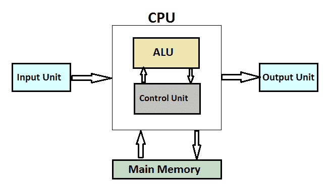

# 带 RxJS 的 Chip8 仿真器

> 原文：<https://dev.to/huntertr/chip8-emulator-with-rxjs-2j90>

## rx 芯片 8

最近决定用 rxjs 写一个 Chip8 虚拟机模拟器。我以前用 typescript 实现过 chip8，但是我想把它转换成 rxjs！Chip8 是一种非常古老的编程语言，运行在自己的虚拟机上。在 70 年代，用 Chip8 开发视频游戏很容易。对于不知道什么是 chip8 的人，这里有一个维基百科的链接。
[https://en.wikipedia.org/wiki/CHIP-8](https://en.wikipedia.org/wiki/CHIP-8)

在你阅读之前，请考虑这将是我在这里的第一篇文章，如果我犯了任何错误，请原谅我。
你可以在 [GITHUB](https://github.com/hunterTR/RxChip8) 中找到所有的代码片段和源代码。
chip8 的实现可能有缺陷，我还没有在这上面花太多时间。

首先，我要写一些一般的非 rxjs 的东西(chip8 vm 实现)

# [公羊类](https://github.com/hunterTR/RxChip8/blob/master/src/ram.ts)

[](https://res.cloudinary.com/practicaldev/image/fetch/s--VwhR1S-r--/c_limit%2Cf_auto%2Cfl_progressive%2Cq_auto%2Cw_880/https://cdn.motor1.cimg/mgl/j7v8e/s1/ram-trucks-just-got-a-mean-prospector-overhaul.jpg) 
开个玩笑，不过我喜欢公羊卡车。

这是一个非常简单的类，它处理 ram 的初始化，也处理 ram 的读写功能。
由于 chip8 常用于 4k 系统。我用 4096 字节(0x1000)初始化 ram。

```
this.memory = new Uint8Array(0x1000); 
```

我用无符号的 8 位数组初始化 ram，让它看起来不太真实:)

当我们试图对不在 ram 边界上的位置进行写入或读取时，会设置 memoryOverflow 标志。

# [CPU 类](https://github.com/hunterTR/RxChip8/blob/master/src/cpu.ts)

[](https://res.cloudinary.com/practicaldev/image/fetch/s--KsMH-qZ6--/c_limit%2Cf_auto%2Cfl_progressive%2Cq_auto%2Cw_880/http://www.it4nextgen.com/wp-content/uploads/2017/01/cpu-block-diagram.png)

芯片 8 有 16 个 8 位寄存器。在规范中，它们被命名为从 V0 到 VF，所以我在代码中用同样的方式命名。
V0:数字；

我在 resetRegisters 函数中初始化了每个寄存器，如下所示。

```
this.V0 = 0 & 0xff; 
```

我通过与 0xff 进行 and 运算来初始化它们，因为这比仅仅给它们赋值 0 要酷得多哈哈。此外，很容易看出该寄存器实际上是一个 8 位寄存器。(对于不知道如何用十六进制表示 8 位的人。你可以在谷歌上搜索。)

由于寄存器的值从 0 到 15，我写了一个函数来获取一个寄存器的值

```
getRegister(num: number): number 
```

我认为这个寄存器的另一个很酷的实现是创建一个 UIntArray8(16)数组，我们可以在这个数组中保存每个寄存器。

创建堆栈非常简单。它只是一个有 16 个槽和 stackpointer 的数组，使它成为 LIFO。当 cpu 进入子程序时，堆栈被用来存储返回地址。

芯片 8 中有两个定时器。延时定时器和声音定时器。当它们被设置为任意数字时，它们开始倒计时。规范说它们在 60hz 倒计时，但是我还没有实现任何东西使它精确到 60hz。

声音计时器被用来发出声音，直到它达到 0。

有 16 种可能的输入。Chip8 监听这些按键输入，如果特定按键被按下或未被按下，它将跳过一条指令。rxjs 中有关于实现的更多解释。

chip8 的显示分辨率为 64x32 像素，每个 sprite 为 8 像素宽。高度可以在 1 到 15 之间。我已经实现了一个二维数组的显示，并将其命名为 graphicArray。我用全 0 初始化。chip8 通过将 sprite 与 graphicArray 上的当前像素进行异或运算，在 graphic array 上绘制 sprite。这意味着只有 sprite 中的 set 位会将 graphicArray 中的相应像素从未设置翻转为设置。

我不打算解释每个操作码和例程。但一般来说，Chip8 CPU 有程序计数器和寄存器。寄存器是 cpu 临时存储数据的地方。程序计数器是另一个寄存器，但是这个寄存器存储指令在 ram 中的位置。当获取该代码时，它增加 1 或者指令可以修改它(例如跳转操作)。如果你想了解更多关于这个主题的信息，你可以在谷歌上搜索 cpu 是如何工作的。

# [渲染器类](https://github.com/hunterTR/RxChip8/blob/master/src/renderer.ts)

我创建了这个类来负责使用 canvas 将我们的图形数组绘制到浏览器。也可以用 openGL 等实现..这是一个非常简单的类，有两个函数。
一个是
draw screen(graphic array:any[][])
另一个是
drawPixel(x: number，y: number)

drawScreen，首先重置我们的画布，用黑色填充。然后遍历 graphicArray 并在找到 set 位的地方调用 drawPixel。

drawPixel 正在为提供的坐标绘制一个矩形。我还添加了 pixelScale 常量，以便更容易地放大屏幕和像素。

## [RxJS 货色](https://github.com/hunterTR/RxChip8/blob/master/src/main.ts)

[](https://i.giphy.com/media/l0IycI0rreFNQwmSQ/giphy.gif)

RxJS 是我想写这篇文章的原因，因为网上有很多 chip8 实现。

我想把状态存储在一个地方，所以我创建了 stateSubject

```
private stateSubject$: BehaviorSubject<Partial<CPU>> 
```

所有更新状态的东西都会调用 stateSubject.next 来部分更新状态。

```
 state$ = this.stateSubject$.asObservable().pipe(
    scan((state, value) => value ? Object.assign(state, value) : state, this.initialState)
  ); 
```

扫描操作符在这里非常有用，因为它基本上存储旧的状态。每次我调用状态 Subject$。接下来，我将拥有最后一个状态，以及我希望在该状态下更新的值。合并这两个值将得到新的状态！

如果你注意到我们的状态实际上是 CPU 对象。我们掌握着 CPU 的最新状态。

# 事件

[](https://i.giphy.com/media/JIX9t2j0ZTN9S/giphy.gif)

事件是作为副作用更新状态的一种方式。例如按键事件

```
private keyUp$: Observable<any> = fromEvent(document, 'keyup');

 keyPress$: Observable<Uint8Array> = merge(this.keyUp$, this.keyDown$).pipe(
   scan((acc, x) => {
     return this.keyPressEventHandler(acc, x);
   }, new Uint8Array(16)),
   distinctUntilChanged(),
   tap(keyPad => {
     //side effect
     this.stateSubject$.next({ keyPad });
   })
 ); 
```

上面的代码合并了两个关键事件。使用扫描来保持键盘的状态并更新它。
keyPressEventHandler 正在创建新的键盘数组。例如，如果我按下键盘上的 A。它将数组的第 8 个索引设置为 1。当 keyup 事件发生时，它切换回 0。

loadGameEvent$正在用载入的游戏数据更新 ram。
按钮有自己的事件

```
startClickEvent$ = fromEvent(document.getElementById('startButton'), 'click').pipe(switchMap(() => test.run$)); 
```

startButton 事件切换到 run$ observable，cpu 开始计时。

# 跑步

[](https://i.giphy.com/media/kkoBbqO82pjAA/giphy.gif)

每次发出状态时，Ticker observable 都会发出。

```
ticker$ = this.state$.pipe(
   switchMap(state => {
     return !state.isPaused ? timer(state.clockSpeed) : NEVER;
   })
 ); 
```

ticker$ observable 是一个管道状态$ observable，并切换到一个计时器 observable 来延迟一点时间。如果我们处于发射状态，那么它会切换到不可观测状态，也就是不发射。

$run observable 将从 ticker observable 中获得，以运行 cpu 周期并更新状态。

```
// RUNNING - TICKING
 run$ = this.ticker$.pipe(
   withLatestFrom(this.state$),
   tap(([, state]) => {
       state.runCycle();
     this.stateSubject$.next(state);
   }),
   takeWhile(([, state]) => !state.ram.memoryOverflow && state.isRunning),
   map(([, state]) => state.graphicArray),
   distinctUntilChanged((x, y) => {
     //written a compare.
     for (let i = 0; i < x.length; i++) {
       for (let j = 0; j < x[i].length; j++) {
         if (x[i][j] !== y[i][j]) {
           return true;

     return false;
   }),
   tap(graphicArray => this.renderer.drawScreen(graphicArray))
 ); 
```

运行$ observable，通过管道从 ticker$ observable 获取最新 cpu 状态并调用 runCycle 函数。CPU 周期结束后，它通过调用$stateSubject.next 发出新的状态，副作用将更新我们的状态并触发我们的链，最终将再次返回 runCycle。

在用新的状态更新状态后，管道继续 takeWhile。
takeWhile 运算符也非常简单。当其中一个条件有效时，它将从流中获取值。
然后我将状态映射到 graphic ray，因为我只需要 graphic ray 来打印屏幕。只有当 graphicArray 不同于前一个时，我才发出。为此，我编写了简单低效的 2d 数组比较。最后，我在渲染器中调用 drawScreen 方法。

# 奖金

pauseClickEvent 用于暂停游戏或恢复游戏。首先获取当前状态，并使用它来更改状态中的 isPaused 字段。

```
pauseClickEvent$ = fromEvent(document.getElementById('pauseButton'), 'click').pipe(
   withLatestFrom(this.state$),
   tap(([,state]) => {
     this.stateSubject$.next({ isPaused: !state.isPaused });
   })
 ); 
```

合并所有事件并通过一个订阅订阅所有事件。

```
 events$ = merge(this.loadGameEvent$, this.keyPress$, this.startClickEvent$, this.stopClickEvent$,this.pauseClickEvent$);

test.events$.subscribe(); 
```

由于读取文件是一个异步任务，我想用 observable 来读取它。

```
export const readFile = (blob: Blob): Observable<ArrayBuffer> =>
{
  if (!(blob instanceof Blob)) {
    return throwError(new Error('`blob` must be an instance of File or Blob.'));
  }

  return Observable.create(obs => {
    const reader = new FileReader();

    reader.onerror = err => obs.error(err);
    reader.onabort = err => obs.error(err);
    reader.onload = () => obs.next(reader.result);
    reader.onloadend = () => obs.complete();

    return reader.readAsArrayBuffer(blob);
  });
} 
```

readFile 函数接受 blob 并返回可观察的 ArrayBuffer。
`Observable.create`让你创建一个可观察的。我们知道，当异步任务完成时，我们通过调用观察对象的下一个函数，将该值推(发出)给观察对象的函数。下一个函数是观察者订阅的函数。

当 reader.readAsArrayBuffer 完成时，它调用它的回调函数，如 reader.onload、reader.onerror 等..因此，通过在 reader.onload 旁边指定 obs .我们可以确定，当读取完成时，它会将该值发送给观察者。

我希望它能帮助你学习新的东西，或者帮助你恢复记忆。如果你发现我做错了什么或者发现了一些更好的方法去实现它。请让我知道。谢谢！