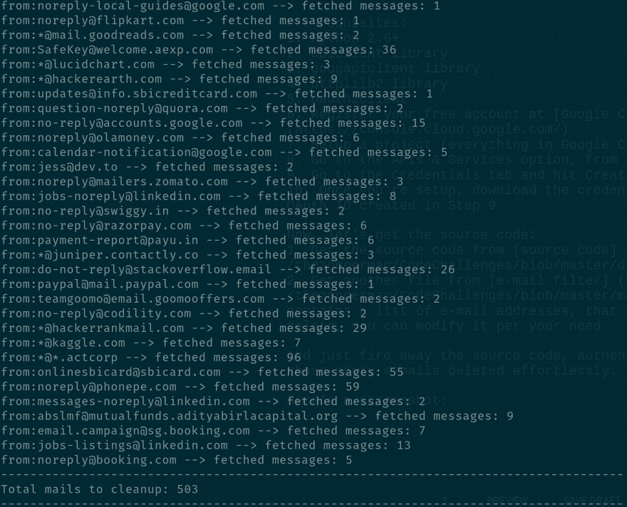
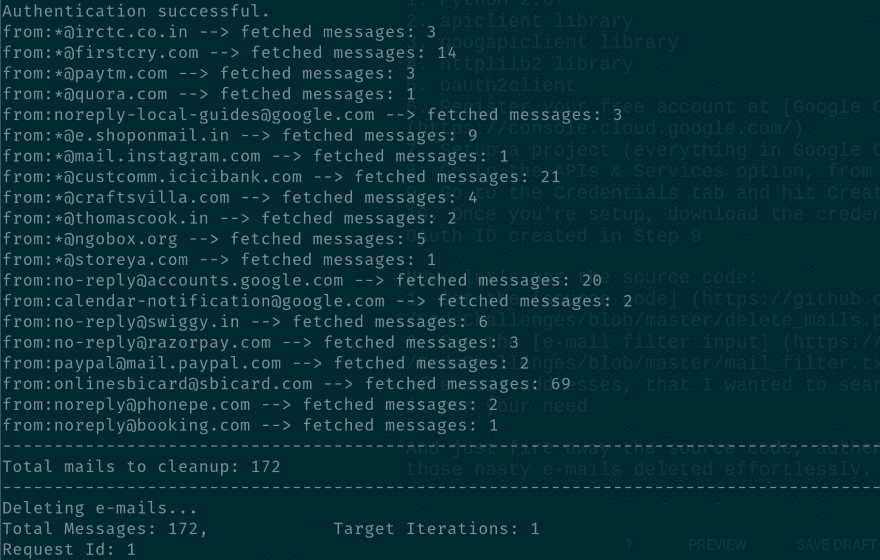

# 用 Python 清理 Gmail

> 原文：<https://dev.to/thezooperman/cleaning-up-gmail-with-python-524j>

## 问题

随着时间的推移，我的 Gmail 帐户塞满了不必要的电子邮件，例如:披萨订单确认、用餐确认、水电费账单提醒、水电费账单支付确认、信用卡优惠、银行优惠、电子商务优惠、OTP 邮件、非常旧的电子邮件等等。

这些电子邮件的频率有些是每月一次(通常)，有些是每周一次(银行邮件、投资邮件、时事通讯)，有些是每季度一次。

所以我和我的配偶想清理我们的 gmail 账户(她有更多的垃圾邮件)。粗略估计，我们需要手动搜索和删除大约 2 万封电子邮件。

## 清理时间

这些邮件也占用了我的 Google Drive 空间(邮件正文和附件都很长，等等)。我开始手动清理邮件，很快意识到这绝对不是办法——一定有更好、更简单的办法。

因此，我开始寻找是否有我可以使用的电子邮件 API。

从谷歌上找到了一个方便的 api 指南

## 那么我从哪里开始呢？

先决条件:

1.  Python 2.6+版本
2.  apiclient 库
3.  googapiclient 库
4.  httplilb2 库
5.  oauth2client
6.  在 [Google Cloud](https://console.cloud.google.com/) 注册您的免费帐户
7.  建立一个项目(Google Cloud 中的所有东西都在一个项目之外)
8.  从 Google Cloud 控制台转到 APIs & Services 选项
9.  转到凭据选项卡，点击创建凭据/OAuth 客户端 ID
10.  设置完成后，从步骤 9 中创建的 OAuth ID 将凭证下载到本地

现在，让我们来看看源代码:

1.  获取[源代码](https://github.com/thezooperman/CodeChallenges/blob/master/delete_mails.py)
2.  获取[电子邮件过滤器输入](https://github.com/thezooperman/CodeChallenges/blob/master/mail_filter.txt)。这个文件包含了我想要搜索和删除的电子邮件地址列表，你可以根据需要修改它

只需打开源代码[python delete _ mail . py]，通过谷歌认证，就能轻松删除那些讨厌的电子邮件。

下面是邮件搜索的截图- 

另一个，邮件被删除- 

## 多一些东西

该代码利用 Google 批处理 http 请求，读取电子邮件过滤器文本文件，并通过 Http 批处理发送搜索和删除请求。

谷歌设置了 1000 封电子邮件的批量处理限制(我上次检查时还是 1000 封)，我认为这是针对普通账户的。所以代码也考虑到了这一点——它以 1000 为一批进行查询。

## 就是这样乡亲们！

我经常用这个程序清理我的 gmail 收件箱、我配偶或我们朋友的收件箱，并不时更新电子邮件过滤器。

继续，添加您自己的电子邮件过滤器，运行该程序，让您的收件箱摆脱不想要的电子邮件。

如果您想确保安全，只需从包含 python 源文件的目录中删除 token.json(也可以选择删除 credentials.json，但是在运行源代码时，您需要这个文件)文件。