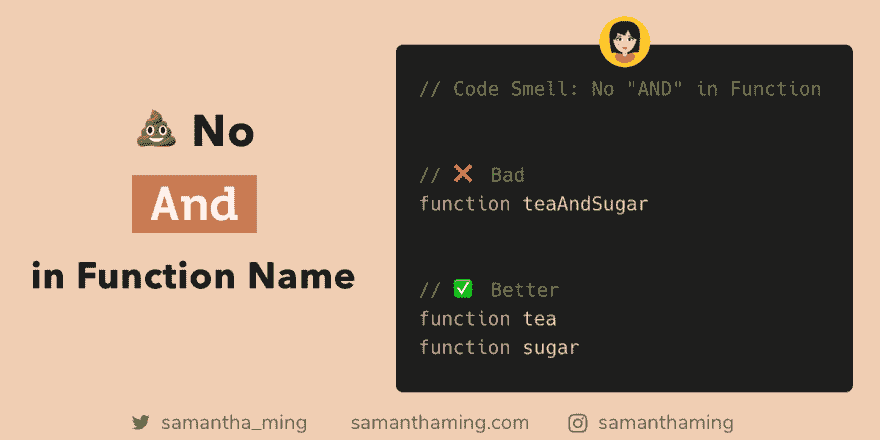

# 代码味道:函数名中没有和

> 原文：<https://dev.to/samanthaming/code-smell-no-and-in-function-name-1g10>

[](https://res.cloudinary.com/practicaldev/image/fetch/s--MY-nX3cG--/c_limit%2Cf_auto%2Cfl_progressive%2Cq_auto%2Cw_880/https://thepracticaldev.s3.amazonaws.com/i/g4yjvklem1lftawdg5ag.png)

职能部门应该坚持单一责任原则——意味着它应该做一件事，而且只做一件事。所以如果你的函数名包含“和”，那就意味着你做的太多了。解决方案？删除“和”,将其拆分为单独的函数👍

```
// ❌ Bad
function teaAndSugar () {}

// ✅ Better
function tea () {}
function sugar () {} 
```

## 单一责任原则(SRP)

> 每个模块都应该有一个单独的职责。这意味着两个独立的关注点/职责/任务应该总是在独立的模块中实现。

*[原则 Wiki: SRP](http://www.principles-wiki.net/principles:single_responsibility_principle)*

背后的基本原理是:

> 当不遵守这个规则时，一个模块有几个任务。如果这些任务中的一个发生了变化，就有可能会影响到另一个通常应该是独立的任务。因此，不相关的功能可能会中断。

当您遵循单一责任原则时，您创建了一个更加灵活和模块化的代码库。

## SRP 在非开发方面的优势

让我们尝试用非开发术语来解释这一点。假设你是一名厨师，你正试图为你的厨房订购食材。两个卖家带着他们的选择来找你。卖家 A 告诉你，我们有你需要的所有成分，所有东西都是为你混合的。卖家 B 告诉你，你需要的食材我们都有，会单独卖给你。你会买哪一个？当然卖方 A 选项是相当好的，因为一切都是预先混合。但是你能做的食谱非常有限，因为你被限制在需要所有三种成分的食谱里。但是，有了卖家 B，你做的菜谱是无穷无尽的。你可以做甜点和美味的食谱👩‍🍳

卖家 A:

购买预混合的配料会限制你的食谱，需要所有三个项目。

```
function flourAndSugarAndEgg () {} 
```

卖方 B:

购买单独的配料消除了限制，让你创造更多的食谱🏆

```
function flour () {}

function sugar () {}

function egg () {} 
```

## 维修性效益

坚持这条规则的另一个好处是可维护性。当你刚开始的时候，当然把所有的东西放在一起看起来容易多了。但是我向您保证，随着时间的推移，随着您添加更多的功能或进行更改，一个完成所有工作的单一功能会变得很难维护。

### 用非开发术语解释

让我们用另一个非开发术语来解释这个问题。假设你是一个大型乐高积木制造商，你给自己买了一套全新的乐高积木。你非常兴奋，你打开新的布景，把所有的碎片都倒进一个容器里。不幸的是，你下周有一个期末考试，所以你还没有时间来建立它。几周后，你有钱的阿姨又买了几套乐高玩具。我提到你的阿姨很有钱，因为我们都知道乐高玩具贵得离谱😂。你再次打开新的一套，把它们倒在同一个容器里，认为这没什么大不了的。不甘于你有钱的阿姨，你有钱的奶奶也想赢得你的爱，所以她给你买了更多的乐高套装。再说一次，你不认为这有什么大不了的，你打开所有的东西，把它们都倒在同一个容器里。好了，几周过去了，现在你已经准备好搭建你的乐高玩具了。猜猜发生了什么？你现在是在用头撞墙。因为所有的碎片都混在一个容器里，你不知道哪个是哪个。然而，如果你把所有的乐高玩具都放在自己的容器里，你就不会有这个问题了💩

这就是为什么一个函数应该只做一件事。当它做不止一件事的时候。现在看起来可能不是这样，但是随着时间的推移和需求的变化，这个功能会变得臃肿，维护起来会变得极其困难。

## 社区输入

*   *[@Skateside](https://twitter.com/Skateside/status/1142508099753975809) :* 另一个专业提示:用动词开始函数名。这让你的意图更加清晰，也更容易解释——“这个泡茶，那个加糖。”

```
function makeTea() {}
function addSugar() {} 
```

*   *[@sunnysingh.io](https://www.instagram.com/sunnysingh.io/) :* 类似`getData()`的通用函数😝嗯...什么类型的数据？除非是顶级实用程序，否则我喜欢像`getUser()`、`getPost()`等这样具体的。

*   *[@Mouadovicc](https://twitter.com/Mouadovicc/status/1142524184997838848) :* 我更喜欢用`drinkTea`和`drinkSugar`来代替，在这种情况下用一个统一的词就是饮料

## 资源

*   [我辛辛苦苦学到的东西](https://blog.juliobiason.net/thoughts/things-i-learnt-the-hard-way/)
*   [为什么在方法名中使用连词是不好的命名约定？](https://softwareengineering.stackexchange.com/questions/255669/why-is-the-use-of-conjunctions-in-method-names-a-bad-naming-convention)
*   [SamanthaMing:避免错误的变量名](https://www.samanthaming.com/tidbits/36-bad-variable-names-to-avoid)
*   如何给你的布尔变量取一个更好的名字
*   [理解坚实的原则:单一责任](https://codeburst.io/understanding-solid-principles-single-responsibility-b7c7ec0bf80)
*   原则 Wiki: SRP

* * *

**感谢阅读❤**
问好！[insta gram](https://www.instagram.com/samanthaming/)|[Twitter](https://twitter.com/samantha_ming)|[脸书](https://www.facebook.com/hisamanthaming) | [媒体](https://medium.com/@samanthaming) | [博客](https://www.samanthaming.com/blog)