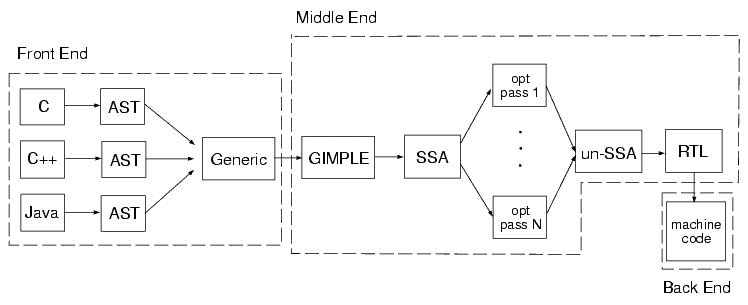

# 编译器系列第 2 部分:GCC

> 原文：<https://dev.to/miiizen/compiler-series-part-2-gcc-2mm4>

[GCC](https://gcc.gnu.org/) ，最初是为 GNU 操作系统编写的，是几个不同编程语言的前端、库和后端的集合。这是一个旧软件，但仍保持最新，并被许多人定期使用。编译器有(可以编译)C/C++、Objective C、Fortran、Ada 和 Go 的前端。

编译器最初是为了避免为使用 GNU 操作系统的供应商编译器而付费。从那以后，它的受欢迎程度和性能都超过了专有编译器。
当用户在终端运行类似`gcc myfile.c`的命令时开始的过程可以分解为 4 个步骤:预处理、编译、汇编和链接。

## 预处理器 <sup id="fnref1">[1](#fn1)</sup>

预处理器负责在编译源代码之前对其进行修改。我们将特别关注 C/C++预处理器。如上所述，其他预处理程序或前端可用于不同的语言。在这一步会发生一定程度的词汇变形。它执行的操作有:

### 线拼接

如果使用了转义换行符，这会整理源代码中的行。转义换行符是用来换行的反斜杠。它们必须出现在标记之间或注释中。代码中的所有注释也被替换为单个空格。

### 标记化

一旦这些转换完成，程序就被分解成预处理器标记。这些标记将被传递给编译器，在那里它们将被用作编译器标记。目前，预处理标记可以分为 5 类:标识符、预处理数字、字符串、标点符号和其他。

*   标识符-不以数字开头的任何字母、数字或下划线序列。关键字——诸如 if、else 之类的标记被视为标识符。这意味着我们可以在实际的 C/C++语言中定义与保留关键字同名的宏

*   预处理数字——这个定义包含了大范围的数字表示。为了支持十六进制和其他表示形式，十进制数字后允许字母、数字、句点和下划线的任意组合。这使得许多无效表单错过了这一步。然而，编译器会选择它们。

*   字符串文字——这包括用尖括号括起来的字符串常量、字符常量和#include 语句的参数。

*   标点符号 ASCII 中除了' @ '、' $ '和'''以外的所有标点符号都被视为标点符号。标点符号对编译器有意义，但是意义是什么取决于它们所在的上下文。

### 指令和宏处理

这是大多数人与 C/C++预处理器联系在一起的步骤，因为它是编译器的用户最常看到的。如果标记流在预处理语言中不包含任何内容，那么它将被简单地传递给编译器。

以下是预处理语言中常用的特性。

#### 包括头文件

头文件包含 C/C++声明和其他预处理器指令。头文件可以由操作系统提供，以便使用系统 API，也可以由用户定义。这使得在文件之间共享定义成为可能。
如果我们查看所有中间步骤的代码输出，我们会看到任何`#include <xyz.h>`都被替换为`xyz.h`的内容

#### 宏处理

宏可以是类对象的，也可以是类函数的。类似对象的宏看起来像数据对象。它们最常用于给符号常量命名，如`#define MAX_SIZE = 1024`
，在我们的代码中使用名称`MAX_SIZE`时，预处理器会用`1024`替换这个文本

类似函数的宏在使用时看起来像函数调用。当它们被“调用”时，出现在定义中的代码被简单地复制到它被调用的地方。例如
`#define SQUARE(x) x*x`
代码中出现`SQUARE(X)`的地方，都用`x*x`代替，其中 x 是传入 square 的值。
宏用于提高性能。因为代码只是由预处理器复制，所以在汇编输出中没有函数栈等的开销。这一段仅仅触及了宏的表面以及它们有多有用，然而，它们并不是编译器的基本部分。

#### 有条件编译

这允许预处理器决定是否将下面的代码段交给编译器。这在一些情况下是有用的，例如包括警卫。包含保护可以防止相同的头文件被复制太多次。这加快了编译速度。

```
// An example include guard
#ifndef __MY_HEADER
#define __MY_HEADER ...
#endif 
```

## 编译 <sup id="fnref2">[2](#fn2)</sup>

这是获取预处理代码并从中生成程序集的阶段。gcc 编译器对输入程序的表示进行多次处理，在输出机器码之前将其转换成不同的中间表示。
下图显示了所涉及的步骤<sup id="fnref3">[3](#fn3)</sup>
[](https://res.cloudinary.com/practicaldev/image/fetch/s--hzNy_02Q--/c_limit%2Cf_auto%2Cfl_progressive%2Cq_auto%2Cw_880/https://thepracticaldev.s3.amazonaws.com/i/5nq2lrzwq3ktfhet26iy.jpeg)

### 解析通过

这是编译器的前端。上面写的关于 C 预处理器的细节适用于这一步。预处理器完成工作后，编译器从令牌流中生成抽象语法树(AST)。现在，这可以被认为是一个表示输入程序的树形数据结构。AST 非常容易修改和转换，因此作为输入的内部表示非常有用。

每个前端以不同的方式工作，但通常最终输出一个称为 Generic(或 GIMPLE)的表单。这个阶段的历史和内部工作看起来有点复杂和混乱，但是只要泛型被输出并传递给编译器，我们就很高兴。

### 万向传递

这一步包括将我们的泛型表示转换成 GIMPLE 表示。然而，这是另一种中间表示，比 AST 更加严格。它用于以后的优化过程。最基本的，GIMPLE 是一个表示通用表达式的元组集合。其结构的要点如下:

*   每个表达式不能超过三个操作数。如果超过三个，表达式被拆分成更小的部分。
*   所有控制流都由条件和 goto 语句组成。

### 树 SSA

这一步涉及对我们现在拥有的代码的内部表示的多次传递。SSA 代表*单一静态赋值*。GIMPLE 表示被修改，使得每个变量只被赋值一次。如果一个变量需要多次赋值，就会创建新的变量。
从上述 gcc 堆内构件手册的第 9.4 节可以看出，这一步涉及 47 种不同的优化。这些包括优化循环，条件，删除不可及的代码和其他复杂的操作。应用了更改的新 GIMPLE 表示从这一步返回，并传递到下一步。

### RTL

RTL 代表*寄存器传输语言*，离我们想要的机器代码输出更近了一步。GIMPLE 表示被转换成 RTL，它假设一个抽象处理器具有无限数量的寄存器。对这个表单进行了多次处理，进一步优化了代码。优化的表单被传递到 gcc 后端。

## 组装

就像前端一样，gcc 支持许多后端处理输出平台特定的机器代码。其中包括 x86、i386 和 arm。当给定优化的 RTL 时，后端将发出指定平台的程序集。最常用的后端是 GNU 汇编程序，称为 gas 或 as。这是 1986 年发布的，但仍在频繁使用。汇编的输出是一个目标文件。这被传递给链接器。

## <sup id="fnref4">[4](#fn4)</sup>

编译和汇编过程是在单个文件上执行的。链接器用于将项目的所有部分连接在一起，无论是头文件和实现文件还是外部库。如果一个函数是在不同的文件中用 extern 或 similar 定义的，那么链接器的工作就是检查它是否已经被定义了。在一个有数千行代码的项目中，为了文件中的一个微小变化而重新编译所有内容将是一件非常痛苦的事情。相反，包含更改的文件被重新编译，项目被重新链接。

通常在 GNU/Linux 系统上，使用程序 ld。这是 GNU 链接器。gcc 程序包装了对 ld 的调用，以使开发人员的工作更容易，但是如果需要的话，这可以手动完成。

这只是巨大的 GCC 项目的一瞥——目前只有不到 2000 万行代码。浏览技术文档帮助我对编译器的结构有了一个大概的了解。分析之后，我可以开始设计我自己的编译器了。

* * *

1.  [【c 预处理器】](https://gcc.gnu.org/onlinedocs/cpp.pdf) [↩](#fnref1)

2.  [“海合会内部”](https://gcc.gnu.org/onlinedocs/gccint.pdf) [↩](#fnref2)

3.  [“GCC 内部/GCC 架构- Wikibooks”](https://en.wikibooks.org/wiki/GNU_C_Compiler_Internals/GNU_C_Compiler_Architecture) [↩](#fnref3)

4.  [“c++——编译/链接过程是如何工作的？-堆栈溢出。](https://stackoverflow.com/questions/6264249/how-does-the-compilation-linking-process-work) [↩](#fnref4)