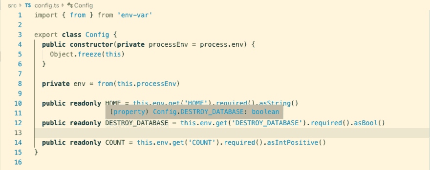

# 以第三种方式配置 TypeScript 应用程序

> 原文：<https://dev.to/m0ltzart/configuring-typescript-application-the-third-factor-way-2ekp>

[十二要素 App](https://12factor.net/) 文件的[第三要素](https://12factor.net/config)说明:

> Config:在环境中存储配置。

本文解释了如何在 TypeScript / NodeJS 应用程序中实现这一点。

## 环境变量

每个 NodeJS 进程中都有环境变量。NodeJS 进程从启动应用程序的进程继承它们。

在开发过程中，这些变量通过终端来自您的 shell 会话，而在生产过程中，这些变量来自流程主管(例如`systemd`)。

您可以通过内置变量`process.env`访问环境变量——这是一个键/值字符串的字典。

在当前环境中，您可以使用下面的命令来查看对您的流程可用的所有变量:

```
node -e 'console.log(process.env)' 
```

您还可以通过在命令前面加上前缀:
来为每个命令的执行提供环境变量

```
API_KEY="foo" node -e 'console.log(process.env.API_KEY)' 
```

## 跨平台

不是每个操作系统( *Windows，我看着你呢！*)支持设置命令行环境变量。

当然，NodeJS 社区想到了这一点，有一个模块 [`cross-env`](https://www.npmjs.com/package/cross-env) 解决了这个问题。

```
cross-env NODE_ENV=production node -e 'console.log(process.env.NODE_ENV)' 
```

## 环境变量值的问题

虽然您可以通过`process.env`直接访问任何变量，但这并不是一个好主意，原因如下。

1.  没有必需的变量检查。如果您的应用程序从`process.env.API_KEY`变量中读取，而您忘记在生产中设置它——当代码试图访问不存在的变量时，您的应用程序启动但失败。
2.  没有数据验证。您的系统可能需要一个有效的 URL，但得到的却是垃圾。
3.  没有类型强制。`process.env`中的值是**总是字符串**。
4.  对于`process.env`键没有智能感知或代码完成，因为这些值直到运行时才知道。
5.  容易引入错别字，例如用`process.env.APIKEY`代替`process.env.API_KEY`。
6.  直接依靠`process.env`很难单元测试代码。它需要全局`process.env`的 munging，这可能会导致副作用。

这里有一个典型的错误:

假设您运行应用程序，环境变量设置为:

```
cross-env DESTROY_DATABASE=false node index.js 
```

您的代码如下所示。你看出问题了吗？

```
// index.js

if (process.env.DESTROY_DATABASE) {
  await database.destroy()
} 
```

问题是`process.env.DESTROY_DATABASE`是**总是一串**。

该变量被设置为文字字符串值`"false"`。它总是评估为`true`。

另一个常见的错误可能与数字有关。猜猜输出是什么？

```
cross-env COUNT=1 node -e 'console.log(process.env.COUNT + 1)' 
```

当然，这不会是`2`，因为那太容易了，对吗？正确答案是`11`，因为它做的是字符串串联，而不是数学。

环境变量的值是**总是一个字符串**。

## 解决方案之一

我将概述解决这些问题的一种方法，但方法不止一种。

我更喜欢使用 [`env-var`](https://www.npmjs.com/package/env-var) 模块来提取和验证数据。

然而，我也以一种更容易存根和测试配置的方式来做。

我通常在项目根目录下创建一个`config.ts`文件，导出一个配置类。

首先，这里有一个完整的例子:

```
import { from } from 'env-var'

export class Config {
  public constructor(private processEnv = process.env) {
    Object.freeze(this)
  }

  private env = from(this.processEnv)

  public readonly HOME = this.env.get('HOME').required().asString()

  public readonly DESTROY_DATABASE = this.env.get('DESTROY_DATABASE').required().asBool()

  public readonly COUNT = this.env.get('COUNT').required().asIntPositive()
} 
```

我们来分解一下。

我们声明一个私有属性`processEnv`，它默认为来自`process.env`的值。

使用默认值允许我们在应用程序代码中使用默认值构建对象。

您可能会使用依赖注入，并为整个应用程序自动提供一个`Config`实例。

```
const config = new Config() 
```

然而，对于测试，我们总是可以覆盖缺省值并提供我们的值:

```
const config = new Config({ COUNT: 2 }) 
```

然后，我们还冻结了构造函数中的对象，这样每个实例都变得不可变。

您没有办法意外地覆盖代码中的 config 对象。

配置应该总是不可变的。

下一步是使用`env-var`提供的`from`方法实例化`env-var`对象。

然后，我们可以在对象上声明任意数量的属性，并使用构建器模式声明我们对给定变量的所有要求。

参考[文档](https://www.npmjs.com/package/env-var)了解所有可能的验证。那里有很多好吃的。您可以设置默认值，甚至从 Base64 解码。

这个解决方案是完全类型安全的。您可以在我的库中看到[代码和测试。](https://github.com/moltar/typescript-12-factor)

下面是一个截图，展示了 VS 代码智能感知如何正确地识别出`DESTROY_DATABASE`是一个布尔值。

[](https://res.cloudinary.com/practicaldev/image/fetch/s--sOrgCG3y--/c_limit%2Cf_auto%2Cfl_progressive%2Cq_auto%2Cw_880/https://raw.githubusercontent.com/moltar/typescript-12-factor/master/intellisense.png)

## 你的想法

你有什么管理配置的技巧和诀窍吗？

请在下面的评论中分享它们。