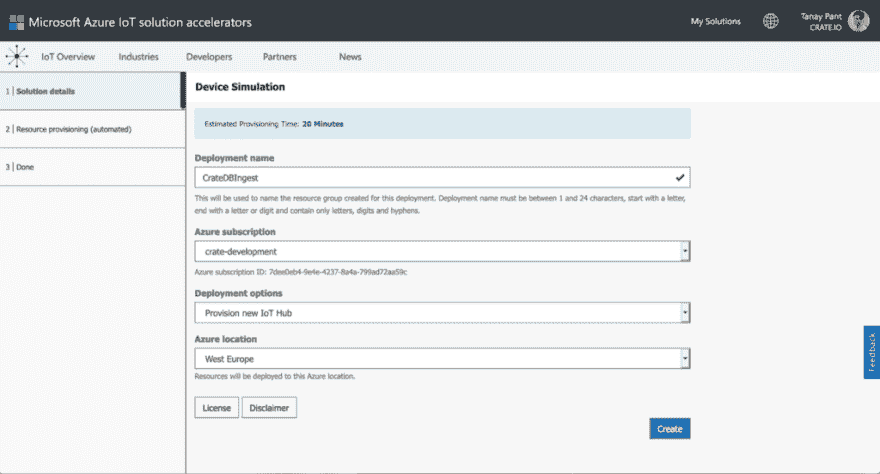
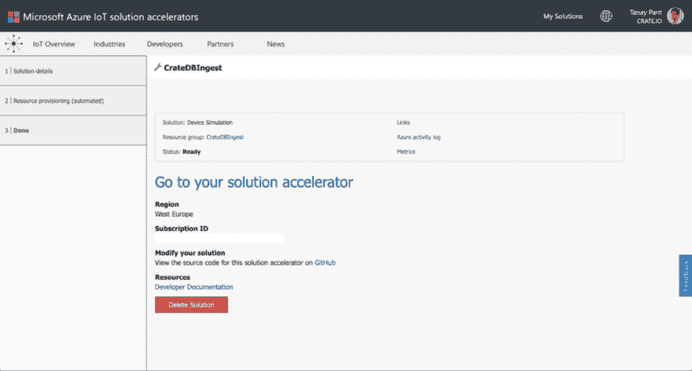
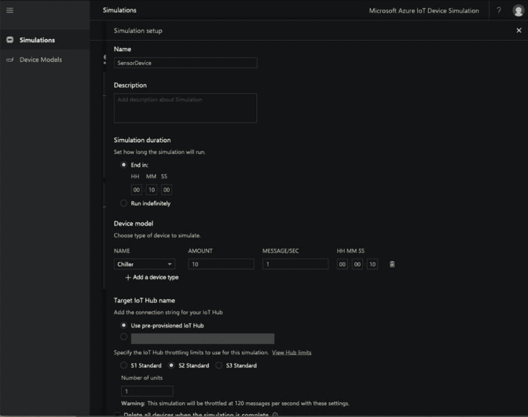
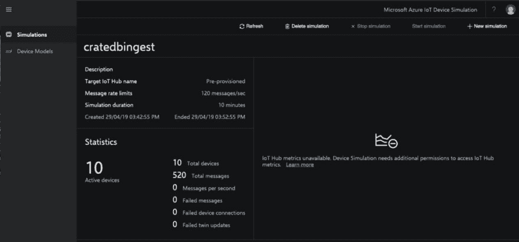
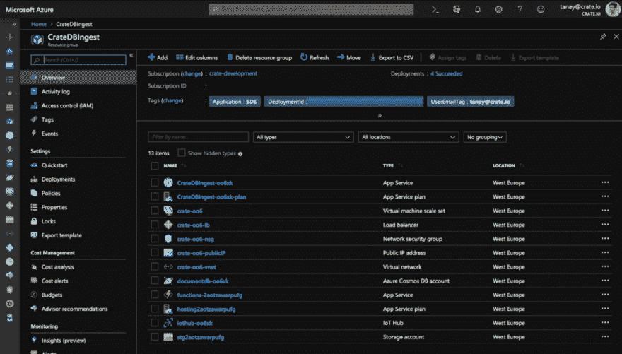
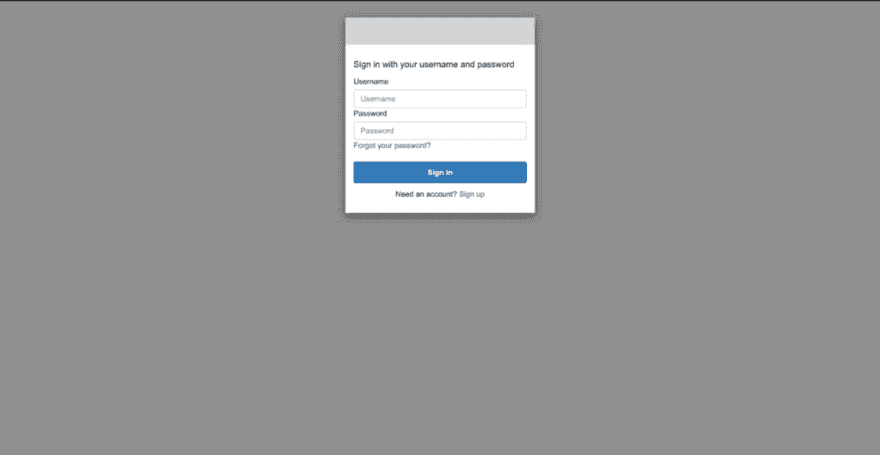
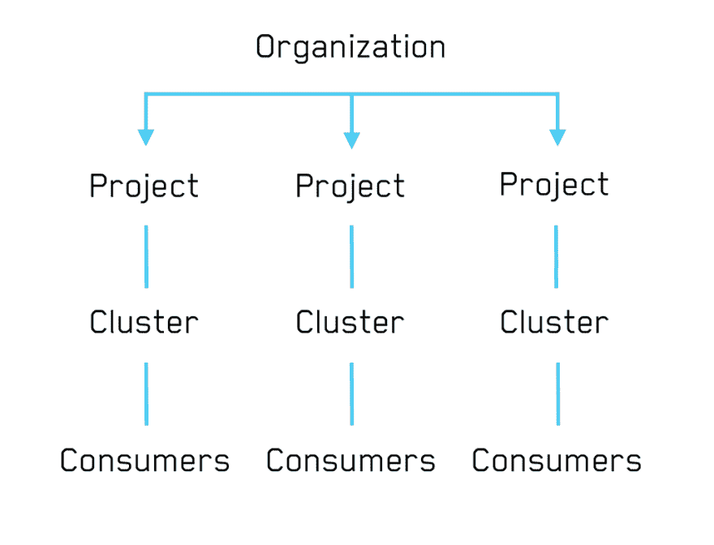

# 连接 Azure 物联网中心和 CrateDB 云以获取传感器数据

> 原文：<https://dev.to/tanay1337/connecting-azure-iot-hub-and-cratedb-cloud-for-the-ingestion-of-sensor-data-3km1>

由于 [*物联网*](https://en.wikipedia.org/wiki/Internet_of_things) (物联网)的兴起，智能工厂和智能城市等事物正在产生大量的机器数据。因此，需要可线性扩展的[时序](https://en.wikipedia.org/wiki/Time_series)数据库，能够处理这种规模的数据接收和处理。

微软 Azure 和 T2 的分布式 SQL 数据库非常适合这样的应用。事实上，我们最近发表了一篇名为 [Supercharge your Azure 物联网和时序数据应用](https://crate.io/a/supercharge-your-azure-internet-of-things-and-time-series-data-applications/)的博文。

这里有一个使用 Azure 和 CrateDB 的[容器就绪](https://en.wikipedia.org/wiki/Container_%28virtualization%29)、[水平可伸缩](https://stackoverflow.com/a/11715598)和[高可用性](https://en.wikipedia.org/wiki/High_availability)基础设施的高级视图:

[](https://res.cloudinary.com/practicaldev/image/fetch/s--HAAwHigY--/c_limit%2Cf_auto%2Cfl_progressive%2Cq_auto%2Cw_880/https://cdn-images-1.medium.com/max/1024/0%2ANsE7vLFIHyjkZtEY.png)

让我们来分解一下:

1.  Azure 物联网中心接收由您的边缘设备(例如，智能工厂中的传感器)生成的数据。
2.  从那里，您可以使用 CrateDB(托管在 Microsoft Azure 上)实时查询和分析数据。
3.  然后，使用 Power BI 或插件 Grafana 生成报告，以便根据时间序列和机器数据进行数据可视化。

在这篇文章中，我将向你展示如何:

*   在 Azure 上启动 CrateDB 集群，
*   将它与物联网中心连接起来
*   在 Azure 物联网解决方案加速器的帮助下，模拟要摄取的传感器数据

### 模拟传感器数据

首先，我们需要决定数据是什么样的，然后才能开始生成数据并将其推送到 Azure IoT Hub。

智能工厂有大量的传感器，测量各种各样的参数。

数据结构因传感器而异，但我们可以使用一个使用动态对象[的单个表来建模这些数据结构，这些对象可以被查询到任意深度。这不是我们推荐的生产设置，但是它使演示更加容易。](https://crate.io/docs/crate/reference/en/latest/general/ddl/data-types.html#dynamic)

Azure 物联网[解决方案加速器](https://azure.microsoft.com/de-de/features/iot-accelerators/)提供了一个预配置模板库，以加速您的物联网项目。

[设备模拟](https://www.azureiotsolutions.com/Accelerators#/sdssolutions/new/device-simulation)加速器可以让你模拟各种类型的物联网设备。这些设备将产生数据，然后我们可以摄取到 CrateDB。

要创建一个，请转到 [*新设备模拟*](https://www.azureiotsolutions.com/Accelerators#/sdssolutions/new/device-simulation) 页面，提供部署名称，并选择适当的 Azure 订阅、部署选项和 Azure 位置。

以下是我的设置:

[](https://res.cloudinary.com/practicaldev/image/fetch/s--6kU87d_I--/c_limit%2Cf_auto%2Cfl_progressive%2Cq_auto%2Cw_880/https://cdn-images-1.medium.com/max/1024/0%2AxNY5-P74EDEuuQ8u.png)

我给我的设备模拟命名为`CrateDBIngest`，选择我的`crate-development` Azure 订阅，选择 *Provision new IoT Hub* ，然后选择*西欧*作为我的 Azure 位置。

完成后，选择 *Create* 按钮开始部署过程。

部署新设备模拟大约需要 15 到 20 分钟。完成后，我们会通过电子邮件通知您。

解决方案加速器页面现在应该如下所示:

[](https://res.cloudinary.com/practicaldev/image/fetch/s--p1V2GDr1--/c_limit%2Cf_auto%2Cfl_progressive%2Cq_auto%2Cw_880/https://cdn-images-1.medium.com/max/1024/0%2AJVdHYr1UwJ3bFU-O.png)

从这里，选择顶部导航栏右侧的*我的解决方案*选项卡，然后选择适当的*启动*按钮。

进入解决方案加速器后，选择 *New Simulation* 并输入关于您的模拟器的一些信息:

[](https://res.cloudinary.com/practicaldev/image/fetch/s--oRf2T-kc--/c_limit%2Cf_auto%2Cfl_progressive%2Cq_auto%2Cw_880/https://cdn-images-1.medium.com/max/1024/0%2AmA3xnA47zfofr6vE.png)

我将模拟命名为`SensorDevice`，并将模拟设置为开始后 10 分钟结束。然后，我选择了*冷却器*设备型号，它主要发送温度、压力和湿度的模拟遥测数据。

我设置了 10 个这样的设备，并配置它们每秒发送一条消息。

最后，我选择使用一个预配置的物联网集线器，并将节流限制设置为 S2 标准。

准备好后，选择*开始模拟*按钮。Azure 将开始运行模拟，您应该会看到这样的屏幕:

[](https://res.cloudinary.com/practicaldev/image/fetch/s--UTR6XoCZ--/c_limit%2Cf_auto%2Cfl_progressive%2Cq_auto%2Cw_880/https://cdn-images-1.medium.com/max/1024/0%2AeBWLftc5_zGvix7X.png)

在这里，我们看到在模拟运行的 10 分钟内创建了 520 条消息。一旦我们完成整个设置，这些消息(也称为[事件](https://docs.microsoft.com/en-us/azure/event-hubs/event-hubs-about))将被推送到 CrateDB。

### 配置 Azure 门户

现在，我们去 [Azure 门户](https://portal.azure.com/)配置一些东西。

在 Azure 门户屏幕顶部的搜索栏中，搜索*资源组*。应该已经使用与解决方案加速器的部署名称相同的名称为您创建了一个新的资源组。(如果您手动选择将解决方案加速器部署到现有资源组，则情况并非如此。)

我的设备模拟被命名为`CrateDBIngest`，所以我的资源组也被命名为`CrateDBIngest`:

[](https://res.cloudinary.com/practicaldev/image/fetch/s--XGi_cdqy--/c_limit%2Cf_auto%2Cfl_progressive%2Cq_auto%2Cw_880/https://cdn-images-1.medium.com/max/1024/0%2AyQAhc7mdgPkZe1uV.png)

该资源组中列出了 13 种资源。我们需要更改*物联网中心*和*存储账户*资源类型的配置(参见*类型*列)。

### 物联网中枢

在上面的截图中，你可以看到我的物联网 Hub 资源被命名为`iothub-oo6xk`。

选择您的物联网中心资源。然后，转到*设置*部分左侧的*内置端点*选项，并在*消费者群组*部分下创建一个新的消费者群组。

我为我的[消费者群体](https://docs.microsoft.com/en-us/azure/event-hubs/event-hubs-features#consumer-groups)选择了`cratedbingest`这个名字。

记下您选择的名称，并复制列出的 *EventHub 兼容端点* URL。在后面的步骤中，您将需要这两者(在下面用红色标记)。

[](https://res.cloudinary.com/practicaldev/image/fetch/s--Mjdbngz_--/c_limit%2Cf_auto%2Cfl_progressive%2Cq_auto%2Cw_880/https://cdn-images-1.medium.com/max/1024/0%2AZaCBI4OYTJKKfHWU.png)

完成后，从菜单列表中选择*消息路由*并添加新路由。说出路线(我又和`cratedbingest`一起去了)。然后，选择端点*事件*，设置*设备遥测消息*为数据源，并保存您的更改。

### 存储账户

现在，返回到资源组，使用以下设置创建一个新的[存储帐户](https://docs.microsoft.com/en-us/azure/storage/common/storage-account-overview):

[](https://res.cloudinary.com/practicaldev/image/fetch/s--B7V_QnoJ--/c_limit%2Cf_auto%2Cfl_progressive%2Cq_auto%2Cw_880/https://cdn-images-1.medium.com/max/1024/0%2AFD0cl-aePKA3sufa.png)

注意:您可以使用由解决方案加速器创建的预先创建的存储帐户。但是，将数据放在单独的存储帐户中可能是有意义的，因为将来删除解决方案加速器需要您为其他使用情形创建一个新的帐户。

我们将使用 [blob 存储](https://azure.microsoft.com/en-us/services/storage/blobs/)来[检查点](https://en.wikipedia.org/wiki/Application_checkpointing)来自事件队列的数据。

创建存储帐户后，创建 blob 存储。然后，转到*设置*部分的*访问键*选项，复制存储帐户的名称以及 blob 存储连接字符串(下面用红色标记)。

### 建立 CrateDB 云

好了，现在，你的设备模拟器应该在 Microsoft Azure 上设置好了，你应该有以下信息:

*   您的 Azure 消费群的名称
*   使用者组 EventHub 兼容的端点 URL
*   用于 Azure blob 存储的存储帐户的名称
*   blob 存储连接 URL

有了这些，您就可以开始设置 CrateDB Cloud 了。

你可以使用 [Croud](https://crate.io/docs/cloud/cli/en/latest/) ，一个*命令行界面* (CLI)工具，与 CrateDB Cloud 进行交互。

安装 Croud，像这样:

```
$ pip install croud 
```

然后，登录:

```
$ croud login 
```

这将打开一个浏览器窗口，以便您可以登录到您的 CrateDB 云帐户:

[](https://res.cloudinary.com/practicaldev/image/fetch/s--NiFfxpK_--/c_limit%2Cf_auto%2Cfl_progressive%2Cq_auto%2Cw_880/https://cdn-images-1.medium.com/max/1024/0%2A_Ra2zwQIlo9eHgab.png)

如果您目前没有 CrateDB 云帐户，您可以在此屏幕上选择*注册*来创建一个。

CrateDB 云帐户是这样组织的:

[](https://res.cloudinary.com/practicaldev/image/fetch/s--f98pSeDv--/c_limit%2Cf_auto%2Cfl_progressive%2Cq_auto%2Cw_880/https://cdn-images-1.medium.com/max/1024/0%2Al0WsfA7Gz_wQ0_xF.png)

让我们来分解一下:

*   在顶层，所有帐户都必须属于一个组织
*   组织可以有多个项目
*   项目可以有多个 CrateDB 集群
*   创建的集群可以有多个事件消费者

### 部署一个 CrateDB 集群

首先，创建一个新的组织:

```
$ croud organizations create --name "CrateDBIngest" --plan-type 1 

+--------------------------------------+---------------+-----------+  
|id                                  | name          |   plan_type |                         
|--------------------------------------+---------------+-----------|  
|8a8e5841-ad1d-4519-8683-138a08b73130| CrateDBIngest | 1           | 
+--------------------------------------+---------------+-----------+ 
```

现在，创建你的第一个项目:

```
$ croud projects create --name "CrateDBIngest" --org-id ORG_ID

+----------------------------------------------+
| id                                           |
|----------------------------------------------|
| d24b6665-9719-42e8-9876-9b7f300dd159         |
+----------------------------------------------+ 
```

在这里，用您的组织 ID 替换`ORG_ID`(在上面运行的命令的输出中给出。

输出表返回项目 ID(在我的例子中是`d24b6665-9719-42e8-9876-9b7f300dd159`)。

现在，部署您的第一个 CrateDB 集群: