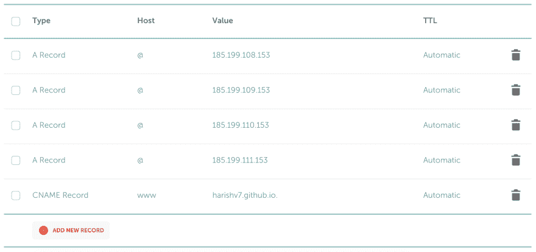

# 连接域名和 GitHub 页面

> 原文：<https://dev.to/rightfrombasics/connecting-namecheap-domain-with-github-pages-3nn6>

这是一个基础教程，面向那些希望将自己的自定义域连接到 GitHub 页面的人。这篇文章假设你会得到你的域名。但是，它应该主要适用于任何域提供商。

我第一次使用 Namecheap 是因为他们向学生提供免费域名。是的，如果你是学生，你可以免费获得一个以`. me '结尾的域名，为期一年。点击这里查看他们的报价。

#### 1。在 Namecheap 上注册

只需进入 [Namecheap 主页](https://www.namecheap.com/)并注册一个账户。

#### 2。选择一个酷域

尝试获取一个`.com`域。它是最通用和最常用的领域。但是随着大量网站在网上浮动，你可能无法在`.com`下找到你理想的域名。如果是这样的话，看看个人网站的`.me`域名(比如我的)，创业公司的`.io`，`.net`。Namecheap 提供了广泛的域名可供选择。其中有`.life`、`.co`、`.tech`等。

仔细选择领域，因为你会坚持一段时间。

#### 3。获取 GitHub 存储库

如果您还没有创建存储库，请转到 GitHub 创建一个。将其命名为`<your-github-username>.github.io`,并确保您有一个主分支，您可以在其中推送您的 HTML 文件。我假设您已经准备好了 HTML、CSS 和 JavaScript 文件。将它们推送到主分支上的这个存储库。

访问网站`<your-github-username>.github.io`应该允许您查看预期的网站。

#### 4。在存储库中创建 CNAME 记录

用你的域名创建一个名为 CNAME 的文件。就是这样。例如我的 CNAME 文件包含这个:
`harishv.me`。

#### 5。转到 Namecheap 的仪表板

在高级 DNS 部分下，添加以下记录。CNAME 记录的值遵循您在步骤 3 中创建的 GitHub URL。A 记录用于将域名指向托管服务器的 IP 地址，在您的例子中，托管服务器是 GitHub 的。

这是所有的乡亲。给它几分钟(或几小时)，你的网站将在你新注册的域名上运行。

### 找托管？

*   如果你想要最好的 Wordpress 托管，我强烈推荐 [Bluehost](https://www.bluehost.com/track/harishv/) 。当你[通过此链接](https://www.bluehost.com/track/harishv/)申请时，可以获得很大的折扣。
*   此外，当你[通过此链接](https://www.hostg.xyz/aff_c?offer_id=6&aff_id=2883)申请时，还可以获得 [Hostinger](https://www.hostg.xyz/aff_c?offer_id=6&aff_id=2883) 的大幅折扣。

这两项服务都提供了良好的正常运行时间和客户服务。哦，我有没有提到-你得到一个免费的域名与 Bluehost 和 Hostinger！