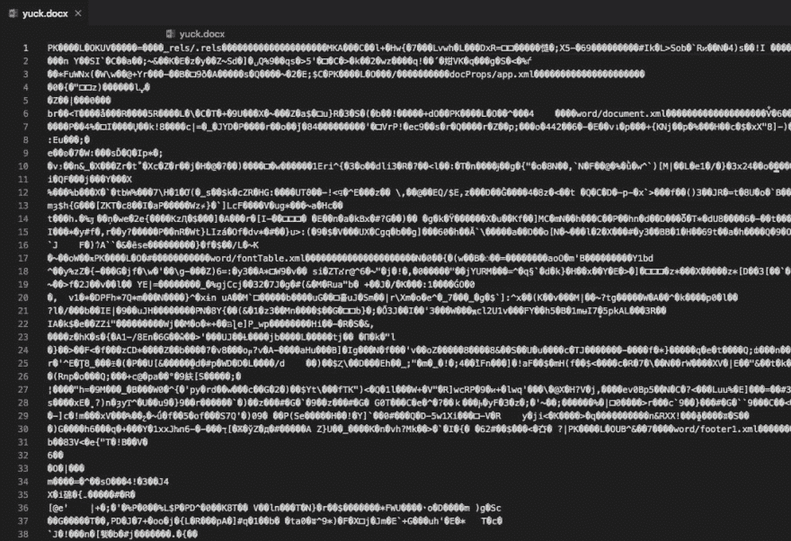

# 使用基于 Python 的 Lambda 将 Word 转换为 PDF

> 原文：<https://dev.to/mdhornet90/converting-word-to-pdf-using-a-python-based-lambda-3d82>

### 使命

TL；DR or: [中止任务](#finally-the-code)

我最近接受了一个新任务，在其他事情中，在无服务器架构中大量使用 AWS。我的第一个任务的目标是当文档被上传到 S3 桶时触发λ[，并将不同格式的文件转换为`.pdf` s。期望支持的格式包括`.doc`和`.docx`。虽然我知道这些文件包含了在文档编辑过程中使用的元数据，但我认为我可以只抓取文档，直到找到 ascii 字符。直到我强行 VS 代码打开文件 raw:
](https://docs.aws.amazon.com/lambda/latest/dg/with-s3.html)[](https://res.cloudinary.com/practicaldev/image/fetch/s--sbXYn8R4--/c_limit%2Cf_auto%2Cfl_progressive%2Cq_auto%2Cw_880/https://thepracticaldev.s3.amazonaws.com/i/c7jgv2c2qt61neflpwyq.png) 
这才惊觉。很明显，我正忙得不可开交。

### 探索

所以我想我们都同意编写代码来解决问题应该是最后的手段，所以首先我想知道我是否可以利用一个(希望是免费的)服务来完成这个重任。

#### Google Docs 怎么样？

我考虑过使用 Google Docs 作为转换工具，但是一个在这个项目上工作了很长时间的同事告诉我，Google Docs 总是会删除某些格式元素，通常是像 open paren 这样的符号。企业的要求是完整地保留文档格式，所以我不能冒险使用不完整的解决方案。

#### 好吧，那还有什么呢？

原来将 word 文档转换成 pdf 的一个流行策略是使用 LibreOffice 的 [CLI 功能。事实上，已经存在一个基于 JS 的库，](https://help.libreoffice.org/Common/Starting_the_Software_With_Parameters)[就是做这个的](https://github.com/shelfio/aws-lambda-libreoffice)！

#### 哦！那么为什么不用 Javascript 代替 Python 呢？

因为我喜欢使用 Python，想要一个挑战？忘记我之前说的关于避免写代码的话。

#### 那好吧。

### 工具

因此，我们已经确定，我想在一个基于 Python 的 AWS Lambda 中复制 Javascript Word-to-PDF 转换库的功能，这完全是出于与自我无关的原因。第一步是分析前面提到的 JS 库的代码，找出神奇的事情是如何发生的。让我们来看看`Shelf`对其基于 AWS-Lambda 的图书馆的描述:

> 85 MB LibreOffice 适合 AWS Lambda 使用`brotli`压缩

果然代码[证明了](https://github.com/shelfio/aws-lambda-libreoffice/blob/master/src/convert.ts)的存在。它使用 ~~Richard 的~~ Google 的 [`brotli`压缩算法](https://github.com/google/brotli)将 [LibreOffice Lambda Layer](https://github.com/shelfio/libreoffice-lambda-layer) 提供的`lo.tar.br`文件解压到给定 AWS Lambda 函数的`/tmp`文件夹中。

这看起来确实很费力，为什么我们不能自己上传一个包含在 LibreOffice 层中的解包实例呢？好吧，在这一点上，是时候从技术悬崖上跳下去了...

### 约束

众所周知，从任何来源[上传到 Lambdas 的最大代码包是 250MB](https://hackernoon.com/exploring-the-aws-lambda-deployment-limits-9a8384b0bec3) 。你可能会看到上面的那个`85MB`数字，然后想“到底是什么问题？”

#### 你读懂了我的心思，是什么？

虽然`85MB`确实是一个比`250MB`小得多的数字，但它证明了`brotli`算法在打包其内容方面是多么有效；未压缩解包，包的大小刚好在`300MB`以北！因此，如果我们自己上传这个包，我们仍然需要对它的内容进行解压缩。在这种情况下，我们为什么不利用现有的 LibreOffice 层来[保持我们的部署包小](https://docs.aws.amazon.com/lambda/latest/dg/configuration-layers.html)并减少每当我们上传新代码时的迭代时间，这肯定比我们使用 LibreOffice 更频繁地发生变化？

#### 你说服了我，但我们如何前进？

正如我之前提到的，JS 库将 LibreOffice 解包到`/tmp`，这有利于[，原因有二](https://docs.aws.amazon.com/lambda/latest/dg/running-lambda-code.html):

1.  `/tmp`的大小被限制在`512MB`，对于 LibreOffice 的一个解压缩和未打包的实例以及一个(sane) Lambda 函数给定运行的所有修复来说绰绰有余！
2.  在运行之间，`/tmp`的内容被*缓存，这意味着我们可以添加逻辑来重用之前解包的 LibreOffice 实例。考虑到我的测试证明程序的初始提取需要 10 秒到 12 秒，这是一个关键的性能改进，以保持依赖于 PDF 转换的 Lambdas 的速度！*

### 走近

好了，最后，我们要想出一个算法！首先，让我们回顾一下我们所知道的所有这些部分是如何组合在一起的。

*   LibreOffice Lambda 层像所有其他 Lambda 层一样，将其内容转储到`/opt`文件夹中。所以我们知道我们有一个大小为`85MB`的`/opt/lo.tar.br`文件需要解压缩。
*   我们知道，对于 Lambda 函数的任何给定运行，我们在`/tmp`中有`512MB`的空间，所以我们要在那里展开所有内容。
*   我们也知道`/tmp`在 Lambda 运行之间是可缓存的，所以我们要检查 Lambda 的前一次运行是否已经为我们解包了。
*   最后，我们知道 LibreOffice 已经用`brotli`压缩算法进行了压缩。我将缩短悬念，告诉你一个特定于 Python 的[实现已经存在](https://pypi.org/project/Brotli/)，并带有[可接受的文档级别](https://python-hyper.org/projects/brotlipy/en/latest/api.html)。

考虑到所有这些，我们现在有足够的上下文将`Shelf`库的 JS 代码移植到 Python！

### 实现

#### 构建工具

请记住，所有这些解压缩和解包都需要在 AWS Lambda 函数本身中完成，因此我们需要使用的任何外部工具(如`brotli`模块)都必须捆绑在我们发送的函数代码中。我强烈推荐使用这个任务的 [juniper 工具](https://pypi.org/project/juniper/)——它将独立版本的依赖项和所有源代码捆绑到一个`.zip`文件中。从那里开始，只需要[上传你的捆绑代码到 AWS](https://docs.aws.amazon.com/lambda/latest/dg/lambda-python-how-to-create-deployment-package.html#python-package-dependencies) (注意`juniper`为你处理步骤 1 到 3)。

#### 最后，代码

```
import os
from io import BytesIO
import tarfile

import brotli

LIBRE_OFFICE_INSTALL_DIR = '/tmp/instdir'

def load_libre_office():
    if os.path.exists(LIBRE_OFFICE_INSTALL_DIR) and os.path.isdir(LIBRE_OFFICE_INSTALL_DIR):
        print('We have a cached copy of LibreOffice, skipping extraction')
    else:
        print('No cached copy of LibreOffice exists, extracting tar stream from Brotli file...')
        buffer = BytesIO()
        with open('/opt/lo.tar.br', 'rb') as brotli_file:
            decompressor = brotli.Decompressor()
            while True:
                chunk = brotli_file.read(1024)
                buffer.write(decompressor.process(chunk))
                if len(chunk) < 1024:
                    break
            buffer.seek(0)

        print('Extracting tar stream to /tmp for caching...')
        with tarfile.open(fileobj=buffer) as tar:
            tar.extractall('/tmp')
        print('Done caching LibreOffice!')

    return '{}/program/soffice'.format(LIBRE_OFFICE_INSTALL_DIR) 
```

#### 分解它

在上面的模块中有一点需要解开([对不起](https://chumley.barstoolsports.com/wp-content/uploads/2018/11/26/5aa22d7456db5.image_.jpg))，所以我将调出一些更有趣的代码:

```
if os.path.exists(LIBRE_OFFICE_INSTALL_DIR) and os.path.isdir(LIBRE_OFFICE_INSTALL_DIR):
    print('We have a cached copy of LibreOffice, skipping extraction')
else: 
```

正如我之前提到的，考虑到解压缩 LibreOffice 需要多长时间，我们需要重用 Lambda 之前运行的成果。我们的 Lambda 单独控制了`/tmp`中的所有空间，而且据我所知，默认情况下，Lambda 执行是按顺序发生的，所以简单地检查一下`instdir`(libre office 程序解包后的根)是否存在就足够了。

```
buffer.seek(0) 
```

错过这一行让我进行了 20 分钟的兔子追踪，试图找出为什么试图解压包含在`buffer`中的`.tar`文件却没有产生任何文件或文件夹。如果你打算先写后读的话，一定要把读指针设置在缓冲区的开头！

```
with tarfile.open(fileobj=buffer) as tar:
    tar.extractall('/tmp') 
```

你会看到这里我用一个`fileobj`来利用`tarfile`的 [open](https://docs.python.org/3/library/tarfile.html) 函数。为什么不将解压后的`.tar`文件写入`/tmp`中的文件系统，然后打开它呢？事实证明，试图让 LibreOffice 的打包和未打包实例都超过`512MB`的限制`/tmp`！如果你参考`Shelf`的 [Brotli Unpacker 库](https://github.com/shelfio/aws-lambda-brotli-unpacker/blob/master/src/index.js)的源代码，你会看到它通过一个 tar-extractor(暗示它是一个内存中的操作)传输解压缩结果，所以我假设他们正在解决同一个问题。

我并不经常用 Python 为我的日常工作编写代码，所以我可能会错过一种更 Python 化的方式来表达本质上相同的管道操作，但是它确实完成了工作。只要你愿意为你的 Lambda 分配适量的内存，这应该不是问题。

### 总结起来

我[没有正式测试这个解决方案](https://chumley.barstoolsports.com/wp-content/uploads/2018/11/26/5aa22d7456db5.image_.jpg)的性能，但是平均分配给 Lambda 512 MB 的内存，并且假设 Lambda 使用 LibreOffice 的缓存副本，这个函数大约在`1s`到`1.5s`之间转换 pdf，这取决于它的大小。

弄清楚这种方法让我学到了很多关于 AWS Lambda 的优点，它最终成为了在该生态系统的约束下工作的一个有趣的挑战。

最后，这是我的第一篇文章，所以不言而喻(但我还是要说)如果你看到这个解释可以改进的方法，一定要让我知道！

### 参考文献

*   [通过亚马逊 S3 使用 AWS Lambda](https://docs.aws.amazon.com/lambda/latest/dg/with-s3.html)
*   [LibreOffice CLI 文档](https://help.libreoffice.org/Common/Starting_the_Software_With_Parameters)
*   [`Shelf`的 Lambda 为基础的图书馆](https://github.com/shelfio/aws-lambda-libreoffice)
*   [`Shelf`的图书馆λ层](https://github.com/shelfio/libreoffice-lambda-layer)
*   [`Shelf`](https://github.com/shelfio/aws-lambda-brotli-unpacker)
*   [`brotli`模块文档](https://python-hyper.org/projects/brotlipy/en/latest/api.html)
*   [`juniper`λ打包工具](https://pypi.org/project/juniper/)
*   [具有依赖关系的代码的 AWS Lambda 部署程序](https://docs.aws.amazon.com/lambda/latest/dg/lambda-python-how-to-create-deployment-package.html#python-package-dependencies)