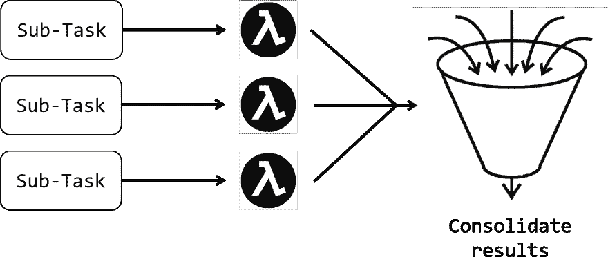
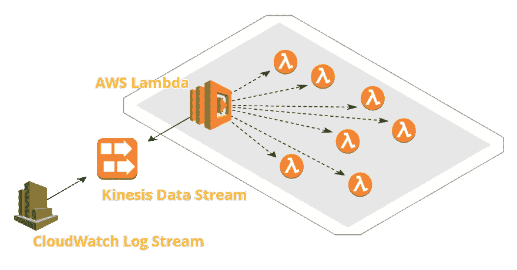
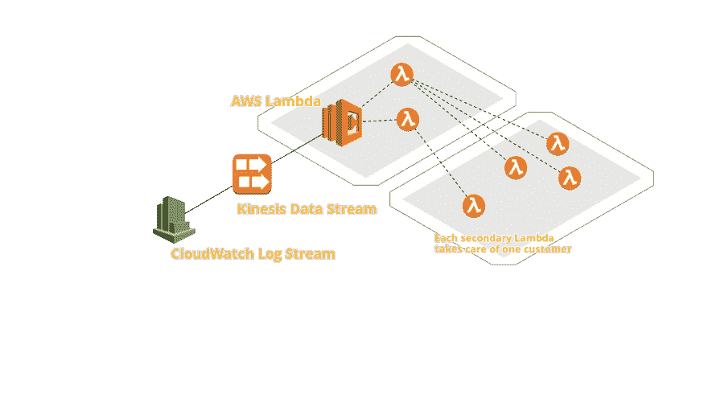

# AWS Lambda 扇出和扇入速成班

> 原文：<https://dev.to/byrro/crash-course-on-fan-out-fan-in-with-aws-lambda-47g0>

Lambda 是 AWS 广受欢迎的无服务器计算服务。它允许通过非常简化的基础架构管理实现大规模并行化，这使其成为实施扇出/扇入(也称为推拉)架构的绝佳候选工具。

扇出基本上是将一个较大的任务(或一批任务)分割成较小的子任务，将这些子任务的处理委托给另一个功能，该功能并行运行，以快速高效的方式完成整个过程。

当我们需要从以前扇出的子任务中收集结果以巩固结果时，可以使用扇入。例如，当应用程序需要等待所有子任务完成后才能继续整个流程时，它也很有用。

扇出可以单独应用，但是扇入显然依赖于之前的扇出过程(没有必要合并之前没有分离的东西)。

## 扇出图

[](https://res.cloudinary.com/practicaldev/image/fetch/s--AJNiqLxa--/c_limit%2Cf_auto%2Cfl_progressive%2Cq_auto%2Cw_880/https://d1enm3zt1hbvj4.cloudfront.net/static-media/fan-out-fan-in-article/fanout-diagram.png)

## 扇入图

[](https://res.cloudinary.com/practicaldev/image/fetch/s--O8Q9y9g3--/c_limit%2Cf_auto%2Cfl_progressive%2Cq_auto%2Cw_880/https://d1enm3zt1hbvj4.cloudfront.net/static-media/fan-out-fan-in-article/fanin-diagram.png)

# 简单扇出从λ到λ

Lambda 不仅可以用作子任务处理器，还可以用作“通风机”(如上图所示)。我们至少有两个 Lambda 函数:

1.  **Ventilator** :接收一个大任务，并将其分解以调用子任务处理器；
2.  **处理器**:接收子任务并执行任何需要的任务

在这种情况下，我们将需要呼吸机 Lambda 以编程方式调用处理器 Lambda 的一个或多个实例。

AWS 有针对所有主要运行时和编程语言的 SDK:NodeJS，Python，Java，你能想到的。在本文中，我们将使用 Python 及其相应的 AWS SDK ( [boto3](https://aws.amazon.com/sdk-for-python/) )，因为它有非常简单易读的语法，使得示例对环境有些不可知。

调用 Lambda 函数有两种方法: [Invoke](https://docs.aws.amazon.com/lambda/latest/dg/API_Invoke.html) 和 [InvokeAsync](https://docs.aws.amazon.com/lambda/latest/dg/API_InvokeAsync.html) 。基本上区别在于，通过使用 Invoke，呼吸机将在关闭 HTTP 连接之前等待每个处理器响应结果。另一方面，InvokeAsync 将只调用处理器 Lambda，它将快速响应一个“Ok ”,并立即终止连接，继续后续的子任务处理。

这将对扇入策略产生影响，我们将在下一个主题中讨论。

## 并发，并发，并发

但是，在这种情况下，AWS SDK 有一个问题:它使用阻塞 HTTP 请求。如果我们通过一个子任务列表循环扇出，每个请求都会阻止下一个请求向处理器发出。第二个子任务只有在第一个完成后才会出去，以此类推，完全挫败了整个架构的并行化优势。

我们需要并行处理处理器调用请求。使用 InvokeAsync 端点不会使 SDK 以并行方式运行。我们[使用 Python](https://gist.github.com/byrro/439d233636ac6894f87c1df6ff1fa298) [asyncio](https://docs.python.org/3/library/asyncio.html) 和 [aiohttp](https://github.com/aio-libs/aiohttp) 库发布了 AWS Lambda API 端点的非阻塞 HTTP 请求的实现。它是在麻省理工学院许可下开源的，请随意在你的项目中使用它。

下面是我们如何使用这个非阻塞的 HTTP 请求方法:

```
from async_lambda import invoke_all

requests = [
    {
        'function_name': 'lambda-function',
        'payload': {...},
    },
    ...
]

results = invoke_all(
    requests=requests,
    region='us-east-1',
    async=True,
) 
```

# 逐步扇入

如果使用 Invoke 端点(同步请求)将子任务分散到 Lambda，则很容易消费和整合结果:只需等待所有处理器 Lambda 响应并运行整合逻辑。

在非常常见的异步调用中，扇入过程需要更多的结构。下面是使用 [DynamoDB](https://aws.amazon.com/dynamodb/) 的一步一步的指导。

## 1。创建处理批处理对象

第一件事是创建一个处理批处理作为保护伞来跟踪和识别 DynamoDB 中的所有子任务。

我们将需要这个处理批处理的唯一标识符，它需要是幂等的。这一点很重要，因为如果中途出现故障，Lambda 会自动重试请求，我们希望避免这种行为带来的不必要的副作用([我最近写过这个](https://dashbird.io/blog/why-your-lambda-functions-may-be-doomed-to-fail/))。

与 Lambda 调用相关联的两个可能的唯一标识符是:

**调用请求 ID** :

```
def handler(event, context):
    unique_id = context.aws_request_id 
```

**事件有效载荷哈希** :

```
import hashlib
import json

def handler(event, context):
    unique_id = md5_hash(json.dumps(event))

def md5_hash(string, encoding='utf-8'):
    md5 = hashlib.md5()
    md5.update(string.encode(encoding))
    return md5.hexdigest() 
```

现在让我们将这个批处理存储在 DynamoDB 中，以便以后跟踪，以及生成的子任务的数量:

```
import time
import boto3

# Preparing the list of sub-tasks is beyond the scope of this tutorial sub_tasks = [...]

client = boto3.client('dynamodb')

client.put_item(
    TableName='fan-out-tasks',
    Item={
        'unique_id': {
            'S': f'BATCH-{unique_id}',  # Defined in the previous step
        },
        'total_tasks': {
            'N': len(sub_tasks),
        },
        'finished_tasks': {
            'N': 0,
        },
        'status': {
            'S': 'pending',
        },
        'created_at': {
            'N': str(int(time.time())),
        },
        'finished_at': {
            'NULL': True,
        },
    },
    # This condition prevents running the same batch multiple times
    ConditionExpression='attribute_not_exists(unique_id)',
) 
```

## 2。在 DynamoDB 中存储每个子任务的引用

我们将通过使用 DynamoDB 中存储的批处理对象中的`finished_tasks`属性来跟踪作业进度。每当一个子任务完成时，它将递增该计数器。当`finished_tasks == total_tasks`时，意味着我们完成了所有的处理。

问题是 [DynamoDB 增量计数器不是幂等的](https://docs.aws.amazon.com/amazondynamodb/latest/developerguide/WorkingWithItems.html#WorkingWithItems.AtomicCounters)。在失败的情况下，Lambda 将重试相同的子任务调用，这将被多次处理，可能会多次递增计数器。这将打破我们的逻辑。

为了避免这个问题并为处理器 Lambda 提供幂等性，我们将在 DynamoDB 中存储每个子任务的引用及其状态。

```
import time
import boto3

sub_tasks = [
    {'task': 'foo bar'},
    {'task': 'hello world!'},
    {'task': 'the quick brown fox jumped over the lazy dog'},
]

client = boto3.client('dynamodb')

# Beware that Dynamo accepts up to 25 items in batch write; split and
# request multiple times, if you have more sub-tasks response = client.batch_write_item(
    RequestItems={
        'fan-out-tasks': [
            {
                'PutRequest': {
                    'Item': {
                        'unique_id': {'S': f'SUBTASK-123ABC-{index}'},
                        'status': {'S': 'pending'}
                        'created_at': {'N': str(int(time.time()))},
                        'finished_at': {'NULL': True},
                    },
                },
            }
            for index, task in enumerate(sub_tasks)
        ]
    }
) 
```

一旦子任务完成，我们可以创建一个包含两个更新的[事务查询](https://docs.aws.amazon.com/amazondynamodb/latest/developerguide/transactions.html):

1.  增加批处理对象中的*完成任务*计数器
2.  将子任务对象中的*状态*属性更新为‘已完成’，条件是当前*状态*为‘待定’

在被调用后，处理器 Lambda 必须检查 DynamoDB 中的子任务*状态*是否为“未决”,然后继续处理:

条件更新还将防止在同一子任务被同时处理更多次的情况下增加一次以上。

在像 AWS Lambda 这样的大规模分布式系统中，如果事情可能出错，它们将在某个时候出错。安全总比后悔好。

## 3。扇出子任务

终于！我们现在可以扇出子任务。我们应该提供处理批处理 ID 以及子任务有效负载，以便每个处理器 Lambda 知道它的子任务所有者:

```
from async_lambda import invoke_all

sub_tasks = [
    {'task': 'foo bar'},
    {'task': 'hello world!'},
    {'task': 'the quick brown fox jumped over the lazy dog'},
]

requests = [
    {
        'function_name': 'processor-lambda-name',
        'payload': {
            'batch_id': unique_id,  # Determined in previous step
            'index': index,
            'task': task,
        },
    }
    for index, task in enumerate(sub_tasks)
]

invoke_all(requests=requests, region='us-east-1', async=True) 
```

## 4。处理子任务

当 Lambda 处理器被调用时，在试图处理子任务之前，它应该检索 DynamoDB 引用并仔细检查它的状态。除非“待定”，否则不应继续。

```
from boto3.dynamodb.conditions import Key

# Get the sub-task index from the Lambda event payload sub_task_index = event.get('index')

dynamodb = boto3.resource('dynamodb')
table = dynamodb.Table('fan-out-tasks')

response = table.query(
    KeyConditionExpression=Key('unique_id').eq(f'SUBTASK-123ABC-{sub_task_index }')
)

item = response['Items'][0]

if item.get('status') != 'pending':
    raise ValueError(
        f'Expected sub-task status "pending", got {item.get('status')}'
    ) 
```

子任务完成后，处理器 Lambda 应该使用事务查询更新 DynamoDB 中的批处理计数器以及子任务引用。我们还存储了任务处理的结果，以便在最后可以合并所有结果:

```
import json
import boto3

# Extract sub-task index from invocation payload sub_task_index = event.get('index')

client = boto3.client('dynamodb')

response = client.transact_write_items(
    TransactItems=[
        {
            'Update': {
                'Key': {
                    'S': 'BATCH-123ABC',
                },
                'UpdateExpression': 
                    'SET finished_tasks = finished_tasks + :increment',
                'ExpressionAttributeValues': json.dumps(
                    {
                        ':increment': {
                            'N': '1',
                        }
                    }
                )
            },
        },
        {
            'Update': {
                'Key': {
                    'S': f'SUBTASK-123ABC-{sub_task_index}',
                },
                'UpdateExpression': 'SET status = :new_status',
                'ConditionExpression': 'status = :pending',
                'ExpressionAttributeValues': json.dumps(
                    {
                        ':new_status': {
                            'S': 'finished',
                        },
                        ':pending': {
                            'S': 'pending',
                        },
                    }
                ),
            },
        },
    ]
) 
```

## 5。最后一个把一切都包起来了

如果一切按预期进行，在某个时候所有子任务都将完成。*希望*！

我们需要一个适当的流程来确定何时一切就绪，并开始整合结果。我们也将把它交给处理器 Lambda。在处理结束时，这个 Lambda 将检查 DynamoDB 中的批处理对象。如果`total_tasks == finished_tasks`，会触发结果的合并。

合并可以在处理器 Lambda 中进行，但是最好是分离关注点，并为此创建第三个 Lambda。让我们称之为合并器 Lambda。然后，处理器应该调用合并器，传递批次唯一 ID:

```
from boto3.dynamodb.conditions import Key

dynamodb = boto3.resource('dynamodb')
table = dynamodb.Table('fan-out-tasks')

# Get the Batch ID from the Lambda event payload batch_id = event.get('batch_id')

dynamodb = boto3.resource('dynamodb')
table = dynamodb.Table('fan-out-tasks')

response = table.query(
    KeyConditionExpression=Key('unique_id').eq(batch_id)
)

batch = response['Items'][0]

if batch['total_tasks'] == item['finished_tasks']:
    lambda_client = boto3.client('lambda')
    lambda_client.invoke(
        FunctionName='consolidator-lambda',
        InvocationType='Event',  # Asynchronous, will not wait for consolidator
        Payload={
            'batch_id': batch['unique_id'],
            'action': 'consolidate_results',
        },
    ) 
```

在被调用时，合并器 Lambda 将从 DynamoDB 获得所有子任务，并施展它的魔法:

## 6。了解幕后发生的事情

AWS Lambda 本身就是一头猛兽。它巨大的可伸缩性和特性(例如，超时和内存限制会带来麻烦)加上任何应用程序都可能出错的一大堆问题，使得很难监控和维护任何无服务器应用程序的健康。

为此，首先[在 Dashbird 上创建一个免费账户](https://dashbird.io/register/)(不需要信用卡)。然后，[将 Dashbird](https://dashbird.io/docs/get-started/quick-start/) 与你的 AWS 账户整合。

并且 *voilá* ，Dashbird 会自动开始监控你的 AWS Lambda 功能。我强烈建议[设置警报渠道](https://dashbird.io/docs/user-guide/integrations/)(电子邮件和/或空闲渠道)警报，这样当事情变糟时[就能得到通知](https://dashbird.io/docs/user-guide/alerting/)。

# 替代架构

## 用 Kinesis 或 SQS 扇出

以我们的用例为例: [Dashbird](https://dashbird.io/) 监控其他人的 Lambda 执行生成的日志。我们解析这些日志来识别各种事情，以帮助我们的客户更好地维护他们的应用程序健康:冷启动、错误、超时、执行异常等。我们的服务一直在稳步增长，[现在处理+350，000 个 Lambda 函数的日志](https://dashbird.io/blog/state-of-lambda-functions-2019/)，需要一个可以根据需求平滑伸缩的架构。

[](https://res.cloudinary.com/practicaldev/image/fetch/s--F3MWlwfh--/c_limit%2Cf_auto%2Cfl_progressive%2Cq_auto%2Cw_880/https://d1enm3zt1hbvj4.cloudfront.net/static-media/fan-out-fan-in-article/fan-out-with-kinesis.png)

由于这些日志存储在 CloudWatch 日志流中，我们为其订阅了一个 Kinesis 数据流，它负责将日志扇出到一个 Lambda 函数，该函数实现了我们处理 Lambda 日志的逻辑。

这是在 AWS 基础设施上创建无服务器且易于管理的扇出模式的一种方式。我们的实际实现更加复杂，但总的来说，这就是上图中的情况:

1.  每当有新的日志生成时，CloudWatch 都会通知 Kinesis
2.  Kinesis 将批处理并准备要消耗的日志
3.  Lambda 平台将不断轮询 Kinesis 检查新日志
4.  Lambda 函数的新实例将被调用，根据需求放大和缩小，接收日志作为解析的输入

这里有一个来自 AWS 的很好的[分步指南](https://docs.aws.amazon.com/lambda/latest/dg/with-kinesis.html)，解释了这个实现的每个主题。

通过使用 [SQS](https://aws.amazon.com/sqs/) 代替 Kinesis 数据流，可以实现类似的架构。AWS 有一篇关于它的[文章](https://docs.aws.amazon.com/lambda/latest/dg/with-sqs.html)。

## 让我们把它复杂化一点

在上面概述的用例中，扇出并不难，因为每个日志都需要相同的解析逻辑。一个客户或另一个客户的冷启动或超时错误之间没有区别。但是运行时之间存在差异:NodeJS 错误将不同于 Python 或。比如说网上的。

更复杂的是:假设我们希望允许用户自定义他们想要的日志解析方式？这正是 Logbird 这样的服务应该做的。例如，您可以输入多个正则表达式模式，并确定当其中任何一个模式匹配特定的日志行时应该发生什么。例如:您可以设置一个松弛通道通知，以防它在日志中发现*UserTier = BigBucksCustomer*和 *CreditCardExpired* 错误，以便您的支持团队做出相应的反应。

好吧，但是…我们如何让 Lambda 函数知道它们应该如何解析来自 Kinesis 的每个日志？我们不能再有纯粹的无状态执行了，因为解析逻辑会根据谁拥有日志流而变化。

## 定制扇出方法

假设我们将用户的模式存储在 [DynamoDB](https://aws.amazon.com/dynamodb/) 中。同一个 Lambda 函数可以检索所有模式并解析来自任何和所有客户的日志。问题是这种方法很难推广。如果有一千个顾客，每个人有 50 个图案，会怎么样？1 万或者 10 万客户怎么样？这可能不会顺利扩展。那么，在这种情况下，我们如何应用扇出呢？

我们可以想出一些方法。当然，我们太天真了，不能每次都找出所有的模式。因为每个 Lambda 调用只提供几个日志，所以它们也受限于几个客户模式。因此 DynamoDB 查询应该只过滤与日志所有者相关的模式。

但是这在某些情况下仍然会失败。如果一个客户模式出现问题，导致 Lambda 提前终止执行，该怎么办？我们将阻止其他客户的日志被解析。或者可能一个调用同时接收来自一群客户的日志，每个客户有太多的模式。那可能会使我们的功能超负荷。

因此，应用两级扇出策略可能是个好主意。从 Kinesis 接收日志后，我们的 Lambda 函数可以对日志所有者进行分组，然后调用另一个函数来分别处理每个客户的日志。

[](https://res.cloudinary.com/practicaldev/image/fetch/s--dpEOoCpV--/c_limit%2Cf_auto%2Cfl_progressive%2Cq_auto%2Cw_880/https://d1enm3zt1hbvj4.cloudfront.net/static-media/fan-out-fan-in-article/fan-out-with-kinesis-two-level.png)

# 结论

扇出/扇入模式使开发人员能够在 AWS Lambda 基础设施上构建可伸缩且灵活的应用程序。Lambda 和 AWS 目录之间的大量集成和事件源触发器也提供了许多选项来适应每种环境和需求。

我们鼓励您探索许多其他选项。AWS Lambda[能够捕获 Aurora SQL 数据库中的数据变化](https://aws.amazon.com/blogs/database/capturing-data-changes-in-amazon-aurora-using-aws-lambda/)，例如，基于自定义触发器，有效地允许我们使用 SQL 数据库作为起点来构建扇出架构，这在某些情况下非常有用([参见这里的实现指南](https://docs.aws.amazon.com/AmazonRDS/latest/AuroraUserGuide/AuroraMySQL.Integrating.Lambda.html))。

AWS 无服务器产品和潜力在不断发展，请密切关注。免费加入[我们的简讯](https://dashbird.io/#mc-embedded-subscribe-form)以接收无服务器领域的最新更新(在页面底部输入您的电子邮件——我们**和您一样讨厌垃圾邮件**!).