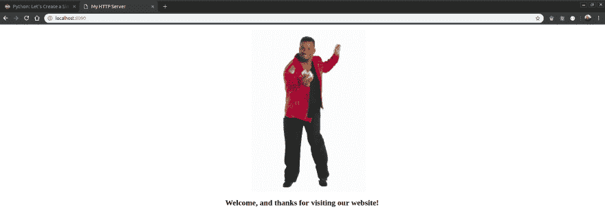

# 用 Python 创建 HTTP 服务器

> 原文：<https://dev.to/hallessandro/create-a-http-server-with-python-e25>

嗨，我的名字是 Hallessandro，我是一名软件开发人员，目前在巴西工作和生活，在这篇文章中，我将向您展示如何使用 Python 创建 HTTP 服务器，所以让我们开始吧。

### 要求

对于这篇文章，你需要在你的机器上安装 Python 3.x 和一些你喜欢的文本编辑器或 IDE。

我们的 HTTP 服务器将服务一个简单的静态 HTML 网页，这意味着每次有人向我们发出请求，HTTP 服务器将返回一个 HTML 页面作为响应。

首先，让我们创建一个新的 HTML 文件，它将在每次发出请求时使用。为此，创建一个**index.html**文件，并将以下代码放入其中。

```
<!DOCTYPE html>
<html lang="en">
<head>
    <meta charset="UTF-8">
    <meta name="viewport" content="width=device-width, initial-scale=1.0">
    <meta http-equiv="X-UA-Compatible" content="ie=edge">
    My HTTP Server
    <style>
        .img-div {
            display: flex;
            justify-content: center;
        }
        h2 {
            text-align: center;
        }
    </style>
</head>
<body>
    <dir class="img-div">
        
    </dir>
    <h2>Welcome, and thanks for visiting our website!</h2>
</body>
</html> 
```

我在我们的页面上放了一张图片，所以点击[这里](https://drive.google.com/open?id=13y3KDwTcgt6vZt-4m0sHN66AcDy2DDx4)并下载名为**的图片。您需要将图像放在 HTML 文件的同一个文件夹中，或者更改 img 标签上的 src 值。**

### 创建一个 HTTP 服务器

在 Python 中创建一个 HTTP 服务器，需要导入两个模块， **http.server** 和 **socketserver**

```
import http.server
import socketserver as socket 
```

现在我们需要一种方法来处理 http 请求，幸运的是，Python 有**http . server . simplehttprequesthandler**，这是一个简单的处理程序，用于处理当前目录中的静态文件。为了利用这个家伙，做出这样的东西:

```
handler = http.server.SimpleHTTPRequestHandler 
```

我们有一个处理程序来处理 http 请求，但是现在我们需要把我们的服务器放到空中，为此我们需要使用 TCP 协议。在 Python 中打开一个 TCP 连接非常简单(就像 Python 中的其他东西一样)，我们所需要的就是使用 **socketserver。TCPServer 类。**，像这样:

```
socketserver.TCPServer((IP_ADDRESS, PORT), Handler) 
```

如您所见，TCPServer 接收三个参数，一个是元组形式的 ip 地址和端口，另一个是处理程序，在我们的例子中是 SimpleHTTPRequestHandler 的一个实例。

Ip 地址不是必需的信息，您可以传递一个空字符串，这意味着服务器将监听任何可用的网络接口。

现在我们需要做的就是让服务器运行起来，为此，在 TCPServer 内部，我们需要从 TCPServer 类中调用一个名为 serve_forever()的方法，这个方法启动一个服务器并开始监听和响应传入的请求，为了使用它们，可以这样做:

```
with socket.TCPServer(("", PORT), handler) as httpd:
    print("Server is running on port ", PORT)
    httpd.serve_forever() 
```

现在让我们测试一下，为此，从您的终端运行 python 文件，如果一切正常，您将在控制台上看到类似这样的内容:

```
Server is running on port  8090 
```

现在，打开一个 web 浏览器，访问 url localhost:8090，将会显示这样一个页面:

[](https://res.cloudinary.com/practicaldev/image/fetch/s--cFAgJeoL--/c_limit%2Cf_auto%2Cfl_progressive%2Cq_auto%2Cw_880/https://thepracticaldev.s3.amazonaws.com/i/7gn01sex96ergck4lrob.png)

如果你看到在你的控制台上将会有一个日志来接收 GET 请求，当你在 web 浏览器上访问该页面时生成。

```
127.0.0.1 - - [22/Jan/2019 22:27:32] "GET / HTTP/1.1" 200 -
127.0.0.1 - - [22/Jan/2019 22:27:32] "GET /tenor.gif HTTP/1.1" 200 - 
```

这个例子的完整代码如下:

```
import http.server
import socketserver as socket

PORT = 8080
handler = http.server.SimpleHTTPRequestHandler

with socket.TCPServer(("", PORT), handler) as httpd:
    print("Server is running on port ", PORT)
    httpd.serve_forever() 
```

在一个真实的情况下，你的服务器不仅仅是服务器静态 html 文件，但举例来说，这是一个很好的方式来理解如何在 Python 中做到这一点，所以现在是所有的乡亲，感谢阅读，随时与我联系，直到下次伙计们。