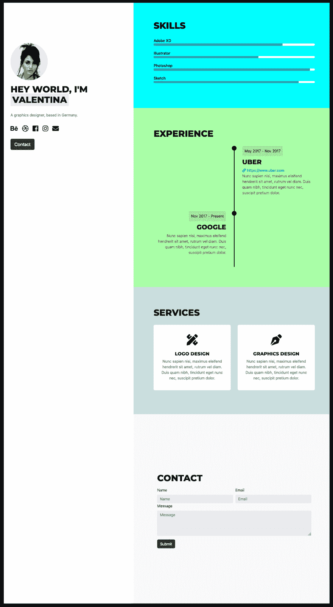
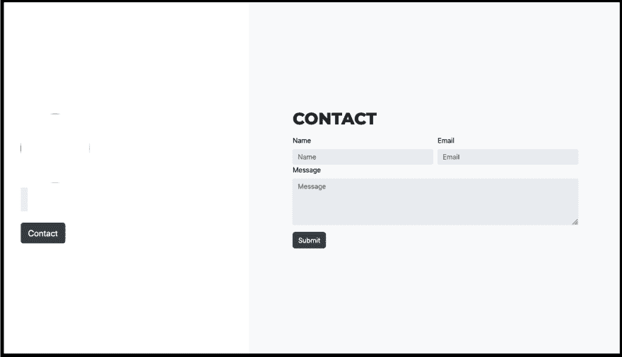
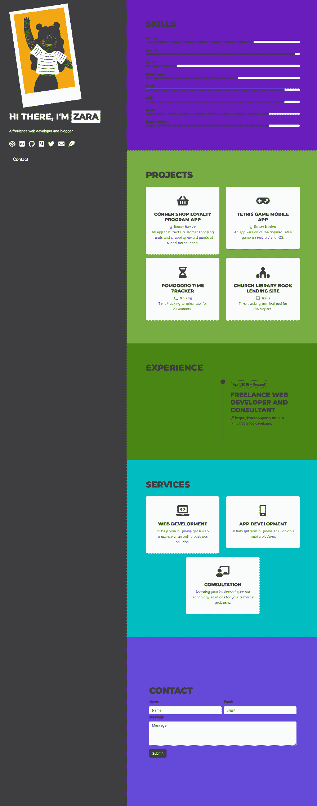

# 使用 Hugo 和 Github 页面创建您的开发者作品集

> 原文：<https://dev.to/zaracooper/create-your-developer-portfolio-using-hugo-and-github-pages-35en>

在寻找开发者工作时，让你与众不同的一点是投资组合网站。它让潜在的客户或雇主了解到你是一个怎样的专业人士，你过去做过什么样的工作，以及你现在在做什么。不幸的是，一个让许多人(包括最近的我自己)没有投资组合网站的常见障碍是害怕从头开始建立一个网站的所有工作、规划和想法，选择哪个主机提供商，如果你想要的域名可用，多少主机和一个域名会让你退缩(特别是如果你缺钱的话)等等。

在本教程中，我将带你快速、免费地建立和托管你的作品集网站。

## 但是，首先……拥有一个投资组合网站真的那么重要吗？

是的。原因如下:

1.  它展示了你作为开发人员的技术技能。你不仅可以列出你在职业生涯中磨练出的技能，还可以链接到具体展示这些技能的所有东西。这些可以包括你的项目、你参加过的黑客马拉松、你接受过的采访、你发表过的文章、你做过的教程、讲座、开源作品等等。
2.  它在联网时支持你。[人际关系网就是与兴趣相投的人联系在一起](https://podcasts.google.com/?feed=aHR0cHM6Ly9mZWVkcy5mZWVkYnVybmVyLmNvbS9Xb3JrbGlmZVdpdGhBZGFtR3JhbnQ%3D&episode=cHJ4XzEzMV9iMjNiZDRlYi04YWYyLTQ3ZmMtYTYwZi1iOGMwMWVjMTBmYjg%3D)你的作品集向 SWE 领域的其他人展示了你的兴趣所在。
3.  这是吸引潜在客户和雇主的一种方式。
4.  它帮助你建立你的品牌。它允许你定义你希望看到你的投资组合的新人如何看待你。
5.  它让你展示你的风格。
6.  作为一名开发人员，它是你进入互联网的门户。你可以让人们看到你的运球、Github、LinkedIn、Codepen、Dev.to、Medium、Youtube、Twitch 和你的其他各种开发者账户。

## 先决条件

1.  **Github 账号:** [如果你还没有一个的话，这里有一个链接](https://github.com/join)来创建一个。
2.  **Hugo 安装:**安装说明 [macOS](https://gohugo.io/getting-started/installing#macos) 、 [Windows](https://gohugo.io/getting-started/installing#windows) 和 [Linux](https://gohugo.io/getting-started/installing#linux) 。

# 第一步:生成你的新站点

1.  导航到你的终端，进入你设置网站的目录。
2.  为您的站点文件夹选择一个名称。我们将使用占位符`<PORTFOLIO_NAME>`。
3.  如下生成您的站点。

    ```
    hugo new site <PORTFOLIO_NAME> 
    ```

4.  `cd`到新生成的文件夹中，并初始化一个 git 存储库。

    ```
    cd <PORTFOLIO_NAME> && git init . 
    ```

# 第二步:选择并添加主题

1.  前往雨果的作品集主题页面，选择一个你喜欢的主题。对于本教程，我选择了一个名为 [UILite](https://themes.gohugo.io/hugo-uilite/) 的主题。它很简单，看起来很酷，满足投资组合的基本需求。不过，还有许多其他很酷的主题可供选择。

    这就是 UILite 主题的样子。

    [](https://res.cloudinary.com/practicaldev/image/fetch/s--3l--6lgw--/c_limit%2Cf_auto%2Cfl_progressive%2Cq_auto%2Cw_880/https://thepracticaldev.s3.amazonaws.com/i/yfhe1ycgdqrrla73x0w4.png)

2.  将主题作为 git 子模块添加到`<PORTFOLIO_NAME>`。这一步因主题而异，但几乎所有的主题都鼓励使用主题作为子模块。您可以通过运行
    来添加主题

    ```
    git submodule add <LINK_TO_THEME_REPO> themes/<THEME_NAME> 
    ```

    在我们的例子中:

    ```
    git submodule add https://github.com/uicardiodev/hugo-uilite themes/hugo-uilite 
    ```

3.  在已经为你自动生成的 **config.toml** 文件中指明你将用于你的投资组合网站的`<THEME_NAME>`。config.toml 文件允许你为你的整个站点指定设置。

    ```
    echo ‘theme = "<THEME_NAME>”’ >> config.toml 
    ```

    对于我们的主题，这是我们要做的:

    ```
    echo ‘theme = "hugo-uilite”’ >> config.toml 
    ```

    在这一步的最后，您的 **config.toml** 文件应该看起来像这样:

    ```
    baseURL = "http://example.org/"
    languageCode = "en-us” title = "My New Hugo Site” theme = "hugo-uilite” 
    ```

这将是改变投资组合网站的`baseURL`和`title`的好时机。

# 第三步:测试你的网站

1.  启动 Hugo 服务器。

    ```
    hugo server 
    ```

2.  在浏览器上，导航到 [http://localhost:1313](https://localhost:1313/) 。您的站点现在应该可以工作了，看起来像这样:

    [](https://res.cloudinary.com/practicaldev/image/fetch/s--3bA9PoBd--/c_limit%2Cf_auto%2Cfl_progressive%2Cq_auto%2Cw_880/https://thepracticaldev.s3.amazonaws.com/i/q3eheu3vjqk0dom837dn.png)

它看起来坏了，但它不是。我们只是还没有给网站添加内容。这就是我们接下来要做的。

# 第四步:调整你的主题

所以这部分是主观的，取决于你的主题，你想添加的内容和你的风格品味。作品集的一些常见内容是突出显示的名字、简短的简历、社交开发者简介、技能、项目、工作经验、成就等的链接。

以下是调整 hugo-uilite 主题的一种方法:

1.  先把主题恢复到原来的辉煌。对于 **hugo-uilite** 主题，我们将从它的 *exampleSite* 文件夹中复制一些文件。如果你的主题一开始就有问题，主题的自述文件应该是寻找解决方案的第一步。如果什么都没有指定——就像我们的例子——查看你的主题 repo 的 *exampleSite* 文件夹。要修复站点，请将丢失的文件从 *exampleSite* 的数据文件夹复制到 portfolio 站点的数据文件夹。

    ```
    mkdir data
    cp themes/hugo-uilite/exampleSite/data/* data/ 
    ```

    这使得我们的数据文件夹包含:

    ```
    data
    ├── config.json
    ├── experience.json
    ├── services.json
    ├── sidebar.json
    ├── skills.json
    └── social.json 
    ```

    Hugo 服务器接收到更改，重新加载后，我们的网站现在看起来就像在[主题的演示页面](https://themes.gohugo.io/theme/hugo-uilite/)上一样。

2.  接下来，我们将向网站添加专业信息。如上所述，你可以包括几个细节。也可以对主题进行样式更改。下面我将描述我做了什么来修改主题，使其看起来像下面的网站截图。变化很大，没有必要详细描述，因为不是所有的主题都是一样的。所以，这里有一个总结:

    **a .改变了主题的调色板**

    *   我在`static`文件夹中添加了一个带有额外样式的 CSS 文件。
    *   您在这里添加的任何样式都将覆盖主题中的样式。
    *   主题的`layouts`文件夹是一个很好的地方，可以找到您想要不同样式的组件的 id 和类。

    **b .添加专业信息**

    *   因为我们已经复制了`data`文件夹，我们所要做的就是改变各自文件中的信息，以反映在网站上，例如对于`Experience`，我们只需编辑`experience.json`文件。

    **c .改变了网站的图标**

    *   如果一个主题没有提供一个配置设置来改变站点的 favicon，那么它需要被添加到站点的头部。
    *   在这种情况下，头文件位于主题的`layouts/partials`文件夹中。
    *   要添加 favicon，请将该文件复制到文件夹的`layout/partials`文件夹中，并根据需要进行编辑。
    *   此外，如果不是链接，不要忘记将 favicon 添加到`static`文件夹中。

    **d .增加了项目部分**

    *   这个主题没有附带**项目部分**。
    *   由于它类似于**服务部分**，我复制了它的 HTML 文件(`layouts/partials/projects.html`)，修改了它使项目卡可链接，为它添加了一个数据文件(`data/projects.json`)并将其添加到`layouts/index.html`文件中(这是我从主题中复制过来的)。
    *   在你不提供服务的情况下，你所要做的就是改变`data/services.json`文件的内容以反映**项目**或其他东西，而不是**服务**。

    **e .添加社交信息**

    *   已经有了`data/socials.json`和`data/socialsfas.json`(用于字体很棒的实心图标)文件，您可以在其中指定社交信息。

这是最终网站的样子。

[](https://res.cloudinary.com/practicaldev/image/fetch/s--Hyj3FBJA--/c_limit%2Cf_auto%2Cfl_progressive%2Cq_auto%2Cw_880/https://thepracticaldev.s3.amazonaws.com/i/vstswt5ktmb8aow5w5tj.png)

# 第五步:在 Github 上创建你的 repos，推送你的源代码

1.  将您的更改提交到主分支。
2.  在 Github 上创建一个 repo 来托管你的站点的源代码，例如，名为`<PORTFOLIO_NAME>`。你可以让这个回购私有，因为它只是用来存储你的网站的源代码。
3.  将您的最新更改推送到此回购。
4.  创建第二个 repo，您的网站将从该 repo 托管。它应该有名字`<USERNAME>.github.io`。
5.  在本地，`cd`返回到`<PORTFOLIO_NAME>`文件夹，检查你是否满意你的站点运行 Hugo 服务器后的样子。如果你对最终的投资组合满意，就关掉服务器。
6.  接下来，我们必须将本地构建站点时生成的`public`文件夹链接到我们创建的`<USERNAME>.github.io` repo。我们将使`<USERNAME>.github.io` repo 成为公共文件夹的远程源，并使`public`文件夹成为我们的`<PORTFOLIO_NAME>`项目的子模块。为此，请运行:

    ```
    git submodule add -b master git@github.com:<USERNAME>/<USERNAME>.github.io.git public 
    ```

7.  我们可能会经常对我们的网站进行更改，因此，我们需要在下一次更容易地部署我们的产品组合。Hugo 提供了一个脚本，将您的更改推送到您的原点(带有可选的提交消息),并部署您的 portfolio 站点。它可以被添加到您的`<PORTFOLIO_NAME>`项目中，并在您做出更改时简单地运行。名为 **deploy.sh** 的脚本可以在这里找到[。](https://gohugo.io/hosting-and-deployment/hosting-on-github/#put-it-into-a-script)一旦你复制了脚本，你需要做的就是对你的作品集网站进行第一次部署:

    ```
    # Make the script executable
    chmod +x deploy.sh
    # Deploy your portfolio site with an optional commit message
    ./deploy.sh "Deploy the first version of my portfolio site” 
    ```

# 第六步:在 GitHub 页面上托管你的站点

如果你对 Github 用户页面不熟悉或者感兴趣，你可以在这里阅读。

我们将托管我们在**用户页面**上创建的作品集，该页面位于`<USERNAME>.github.io` URL。我们将直接从我们在步骤 5 中创建的`<USERNAME>.github.io`回购的**主**分支进行托管。为此:

1.  首先，如果你使用 Github 的免费计划，回购必须是公开的(如果你使用升级计划，你可以通过私人回购进行托管)。如果你的`<USERNAME>.github.io`回购是私人的，前往**设置>选项>危险区**将其改回公共。

    [](https://res.cloudinary.com/practicaldev/image/fetch/s--aXtdRwGn--/c_limit%2Cf_auto%2Cfl_progressive%2Cq_auto%2Cw_880/https://thepracticaldev.s3.amazonaws.com/i/efu03kqi7s2pef9e3hor.png)

2.  接下来，我们需要设置 Github 用户页面的源。如果您的回购被命名为`<USERNAME>.github.io`，默认情况下，Github Pages 会启用公共回购或私人回购(如果您使用的是升级计划)。这个设置可以在**设置>选项> Github 页面**找到。我们将选择页面的源作为`master`分支。

    [](https://res.cloudinary.com/practicaldev/image/fetch/s--hobhtfbi--/c_limit%2Cf_auto%2Cfl_progressive%2Cq_auto%2Cw_880/https://thepracticaldev.s3.amazonaws.com/i/ke0v4am83j8j5fwc2qtx.png)

3.  进入 repo 页面上的**代码**标签的**环境**标签，确保部署成功。在此选项卡上，您将看到您过去部署的活动日志，在顶部突出显示的是您最近的部署。

    [](https://res.cloudinary.com/practicaldev/image/fetch/s--r-vTxGC4--/c_limit%2Cf_auto%2Cfl_progressive%2Cq_auto%2Cw_880/https://thepracticaldev.s3.amazonaws.com/i/rpegy86d92hwm0b9ogj4.png)

4.  最后，在新的浏览器标签上输入`<USERNAME>.github.io`,就可以看到你的投资组合。

# 结论

我希望这有所帮助。虽然在 Github 页面上有很多更简单的方法来获得一个静态投资组合网站，但我喜欢 Hugo 的方法，因为它的可定制性、广泛的主题和内置的模板，如 Google Analytics、Disqus 等。我也很欣赏 Github 的用户页面免费静态网站托管。