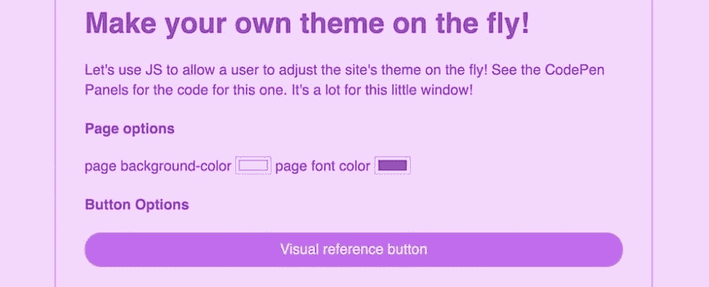

# 创建您的第一个 CSS 自定义属性(变量)

> 原文：<https://dev.to/brob/create-your-first-css-custom-properties-variables-5c2e>

[](https://res.cloudinary.com/practicaldev/image/fetch/s--tHSEIJub--/c_limit%2Cf_auto%2Cfl_progressive%2Cq_auto%2Cw_880/https://bryanlrobinson.cimg/css-custom-property-image.jpg)

在本教程中，我们将处理 CSS 的一个惊人的新特性:自定义属性。你可能也听说过它们被称为 CSS 变量。

这个特性为我们提供了预处理器的一些特性和浏览器的所有附加功能。你可以在你的变量中设置值，在你的 CSS 中修改以增加作用域值，也可以在 JavaScript 中更新它们以创建强大的主题化组件。

为了展示它们的威力，我们将利用这些样式来创建一个不起眼的按钮样式的`<a>`标签。

只想要密码？[使用博客文章中的所有代码和一些上下文](https://codepen.io/brob/pen/JjPGMPp?editors=1010)来检查这个 CodePen。

## 为我们的主播定义 CSS

我们将从定义锚标签的基本样式开始。在这个例子中，任何带有类`button`的东西都将被设计成一个浅红色背景和圆角的“按钮”。

```
.button {
    background-color:#ff6347;
    color: #ffffff;
    display: inline-block;
    padding: .5rem 1rem;
    border-radius: 3px;
    text-decoration: none;
    text-align: center;
} 
```

Enter fullscreen mode Exit fullscreen mode

从这里开始，我们需要获取我们想要使之易于编辑的值，并将它们转换为自定义属性。

## 在 CSS 中设置和获取自定义属性

让我们把这个按钮变得灵活些！

首先我们需要定义变量。有了自定义属性，我们可以在任何范围内定义它们，但是为了让所有 CSS 都可以全局访问它们，我们需要将它附加到`:root`元素上。`:root` [伪类](https://developer.mozilla.org/en-US/docs/Web/CSS/:root)与`html`选择器同义，但是创建了更高层次的特定性，使其成为附加变量的有力场所。

要声明一个变量，你需要在一个声明块中。然后使用语法`--variable-name`。变量名可以是不带空格的任何字符串(可以使用破折号和下划线)。在我们的按钮示例中，变量声明如下:

```
:root {
    --button-background:#ff6347;
    --button-foreground:#ffffff;
    --button-display: inline-block;
    --button-padding: .5rem 1rem;
    --button-corners: 3px;
} 
```

Enter fullscreen mode Exit fullscreen mode

大多数情况下，我们会隔离出以后想要改变的属性，比如颜色。

接下来，我们需要在我们的`.button`声明中访问这些变量。

```
.button {
    background-color: var(--button-background);
    color: var(--button-foreground);
    display: var(--button-display);
    padding: var(--button-padding);
    border-radius: var(--button-corners);
    text-decoration: none;
    text-align: center;
} 
```

Enter fullscreen mode Exit fullscreen mode

我们完事了。这个类现在使用 CSS 自定义属性！

但是等等！那有什么意义？我听到了，我们来谈谈一些用例。

## 为特殊用例改变按钮

假设我们想为特殊的用例以各种方式改变我们的按钮。那很好，我们可以在自定义属性之前这样做。自定义属性只会让我们的代码更整洁！

处理这种情况的老方法是拥有我们的`.special`类，然后还拥有一个`.special .button`选择器。

```
.special {
   /* Code for our special area */
}

.special .button {
    display: block; /* make it full width */
    background-color: lightblue;
    color: #333;
} 
```

Enter fullscreen mode Exit fullscreen mode

这没有错，但是我们增加了选择器的膨胀。我们也可以为我们的特殊按钮创建一个全新的类，比如`.button--special`并改变我们的 HTML。

相反，我们现在可以为变量创建一个新的范围，并在我们的`.special`声明中直接更改它们的值。

```
.special {
   /* Code for our special area */
    --button-background: lightblue;
    --button-foreground: #333;
    --button-display: block;
} 
```

Enter fullscreen mode Exit fullscreen mode

有`class="special"`的元素实际上是我们按钮的父元素。通过在这个选择器上设置变量，它过滤到我们的按钮，而不必声明按钮类。这对于管理特定性和设置基于组件的样式来说非常方便。

因此，在 CSS 中更新我们的值更容易。接下来，让我们看看如何在 JavaScript 中访问和修改这些值。

## 用自定义属性设置黑暗模式

黑暗模式最近很流行。每个网站都开始实现这种功能。

有了 CSS 变量，这就变得不那么痛苦了。

我们将从在我们的`:root`元素上创建两个新的定制属性开始。

```
:root {
    --color:#333333;
    --bg-color:#ffffff;

    /* Button variables */
    --button-background:#ff6347;
    --button-foreground:#ffffff;
    --button-display: inline-block;
    --button-padding: .5rem 1rem;
    --button-corners: 3px;
} 
```

Enter fullscreen mode Exit fullscreen mode

这两个新的变量将让我们控制我们的文本颜色和我们的主要背景颜色。

那么我们有两个选项来设置我们的黑暗模式。

首先让我们看看如何在 JavaScript 中设置这些属性。

```
 document.documentElement.style.setProperty('--color', '#fff');  
   document.documentElement.style.setProperty('--bg-color', '#333');  
   document.documentElement.style.setProperty('--button-background', '#7d483e');  
   document.documentElement.style.setProperty('--button-foreground', '#eee');` 
```

Enter fullscreen mode Exit fullscreen mode

让我们把它分解一下。每一行都通过使用`setProperty()`方法设置一个 CSS 属性。`setProperty()`接受两个参数:一个 CSS 属性和一个值。在这种情况下，我们将自定义属性视为任何其他属性，我们可以设置它们。

为了获得样式对象——现在被构建为“CSS 对象模型”——我们查看任何元素的样式块。但是我们需要对`:root`元素进行修改。因此，我们可以使用`document.documentElement`属性来选择文档根，而不是使用类似于`document.querySelector`的东西来找到它。

对于黑暗模式，这将很快变得乏味。所以，让我们来看看选项二:带有类切换的 CSS。

```
.darkMode {
    --button-background: #7d483e;
    --button-foreground: #eee;
    --color: #fff;
    --bg-color: #333;
} 
```

Enter fullscreen mode Exit fullscreen mode

现在，在我们的 JavaScript 中，我们可以切换我们的`<body>`元素上的类`darkMode`来激活黑暗模式。这将改变这些变量的全局范围，这样任何访问它们的东西都会得到更新。

之后，我们可以在 JS 中设置一个 toggle。

```
let darkModeToggle = document.querySelectorAll('.darkModeToggle');
let body = document.querySelector('body');

darkModeToggle.forEach(toggler => toggler.addEventListener('click', e => {
    e.preventDefault();
    body.classList.toggle('darkMode')
})); 
```

Enter fullscreen mode Exit fullscreen mode

如果在 JS 中设置这些变量在那个例子中显得很乏味，为什么我们要在任何场景中使用它呢？

## 使用自定义属性和 JavaScript 创建用户可编辑的主题

在我们开始写 JavaScript 之前，让我们弄清楚我们想要在站点上向用户公开什么来改变。

在我们当前的例子中，我们将获取背景颜色、文本颜色、按钮颜色、按钮边框半径以及按钮是否为全幅。

记住这些，我们将创建一个 HTML 表单，其 id 与每种类型的更改的自定义属性名称相匹配。为了增加额外的趣味，让我们使用 HTML 输入，如颜色选择器和范围滑块！

```
 <form action="" class="theme-change">
        <h4>Page options</h4>
        <label for="" >page background-color</label>
        <input type="color" id="bg-color" name="bg-color" class="text">
        <label for="">page font color</label>
        <input type="color" name="color"  id="color" class="text">
        <h4>Button Options</h4>
        <a href="#" class="button-withvars">Visual reference button</a> <br><br>
        <label for="button-display">Full width?</label>
        <select name="button-display" id="button-display">
            <option value="inline-block">No</option>
            <option value="block">Yes</option>
        </select>
        <br>
        <label for="button-background" >button background-color</label>
        <input type="color" id="button-background" name="button-background" class="text">
        <label for="button-foreground" >button foreground-color</label>
        <input type="color" id="button-foreground" name="button-foreground" class="text">
        <br>
        <label>Border Radius:</label>
        <input data-suffix="true" type="range" id="button-corners" min="0" max="25" value="10">
    </form> 
```

Enter fullscreen mode Exit fullscreen mode

从那里，我们需要找到我们的表单字段并应用事件处理程序。

```
const inputs = Array.from(document.querySelectorAll('.theme-change input, .theme-change select')); // Create an array of form fields

inputs.forEach(input => { 
    setInitialValues(input);
    input.addEventListener('change', handleUpdate);
    input.addEventListener('mousemove', handleUpdate);
}); 
```

Enter fullscreen mode Exit fullscreen mode

我们添加了一个`change`事件监听器来处理大部分表单交互，但是如果我们想要从我们的`range`输入中实时改变，我们还需要一个`mousemove`事件监听器。

我们的第一个次要保护是对付单位。在这个简单的例子中，我们只需要担心一个`px`后缀，但是在这种情况下提供更多的保护也是有意义的。

从表单输入中获得新值后，我们需要设置属性。很像我们的黑暗模式例子，我们将使用`document.documentElement.style.setProperty`。在这种情况下，我们将通过提取字段的 ID 并在开头加上`--`来动态地找到正确的属性。

```
function handleUpdate(e) {
    let newValue = this.dataset.suffix ? `${this.value}px` : this.value; // Add px to input values that have a data-suffix attribute
    document.documentElement.style.setProperty(`--${this.id}`, newValue);
} 
```

Enter fullscreen mode Exit fullscreen mode

该函数负责更新主题。在我们的表单中使用默认值也是有意义的。我们也可以根据我们的自定义属性来设置这些值！你可能注意到了我们`inputs.forEach`中的`setInitialValues(input);`线。

第一步是抓住适当的财产。为此，我们必须运行 [`getComputedStyle`方法](https://developer.mozilla.org/en-US/docs/Web/API/Window/getComputedStyle)。它接受一个 DOM 元素参数，并返回该元素的 CSSOM。然后，我们可以使用`getPropertyValue()`方法返回该对象上任何给定 CSS 属性的值。在这种情况下，我们使用一个模板文本将`--`添加到输入 ID 的前面。

然后，我们需要将`px`添加到任何带后缀的输入值中，然后更新我们的输入值。

```
function setInitialValues(input) {
    let cssProperty = getComputedStyle(document.documentElement).getPropertyValue(`--${input.id}`);
    let updatedValue = input.dataset.suffix ? cssProperty.replace("px", "") : cssProperty;
    input.value = updatedValue;
} 
```

Enter fullscreen mode Exit fullscreen mode

所有这些 JavaScript 都与我们在本文中已经编写的自定义属性一起工作。

这个过程中的一个“陷阱”是 HTML5 颜色选择器输入。它们需要一个六位数的十六进制值。当你在一个自定义属性上运行`.getPropertyValue`时，如果你像我一样喜欢你的 CSS 声明在冒号后有一个空格，它将在字符串的开头返回一个空格。因此，如果您想运行一个表单并从自定义属性中设置表单输入，您将需要调整 CSS 的值或样式。

## 我们将何去何从？

每个月都有新的和令人惊讶的事情发生，我们可以用 CSS 中的这种新功能来做。以下是我在为这篇文章做研究时发现的几个例子。

*   [Wes Bos 的 JavaScript Form CodePen 是我创建主题部分的灵感来源](https://codepen.io/wesbos/pen/adQjoY?editors=1010)
*   [乌娜·克拉韦茨用自定义属性和 calc()](https://codepen.io/una/pen/qzKXgr) 创建了一个惊人的颜色混合器

您将把自定义属性带到哪里？

## 想看这个的视频版？

我在 2019 年 8 月的孟菲斯网络工作者大会上展示了大部分代码。你可以看下面的视频。

[https://www.youtube.com/embed/-ugZb-o0l0s](https://www.youtube.com/embed/-ugZb-o0l0s)

### 与布莱恩保持联系

如果你想及时了解我制作的所有内容，请在这里关注我，同时也关注其他平台。

*   [推特:@brob](https://twitter.com/brob)
*   [YouTube 上我的视频](https://goo.gl/wCeu5C)
*   [在 peerreviews.dev 上观看或请求设计或代码评审](https://peerreviews.dev)