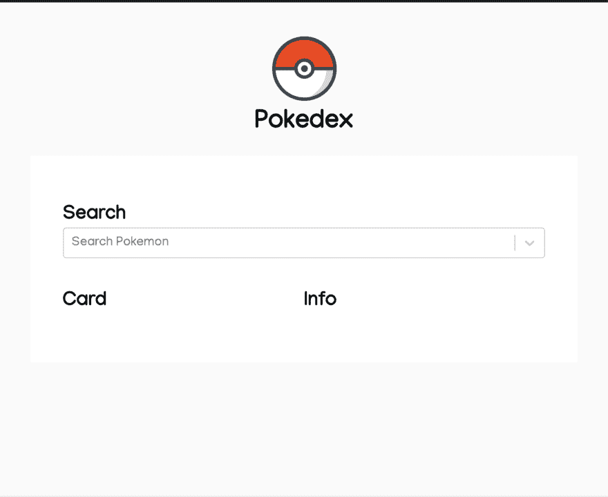
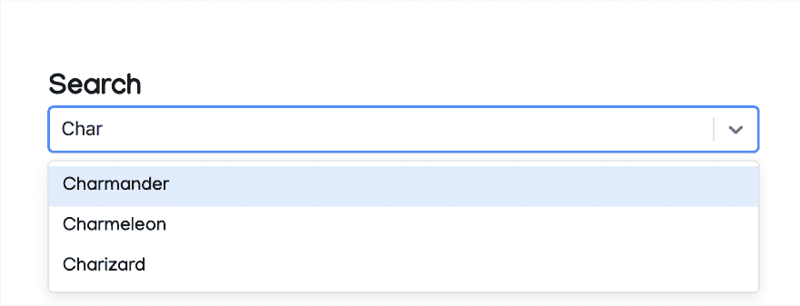
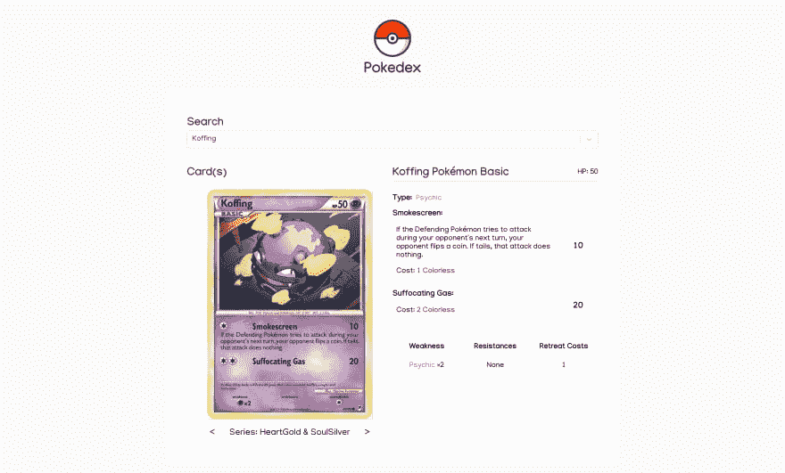

# React 中的一个简单的 Pokedex 应用程序

> 原文：<https://dev.to/jeffwilkey/creating-a-simple-pokemon-card-displayer-in-react-3l78>

## 目标

有一个原始的 150 个口袋妖怪的可搜索列表，当列表项目被点击时，显示相关的卡片和可读信息。

## 执行

我决定在 React 上构建这个项目，因为它很快，并且能够将不同的元素分成组件，这将非常有帮助。至于布局，我使用了一个非常简单的 UI(没有 CSS 框架),并使用了 [React-Select](https://www.react-select.com) 包来搜索下拉列表:

[](https://res.cloudinary.com/practicaldev/image/fetch/s--jeRe1HFm--/c_limit%2Cf_auto%2Cfl_progressive%2Cq_auto%2Cw_880/https://thepracticaldev.s3.amazonaws.com/i/r7fln2tzfob4oaxkza1v.png)

我还添加了一个我在谷歌图片上找到的平面标志，(找不到作者，但是，恭喜！)并添加了一点弹跳动画。虽然这对网站的功能不重要，但我真的喜欢添加这样的小怪癖。这里有一支笔演示反弹动画(无限):

[https://codepen.io/jeffwilkey/embed/qBWPjKm?height=600&default-tab=result&embed-version=2](https://codepen.io/jeffwilkey/embed/qBWPjKm?height=600&default-tab=result&embed-version=2)

## 利用 API

我最初打算在网上搜集最初的 150 个口袋妖怪的名字，但幸运的是，我发现了这个八角形的要点，这正是我需要的反应选择。并配了一张简单的地图:

```
// ./utils/pokemonOptions.js
const Pokemon=new Array("Bulbasaur","Ivysaur","Venusaur","Charmander","Charmeleon","Charizard","Squirtle","Wartortle","Blastoise","Caterpie","Metapod","Butterfree","Weedle","Kakuna","Beedrill","Pidgey","Pidgeotto","Pidgeot","Rattata","Raticate","Spearow","Fearow","Ekans","Arbok","Pikachu","Raichu","Sandshrew","Sandslash","Nidoran","Nidorina","Nidoqueen","Nidoran","Nidorino","Nidoking","Clefairy","Clefable","Vulpix","Ninetales","Jigglypuff","Wigglytuff","Zubat","Golbat","Oddish","Gloom","Vileplume","Paras","Parasect","Venonat","Venomoth","Diglett","Dugtrio","Meowth","Persian","Psyduck","Golduck","Mankey","Primeape","Growlithe","Arcanine","Poliwag","Poliwhirl","Poliwrath","Abra","Kadabra","Alakazam","Machop","Machoke","Machamp","Bellsprout","Weepinbell","Victreebel","Tentacool","Tentacruel","Geodude","Graveler","Golem","Ponyta","Rapidash","Slowpoke","Slowbro","Magnemite","Magneton","Farfetch'd","Doduo","Dodrio","Seel","Dewgong","Grimer","Muk","Shellder","Cloyster","Gastly","Haunter","Gengar","Onix","Drowzee","Hypno","Krabby","Kingler","Voltorb","Electrode","Exeggcute","Exeggutor","Cubone","Marowak","Hitmonlee","Hitmonchan","Lickitung","Koffing","Weezing","Rhyhorn","Rhydon","Chansey","Tangela","Kangaskhan","Horsea","Seadra","Goldeen","Seaking","Staryu","Starmie","Mr. Mime","Scyther","Jynx","Electabuzz","Magmar","Pinsir","Tauros","Magikarp","Gyarados","Lapras","Ditto","Eevee","Vaporeon","Jolteon","Flareon","Porygon","Omanyte","Omastar","Kabuto","Kabutops","Aerodactyl","Snorlax","Articuno","Zapdos","Moltres","Dratini","Dragonair","Dragonite","Mewtwo","Mew");
export default Pokemon.map(p => ({
  value: p.toLowerCase(),
  label: p
})); 
```

Enter fullscreen mode Exit fullscreen mode

我能够添加 150 个口袋妖怪的动态可搜索选择字段:
[](https://res.cloudinary.com/practicaldev/image/fetch/s--vrUyaEUv--/c_limit%2Cf_auto%2Cfl_progressive%2Cq_auto%2Cw_880/https://thepracticaldev.s3.amazonaws.com/i/peuy4y8u56fbl5si1axl.png)

接下来，我对不同的口袋妖怪相关的 API 做了一些研究。(外面有几个)。最终， [pokemontcg.io](https://pokemontcg.io/) 成为我们需要的最佳选择。

在对 pokemontcg SDK 进行了一些修补之后，我发现我想要来自`"Base"`系列的卡片，并且需要过滤从 API 返回的结果，以确保我收到的正是我正在寻找的卡片。

pokemontcg SDK 的使用看起来是这样的:

```
// pass handleChange in as the onChange prop for the React-Select field
handleChange = e => {
    if (this.state.selected !== e.value) {
      pokemon.card.where({ name: e.value, series: "Base" }).then(cards => {
        // filter out cards that dont match name exactly
        cards = cards.filter(card => card.name === e.label); 
        this.setState({
          selected: e.value,
          index: 0,
          cards
        });
      });
    }
  }; 
```

Enter fullscreen mode Exit fullscreen mode

最后，通过这个调用，我们收到了几张卡片，并选择了索引为 0 的那张。到目前为止，这是完全准确的，但肯定不是万无一失的。然而，对于这个应用程序来说已经足够好了，我们使用这个数据(如下所示)在页面上显示信息:

```
"card":  {  "id":  "base6-3",  "name":  "Charizard",  "nationalPokedexNumber":  6,  "imageUrl":  "https://images.pokemontcg.io/base6/3.png",  "imageUrlHiRes":  "https://images.pokemontcg.io/base6/3_hires.png",  "types":  [  "Fire"  ],  "supertype":  "Pokémon",  "subtype":  "Stage 2",  "evolvesFrom":  "Charmeleon",  "ability":  {  "name":  "Energy Burn",  "text":  "As often as you like during your turn (before your attack), you may turn all Energy attached to Charizard into R for the rest of the turn. This power can't be used if Charizard is Asleep, Confused, or Paralyzed.",  "type":  "Poké-Power"  },  "hp":  "120",  "retreatCost":  [  "Colorless",  "Colorless",  "Colorless"  ],  "convertedRetreatCost":  3,  "number":  "3",  "artist":  "Mitsuhiro Arita",  "rarity":  "Rare",  "series":  "Base",  "set":  "Legendary Collection",  "setCode":  "base6",  "attacks":  [  {  "cost":  [  "Fire",  "Fire",  "Fire",  "Fire"  ],  "name":  "Fire Spin",  "text":  "Discard 2 Energy cards attached to Charizard in order to use this attack.",  "damage":  "100",  "convertedEnergyCost":  4  }  ],  "resistances":  [  {  "type":  "Fighting",  "value":  "-30"  }  ],  "weaknesses":  [  {  "type":  "Water",  "value":  "×2"  }  ]  } 
```

Enter fullscreen mode Exit fullscreen mode

然后，经过一些样式，我们最终得到了下面的产品，显示在图像和代码沙箱中。我也在 heroku [这里](https://serene-harbor-16803.herokuapp.com/)主持过。

> 2021 年 1 月更新:如果最近没有人访问该网站，它将需要大约 30 秒才能启动，如果你点击 heroku 错误屏幕，可能需要刷新。当我有时间的时候，我会尝试修复这个问题并更新 codesandbox。*不过在 Heroku 上检查一下真的很值得，因为我增加了对数百个口袋妖怪的支持，以及为每个口袋妖怪翻看不同系列卡片的能力。*

[](https://res.cloudinary.com/practicaldev/image/fetch/s--fSnxqDu9--/c_limit%2Cf_auto%2Cfl_progressive%2Cq_auto%2Cw_880/https://dev-to-uploads.s3.amazonaws.com/i/4mozbmvopr7ipkwnyd73.png)

[https://codesandbox.io/embed/gallant-kirch-k149d](https://codesandbox.io/embed/gallant-kirch-k149d)

非常感谢你的阅读，希望这篇文章对某人有所帮助或启发。我将继续通过[这个 GitHub Repo](https://github.com/JeffWilkey/pokedex-react) 为这个项目做贡献，如果你想跟上进度，请随意开始，或者如果你想做贡献，请联系我。

### 增加或处理的事物

*   大量的重构
*   ~~支持所有口袋妖怪~~
*   ~~显示所有版本的卡片~~