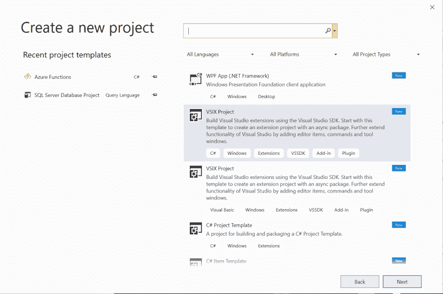
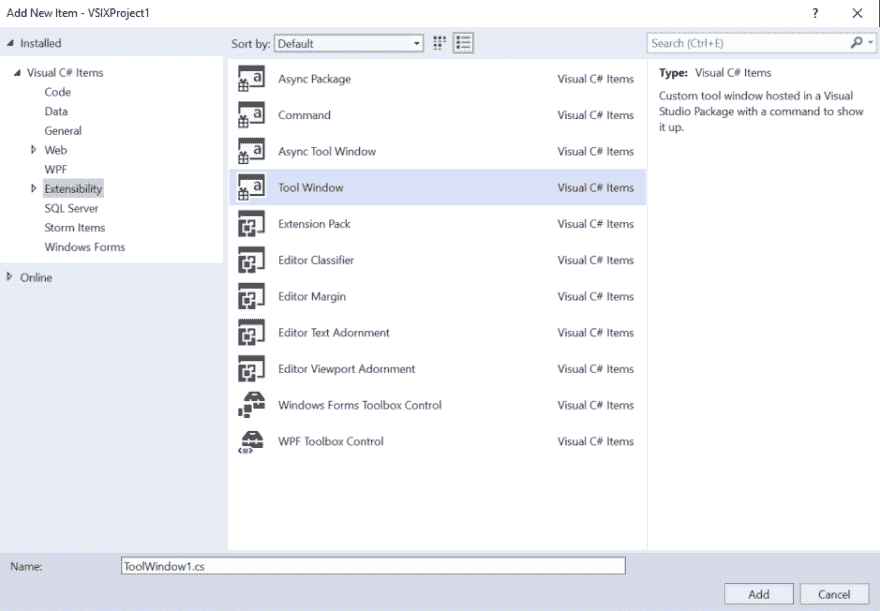
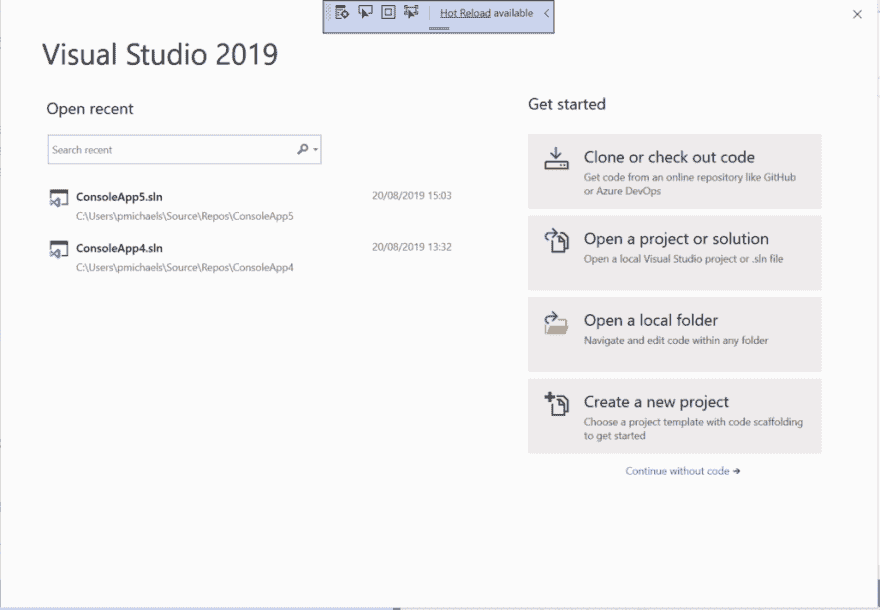
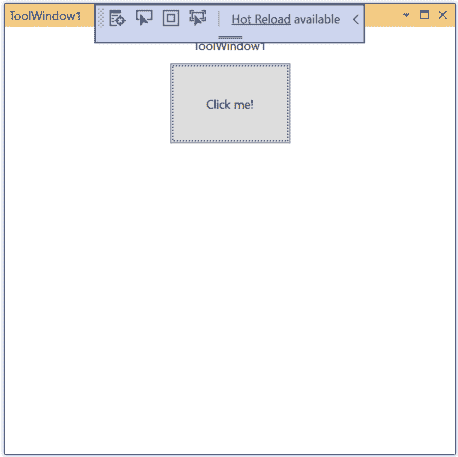

# ADR Visual Studio 扩展–创建一个 Visual Studio 扩展来抓取解决方案并列出所有项目

> 原文：<https://dev.to/pcmichaels/creating-a-visual-studio-extension-to-scrape-the-solution-and-list-all-items-including-solution-items-and-solution-folders-jl>

不久前，我的一位同事让我注意到了 ADRs 的概念。这个想法是，当你对一个项目作出决定时，你把它写下来，但是你在代码库中这样做，并且把它签入源代码控制系统。

即使在人们认为编写长的功能规范是一个好主意的时候，拥有与其记录的代码相匹配的文档也是一个遥远的梦想。通常，您会花大约一周的时间来编写一个规范，在您编写第一行代码的那一刻，该文档就被认为是死的(并且只在客户对交付的内容有争议时引用)。

由于我从未编写过 Visual Studio 扩展，但一直认为这是一个很酷的想法，所以我有了一个以此开始的想法。我的想法是，我可以构建一些东西，从主代码库中提取 ADR。这不是那些我有完整解决方案的帖子之一，我只是记录它…它更像是一个正在进行的旅程…这可能会导致这样的结论:这要么没有意义，不可行，要么已经完成了。

我要把到目前为止的进展上传到[这个 GitHub repo](https://github.com/pcmichaels/ADRManager/tree/master/ADRManager) 。

在第一篇文章中，我们将创建一个能够查看其所在项目的扩展。

# 步骤 1 -安装 SDK

要进行任何扩展开发，您需要安装 SDK——您可以通过 Visual Studio 安装程序来完成:

[](https://www.pmichaels.net/wp-content/uploads/2019/08/extension-1.png)

# 步骤 2 -创建一个新的(VSIX)项目

VS 扩展被称为 VSIX，因为它是可部署产品的扩展。

[](https://www.pmichaels.net/wp-content/uploads/2019/08/extension-2.png)

# 步骤 3 -添加新的工具窗口并进行测试

添加一个新项(右键单击项目->添加新项)，并选择工具窗口:

[](https://www.pmichaels.net/wp-content/uploads/2019/08/extension-3.png)

这里不需要做任何准备——解决方案中任何符合条件的扩展类型都将被编译和使用——现在尝试按 F5。您应该获得一个要调试的 Visual Studio 版本:

[](https://www.pmichaels.net/wp-content/uploads/2019/08/extension-4.png)

如你所见，我以前来过这里。出于测试的目的，我建立了一个复杂的项目:

[](https://www.pmichaels.net/wp-content/uploads/2019/08/extension-5.png)

这样做的原因很快就会清楚，现在，只需启动您创建的工具窗口(视图->其他窗口->工具窗口 1(或您称之为的任何东西):

[](https://www.pmichaels.net/wp-content/uploads/2019/08/extension-6.png)

# 步骤 4 -向工具窗口添加一些代码

出于第一阶段的目的，我们将只分析项目结构。完成后，我希望它能够根据可配置的位置识别 ADR 文档，但现在，让我们只显示我们有多少项目和文件。目前，我们不会改变任何东西，让我们只是钩到上面截图中微妙的按钮的按钮点击:

```
 private async void button1_Click(object sender, RoutedEventArgs e)
    {
        await ThreadHelper.JoinableTaskFactory.SwitchToMainThreadAsync();
        var dte = (DTE)Package.GetGlobalService(typeof(DTE));            

        var sln = Microsoft.Build.Construction.SolutionFile.Parse(dte.Solution.FullName);
        projectsText.Text = $"{sln.ProjectsInOrder.Count.ToString()} projects";

        foreach (Project p in dte.Solution.Projects)
        {
            projectsText.Text += $"{Environment.NewLine} {p.Name} {p.ProjectItems.Count}";
        }
    } 
```

*SwitchToMainThreadAsync* 是因为任何与解决方案的交互都需要在主线程上进行。之后，我们解析解决方案文件并输出每个“项目”中的名称和项目:

[](https://www.pmichaels.net/wp-content/uploads/2019/08/extension-7.png)

如你所见，它将每个顶层文件夹分类为一个解决方案项目，这对我们来说非常理想。

# 摘要

在这篇文章中，我们看到了如何创建一个 Visual Studio 扩展，以及如何搜索当前的解决方案和项目。在下一篇文章中，我们将尝试提取一些 ADR 的具体内容。

# 参考

T1】https://docs . Microsoft . com/en-us/visual studio/extensibility/installing-the-visual-studio-SDK？view=vs-2017

[https://msdn.microsoft.com/en-us/library/ms973240.aspx?f = 255&MSP perror =-2147217396](https://msdn.microsoft.com/en-us/library/ms973240.aspx?f=255&MSPPError=-2147217396)

[https://docs . Microsoft . com/en-us/visual studio/extensibility/starting-to-develop-visual-studio-extensions？view=vs-2017](https://docs.microsoft.com/en-us/visualstudio/extensibility/starting-to-develop-visual-studio-extensions?view=vs-2017)

[http://www.visualstudioextensibility.com/articles/packages/](http://www.visualstudioextensibility.com/articles/packages/)

本文原帖[此处](https://www.pmichaels.net/2019/09/07/an-adr-visual-studio-tool-part-1-creating-a-visual-studio-extension-to-scrape-the-solution-and-list-all-items-including-solution-items-and-solution-folders/)。