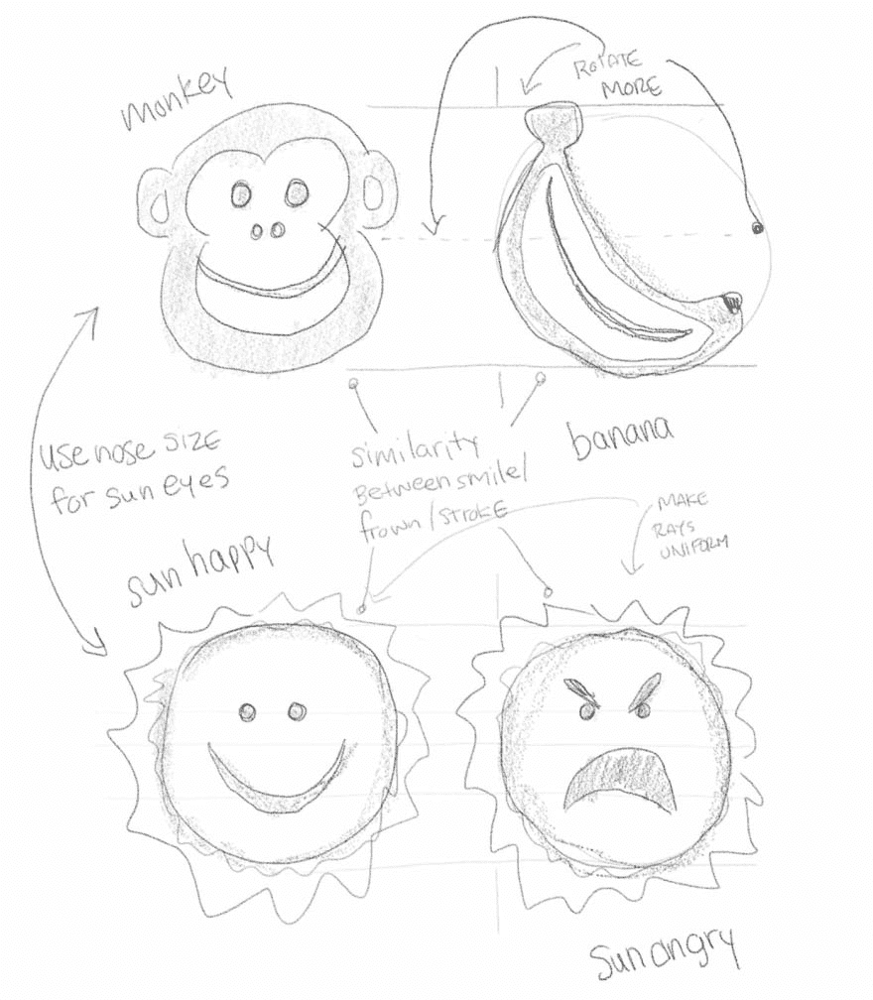
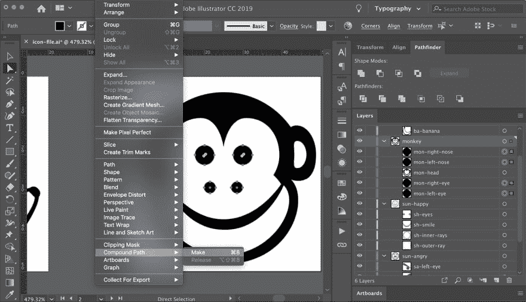
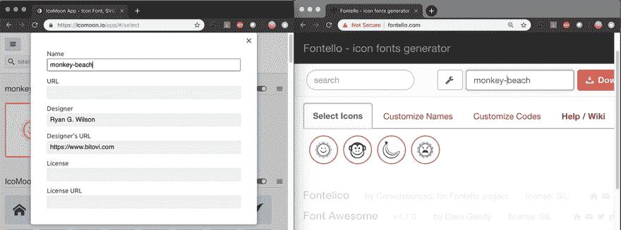
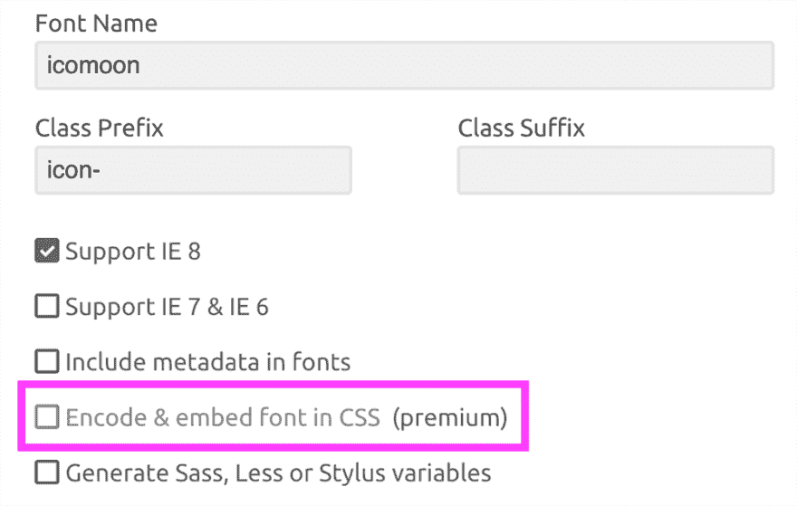
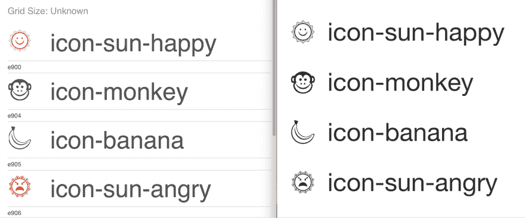

# 创建 SVG 图标字体

> 原文：<https://dev.to/bitovi/creating-an-svg-icon-typeface-2fp4>

图标被用在应用程序、网站、营销材料中，你能想到的都有。他们交流复杂的话题，创造视觉兴趣，强调话题，吸引用户的注意力。确保图标在应用程序中正确使用的最简单的方法之一是创建和共享一个图标字体。然后，可以将这些图标作为字体添加到计算机上的文档中，或者在样式表中用于在线或在应用程序中显示图标。

## 创建您的图标

第一步是创建你的图标。我更喜欢先在纸上和铅笔上画草图来充实想法。一旦你有了你的概念，打开你最喜欢的矢量设计程序。如果这是一个单独的图标或头像，你的画板大小并不重要，但请记住向量是无限可扩展的，所以你只需要选择不太小也不太大的大小。

我已经为这些图标创建了示例文件，如果您想下载并跟随学习的话:

演示文件:[图标草图文件](https://drive.google.com/open?id=1xdTnuXJjtqukfiko5UPtMsDZ8WJTsv6g) | [图标插画文件](https://drive.google.com/open?id=1xiKYfynPAl7HJQS_IlORM-y92ZN3HE8L)

如果您要创建一组具有相似性并能一起工作的图标，那么所有画板的大小必须相同，这一点很重要。对于统一图标集:

*   使用正方形画板
*   考虑基于网格设计你的图标，这样它们就有相似性([这是我在演示中使用的网格](https://drive.google.com/open?id=1xdkMUzWvNZJXWJiIN33I-S3TjhLgOUxC)
*   找到一个适用于小尺寸和大尺寸的笔画
*   如果你的图标是单色的，在你的设计程序中设置为纯黑色。这可以在应用程序或样式表中修改为适当的颜色
*   轮廓笔画和文本

演示文件:[原始 SVG](https://drive.google.com/open?id=1y38Z6SsQpNDcH46YT4itqTm6ozyWlPuy)

如果您已经组合了图层、圆形或椭圆形，您应该将它们转换为复合路径。这将简化您的 SVG，获得更小的文件大小，并确保它们可以跨多个平台正确显示。

> 提示:在我的关于 SVGs post 的[最佳实践中有更多关于这些项目的细节。](https://www.bitovi.com/blog/best-practices-for-working-with-svgs)

在演示文件中，你可以看到香蕉上的弧线、猴子的微笑以及太阳的微笑和皱眉之间的相似之处。这种相似性也延续到设计资产穿过网格的位置，以及贝塞尔曲线处理击中的位置。包含太阳图标是为了演示在创建 SVG 图标时多色图标会发生什么。

## 创建您的图标字体

### 添加 ID 标签

一旦你的图标完成，出口和优化你的图标为 SVG 格式。优化 SVG 之后，在代码编辑器中打开文件，并为每个 SVG 标签添加一个惟一的 ID 标签。

演示文件:[优化的 SVG](https://drive.google.com/open?id=1y-dgf3fkIAP0iOdF1FbC0xE1x88OL7Hj)

### 选择发电机

创建一种字体比听起来容易得多，而且不需要昂贵的字体构建程序。有很多免费的在线字体生成器可供选择。这是我经常与客户使用的两个:fontello.com | ico moon . io 两个生成器提供相同的基本服务；从现有的图标集中选择图标，或者上传你自己的图标，生成你的图标字体，作为标准的系统字体，也可以在网上使用。两者都有各自的缺点，下面我会讨论；正是由于这些缺点，我们根据项目的需要使用一个或另一个生成器。

### 导入您的图标

一旦你选择了你的在线字体生成器，你将需要把你的 SVG 图标导入到生成器中。有些需要创建和命名一个新项目，有些则直接上传你的图标。

> 提示:我在这里演示的每种字体都有一些缺点(在本文中讨论过),所以在选择字体生成器之前，请确保您了解自己的设计需求。

使用发生器预览选项，确保您的图标集在小、中和大尺寸下看起来都很好——有些发生器显示的尺寸比其他发生器大。如果有些地方看起来不太对，回到你的编辑应用程序，调整你的图标，导出，优化，替换字体生成器中的 SVG。你会注意到在下图中，Fontello 去掉了我们多色图标的颜色。这是使用 Fontello 的一个缺点；我有一个关于这个的问题，希望它能很快得到解决。

> 提示:如果画板的大小都相同，图标在画板上对齐正确，这将减少图标在字体生成器中看起来不符合预期的任何问题。

### 设置您的下载

一旦你的图标集看起来不错，你就差不多可以下载你的字体了。每个发生器的工作原理都有所不同。确保给你的字体命名，如果需要的话添加一个类别前缀。这也是您可以更改 Unicode 十六进制代码的时候。

[T6】](https://res.cloudinary.com/practicaldev/image/fetch/s--NGtYIehN--/c_limit%2Cf_auto%2Cfl_progressive%2Cq_auto%2Cw_880/https://www.bitovi.com/hubfs/blogposts/creating-svg-typeface/edit-details.png)

> 提示:为图标集中的每个图标添加关键字将有助于您和他人更容易地找到图标，尤其是当您有一个大型图标集时。描述一下。您可以用逗号分隔名称，如`banana, fruit, plantain`。

[ find individual icons, especially in large icons sets")](https://res.cloudinary.com/practicaldev/image/fetch/s--aUnQ_mi7--/c_limit%2Cf_auto%2Cfl_progressive%2Cq_auto%2Cw_880/https://www.bitovi.com/hubfs/blogposts/creating-svg-typeface/unicode.png)

> 提示:除非您要替换现有的图标字体，否则不要担心更改 Unicode 十六进制值。

在 Fontello 中，编码和嵌入是自动进行的。在 Icomoon 中有一个将字体编码并嵌入 CSS 的选项，但这仅包含在高级帐户中。这是 Icomoon 的一个缺点。对你的字体进行编码会为你的字体输出一个 DataURL，让你可以选择 BASE64 嵌入你的字体。您至少需要生成。ttf，。eot，。woff、woff2 和。eot 字体文件，如果不是 BASE64 编码。

> 提示:在@font-face 规则中嵌入 DataURL 是一种折衷——减少了 DOM 请求，但向样式表添加了更多数据。如果包含 BASE64 DataURL 的样式表文件发生了很大的变化，那么您需要支付更多的数据成本。

### 下载您的图标字体

下载并打开样式表文件(很可能命名为`styles.css`或您给字体起的名字。css)，将@font-face 声明、图标声明和字体平滑复制并粘贴到您的项目 CSS 中，并将任何关联的字样文件(.ttf，。eot，。woff、woff2 和。eot)到适当的文件夹中。这取决于你引用的字体文件是什么样的，取决于你希望你的浏览器支持的方向。如果你感兴趣，CSS-Tricks 有一篇很棒的文章:[CSS-Tricks-Using @ font-face](https://css-tricks.com/snippets/css/using-font-face)

> 提示:保留一份。json 文件包含在您的下载中。您可以使用此文件在最初用于创建字样的字体生成器中快速重新创建图标字样。此外，保留各个图标的 SVG 文件作为备份，以防以后需要修改图标。

### 使用你的图标字体

现在，您可以根据生成器创建的类在标记中引用图标的类:
**-或-**

 *

> 提示:在语义上，`<i>`标签和``标签是有区别的。从技术上来说，在 HTML 中，`<i>`代表“斜体”，但许多字体生成器和图标集(如 fontawesome.com)将其用作“图标”的简写，但您可能对该标签有不同的定义，因此最好(也是最佳实践)使用``。

演示文件: [IcoMoon 生成字体](https://drive.google.com/open?id=1yBu4idtM-t8Danil3i8w0eo8ykgQEwFg) | [Fontello 生成字体](https://drive.google.com/open?id=1yFCZrFoQAssgdVJjuSlKtuQl2NPRleVF)

### 本地安装&共享你的字体

这一步是可选的，但是如果您正在为您的设计创建模型和原型，这一步会很有帮助。您可以在任何应用程序中使用您的新图标字体，甚至是文字处理应用程序。这个字体文件可以与你公司的其他人共享，也可以做同样的事情。

> 提示:当测试你的网站时，最好在你的电脑上禁用这种字体，这样你就可以测试你的图标字体是否正确加载，因为没有安装字体的任何人都会看到它。如果你看不到它，客户端也看不到:检查你的图标字体文件的路径，或者如果在 Axure 或 Sketch 这样的在线原型应用程序中使用，你将需要在该程序中嵌入字体。

## 关闭

创建图标字体是使用和共享您的产品或公司图标集的一个简单易行的解决方案。如果你有兴趣了解更多关于素描的过程，请查看我的文章[通过素描寻找想法](https://www.bitovi.com/blog/finding-ideas-through-sketching)。如果你有兴趣了解更多关于创建优化的 SVG，请查看我的文章[使用 SVG 的最佳实践](https://www.bitovi.com/blog/best-practices-for-working-with-svgs)
。

*