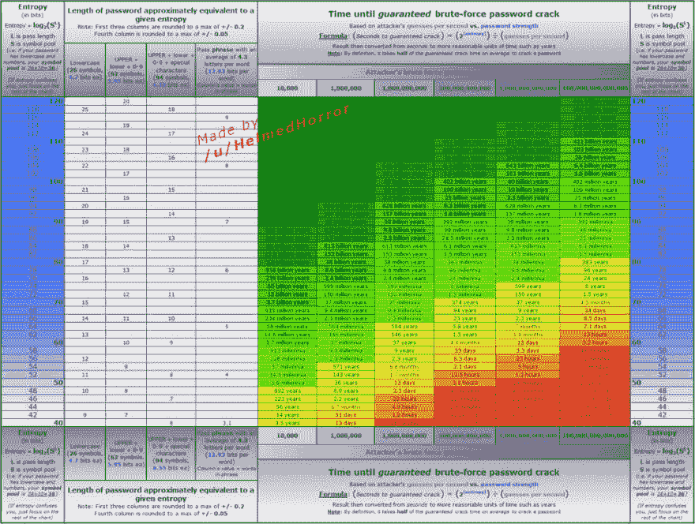

# 创建并记住强密码

> 原文：<https://dev.to/wagslane/creating-and-remembering-a-strong-passphrase-5ghd>

莱恩·瓦格纳

我们都有数百个在线账户。理想情况下，尽可能多的帐户拥有唯一的密码。然而，唯一的密码带来了一个难题:

没有人能记住上百个强密码。

为了解决这个问题，我们创建了密码管理器。现在，我们所有的密码都整齐地存储在一个地方，由一个主密码或通行短语加密。当然，这方面的问题是主密码或通行短语需要非常安全。

应该用哪个？密码或通行短语？

## 口令比密码更好

<figure>

<figcaption></figcaption>

</figure>

这个 XKCD 漫画很好地解释了密码和通行短语之间的区别。密码更容易被计算机猜到(熵更小)，也更难记住！我们没有理由使用密码。

## 熵

您可能已经注意到漫画中的示例密码有 28 位熵，而密码短语有 44 位熵。熵只是指攻击者为了破解密码或短语而需要猜测的可能性的数量。

例如， [qvault 卡](https://qvault.io)上的恢复码有 16 个字符，每个字符有 58 种可能。这意味着有:

58^16 = 16，400，152，899，115，243，850，138，976，256 种可能性。

如果我们取可能性数量的以 2 为底的对数，那么我们得到恢复码包含多少位熵。

log2(58^16) = 93.73 比特的熵。

下面的图表根据一个给定的密码或密码短语有多少位熵以及攻击者每秒可以猜测多少次(这取决于他们的硬件)，给出了破解该密码或密码短语需要多长时间的大致想法。

<figure> 

<figcaption>[熵图](https://www.reddit.com/r/dataisbeautiful/comments/322lbk/time_required_to_bruteforce_crack_a_password/)</figcaption>

</figure>

## 如何记忆

既然我们已经介绍了密码短语为什么以及如何比密码更安全，那么让我们来看看如何创建一个容易记忆的密码短语。令人难忘的密码短语的关键是意象。这个想法是随机抽取 4 到 5 个单词，用这些单词在你的头脑中创造一个图像。形象越可笑，就越容易记住。

上面 XKCD 的*正确的马电池订书钉*就是一个很好的例子，不过我再给你举一个。让我们假设你在努力回忆:

*香蕉军酸鼻喷雾剂*

我可能会想象一大群香蕉从一个巨大的鼻子里喷出来的时候会产生酸。如果我在想象这个可笑的场景时大声重复几遍“*香蕉军酸鼻喷雾剂*，那么我可以在几秒钟内记住它。

重复几次可以让你记住单词的确切顺序，但是描绘图像会在你的脑海中长久地巩固 ii。

我希望这能帮助你创建安全的密码！一如既往，保持在线安全！这是一个危险的地方。

帖子[创建并记住一个强密码短语](https://qvault.io/2019/08/03/creating-and-remembering-a-strong-passphrase/)首先出现在 [Qvault](https://qvault.io) 上。