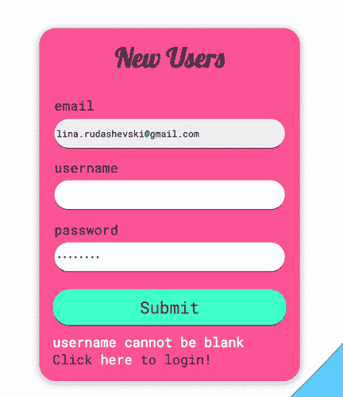

# 使用 Django Rest 框架创建定制异常

> 原文：<https://dev.to/aduranil/creating-custom-exceptions-using-django-rest-framework-pl0>

对于前端显示来说，Django Rest 框架返回的序列化错误并不简单。下面是它如何返回常见用户注册错误序列化错误:

```
{'username': ['This field is required.'], 'password': ['This field must be at least 8 chars'], 'email': ['This field cannot be blank']} 
```

Enter fullscreen mode Exit fullscreen mode

我发现前端很难处理这个问题。可能需要做很多工作来判断错误消息与哪个字段相关。前端解析一堆数组来查找错误也很麻烦。

要使错误消息更友好:

首先，覆盖序列化程序的`__init__`方法中的默认错误消息。在这里，我对其进行了更改，以便实际上**会指出错误与** :
相关的字段(即用户名而非“此字段”)

```
class UserSerializer(serializers.ModelSerializer):
    email = serializers.EmailField(required=True)
    username = serializers.CharField(required=True)
    password = serializers.CharField(min_length=8, required=True)

    class Meta:
        model = User
        fields = ("id", "username", "email", "password")

    def __init__(self, *args, **kwargs):
        super(UserSerializer, self).__init__(*args, **kwargs)
        self.fields["username"].error_messages["required"] = u"username is required"
        self.fields["username"].error_messages["blank"] = u"username cannot be blank"
        self.fields["email"].error_messages["required"] = u"email is required"
        self.fields["email"].error_messages["blank"] = u"email cannot be blank"
        self.fields["password"].error_messages[
            "min_length"
        ] = u"password must be at least 8 chars" 
```

Enter fullscreen mode Exit fullscreen mode

然后**定义自定义异常**，这是我在一个名为`exceptions.py.`的新文件中做的，我正在查看我可能想要覆盖错误的字段，并抓取数组中的第一项。如果每个字段有多个异常，我并不担心，因为如果用户修复了一个，他们会升级到下一个异常。

```
from rest_framework.exceptions import ValidationError
from rest_framework.views import exception_handler

def base_exception_handler(exc, context):
    response = exception_handler(exc, context)

    # check that a ValidationError exception is raised
    if isinstance(exc, ValidationError):
        # here prepare the 'custom_error_response' and
        # set the custom response data on response object
        if response.data.get("username", None):
            response.data = response.data["username"][0]
        elif response.data.get("email", None):
            response.data = response.data["email"][0]
        elif response.data.get("password", None):
            response.data = response.data["password"][0]

    return response 
```

Enter fullscreen mode Exit fullscreen mode

**最后，确保在`settings.py`中指定使用新的异常处理程序** :

```
REST_FRAMEWORK = {
    "DEFAULT_PERMISSION_CLASSES": ("rest_framework.permissions.IsAuthenticated",),
    "DEFAULT_AUTHENTICATION_CLASSES": (
        "rest_framework.authentication.TokenAuthentication",
        "rest_framework.authentication.SessionAuthentication",
        "rest_framework.authentication.BasicAuthentication",
    ),
    "EXCEPTION_HANDLER": ("app.exceptions.base_exception_handler"),
} 
```

Enter fullscreen mode Exit fullscreen mode

下面是更友好的错误消息！
[T3】](https://res.cloudinary.com/practicaldev/image/fetch/s--MXYOvPoG--/c_limit%2Cf_auto%2Cfl_progressive%2Cq_auto%2Cw_880/https://thepracticaldev.s3.amazonaws.com/i/hbhzyo25tiyyrudta82q.png)