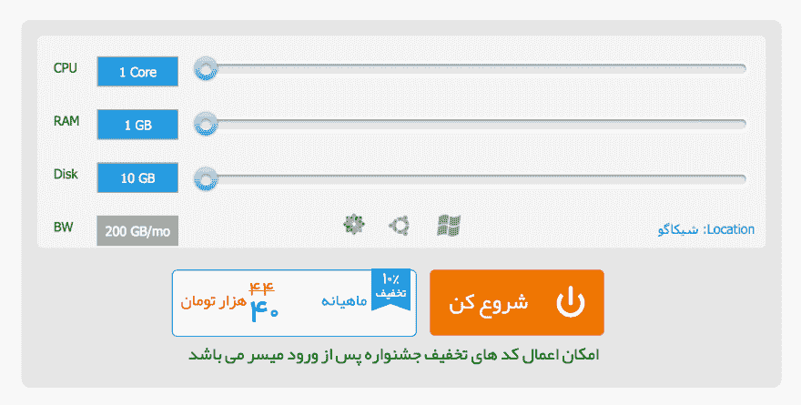

# 跨域 Iframe-parent 通信

> 原文：<https://dev.to/farskid/cross-domain-iframe-parent-communication-4k7k>

在很多情况下，iframe 是一个很好的解决方案。尽管它们对 HTML 来说有点过时，而且没有多少开发人员使用它，但它可能会在某一天成为一个复杂问题的解决方案。

知道一种通过 iframe 与父母交流的方法是非常有价值和节省时间的。也许 iframe 可以告诉它的父母什么时候它的内容准备好了，或者在 iframe 中与父母进行用户交互以做出正确的反应。

几天前，在我的公司，我们有一个 Wordpress 网站，它加载了一个 iframe 来选择购买虚拟机的计划，如下所示。

[](https://res.cloudinary.com/practicaldev/image/fetch/s--7hm5xR9X--/c_limit%2Cf_auto%2Cfl_progressive%2Cq_auto%2Cw_880/https://cdn-images-1.medium.com/max/1600/1%2ANpna_TbF8ChgAroSVkyu_Q.png)

我被分配了一项任务，在这个元素上做一些有挑战性的事情。该公司打算在点击橙色按钮时打开一个 URL，但因为按钮在 iframe 内部，所以不容易管理。

我尝试的第一件事是使用 postMessage 从 iframe 向其父节点发送消息。我想出了这个代码:

```
<iframe src="Path/To/Html"><button id="my-btn">Start</button></iframe> 
```

Enter fullscreen mode Exit fullscreen mode

```
document
  .getElementById("my-btn")
  .addEventListener("click", handleButtonClick, false);
function handleButtonClick(e) {
  window.parent.postMessage("iframe_message");
} 
```

Enter fullscreen mode Exit fullscreen mode

并且还要听父窗口上的消息:

```
window.addEventListener('iframe_message', function() {
window.open('some url', '_blank')
}, false 
```

Enter fullscreen mode Exit fullscreen mode

太完美了！非常有效。过了几分钟，我才发现真正的问题。这只适用于相同域的 iframes。显然，跨域 iframes 不能正确地向父级发送消息。

我在网上追踪了很多，在 stackoverflow 的一个黑暗边缘找到了一个非常有趣的灵感。虽然它没有帮助我，但它把我固定在正确的方向上。解决方案是使用客户事件。

所以我将解决方案重构为:

```
document
  .getElementById("my-btn")
  .addEventListener("click", handleButtonClick, false);
var myEvent = new CustomEvent("my_event", { detail: { url: "some url" } });
function handleButtonClick(e) {
  window.parent.dispatchEvent(myEvent);
} 
```

Enter fullscreen mode Exit fullscreen mode

当然是在家长那里听:

```
window.addEventListener(
  "iframe_message",
  function(e) {
    var url = e.detail.url;
    window.open(url, "_blank");
  },
  false
); 
```

Enter fullscreen mode Exit fullscreen mode

令人惊讶的是，我可以轻松地将自定义数据从 iframe 传递到父窗口。

## 结论

处理 iframes 是困难的。除非没有其他方法，否则不打算使用它。

如果你使用的是同域 iframe，你就在天堂了。您可以很容易地控制 iframe 的内容，并通过 postMessage 与它的父节点通信。

但是当它跨域的时候你就在地狱里了。您只能在 iframe 上使用 CustomEvent 和 dispatchEvent，并在父窗口上监听它。在这种情况下，尝试模块化您的通信协议并传递自定义数据。