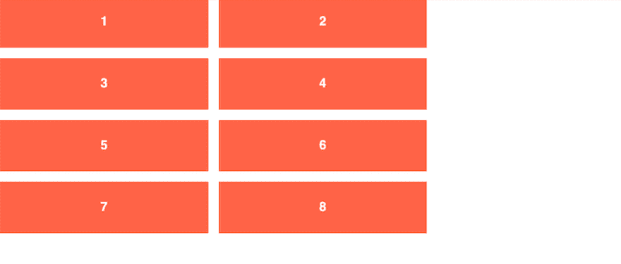

# CSS Gap 为 Flex 和 Grid 的利润率创造了光明的未来

> 原文：<https://dev.to/brob/css-gap-creates-a-bright-future-for-margins-in-flex-as-well-as-grid-1bcp>

[](https://res.cloudinary.com/practicaldev/image/fetch/s--aFxTHKt9--/c_limit%2Cf_auto%2Cfl_progressive%2Cq_auto%2Cw_880/https://bryanlrobinson.cimg/flex-gap-new.png)

**快速警告:Gap for Flex 目前仅适用于 Firefox **

CSS 网格规范中我最喜欢的部分之一是`grid-gap`。这使得在我的网格中创建“内部边距”变得更加容易。

边距和我们在各种上下文中清除它们的方法一直是我对 CSS 的主要不满之一。网格的缺口很有意义。

事实证明，这对其他人也很有意义。W3C 已经推荐将`grid-gap`切换为简单的`gap`，并允许它在 Flexbox 和多列中使用。

在本教程中，我们将了解过去我们是如何使用 Flex 添加边距的，以及`gap`是如何实现的，这样我们就可以在没有任何改动的情况下拥有这些内部边距。

## 简单 Flexbox 网格中的边距

在本例中，我们将采用一系列盒子，使用 Flexbox 创建一个网格样式，然后通过边距分隔盒子。

我们将从基本的 HTML 开始。一个`flex-container`和多个`flex-item`

```
<div class="flex-container">
    <div class="flex-item"></div>
    <div class="flex-item"></div>
    <div class="flex-item"></div>
    <div class="flex-item"></div>
    <div class="flex-item"></div>
    <div class="flex-item"></div>
    <div class="flex-item"></div>
    <div class="flex-item"></div>
</div> 
```

Enter fullscreen mode Exit fullscreen mode

我们将添加一小段`flex`来并排放置所有内容，加入少量的`width`计算来调整我们的项目，然后允许它们用`flex-wrap`包装。

```
.flex-item {
    width: calc(100% / 3);
    margin-right: 1rem;
    margin-bottom: 1rem;
} 
```

Enter fullscreen mode Exit fullscreen mode

[](https://res.cloudinary.com/practicaldev/image/fetch/s--dQh2fCjZ--/c_limit%2Cf_auto%2Cfl_progressive%2Cq_auto%2Cw_880/https://bryanlrobinson.cimg/flex-gap-old-step-1.jpg)

这给了我们尺寸完美的盒子，其宽度是我们容器的 1/3。让我们添加一些页边空白，在每一项之间留出垂直和水平的空间。

```
.flex-item { width: calc(100% / 3); margin-right: 1rem; margin-bottom: 1rem;} 
```

Enter fullscreen mode Exit fullscreen mode

[](https://res.cloudinary.com/practicaldev/image/fetch/s--h6nBWkkg--/c_limit%2Cf_auto%2Cfl_progressive%2Cq_auto%2Cw_880/https://bryanlrobinson.cimg/flex-gap-old-step-2.png)

啊哦！我们的完美尺寸的三分之一现在不再适合我们的 flex 布局！不过，行与行之间的间距很大！

我们需要调整宽度计算来处理额外的空白空间。我们还需要清除每三个项目右边的空白。

我们现在有两个`1rem`页边空白，我们需要从所有三个项目的宽度中减去这些`2rem`。

```
flex-item {
    // width: calc(100% / 3);
    width: calc((100% / 3) - (2rem / 3)); // one-third - two margins divided equally among 3 items
    margin-right: 1rem;
    margin-bottom: 1rem;
}
.flex-item:nth-child(3n) {
    margin-right: 0;
} 
```

Enter fullscreen mode Exit fullscreen mode

[](https://res.cloudinary.com/practicaldev/image/fetch/s--L8JZ6ASY--/c_limit%2Cf_auto%2Cfl_progressive%2Cq_auto%2Cw_880/https://bryanlrobinson.cimg/flex-gap-old-final.jpg)

这是否显得过于复杂？对我来说很重要。有更简单的方法可以做到这一点，但它们也不会给你在我们的列之间留下完美的间隙。这种复杂的代码也使得响应式设计变得更加复杂。

一旦所有浏览器中的 Flexbox 都可以使用`gap`属性，代码就会变得更加简洁。我们也可以从设置项目的宽度——在网格世界中，我觉得有点代码味——迁移到使用`flex-grow`、`flex-shrink`和`flex-basis`属性。

## 在 Flex 中设置内部边距的间隙方式

通过利用 gap，我们不再需要进行大部分的宽度黑客攻击。这也允许我们回到使用弹性增长/收缩值

在这种情况下，我们的容器上仍然有`display: flex`和`flex-wrap: wrap`，但是现在我们也添加了我们的`gap`值。这是一个表示行间距和列间距的短指针。[查看 Mozilla Developer Network 的文档，了解所有不同的方法](https://developer.mozilla.org/en-US/docs/Web/CSS/gap)。

在那里，我们将设置 flex 增长、收缩和基础值，而不是设置每个 flex 项目的宽度。`flex-basis`将是浏览器决定创建多少列的方式。我们仍将为此使用一个`calc()`,但是结果代码要干净得多。

```
.flex-container {
    display: flex;
    flex-wrap: wrap;
    gap: 1rem;
}
.flex-item {
    flex: 1 1 calc((100% / 3) - 2rem);
} 
```

Enter fullscreen mode Exit fullscreen mode

[](https://res.cloudinary.com/practicaldev/image/fetch/s--aFxTHKt9--/c_limit%2Cf_auto%2Cfl_progressive%2Cq_auto%2Cw_880/https://bryanlrobinson.cimg/flex-gap-new.png)

明眼人还会注意到，这允许我们最后的项目增长，以填充没有足够项目的行的空间。网格不能为我们做的事情，我们的基于宽度的 Flex 例子也不能。

## 奖金:差距也使这更容易采取响应

在我们最初的例子中，如果我们想改变不同断点处的列数，我们必须重新计算我们的宽度并改变我们的`nth-child`选择器来清除边距。

在我们的`gap`示例中，我们所要做的就是重置我们的`flex-basis`，我们就可以开始了。

```
.flex-item {
    flex: 1 1 100%; // 1 across at mobile
}
@media (min-width: 640px) {
    .flex-item {
        flex-basis: calc((100% / 2) - 1rem); // 2 across at tabletish
    }
}
@media (min-width: 1024px) {
    .flex-item {
        flex-basis: calc((100% / 3) - 2rem); // 3 across at desktop
    }
} 
```

Enter fullscreen mode Exit fullscreen mode

我不会撒谎，[对于这样的设计模式，我仍然更喜欢 CSS Grid](https://bryanlrobinson.com/blog/howto-css-grid-layout-to-make-a-simple-fluid-card-grid/) ，但是希望你可以看到这个令人惊讶的新特性的多个用例。

## 展望未来

目前，`gap`仅在 Firefox 中受支持。因此，如果这篇文章让你兴奋，我谦卑地道歉！你需要等待其他浏览器赶上这一步。希望他们注意到开发者对利润的痛苦，尽早给我们这种权力。