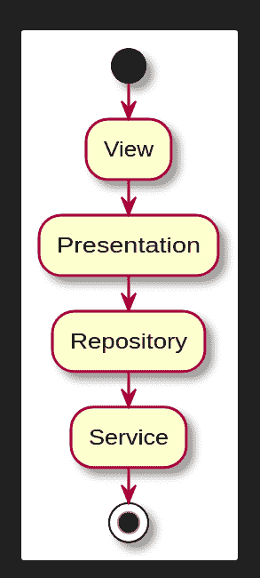

# 依赖注入-实用的观点。

> 原文：<https://dev.to/olivermensahdev/dependency-injection-a-practical-perspective-31ib>

设计面向对象的程序意味着在相关对象之间创建交互，并且通常在交互对象之间创建依赖关系。这种依赖性有时会导致设计的应用程序难以维护和扩展。在本文中，我们将借助依赖注入来设计松散耦合的程序。

# 简介

[](https://res.cloudinary.com/practicaldev/image/fetch/s---bvjuSS4--/c_limit%2Cf_auto%2Cfl_progressive%2Cq_auto%2Cw_880/https://raw.githubusercontent.com/OliverMensahDev/content-resources/master/uml/monolithic.png)

上图是一个典型的 monolith 应用程序，它从数据源获取数据，并将其呈现给某个用户界面，在本例中是 web 浏览器。首先，应用程序被结构化为包含`View`——实际的用户界面元素，在本例中，是显示在浏览器中的项目列表。它还有一个`Presentation`层，包含驱动我们 UI 的逻辑。在这里，每当 web 浏览器加载时，都会调用一个方法来检索所有人，并用这些数据填充浏览器。然后我们有我们的`Repository layer`，这里它被称为个人存储库，这是一个负责与服务交互的存储库，可以是一个数据存储。底层是`Service`层，帮助为应用程序提供数据，它可以是数据库、API 或任何数据存储。目前，应用程序服务使用硬编码的数据数组。

让我们开始稍微深入这些层中的每一层。

## 共享对象

```
<?php 
namespace testapp\sharedObjects;

final class Person
{
  public $name;
  public $gender;
  public $age;

  public function __construct(string $name, string $gender, string $age)
  {
    $this->name = $name;
    $this->gender = $gender;
    $this->age  = $age;
  }
} 
```

上面是一个样本对象，它可以被认为是一个数据传输对象，因为它提供了一个 Person 实体应该如何在各层之间共享的结构。最后，它使得将来自外部世界的输入数据建模为应用程序可以使用的结构或者创建可以在应用程序中持久化的实体变得更加容易。这是一个非常简单的类，有三个属性——姓名、性别和年龄。

这些属性可以是而不是原语，但是为了简洁，我们将保持原语类型。

## 服务层

```
 <?php 

namespace testapp\services;

use testapp\sharedObjects\Person;

final class PersonService 
{
  public function getPeople(): array
  {
    return [
      new Person("Oliver Mensah", "Male", 27),
      new Person("Olivia Ennin", "Female", 22),
    ];
  }
} 
```

该服务有一个创建实体对象并最终持久化它的方法。它还有一个返回可用实体的方法。

## 储存库层

```
<?php 
namespace testapp\repositories;

use testapp\services\PersonService;

final class PersonRepository
{
  public function __construct()
  {
    $this->personService = new PersonService();
  }

  public function getPeople(): array 
  {
    return $this->personService->getPeople();
  }
} 
```

存储库有助于与服务进行交互。在这里，它读取数据，然后将结果呈现给表示层。

## 表示层

```
<?php
namespace testapp\presentation;

use testapp\repositories\PersonRepository;

final class UserModel
{
  public function __construct()
  {
    $this->personRepository = new PersonRepository();
  }

  public function getPeople(): array
  {
    return $this->personRepository->getPeople();
  }
} 
```

这里，我们有表示层，它包含了驱动 UI 的所有表示层逻辑。

## 查看图层

```
<?php foreach ($people as $person): ?>
  <li><?php echo $person->name?></li>
<?php endforeach;?> 
```

## 控制器

```
use testapp\views\Template;
use testapp\presentation\UserModel;

$userModel = new UserModel();
$indexPage = new Template("./testapp/views/pages/index.php");
$indexPage->people = $userModel->getPeople();
echo $indexPage; 
```

它接受传入的请求，并从表示层调用一个方法，通过在浏览器中列出用户名来呈现 UI。

# 紧耦合的问题

上面的结构可能有一个很好的设计，因为我们在我们的层之间有很好的关注点分离。但是如果您仔细观察，现在的存储库直接引用了服务。无论何时，存储库类被实例化，服务都会自动更新。这意味着，无论何时我们需要人员存储库，数据都应该来自人员服务。这使得存储库与服务的存储库紧密耦合，从而负责创建和管理服务的生命周期。

驱动 UI 的表示层也与存储库紧密耦合，这是真正的问题所在。间接地，它也使得视图与服务紧密耦合。在这种情况下，如果您想要不同的服务，比如从 CSV 文件加载数据或从 API 获取数据，表示层现在负责在调用这样的服务之前知道需要哪个存储库。在代码中，这将如下所示；

```
//.. namespace and imports here

final class UserModel
{
  public function __construct()
  {
    switch($service){
      case 'raw': $this->service = new PersonRepository();
      break;
      case 'csv': $this->service = new PersonCSVRepository();
      break;
      case 'sql': $this->service = new PersonSQLRepository();
      break;
    }
  }

  public function getPeople(): array
  {
    return $this->service->getPeople();
  }
} 
```

这真的很痛苦，演示不应该做这样的工作。它的职责是通过存储库将 UI 动作发送到数据存储。

我们已经知道我们的应用程序有一个紧密耦合的代码，当应用程序想要切换到不同的数据源时，[圈复杂度](https://en.wikipedia.org/wiki/Cyclomatic_complexity)会增加。这是应该避免的。

为了确保每一层都执行其单一的职责，其他“某人”必须负责知道在应用程序的某一部分应该做什么。依赖注入有助于实现这一目标。接下来，我们将看看依赖注入，它是什么，以及它如何帮助创建松散耦合的代码。

## 【依赖注入(DI)来救援

当你在谷歌上搜索[依赖注入](https://en.wikipedia.org/wiki/Dependency_injection)的含义时，会有很多定义，但为了保持简单，它是一套软件设计原则和模式，使像你这样的软件从业者能够开发松散耦合的代码。下面是实现依赖注入的各种方法；

*   构造函数注入
*   资产注入
*   方法注入
*   周围环境
*   服务定位器

在我们的例子中，我们可以应用构造函数注入来解决大部分问题，因为紧耦合发生在大多数类构造函数中。但是问题变成了应该注入哪些服务？目前，它们是 PersonRepository、PersonCSVRepository 和 PersonSQLRepository。将来可能会有其他的服务。所以不要注入特定的类实现，比如；

```
//.. namespace and imports here

final class UserModel
{
  public function __construct(PersonRepository $personRepo,PersonCSVRepository $csvRepo, ... )
  {
    switch($service){
      case 'raw': $this->service = $personRepo;
      break;
      case 'csv': $this->service = $csvRepo;
      break;
      case 'sql': $this->service = $sqlRepo;
      break;
    }
  }

  // ...other methods
} 
```

尽管责任从表示层转移了，但是应用程序在扩展到其他服务方面受到了限制。在这种情况下，注入一个建立类契约的接口可以帮助解决这个问题。

## 与知识库对接；

一个接口为我们到目前为止所看到的许多问题提供了解决方案。从概念上讲，接口是一个契约，它定义了一组必须由实现接口的类实现的方法。它是一个被称为类契约的通用设计术语的形式化，尽管类契约的概念不仅包含一组方法，还包含这些方法的行为。换句话说，实现契约的类必须以特定的方式运行，而不仅仅是实现一组函数，在这种情况下，与应用程序中的各种服务对话。

### 定义界面

目前，大多数存储库只是从服务中检索信息，并将其填充到 UI 中。我们可以只使用该功能，或者在界面上添加更多功能。

```
<?php 
namespace testapp\repositories;

use testapp\sharedObjects\Person;

interface IPerson  
{
  public function getPeople(): array;

  public function addPerson(Person $newPerson);
} 
```

### 使用界面工作

我们现在可以注入接口，一旦应用程序的存储库实现了定义的接口，应用程序需要的任何服务都可以使用。

```
<?php
namespace testapp\presentation;

// ...imports here

final class UserModel
{
  public function __construct(IPerson $repository)
  {
    $this->repository = $repository;
  }

  public function getPeople(): array
  {
    return $this->repository->getPeople();
  }
} 
```

### 用接口定义类合同

有了定义的接口，你需要做的就是允许你的与服务交互的存储库实现它，这就是接口。现在，存储库的实现如下所示；

```
<?php 
namespace testapp\repositories;

use testapp\services\PersonService;
use testapp\sharedObjects\Person;

final class PersonRepository implements IPerson
{
  public function __construct()
  {
    $this->personService = new PersonService();
  }

  public function getPeople(): array 
  {
    return $this->personService->getPeople();
  }

  public function addPerson(Person $person)
  {

  }
} 
```

```
<?php 
namespace testapp\repositories;

use testapp\sharedObjects\Person;

final class PersonCSVRepository implements IPerson
{
  public function __construct()
  {
    $this->csvService = new CSVService();
  }

  public function getPeople(): array 
  {
    return $this->csvService->getPeople();
  }

  public function addPerson(Person $person)
  {

  }
} 
```

```
<?php 
namespace testapp\repositories;

use testapp\sharedObjects\Person;

final class PersonSQLRepository implements IPerson
{
  public function __construct()
  {
    $this->sqlService = new SQLService();
  }

  public function getPeople(): array 
  {
    return $this->sqlService->getPeople();
  }

  public function addPerson(Person $person)
  {

  }
} 
```

我们可以根据我们的服务实现尽可能多的存储库。我们还可以看到服务也与存储库紧密耦合，当您想要测试代码时，这是一个很大的问题。在测试期间，您可能无法运行实际的服务，因此模仿它将是最好的选择。

## 通过模仿服务来简化代码测试

为了模拟服务，依赖注入扮演了一个关键的角色。从今以后，存储库现在可以通过注入与服务一起工作，如下所示；

```
<?php 
namespace testapp\repositories;

use testapp\services\PersonService;
use testapp\sharedObjects\Person;

final class PersonRepository implements IPerson
{
  public function __construct(PersonService $service)
  {
    $this->personService = $service;
  }

  public function getPeople(): array 
  {
    return $this->personService->getPeople();
  }

  public function addPerson(Person $person)
  {

  }
} 
```

```
<?php 
namespace testapp\repositories;

use testapp\sharedObjects\Person;

final class PersonCSVRepository implements IPerson
{
  public function __construct(CSVService $service)
  {
    $this->csvService = $service;
  }

  public function getPeople(): array 
  {
    return $this->csvService->getPeople();
  }

  public function addPerson(Person $person)
  {

  }
} 
```

```
<?php 
namespace testapp\repositories;

use testapp\sharedObjects\Person;

final class PersonSQLRepository implements IPerson
{
  public function __construct(SQLService $service)
  {
    $this->sqlService = $service;
  }

  public function getPeople(): array 
  {
    return $this->sqlService->getPeople();
  }

  public function addPerson(Person $person)
  {

  }
} 
```

有了这些变化，我们可以在代码的单元测试期间轻松地模拟任何服务。

你可以使用任何工具来测试你的代码。在这种情况下，使用[嘲讽](http://docs.mockery.io/en/latest/)。

```
<?php

use PHPUnit\Framework\TestCase;
use testapp\presentation\UserModel;
use testapp\sharedObjects\Person;

class UserModelTest extends TestCase
{

    public function testGetPeople()
    {
        $repository = \Mockery::mock('testapp\repositories\IPerson');
        $repository->shouldReceive('getPeople')
        ->once()
        ->andReturn([new Person("Oliver Mensah", "Male", 24), new Person("Geddy Addo", "Female", 21)]);

        $userModel = new UserModel($repository);
         // Verify
        $this->assertEquals([new Person("Oliver Mensah", "Male", 24), new Person("Geddy Addo", "Female", 21)], $userModel->getPeople());
    }
} 
```

在这种情况下，我们只是通过模仿我们的服务来测试`getPeople`方法。

## 结论

在这里，我们研究了如何应用依赖注入规则，这是编写有效的产品级面向对象系统的一个好原则。我们熟悉如何通过避免常见的陷阱来构建具有高可维护性、可扩展性和易修改性的代码。因此，下面应该是从这个小作品中常见的收获；

*   应用分层
*   紧耦合的问题
*   依赖注射(DI)来拯救
*   连接存储库
*   通过模仿服务来简化代码测试

我希望你和我一样喜欢把这些放在一起。

示例代码可以在[这里](https://github.com/OliverMensahDev/dependencyInjection)找到

## 进一步阅读

[Matthias Noback 的](https://twitter.com/matthiasnoback)描述是从实用设计原则的角度对[风格的对象设计指南](https://leanpub.com/object-design)的最好的深入讨论之一。

## 保持联系

当我们继续学习和探索更多关于软件工程的知识时，让我们保持联系。别忘了在推特或 T2【LinkedIn】和我联系