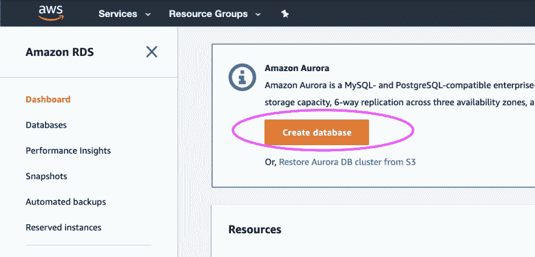
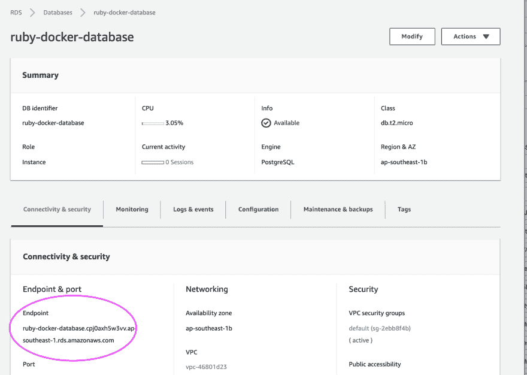
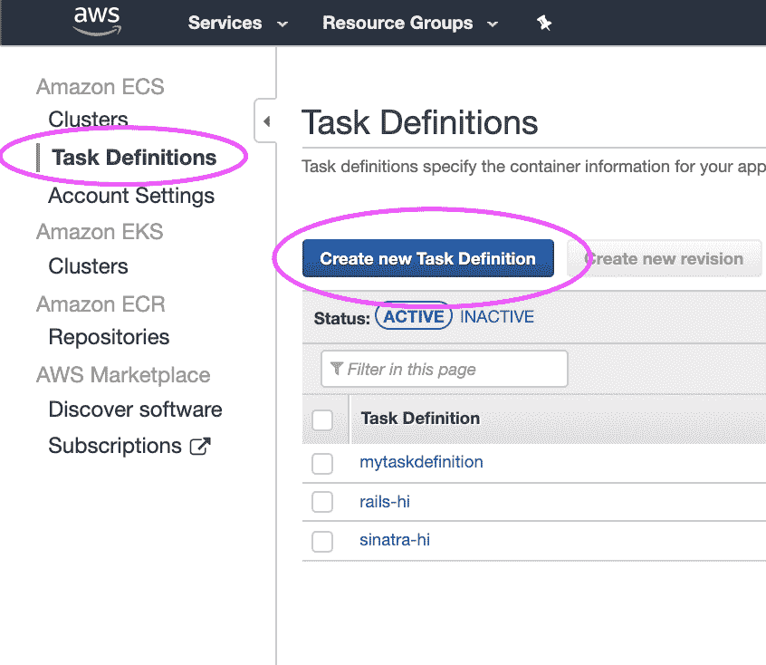
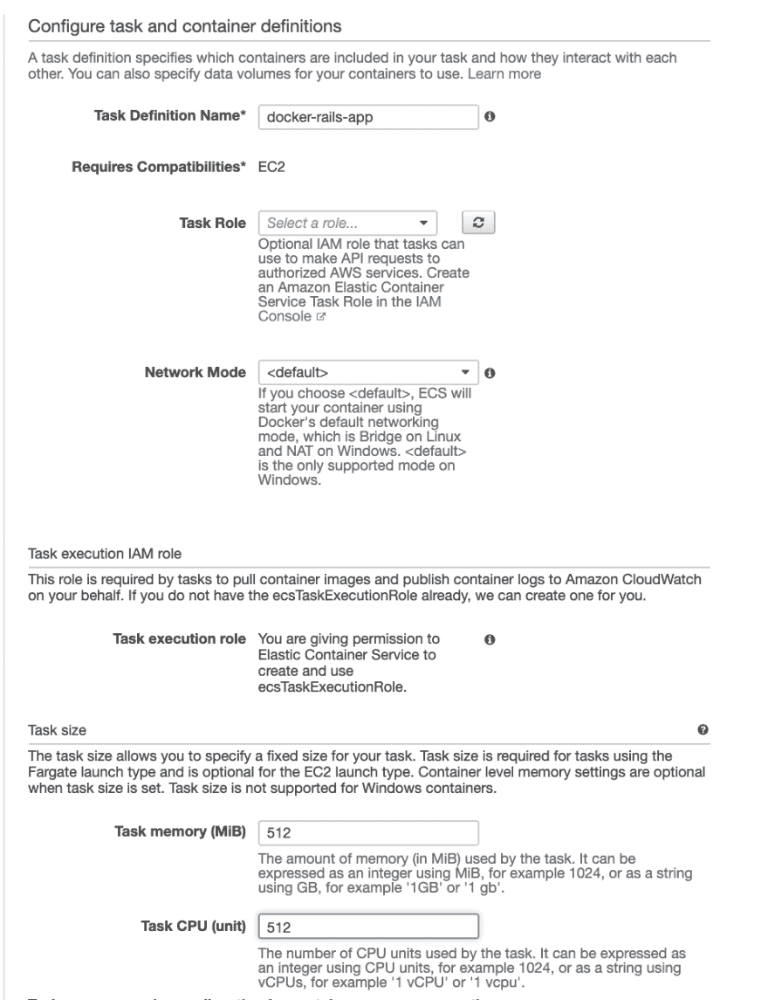
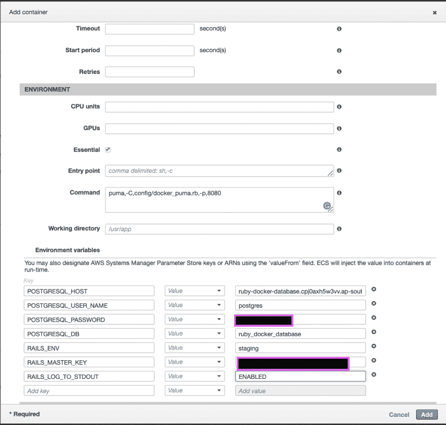
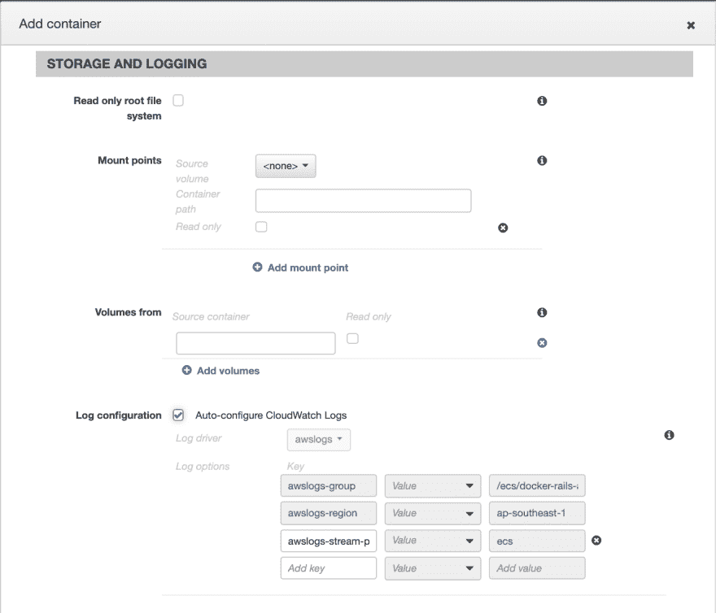
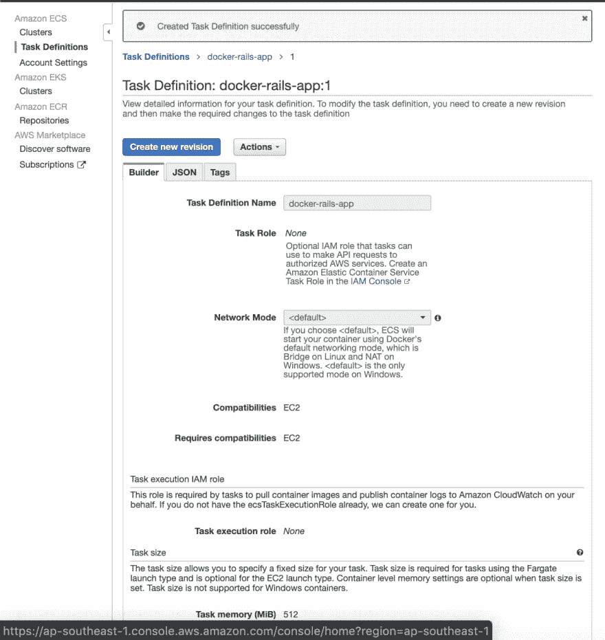
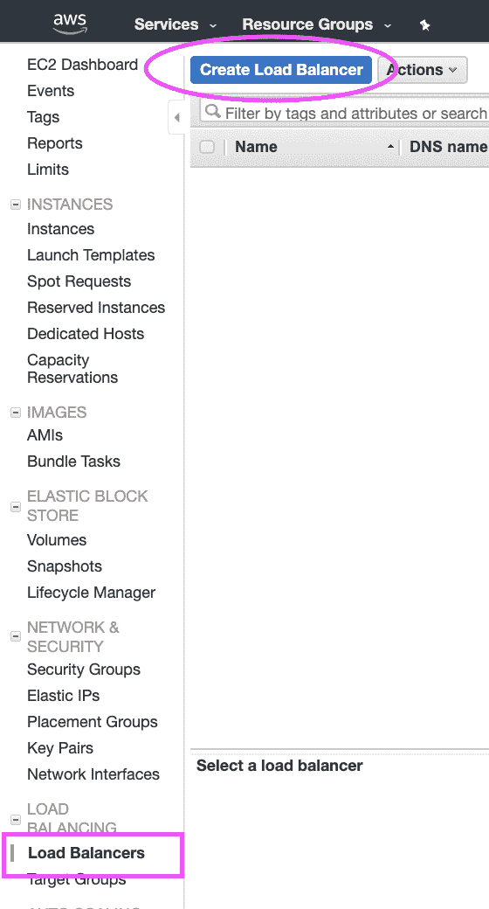
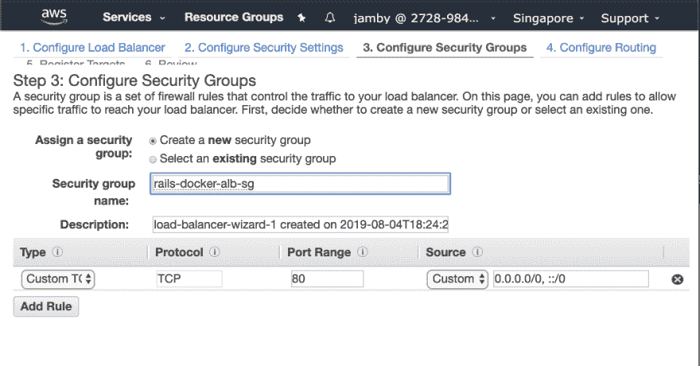
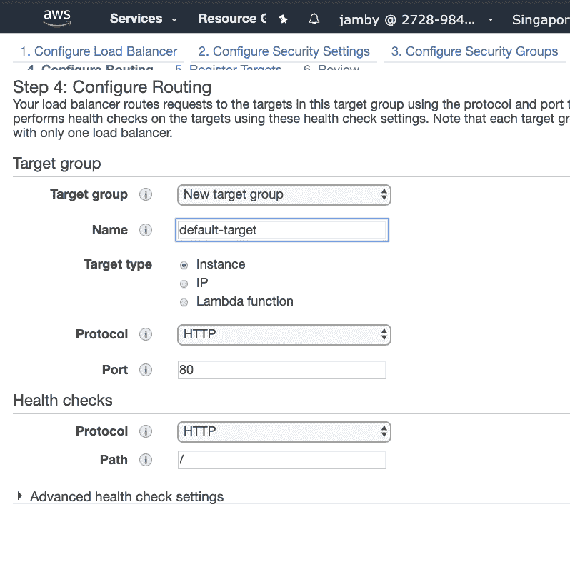

# 在 Amazon ECS 中部署 Rails:第 3 部分——创建 RDS 数据库、任务定义和负载平衡器

> 原文：<https://dev.to/raphael_jambalos/deploy-rails-in-amazon-ecs-part-3-create-the-rds-database-task-definition-and-load-balancer-1ffe>

这是亚马逊 ECS 文章*部署 Rails 的第三部分。它是 Docker* 中更广泛的系列*的一部分，而不是“你好世界”。该系列将带您从 Docker 中的 *hello world* 到在 AWS 中部署您的应用程序。*

*   [在 Docker 中构建 Rails + Sidekiq web 应用](https://dev.to/jamby1100/more-than-hello-world-in-docker-run-rails-sidekiq-web-apps-in-docker-1b37)
*   **在亚马逊 ECS 中部署 Rails**
    *   [概念](https://dev.to/jamby1100/deploy-rails-in-amazon-ecs-part-1-concepts-26nl)
    *   [将图像推送到 ECR](https://dev.to/jamby1100/deploy-rails-in-amazon-ecs-part-2-push-an-image-to-ecr-43fl)
    *   **创建 RDS 数据库、任务定义和负载平衡器——我们到了**
    *   [创建 ECS 群集并将其全部连接在一起](https://dev.to/jamby1100/deploy-rails-in-amazon-ecs-part-4-create-an-ecs-cluster-338f)
    *   [配置 Sidekiq](https://dev.to/jamby1100/deploy-rails-in-amazon-ecs-part-5-integrate-sidekiq-and-redis-for-background-processing-150f)
*   [使用 AWS CodeDeploy 自动部署](https://dev.to/raphael_jambalos/automate-deployments-with-aws-codepipeline-52f5)
    *   [深入了解 AWS 代码构建](https://dev.to/jamby1100/automate-docker-build-with-aws-codebuild-9om)
*   高级 ECS 概念:
    *   服务发现和自动扩展-即将推出
    *   Fargate -即将推出

在本帖中，我们将设置在 AWS 上运行容器化应用程序所需的三个 AWS 服务:数据库、任务定义和负载平衡器。

# 6 |创建 RDS 数据库

Docker 容器应该是无状态的:它们可以被关闭和打开，因为它们不保存任何数据或*状态*(或者至少不保存不能从另一个源检索的状态)。根据定义，数据库是*有状态的*:它们包含数据，被认为是真理的来源。如果数据从数据库中消失，我们没有其他可靠的来源可以把它找回来。因为容器应该是无状态的，所以我们不应该在容器中托管我们的数据库。

在[之前的一篇](https://dev.to/jamby1100/more-than-hello-world-in-docker-run-rails-sidekiq-web-apps-in-docker-1b37)中，我们使用`docker-compose`在 Docker 容器中设置了一个 PostgreSQL 服务器。这对开发来说没问题，因为那里的数据很容易复制。我们不能在生产数据库上这样做，因为如果容器消失了，数据也会随之消失。

容器上数据库的支持者认为应该使用 docker 卷，这样当容器死亡时，数据不会消失。*嗯，你可以*，但这增加了你必须管理的复杂性。更好的方法是使用托管数据库服务，而不要担心将工程可靠性融入到您可以付钱给其他人去做的解决方案中。

对于数据库，我们将创建一个 RDS PostgreSQL 数据库。

**(6.1)** 在服务选项卡上，搜索 RDS 并单击它。然后，单击“创建数据库”。

**(6.2)** 在下一页中，选择 PostgreSQL 作为您选择的数据库，并从模板中释放层。在 Settings tile 上，添加 *ruby-docker-database* 的 DB 实例标识符，以及您选择的密码。将 DB 实例大小保留为 t2.micro。对于连接，将 VPC 保留为默认 VPC(注意第 8 节中此 VPC 的 id)。

然后，单击“创建数据库”。您将在下一个屏幕上看到您的数据库正在创建:

**(6.3)** 数据库创建完成后，点击数据库名称。在下一页，记下端点。稍后我们将使用它来访问数据库。

# 7 |创建任务定义

我们需要任务定义来在 ECS 中运行任务。任务定义定义了任务可用的资源。它还保存有关作为任务一部分的容器的信息。用面向对象的术语来说，把任务定义想象成*类*，把任务想象成类的*实例:要实例化一个任务，必须从任务定义中获取信息。*

**(7.1)** 在“服务”选项卡上，搜索 ECS 并单击它。然后，单击“创建新任务定义”。

**(7.2)** 然后，选择 EC2 启动类型兼容性并点击下一步。

**(7.3)** 让我们把我们的任务定义命名为 *docker-rails-app* 。对于任务大小，我们姑且给它 512mb 内存，512 单位 CPU。CPU 单位是量化计算能力的一种简化方式。这为每个任务种子提供了 512mb 和 512 个 CPU 单元。一个任务中的容器共享这个资源。

**(7.4)** 向下滚动，点击“添加容器”。任务定义定义了单个任务。一个任务可以包含许多容器。您可以添加任意数量的容器，但是我建议每个任务只添加一个。

**(7.5)** 接下来，将我们刚刚在 5.4 节上传的 Docker 图像的 URI 添加到*图像*字段，并将“web”添加到*名称*字段。另外，确保将主机端口添加为 0，将容器端口添加为 8080。将主机端口设置为零允许许多容器驻留在一个 EC2 实例中。

主机实例中的每个容器都有自己的端口范围，主机实例也有自己的端口范围。就其本身而言，不能从实例外部访问容器及其端口范围。通过将主机端口设置为 0 并将容器端口设置为 8080，我们将每个容器的端口 8080 暴露给主机实例中的任意随机端口。想象一下，如果我们在主机实例中有 3 个 IP 为 *10.0.0.123* 的容器。每个实例都有自己的端口 8080，但它们将映射到主机实例上的不同端口:

*   `container_one:8080`->-`10.0.0.123:16217`
*   `container_two:8080`->-`10.0.0.123:11394`
*   `container_three:8080`->-`10.0.0.123:2390`

这个特性叫做*动态端口映射*。它通过一个独特的`ip_address:port`组合来访问每个容器。因此，我们可以将它注册到负载平衡器，并将流量定向到它。AWS 在后台为我们处理这一切。我们所要做的就是将主机端口设置为零。

在本例中，它将`10.0.0.123:16217`、`10.0.0.123:11394`和`10.0.0.123:2390`添加到负载均衡器，这样流量就可以被定向到每个容器。

负载平衡器对每个容器执行健康检查，以测试它们是否仍在正常运行。如果容器未能通过一定数量的健康检查，负载均衡器会注销该容器，这样流量就不会再流向它。ECS 终止有问题的容器并启动一个新的容器。

**(7.6)** 向下滚动到环境部分。对于命令，输入`puma,-C,config/docker_puma.rb,-p,8080`。这是 Docker 在启动容器时将运行的命令。该命令启动 Rails 的默认应用服务器 Puma，并将流量路由到端口 8080。

添加以下环境变量:

*   `POSTGRESQL_HOST` : < <你在 5.3 >中记下的端点>
*   `POSTGRESQL_USER_NAME` : postgres
*   `POSTGRESQL_PASSWORD` : < <您在 5.2 > >输入的密码
*   `POSTGRESQL_DB` : ruby_docker_database
*   `RAILS_ENV`:暂存
*   `RAILS_MASTER_KEY` : < <如果你克隆了我的回购，用`e451d94494f606afa27a4cae3dea3948`。如果你自己做的，使用`config/master.key` > >中的值
*   `RAILS_LOG_TO_STDOUT` -启用

我们在步骤 4.1 中制作的 database.yml 将使用`POSTGRESQL_`前置变量。`RAILS_ENV`变量是为了确保我们使用的是暂存环境。轨道 5 运行需要`RAILS_MASTER_KEY`。

**(7.7)** 在存储和记录部分，点击`Auto-configure Cloudwatch Logs`。这将设置 Cloudwatch 日志从 Rails 收集应用程序日志，但是日志必须来自标准输出。使能 7.6 中的`RAILS_LOG_TO_STDOUT`将轨道日志输出到[标准输出](http://www.linfo.org/standard_output.html)。

**(7.8)** 然后，点击“添加”关闭容器定义窗口。然后，点击“创建”。您应该会看到类似这样的内容:

因为这是我们第一次创建任务定义，所以这将是第一个版本。如果您点击下图中的“创建新版本”,您将有机会更改我们之前所做的任何设置。当您保存您的更改时，它将被放置在一个新版本上，即版本 2。

# 8 |创建应用程序负载平衡器

我们在第 7.5 节详细讨论了*动态端口映射*。实际上，主机实例中的每个容器都将被分配一个随机端口。主机`10.0.0.123`可以包含三个容器，可以通过`10.0.0.123:1911`、`10.0.0.123:7421`、`10.0.0.123:5819`访问。AWS ECS 将负责向负载平衡器注册这些 ip_address:port 组合。注册后，负载平衡器会将传入流量分发到注册到它的容器。

**(8.1)** 在服务选项卡上，搜索 EC2 并单击它。然后，点击左侧菜单上的*负载平衡器*，并点击“创建负载平衡器”。在下一页，点击*应用负载均衡器*。

**(8.2)** 让我们把我们的负载均衡器命名为 *rails-docker-alb* 。接下来，选择我们在 6.2 中选择的 VPC，并选择它的所有子网。然后，点击*下一个*。点击下一步的*跳过“步骤 2:配置安全设置”。*

**(8.3)** 让我们在下一页创建一个名为 *rails-docker-alb-sg* 的安全组。这个安全组定义了哪些流量可以进入我们的负载平衡器。

确保为 0.0.0.0/0(所有人)打开端口 80。这将确保我们的应用程序可以访问开放的互联网。然后，点击下一个的*。*

**(8.4)** 创建一个名为*默认目标*的新目标组。然后，单击下一步。点击下一个的*，跳过“步骤 5:注册目标”。*

**(8.5)** 查看你的负载平衡器，然后点击*创建*。

就是这样！您已经创建了一个数据库、一个任务定义和一个负载平衡器。

# 接下来是什么？

在下一篇文章中，您将创建 ECS 集群，我们将在那里部署我们的 Rails 应用程序。我们终于可以看到我们的 Rails 应用程序被部署了！