# 在 Amazon ECS 中部署 Rails:第 4 部分——创建 ECS 集群

> 原文：<https://dev.to/raphael_jambalos/deploy-rails-in-amazon-ecs-part-4-create-an-ecs-cluster-338f>

这是亚马逊 ECS 帖子*部署 Rails 的第四部分。它是 Docker* 中更广泛的系列*的一部分，而不是“你好世界”。该系列将帮助您准备好您的应用程序:从在本地设置它到在 AWS 中将它部署为生产级工作负载。*

*   [在 Docker 中构建 Rails + Sidekiq web 应用](https://dev.to/jamby1100/more-than-hello-world-in-docker-run-rails-sidekiq-web-apps-in-docker-1b37)
*   **在亚马逊 ECS 中部署 Rails**
    *   [概念](https://dev.to/jamby1100/deploy-rails-in-amazon-ecs-part-1-concepts-26nl)
    *   [将图像推送到 ECR](https://dev.to/jamby1100/deploy-rails-in-amazon-ecs-part-2-push-an-image-to-ecr-43fl)
    *   [创建 RDS 数据库、任务定义和负载平衡器](https://dev.to/jamby1100/deploy-rails-in-amazon-ecs-part-3-create-the-rds-database-task-definition-and-load-balancer-1ffe)
    *   **创建 ECS 群集并将其全部连接在一起——我们到了**
    *   [配置 Sidekiq](https://dev.to/jamby1100/deploy-rails-in-amazon-ecs-part-5-integrate-sidekiq-and-redis-for-background-processing-150f)
*   [使用 AWS CodeDeploy 自动部署](https://dev.to/raphael_jambalos/automate-deployments-with-aws-codepipeline-52f5)
    *   [深入了解 AWS 代码构建](https://dev.to/jamby1100/automate-docker-build-with-aws-codebuild-9om)
*   高级 ECS 概念:
    *   服务发现和自动扩展-即将推出

# 9 |创建 ECS 集群

ECS 集群是任务和服务的集合。使用 ECS-EC2 服务时，集群也是 EC2 实例的集合。您的容器运行在这些 EC2 实例上。查看[这篇文章](https://dev.to/jamby1100/deploy-rails-in-amazon-ecs-part-1-concepts-26nl)以获得更详细的解释。

**(9.0)** 在“服务”选项卡上，搜索 EC2 并单击它。然后，点击左侧菜单上的*键对*。点击创建密钥对并添加名称“rails-docker”。这将下载一个`rails-docker.pem`文件到你的本地。我们正在创建一个密钥对，因为我们希望能够访问我们的集群稍后将创建的 EC2 实例。如果没有密钥对，这些 EC2 实例将无法通过 SSH 访问

[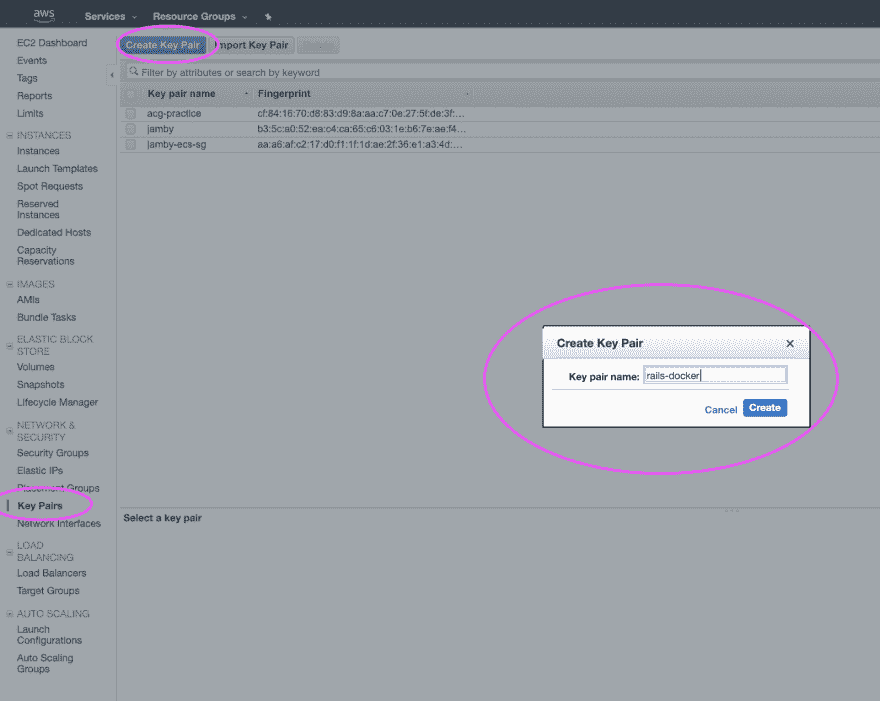](https://res.cloudinary.com/practicaldev/image/fetch/s--UgwvAsvK--/c_limit%2Cf_auto%2Cfl_progressive%2Cq_auto%2Cw_880/https://thepracticaldev.s3.amazonaws.com/i/ks6jdbhxutrk3vu4p6vy.png)

**(9.1)** 在“服务”选项卡上，搜索 ECS 并单击它。然后，单击“创建集群”。在下一页，点击 *EC2 Linux +网络*。

[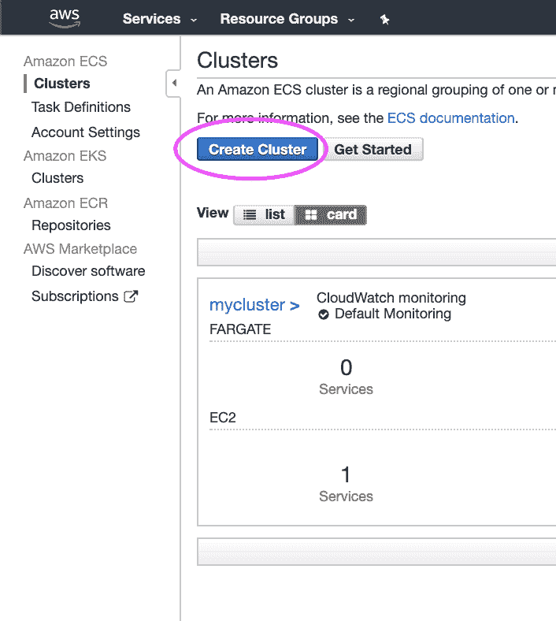](https://res.cloudinary.com/practicaldev/image/fetch/s--nB1LY59p--/c_limit%2Cf_auto%2Cfl_progressive%2Cq_auto%2Cw_880/https://thepracticaldev.s3.amazonaws.com/i/tdfkxn623bdm5oxxto3s.png)

**(9.2)** 在下一页，添加 *my-simple-ruby-app* 作为集群名称。
将 EC2 实例类型更改为`m3.medium`，并将密钥对设置为`rails-docker.pem`(或您在步骤 9.0 中设置的任何值)。*请注意，使用 m3.medium 会在您的 AWS 账户上产生费用。如果您按照教程从头开始制作自己的简单 Rails 应用程序，t2.micro EC2 实例类型就足够了。t2.micro 实例是空闲层下的唯一实例。然而，如果你正在部署一个具有更多功能和宝石的应用程序，我建议你先尝试 m3.medium，然后再尝试 t2.micro.*

[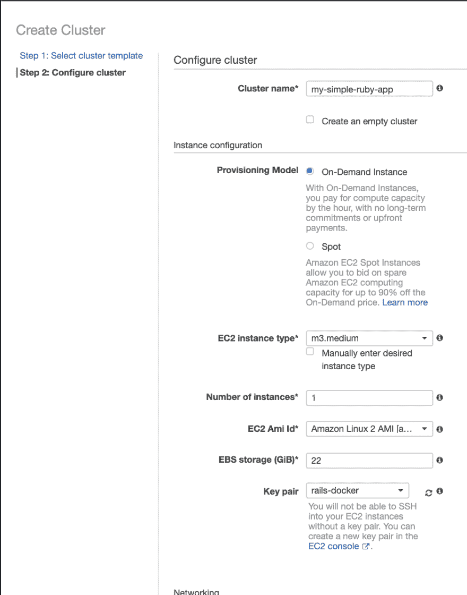](https://res.cloudinary.com/practicaldev/image/fetch/s--Ts7cvVjK--/c_limit%2Cf_auto%2Cfl_progressive%2Cq_auto%2Cw_880/https://thepracticaldev.s3.amazonaws.com/i/lhutt6awq7r795trfygy.png)

**(9.3)** 向下滚动页面。在“网络”部分，确保您使用的 VPC 与您在 6.2 中使用的相同。在子网字段中，添加 VPC 中的所有子网。

[](https://res.cloudinary.com/practicaldev/image/fetch/s--MU-24ysk--/c_limit%2Cf_auto%2Cfl_progressive%2Cq_auto%2Cw_880/https://thepracticaldev.s3.amazonaws.com/i/zt8oxciohg2el18vb03h.png)

**(9.4)** 进一步向下滚动。勾选*启用容器洞察*，这样 ECS 将从您的容器中收集 CPU 和内存利用率数据。然后，点击“创建”。您应该会看到类似这样的内容:

[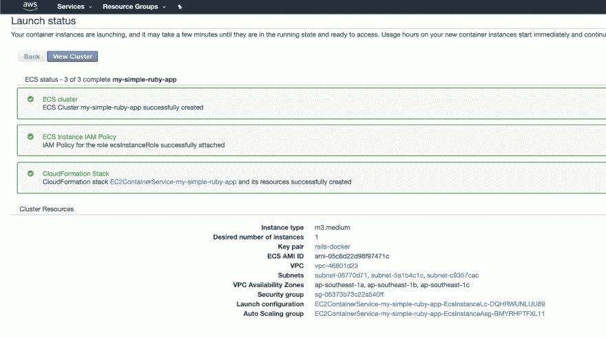](https://res.cloudinary.com/practicaldev/image/fetch/s--j7ypbxFX--/c_limit%2Cf_auto%2Cfl_progressive%2Cq_auto%2Cw_880/https://thepracticaldev.s3.amazonaws.com/i/c023f57lz3058hpoy0ua.png)

检查完所有内容后，单击“查看集群”

# 10 |创建一个 ECS 服务

ECS 服务负责保持一定数量的任务始终正常运行。任务是必须一起运行的容器的集合。要了解有关服务的更多信息，请点击此处的。

**(10.1)** 在服务选项卡上，单击“创建”

[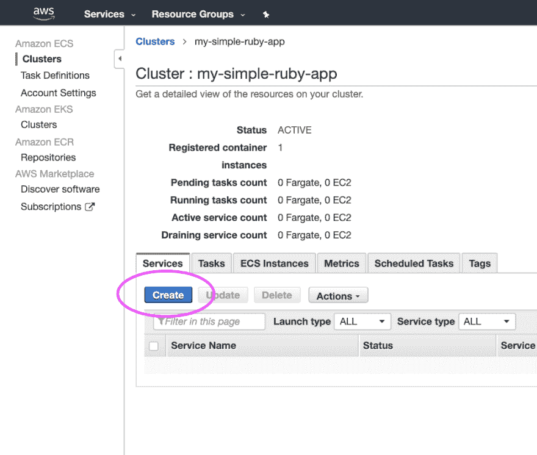](https://res.cloudinary.com/practicaldev/image/fetch/s--VGyDoO1t--/c_limit%2Cf_auto%2Cfl_progressive%2Cq_auto%2Cw_880/https://thepracticaldev.s3.amazonaws.com/i/q2p74q1shtg4ogntctva.png)

**(10.2)** 然后，选择 EC2 发射类型。选择 *docker-rails-app* 的任务定义系列，以及它的最新修订版(如果您是第一次这么做，应该是 1)。

[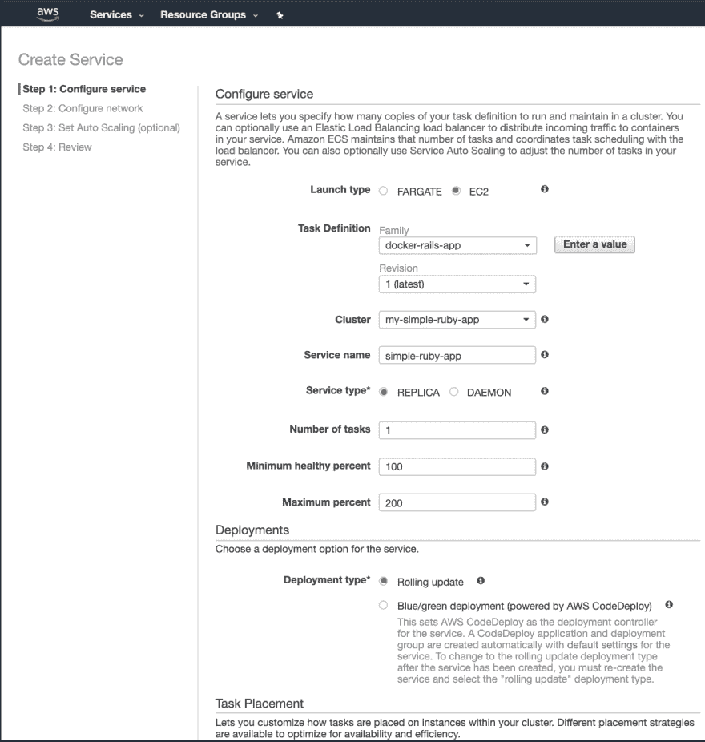](https://res.cloudinary.com/practicaldev/image/fetch/s--nusRAkpG--/c_limit%2Cf_auto%2Cfl_progressive%2Cq_auto%2Cw_880/https://thepracticaldev.s3.amazonaws.com/i/ptlkj135xts94p0ifmv1.png)

**(10.3)** 在“配置网络”部分，勾选“应用程序负载平衡器”。然后，选择我们在第 8 节中创建的负载平衡器。然后，加上`web:0:8080`的`container_name:port`。

[](https://res.cloudinary.com/practicaldev/image/fetch/s--2CThq7A6--/c_limit%2Cf_auto%2Cfl_progressive%2Cq_auto%2Cw_880/https://thepracticaldev.s3.amazonaws.com/i/9dnux7f1n23c27w3l627.png)

**(10.4)**

取消勾选*启用服务发现集成*并点击下一步。在下一页，点击*不要调整服务的期望计数*，然后，点击下一步。

[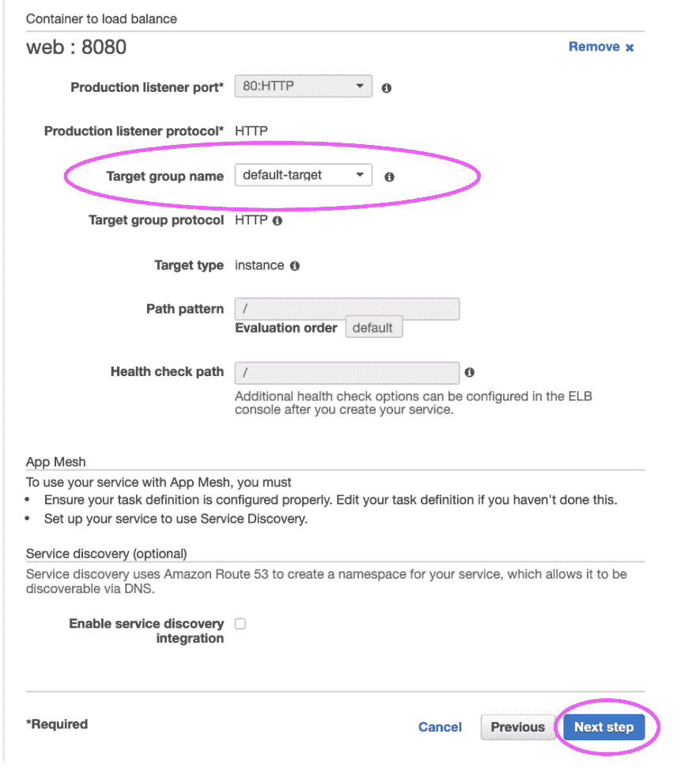](https://res.cloudinary.com/practicaldev/image/fetch/s--_fScOW9S--/c_limit%2Cf_auto%2Cfl_progressive%2Cq_auto%2Cw_880/https://thepracticaldev.s3.amazonaws.com/i/zfirj2lvx40i6az6qzxt.png)

**(10.5)** 查看您的 ECS 服务。它应该看起来像这样。

[](https://res.cloudinary.com/practicaldev/image/fetch/s--u4kTKUIr--/c_limit%2Cf_auto%2Cfl_progressive%2Cq_auto%2Cw_880/https://thepracticaldev.s3.amazonaws.com/i/ybx8hsefr0jj41ou2hwf.png)

然后点击“创建服务”。您应该会看到类似这样的内容:

[](https://res.cloudinary.com/practicaldev/image/fetch/s--eF_QsG2g--/c_limit%2Cf_auto%2Cfl_progressive%2Cq_auto%2Cw_880/https://thepracticaldev.s3.amazonaws.com/i/lo66xa6egtc6anovrlu1.png)

# 11 |设置安全组

我们已经创建了 ECS 设置所需的所有组件。问题是它们目前是孤立存在的。目前他们没有办法互相交流。这是因为我们每个组件的*安全组*并没有被设置为可以相互通信。安全组是传入和传出流量的一组规则。它们指定哪些资源可以与一组特定的资源进行通信。比如说。ECS 群集的安全组指定哪些资源可以与其通信。

我们必须设置 ECS 集群的安全组，以便能够接受 SSH 流量(这样我们就可以通过 SSH 连接到容器),并接受来自负载平衡器的所有端口的流量(以启用动态端口映射)。我们还必须设置我们在第 6 节中创建的数据库的安全组，以便能够接受来自 ECS 群集的流量。

**(11.1)** 在“服务”选项卡上，搜索 ECS 并单击它。然后，单击“Clusters”，然后找到我们刚刚在第 9 节中创建的集群。然后，单击“ECS 实例”选项卡。这应该会列出已经为集群创建的 EC2 实例。单击 EC2 实例。

[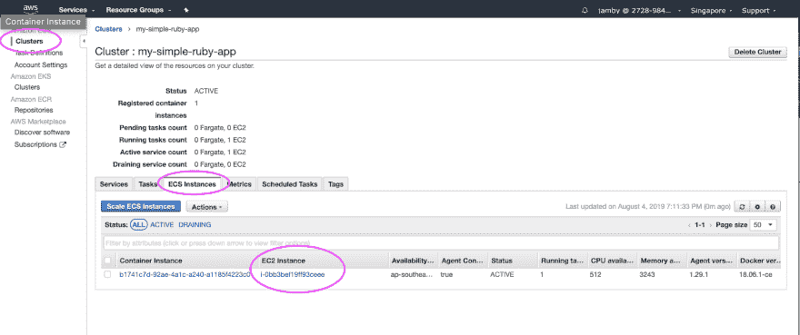](https://res.cloudinary.com/practicaldev/image/fetch/s--hLqL81j6--/c_limit%2Cf_auto%2Cfl_progressive%2Cq_auto%2Cw_880/https://thepracticaldev.s3.amazonaws.com/i/xski1dofkgz9w3rc1k7j.png)

**(11.2)** 这将引导您进入 EC2 页面。单击实例，在下面的详细信息窗格中，找到安全组，然后单击它。记下这个安全组。该安全组定义了哪些资源可以与我们的 ECS 群集通信。

[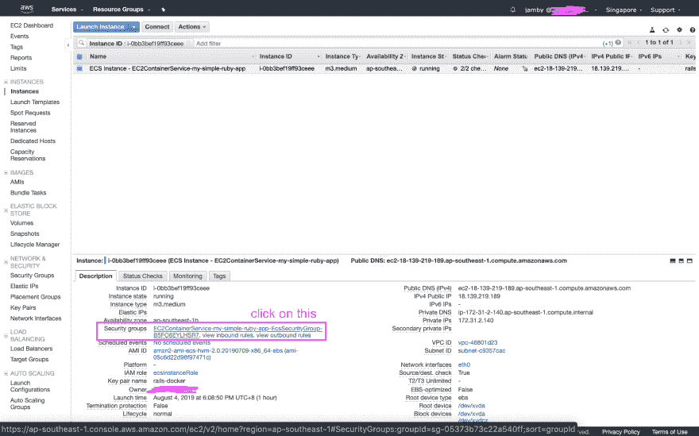](https://res.cloudinary.com/practicaldev/image/fetch/s--2jzV1c2J--/c_limit%2Cf_auto%2Cfl_progressive%2Cq_auto%2Cw_880/https://thepracticaldev.s3.amazonaws.com/i/bd4xpwqbmz206gsz37ta.png)

**(11.3)** 这将引导您进入 EC2 安全组页面。单击“入站”选项卡，然后单击“编辑”。添加允许来自任何地方的 SSH 流量的规则。

[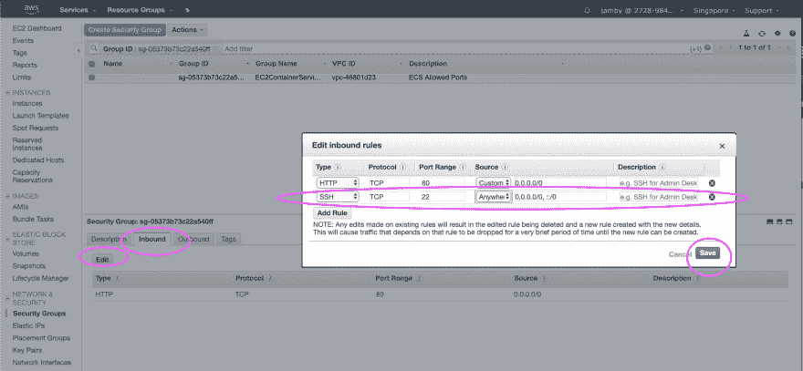](https://res.cloudinary.com/practicaldev/image/fetch/s--3nhazeRm--/c_limit%2Cf_auto%2Cfl_progressive%2Cq_auto%2Cw_880/https://thepracticaldev.s3.amazonaws.com/i/de7g91f1m34g53gc0r3l.png)

添加另一个规则，允许来自我们为 ALB 创建的安全组的所有 TCP 流量。安全组的名称是`rails-docker-alb-sg`。或者，输入您在步骤 8.3 中输入的安全组名。
[](https://res.cloudinary.com/practicaldev/image/fetch/s--lR6Vh3gx--/c_limit%2Cf_auto%2Cfl_progressive%2Cq_auto%2Cw_880/https://thepracticaldev.s3.amazonaws.com/i/o9mtgafuisf2mgbkgose.png)

**(11.4)** 在服务选项卡上，搜索 RDS 并单击它。在左侧菜单中，单击“数据库”。然后，找到并单击您在步骤 6 中创建的数据库。

[](https://res.cloudinary.com/practicaldev/image/fetch/s--WfrcGpiz--/c_limit%2Cf_auto%2Cfl_progressive%2Cq_auto%2Cw_880/https://thepracticaldev.s3.amazonaws.com/i/l2dbpnugpzfcnt5wyrfq.png)

**(11.5)** 在**连接&安全**选项卡上，点击 VPC 安全组上的安全组。该安全组定义了哪些资源可以与数据库通信。

[](https://res.cloudinary.com/practicaldev/image/fetch/s--9k-9TSzR--/c_limit%2Cf_auto%2Cfl_progressive%2Cq_auto%2Cw_880/https://thepracticaldev.s3.amazonaws.com/i/c2odfxrf3iwzslauqrbv.png)

**(11.6)** 这会将您重定向到该特定安全组的 EC2 安全组页面。单击“入站”选项卡，然后单击“编辑”。添加一个规则，以允许您在步骤 11.2 中记录的安全组上的“PostgreSQL”流量(端口 5432)

[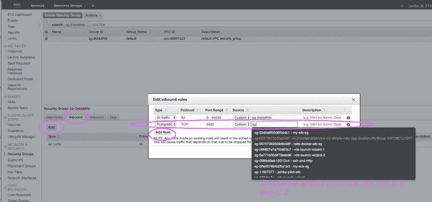](https://res.cloudinary.com/practicaldev/image/fetch/s--xJl6DcpT--/c_limit%2Cf_auto%2Cfl_progressive%2Cq_auto%2Cw_880/https://thepracticaldev.s3.amazonaws.com/i/j4zepkdicsr1it9gph2v.png)

**(11.7)** 接下来，我们重复步骤 11.1，转到为集群创建的 EC2 实例。然后，我们点击“连接”。这将告诉我们如何连接到我们的实例的具体说明。

[](https://res.cloudinary.com/practicaldev/image/fetch/s--yB3sznN8--/c_limit%2Cf_auto%2Cfl_progressive%2Cq_auto%2Cw_880/https://thepracticaldev.s3.amazonaws.com/i/4s9e8elz14oxxkbe8yis.png)

在我们的本地终端上，转到步骤 9.0 中下载了`pem`文件的文件夹。然后，执行`chmod 400 rails-docker.pem`来保护 pem 文件。该命令将文件的权限限制为只能由当前用户访问。然后，在面板上运行 ssh 命令，但是将`root`改为`ec2-user`。

对我来说，这个命令看起来像这样:

```
ssh -i "rails-docker.pem" ec2-user@ec2-18-139-219-189.ap-southeast-1.compute.amazonaws.com 
```

**(11.8)** 一旦你在实例中，做一个`docker ps`来列出当前正在运行的容器。找到名称中带有`sample-docker-rails-app:v1.0.0`的容器。记下该容器的 container_id。

然后通过该命令`docker exec -it <<container_id>> /bin/bash`进入集装箱。用上面的 container_id 替换`<<container_id>>`。

**(11.9)** 在内部执行以下命令。你可能会被踢出集装箱好几次。从步骤 11.8 开始重复，直到成功执行以下命令。

```
rake db:create && rake db:migrate && rake db:seed 
```

# 12 |第一次看到我们的应用

**(12.1)** 在服务选项卡上，搜索 EC2 并单击它。找到我们在第 8 节中创建的负载平衡器，并单击它。然后，将 DNS 名称复制粘贴到浏览器的另一个选项卡中。

[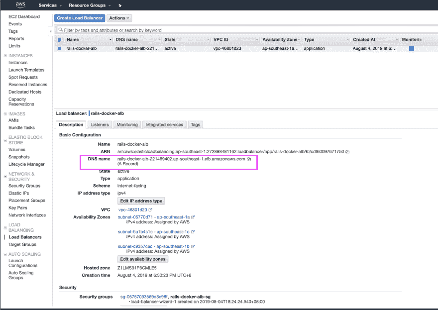](https://res.cloudinary.com/practicaldev/image/fetch/s--4LJsPabI--/c_limit%2Cf_auto%2Cfl_progressive%2Cq_auto%2Cw_880/https://thepracticaldev.s3.amazonaws.com/i/198pzocnt8uwpll2hk4s.png)

**(12.2)** 你应该能看到正在工作的 app！

[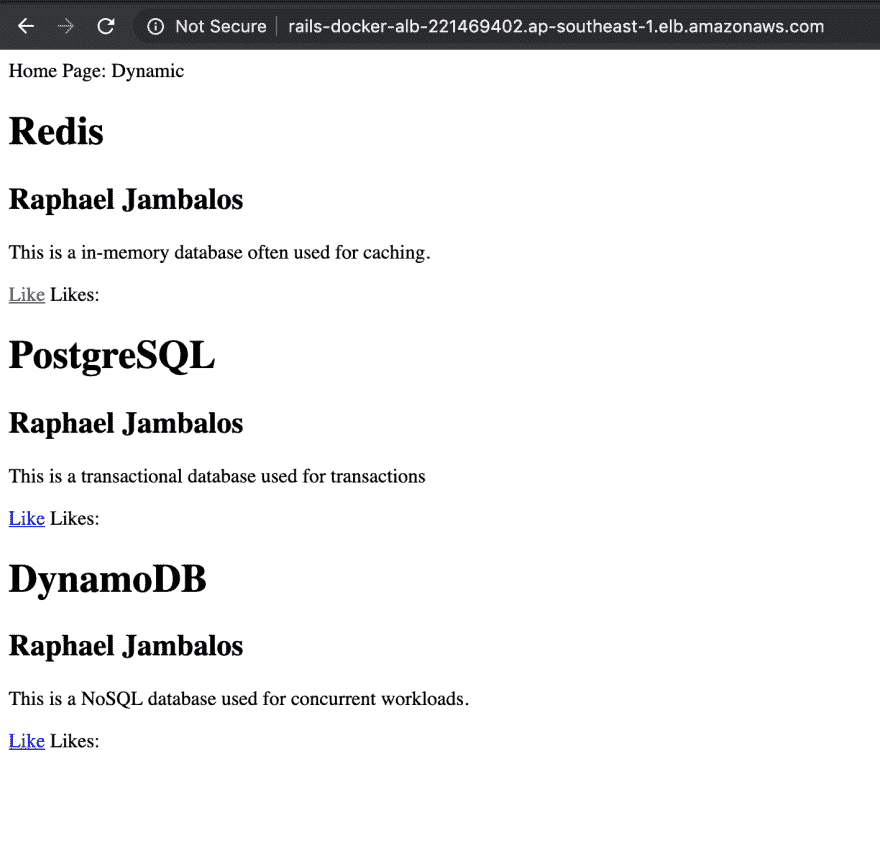](https://res.cloudinary.com/practicaldev/image/fetch/s---U4V-pKF--/c_limit%2Cf_auto%2Cfl_progressive%2Cq_auto%2Cw_880/https://thepracticaldev.s3.amazonaws.com/i/qkev8ep3tcp2gsrgqxti.png)

**(12.3)** 尽管点击了“喜欢”按钮，我们还是发现了一个错误。那是因为我们还没有设置 Redis 和 Sidekiq。

[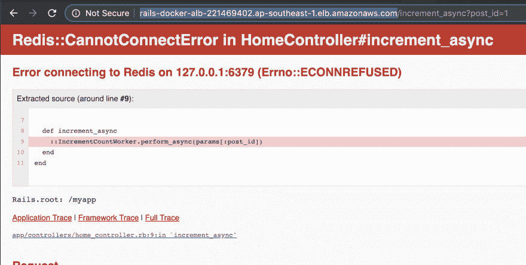](https://res.cloudinary.com/practicaldev/image/fetch/s--pGU_F2Al--/c_limit%2Cf_auto%2Cfl_progressive%2Cq_auto%2Cw_880/https://thepracticaldev.s3.amazonaws.com/i/wzca84o6ribzlm0az296.png)

# 接下来是什么？

在下一篇文章中，我们将通过建立 Redis 和 Sidekiq 服务来解决 Sidekiq 问题。不过，还在计划中。过几天就好了。与此同时，你可以在这里关注我的最新消息。

或者，作为一个挑战，找出如何使喜欢按钮工作。提示是 Redis 服务被设置为一个单独的 EC2 实例

特别感谢我的编辑艾伦，他帮助这篇文章变得更加连贯。另外，特别感谢 tanmmz 指出只有 t2.micro 实例类型在 EC2 自由层之下。

我很高兴听取你对这篇文章的评论/反馈。就在下面评论吧，或者给我留言！