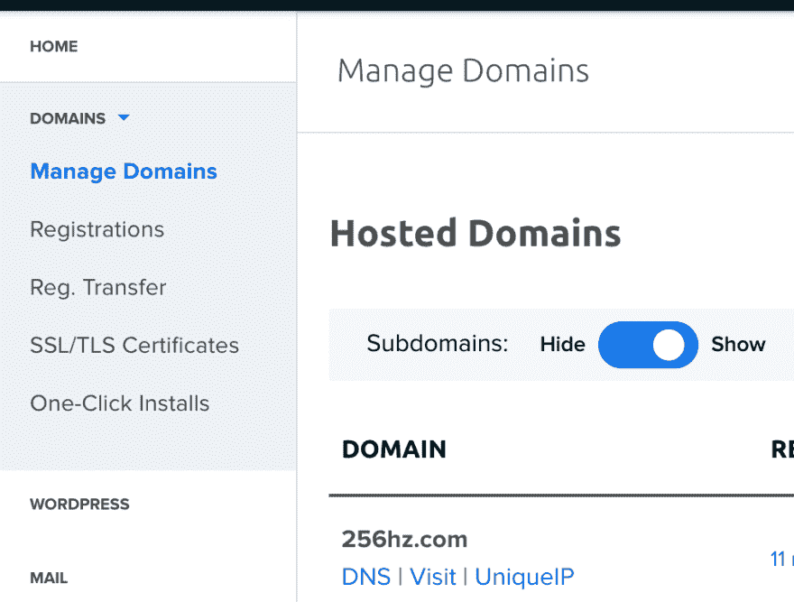
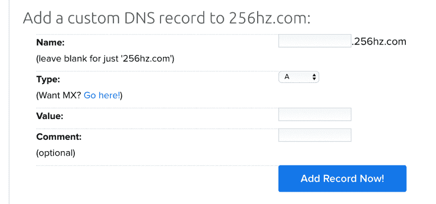
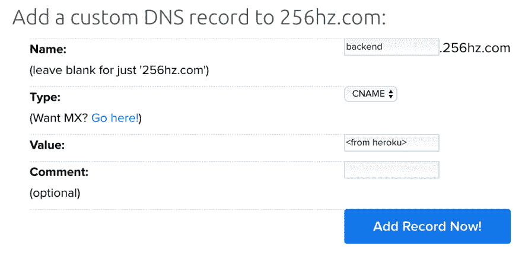
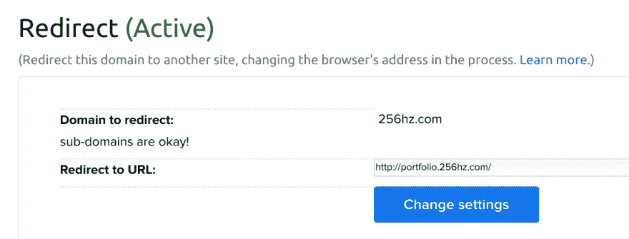

# 将两个回购应用程序部署到 Heroku 上的一个域

> 原文：<https://dev.to/256hz/deploying-a-two-repo-app-to-one-domain-on-heroku-2mhl>

所以！你遵循了良好的实践，并在独立的 Github repos 中保存了新 web 应用的前端和后端。(这很好，因为它模块化了你的项目，并且允许你，比方说，交换你的后端而不需要重新部署你的前端。)现在是时候展示你的全新发明了。然而，你想让你的后台保持公开，你想让它看起来更专业，把它托管在和你的前台相同的域中。这怎么可能呢？

这方面的基本理论将适用于任何主机，但由于 Heroku 的界面使这非常简单，我们将使用它作为一个例子。

### 第一步:初始部署

将两个回购部署到各自的 Heroku 应用程序。Heroku 有一个优秀的[指南](https://devcenter.heroku.com/articles/git)从命令行部署 Git，以及从 Docker 部署。此时，你为它们选择什么`.herokuapp`域并不重要，因为它们只对你可见。

### 第二步:获得一个域名

获取域名。注册商选择很多，大部分都是 GoDaddy。Namecheap 和 Domain.com 也出现了很多推荐。YMMV，DYOR。**重要提示:**确保您的选择支持添加自定义域名，特别是 CNAME 记录。

### 第三步:在 Heroku 上生成自定义 DNS 指针

现在是有趣的，也是出乎意料的简单的部分。转到你后端的 Heroku 仪表板。打开设置选项卡，向下滚动到域和证书。单击紫色的添加域按钮。这将打开以下对话框:

在这里，键入您拥有的域名的子域，例如`backend.yourdomain.com`。重要的是，它是一个子域，而不是根:CNAME 记录只能指向子域。

Heroku 自动生成唯一的 DNS 目标；将此复制到您的剪贴板。生成后，您的域部分将类似如下:

(我编辑了我的 DNS 目标，但那将是你的目标。)

### 第四步:将你的新域的域名指向这些记录

前往你的域名设置页面，寻找一个 DNS 区域。在我的主机中，看起来是这样的:

一旦你进入域名的 DNS 面板，你应该会看到一个添加自定义 DNS 记录的区域。

你应该这样填写:

确保`Name`字段与您在 Heroku 上生成的 DNS 记录的子域相匹配。`Type`应该是 CNAME。`Value`是你剪贴板中的那个，自动生成的长 DNS 指针地址。点击添加记录，你就可以走了！

如果您对 CNAMEs 不感兴趣，可以跳过下一部分。

### 中场休息:DNS 和 CNAME 记录的短暂转向

DNS 的存在是为了将字母和 unicode 等笨拙的人类事物转换成真实 IP 地址的可爱、干净的数字。这些记录存在于世界各地的许多服务器上，并由您的 ISP 缓存以加快查找时间。

不幸是，CNAMEs 的命名令人困惑——甚至可能很糟糕。CNAME 代表`Canonical NAME`。这意味着您正在更改指向您站点 IP 地址的记录的“规范名称”。*实际上是相反的*——你正在为你的站点的规范名称创建一个*别名*。哦好吧。DNS 社区中有传言称 CNAMEs 最终可能会被 ANAMEs 取代，ANAMEs 是准确命名为 `Alias NAME`的*记录。除了作为一个适当构造的标题，ANAME 本质上比 CNAME 更快:它在一个查询中服务于 IP，而不是 CNAME 的两个。如果只是为了命名惯例，我希望这成为标准。*

无论如何，现在，你几乎肯定会被 CNAMEs 困住，因为没有正式的命名标准，而且很少有主机提供它，如果他们提供，那将是他们自己的解释。事情是这样的。中场休息结束了，让我们继续我们的节目。

### 第五步:现在再做一遍

对您的前端重复步骤 3 和 4。不要重复步骤 5，因为这将触发无限循环。

### 第六步:等待

如果您阅读了上面的 DNS 部分，您会记得 DNS 记录存在于许多不同的地方，并且在许多不同的方案下被缓存。坦白地说，这是令人惊讶和美妙的，但对你来说，这意味着给 DNS 一秒钟来赶上你的变化。我发现我的 CNAME 变化发生得相当快——几分钟内——但有些变化可能需要几个小时，甚至一两天。运气好的话，你的经历会和我一样。

### 第七步:最终触摸

假设你想让访问者体验到只需要在根域中输入就可以进入你的项目。这很合理。你很幸运！只需将您的根域转发到您的前端子域。在我的主机中，这被简单地称为“重定向”。

这也不会花太长时间。

恭喜你！你现在在一个域下被完全托管和服务。现在有人可以看着你的网站，却不知道你做了多少艰苦的工作才达到这一步，我想这也是一直以来的想法。

你可以在[256hz.com](http://256hz.com)看到我的实现，它被重定向到[portfolio.256hz.com](http://portfolio.256hz.com)，后者又从[pgdb.256hz.com](http://pgdb.256hz.com)获得后端数据。

感谢阅读！如果你有任何困难，请留下评论，我会尽我所能帮助你。