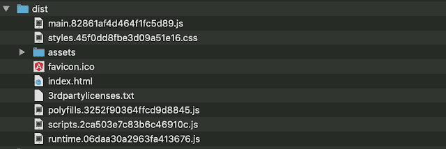
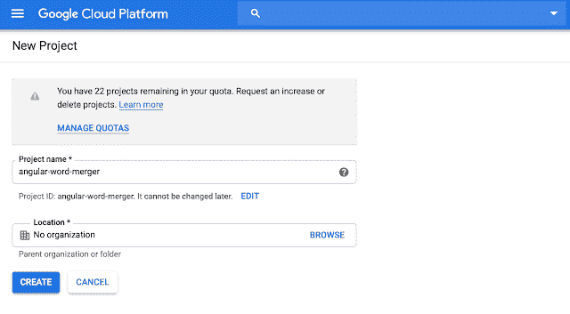
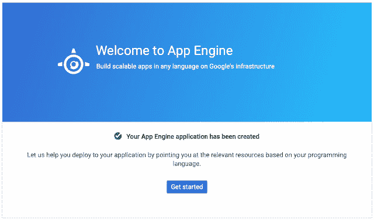

# 将 Angular 应用程序部署到 GCP

> 原文：<https://dev.to/siddb/deploying-angular-app-to-gcp-1dp2>

本文提供了将 Angular 应用程序部署到谷歌 GCP AppEngine 的步骤。

我将部署一个前端角应用程序([角字组合器](https://github.com/siddharthagit/angular-word-merger))不需要任何后端。

下图是我们将要部署的应用程序的截图。

[](https://1.bp.blogspot.com/-Ib0K1VJD0gU/XPtj3J4ws9I/AAAAAAAAAGk/bw6OLSErfGcMflm9ZeuL_xNGI323f4obQCLcBGAs/s1600/Screen%2BShot%2B2019-06-08%2Bat%2B12.29.09%2BAM.png)

Google 提供了两个选项来在 GCP 上部署您的应用程序

1.  谷歌应用引擎
2.  谷歌计算引擎

在这里，我将使用谷歌应用引擎来部署 Word-Combiner 应用程序。App Engine 是 Googles 部署应用程序的托管平台。App Engine 有两种版本标准版和定制版。我将使用应用引擎标准。

首先从 git repo 获取 Word 合并器 APP 到本地磁盘。

```
git clone https://github.com/siddharthagit/angular-word-merger.git 
```

Enter fullscreen mode Exit fullscreen mode

现在我们需要创建一个配置文件，Google Cloud App Engine 将使用它来部署项目。现在转到目录并添加 app.yaml 文件。文件名需要是 app.yaml

```
touch app.yaml 
```

Enter fullscreen mode Exit fullscreen mode

并粘贴以下内容。

```
# [START runtime]runtime: nodejs8handlers:- url: / static_files: dist/index.html upload: dist/index.html- url: / static_dir: dist# [END runtime] 
```

Enter fullscreen mode Exit fullscreen mode

现在我们需要构建 Angular 应用程序，以便它生成将被部署到应用程序引擎
的生产工件

```
ng build --prod 
```

Enter fullscreen mode Exit fullscreen mode

[](https://1.bp.blogspot.com/-H-zp63RwXdQ/XPtuATJcEAI/AAAAAAAAAGw/icnfZv5uyEktilczV9pFf_iDmHmYJFwvQCLcBGAs/s1600/Screen%2BShot%2B2019-06-08%2Bat%2B1.12.29%2BAM.png)

[](https://1.bp.blogspot.com/-8k4kEpnB4kc/XPtvIU2nAGI/AAAAAAAAAG4/OwRHzZmxuPcTSUFCnQyWUHUuzC9M0ZJyACLcBGAs/s1600/Screen%2BShot%2B2019-06-08%2Bat%2B1.17.23%2BAM.png) 
转到谷歌云控制台，用你的谷歌账号登录。为您的 angular 应用程序部署创建一个新项目，例如 angular-word-merger
[](https://1.bp.blogspot.com/-qL5js6g5g2E/XPtz_e27woI/AAAAAAAAAHE/MQz8ZQkzcyMsj1gG-PRBO56dVpjLYNDSgCLcBGAs/s1600/Screen%2BShot%2B2019-06-06%2Bat%2B10.19.05%2BPM.png)

[](https://1.bp.blogspot.com/-sO8pd5YlQwE/XPtz_wG0ixI/AAAAAAAAAHU/dqlVrUZZFHkWE2dE0ZtMwX86FsGnpgy2wCEwYBhgL/s1600/Screen%2BShot%2B2019-06-06%2Bat%2B10.49.35%2BPM.png) 
第二步，是安装 Google Cloud SDK。遵循 https://cloud.google.com/sdk/[的步骤，这样我们可以通过命令行部署我们的应用程序。对于 Mac，按照](https://cloud.google.com/sdk/)[https://cloud.google.com/sdk/docs/quickstart-macos](https://cloud.google.com/sdk/docs/quickstart-macos)中的说明在本地下载 SDK。

```
gcloud app deploy 
```

Enter fullscreen mode Exit fullscreen mode

[](https://1.bp.blogspot.com/-E1g1uX7rhdQ/XPt6odsirTI/AAAAAAAAAHc/C90HcdNVC5w6zZKLIiYbQ3H-Tklvk3BzgCLcBGAs/s1600/Screen%2BShot%2B2019-06-08%2Bat%2B2.06.01%2BAM.png)

现在，如果你去[https://angular-word-merger.appspot.com](https://angular-word-merger.appspot.com)，它应该会从 GCP 加载 Angular 应用程序。