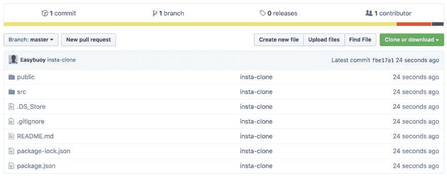
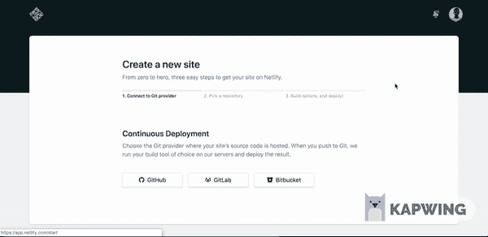
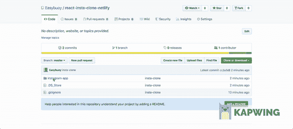
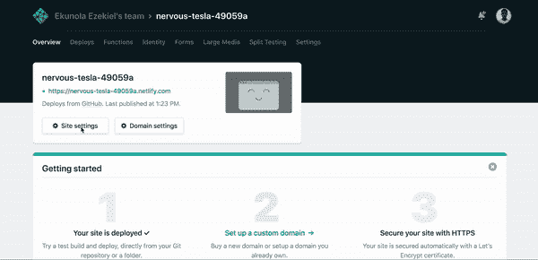

# 将 React 应用从 Github 部署到 Netlify

> 原文：<https://dev.to/easybuoy/deploying-react-app-from-github-to-netlify-3a9j>

我将做一个从 Github 到 Netlify 部署 React 应用程序的演练过程。

如果您有一个项目结构，其中 react 应用程序是**而不是**嵌套在子目录中，如下例所示

[](https://res.cloudinary.com/practicaldev/image/fetch/s--aBQI2dEM--/c_limit%2Cf_auto%2Cfl_progressive%2Cq_auto%2Cw_880/https://thepracticaldev.s3.amazonaws.com/i/k6m7qw5aru5yrr4hov8f.png)

您可以使用以下步骤进行部署:

*   将您的代码推送到 Github
*   将 Github 帐户连接到您的 Netlify 帐户
*   选择要部署的项目
*   部署项目

[](https://res.cloudinary.com/practicaldev/image/fetch/s--9M99r1KG--/c_limit%2Cf_auto%2Cfl_progressive%2Cq_66%2Cw_880/https://thepracticaldev.s3.amazonaws.com/i/ir0dx8e157r8y3kaj7a6.gif)

在 react 应用程序位于如下所示的嵌套目录中的情况下

[](https://res.cloudinary.com/practicaldev/image/fetch/s--Z3hrePXr--/c_limit%2Cf_auto%2Cfl_progressive%2Cq_66%2Cw_880/https://thepracticaldev.s3.amazonaws.com/i/9th5maami9dct1ttqhw7.gif)

将一个 **`netlify.toml`** 文件添加到项目的根目录下，并将下面的配置添加到该文件中。

```
[build]
  command = "npm run build"
  publish="path-to-react-app/build"
  base = "path-to-react-app" 
```

## React 路由器

如果您在项目中使用了 react-router，那么在重定向和重新加载到新的路由时，您可能会遇到 Netlify 会抛出错误(“未找到页面”)的问题，如下例所示

[](https://res.cloudinary.com/practicaldev/image/fetch/s--GL0JGnOm--/c_limit%2Cf_auto%2Cfl_progressive%2Cq_66%2Cw_880/https://thepracticaldev.s3.amazonaws.com/i/s1d1njph3hvj1q5o72zk.gif)

您可以将以下代码添加到您的`netlify.toml`文件中。

```
[[redirects]]
  from = "/*"
  to = "/index.html"
  status = 200 
```

添加后，将更改推送到 Github。Netlify 应该自动部署更改，否则，手动部署更改。部署后，您的应用程序应该不会抛出错误，如下所示。

[](https://res.cloudinary.com/practicaldev/image/fetch/s--_fFCnu5V--/c_limit%2Cf_auto%2Cfl_progressive%2Cq_66%2Cw_880/https://thepracticaldev.s3.amazonaws.com/i/zpi9ay3vqwe9kqk7gxtz.gif)

**注意:** *`netlify.toml`是一个配置文件，您可以在其中指定 Netlify 应该如何构建/运行您的应用程序。使用`netlify.toml`文件可以完成很多工作。在这里找到更多关于`netlify.toml`文件[的信息。](https://www.netlify.com/docs/netlify-toml-reference/)*

## 环境变量

如果您在项目中使用了环境变量，也可以按照下图所示的步骤将它们添加到 Netlify 中

[](https://res.cloudinary.com/practicaldev/image/fetch/s--2_X8xoAN--/c_limit%2Cf_auto%2Cfl_progressive%2Cq_66%2Cw_880/https://thepracticaldev.s3.amazonaws.com/i/wwt70a8li0bekdy9xg82.gif)

## 结论

从前面的内容中，我们已经看到并能够证明在 Netlify 上通过 Github 托管 react 应用程序是非常简单和无缝的，因此可以在很短的时间内完成。

如果您对本文有任何问题或反馈，请随时联系我们。
感谢阅读。