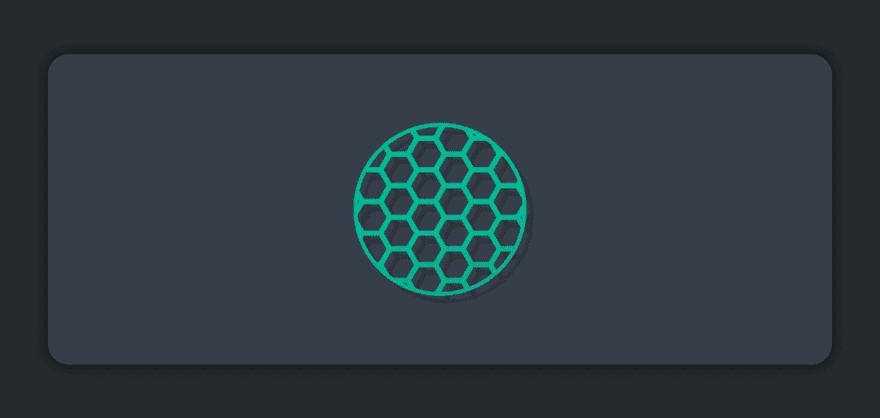
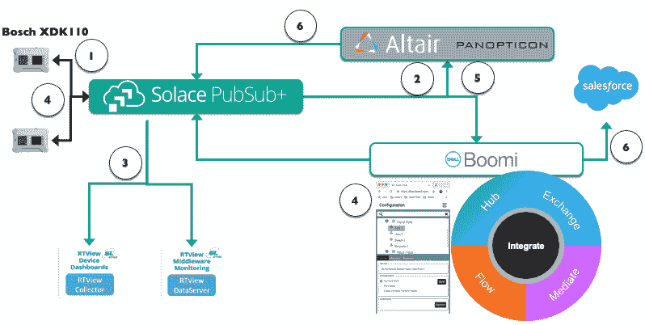
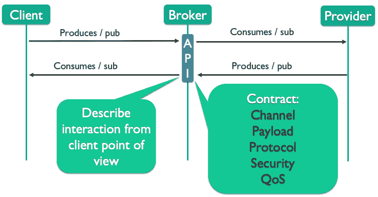
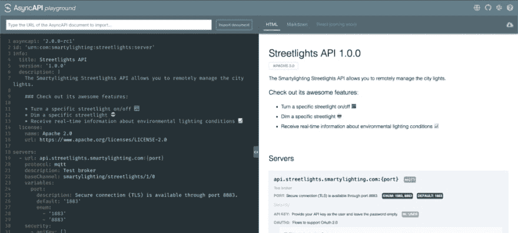

# 为物联网平台设计、记录和测试事件 API

> 原文：<https://dev.to/solacedevs/designing-documenting-and-testing-event-apis-for-iot-platforms-20j2>

[](https://res.cloudinary.com/practicaldev/image/fetch/s--0pzcUya7--/c_limit%2Cf_auto%2Cfl_progressive%2Cq_auto%2Cw_880/https://solace.com/wp-content/uploads/2019/03/DARK_Service-Mesh-Meet-Event-Mesh-.png)

在本文中，我们将深入探讨我们如何设计和记录我们的物联网参考平台的事件 API，我们在之前关于物联网平台原型制作的博文中概述了该平台。我们将:

*   描述平台组件之间的事件流
*   确定用例的核心 API
*   解释我们如何设计和记录事件 API，并提供完整设计和记录的示例和链接。
*   简要说明我们如何引入合作伙伴应用并测试应用

在整个项目中，我们开始采用 [AsyncAPI](https://www.asyncapi.com/) ，因此我们也将简要概述 AsyncAPI 和 Solace 的 [Event Horizon](https://solace.com/press-center/event-horizon/) 计划将如何最终提供完整的、工具支持的事件 API 生命周期管理。这里描述的 API 和工具可以在 [GitHub](https://github.com/solace-iot-team/iot-platform-api-docs) 上找到。

## 简介

在我们之前的帖子中，我们介绍了我们与几个合作伙伴一起构建的物联网参考平台。Solace 的事件网格连接了平台的所有组件。

[](https://solace.com/wp-content/uploads/2019/08/iot-prototype-blog-post_05-1.png)

我们必须确保我们和我们的合作伙伴的所有贡献都发挥作用，并且开发可以通过以下方式独立进行:

*   设计组件之间的契约
*   记录此合同
*   让合作伙伴加入活动网络
*   想出一个独立测试贡献的方法

换句话说，我们必须设计、记录和测试事件驱动的 API。

下图描述了我们平台组件之间的事件流:

1.  来自设备的传感器数据/遥测数据。
2.  这些数据由可视化分析工具——Altair Panopticon 消耗/处理。
3.  遥测技术也被输入到 SL 基于 RTView 的实时仪表板中。
4.  命令和配置事件从在 Dell Boomi 中实施的自定义用户命令和控制应用程序流向设备。
5.  配置事件发出状态变化的信号——这是分析系统感兴趣的。例如，将设备设置为比赛模式表示我们的老虎车赛道上的比赛开始。
6.  通知和警报基于数据分析创建，并用于在 Salesforce 中创建服务案例。

[](https://solace.com/wp-content/uploads/2019/08/iot-apis-blog-post_image-2.png)

看一下这个用例，我们确定了三个功能区域或 API:

*   **遥测**–与来自设备的传感器数据相关的一切
*   **命令&配置**–来自和发往设备的控制和状态消息
*   **通知**–可以被消费并用于生成操作的警报和通知事件

如您所见，我们将与设备的数据和控制通信分成了两个 API。这使我们能够通过物联网事件网格进行更细粒度的事件路由。

上图中的参与者分为两个不同的类别:

*   分布式设备–博世 XDK110
*   平台服务，包括分析、设备配置、仪表板和监控

与 REST/HTTP 相比，事件 API 中参与者的角色更难分类。在 REST 中，客户端发起请求，服务器提供响应，这种通信总是点对点的。事件 API 更加多样。它们本质上是双向的，支持发布/订阅和请求/回复消息交换。这使得分配客户端和服务器角色更加困难。

然而，我们仍然决定识别交互的客户端和服务提供者，并从客户端的角度描述类似于 REST APIs 的交互。我们将主题视为资源标识符，并将提供者角色分配给管理数据的参与者。

在设备交互的情况下，这意味着我们将设备识别为将数据推送到遥测资源的客户端，提供者从遥测资源消费事件并处理它们。对于配置数据，我们认为服务提供商是设备或配置管理应用程序，因为它负责维护配置并在发生变化时通知客户端(设备)。

## 如何设计事件驱动的 API？

在前面几节的基础上，我们确定了需要解决的事件 API 的以下方面:

*   **参与者**–客户和服务提供商
*   这些参与者就主题或队列进行交流
*   **交换模式**–发布、订阅、请求-响应
*   **意图或动词**–事件的意图是创建、更新还是删除？我们认为像 HTTP 请求方法一样包含动词是很重要的。
*   **有效载荷**–事件数据
*   **属性**如协议、服务质量、安全性。

如前所述，我们决定从客户的角度描述交互，提供者实现镜像这个交互。

[](https://solace.com/wp-content/uploads/2019/08/iot-apis-blog-post_image-3.png)

Solace PubSub+是一个多语言事件代理，我们为 showcase 利用了许多协议，如 MQTT、REST、SMF (Solace API)和基于客户或提供商首选技术 API 的 WebSockets。对于许多不同技术的快速集成来说，这是一个非常强大的特性，但是它也有缺点。这意味着我们只能依靠所有这些协议共享的事件特征来保持互操作性。

解决这个问题的典型方法是为封装消息头和有效负载的消息信封创建一个约定。然而，这也有一些基本的缺点。每个应用程序都需要解析有效负载来提取报头，然后才应用处理规则。这不仅在开发和维护方面代价高昂，在运行时也是如此，因为这通常会导致每条消息在系统中被解析多次。

另一种方法是利用细粒度的主题结构在运行时传递关于事件的所有必需信息。在实践中，这要求事件代理能够支持潜在的数百万个主题——这正是 Solace PubSub+ broker 的特性之一。这是我们在这里选择的方法。

本质上，主题成为传达元信息的方式，例如动词(或操作)、资源标识符和资源层次结构或预期的有效负载类型。

因此，我们需要为主题名称空间定义约定，并仔细设计这个名称空间。Solace PubSub+实现主题的方式有助于我们创建一个灵活且可扩展的名称空间。这篇[博文](https://solace.com/blog/solace-topics-vs-kafka-topics/)将 Solace 的主题实现与更传统的方法进行了对比，并对其进行了更详细的解释:

> “使用 Solace，主题实际上不是在代理上配置的:而是由发布应用程序在发布时定义的。它们可以被认为是消息的属性或元数据，而不像“写入文件”或“发送到目的地”。"每一条信息都可以用一个独特的主题发布."

这也是为什么很容易将额外的物联网设备委托到我们的解决方案中，这些设备可以立即就专门的主题进行通信，而无需额外的代理配置。

我们为主题名定义了以下约定(你可以在这个 [github 项目](https://github.com/solace-iot-team/iot-platform-api-docs/blob/master/topic.md)中找到更多的细节和例子):

```
{method}/{representation}/{base-topic}/{version}/{resource-categorization}/{resource}/{id}/{aspect} 
```

这个约定大致基于典型的 REST 资源标识符，并且还包含了一些在 REST 世界中通常通过 HTTP 头传递的信息:

*   **方法**–明确指出事件接收者应该采取的动作，如“创建”、“更新”和“替换”。相当于 HTTP 动词。
*   **表示**–使用的数据格式，如 JSON 或 XML
*   **基础主题**–类似于基础 URL
*   **版本**–API 版本
*   **资源分类**–这可以是分层位置、功能分类或类似分类
*   **资源**——如设备或物联网网关
*   **Id**–唯一的资源 Id
*   **方面**——如指标、状态、配置

因为我们将 JSON 标准化为有效载荷格式，并且不打算引入版本控制，所以我们从我们定义的主题中省略了这些项目。

对于发射遥测数据的设备，目的地主题看起来像这样:

```
CREATE/iot-control/bcw/solacebooth/handheld-solace/device/7bbb15d6-ca36-498a-9d52-7ddcef2a1d75/metrics 
```

有了这些，我们开始描述我们的 API 设计。我们为此使用了异步 API，这是一种类似于 REST 世界中的开放 API 的举措。

让我们快速浏览一下遥测 API 中定义的通道和消息。

它定义了一个通道，客户端——设备——应该将事件发布到该通道(参见下面摘录中的“发布”定义)。客户端的目的是创建一个新的遥测事件，因此使用的动词是“创建”。你会认识到上面概述的主题设计。资源分类和设备 id 的元素被定义为通道中的参数:

```
channels: CREATE/iot-event/{region}/{location}/{production-line}/device/{deviceId}/metrics: description: Topic to subscribe to connected events parameters: - $ref: '#/components/parameters/region' - $ref: '#/components/parameters/location' - $ref: '#/components/parameters/production-line' - $ref: '#/components/parameters/deviceId' publish: summary: device publishes sensor readings. each event represents a new (create) reading for the timestamp. operationId: publishTelemetry message: $ref: '#/components/messages/telemetryMessage' 
```

通过此信道传输的遥测信息已在上文中提及，您可以在组件部分看到它是如何定义的。

```
components: messages: telemetryMessage: name: telemetryMessage title: Telemetry Message summary: Telemetry Message description: "Depending on the mode of the device, the telemetry message can contain all of the sensor readings or only a partial set. For units and ranges please see the datasheet for the XDK. You can find it on this site: https://xdk.bosch-connectivity.com" contentType: application/json payload: $ref: "#/components/schemas/telemetryEvent" schemas: telemetryEvent: type: array items: type: object title: Telemetry Reading/Sample 
```

components 部分还使用 JSON Schema 定义模式和参数。

我们创建的第二个 API 用于设备接收命令和配置事件。

使用主题层次结构很重要，它允许我们针对生产线、位置或区域上的特定设备或一组设备。为了实现这一点，我们设计了一组主题(或频道),这些主题遵循我们的设计惯例，并为每个设备和设备组创建一个独特的主题。

这是渠道层次结构的摘录，它逐个剥离了分类的元素，以解决更高层次的群体。您可以看到，设备订阅了许多主题，同样，这些主题不需要预先在代理上定义，代理支持使用数百万个主题。

```
channels: UPDATE/iot-control/{region}/{location}/{production-line}/device/{deviceId}/configuration: description: device subscribes to configuration events. each event represents an update to the existing configuration. parameters: - $ref: '#/components/parameters/region' - $ref: '#/components/parameters/location' - $ref: '#/components/parameters/production-line' - $ref: '#/components/parameters/deviceId' subscribe: summary: Subscribe to device specific configuration events operationId: subscribeDeviceConfiguration message: $ref: '#/components/messages/configurationMessage' UPDATE/iot-control/{region}/{location}/{production-line}/device/configuration: description: device subscribes to configuration events. each event represents an update to the existing configuration. parameters: - $ref: '#/components/parameters/region' - $ref: '#/components/parameters/location' - $ref: '#/components/parameters/production-line' subscribe: summary: Subscribe to production line specific configuration events operationId: subscribeProductionLineConfiguration message: $ref: '#/components/messages/configurationMessage' 
```

您可以在 GitHub 上找到所有三个 API 的完整定义:

*   [遥测 API](https://github.com/solace-iot-team/iot-platform-api-docs/blob/master/api-definitions/iot-event.yml)
*   [命令&配置 API](https://github.com/solace-iot-team/iot-platform-api-docs/blob/master/api-definitions/iot-command-configuration.yml)
*   [通知 API](https://github.com/solace-iot-team/iot-platform-api-docs/blob/master/api-definitions/notification-api.yml)

这些看起来不太舒服，所以让我们看看如何创建 HTML 或 Markdown 文档。

## 文档

我们首先在内部维基上手工制作文档。然而，随着 AsyncAPI 的发展，它成为了维护 API 设计和根据需要生成文档的最佳选择。我们已经在 GitHub 上以 markdown 格式发布了完整的文档[,所以它呈现得非常好。](https://github.com/solace-iot-team/iot-platform-api-docs)

AsyncAPI 工具仍处于早期阶段，但是我们发现他们基于模板的生成器工具非常有用。它带有 HTML 和 Markdown 模板。

您可以在 [AsyncAPI playground](https://playground.asyncapi.io/?utm_source=editor&utm_medium=editor-topbar&utm_campaign=playground) 上探索如何为即将发布的 2.0.0 规范设计和创建不同的文档格式。

它加载了一个示例 API:

[](https://solace.com/wp-content/uploads/2019/08/iot-apis-blog-post_image-4.png)

让我们直接从 GitHub 加载一个 API 定义:

*   复制这个网址[https://raw . githubusercontent . com/solace-IOT-team/IOT-platform-API-docs/master/API-definitions/IOT-event . yml](https://raw.githubusercontent.com/solace-iot-team/iot-platform-api-docs/master/api-definitions/iot-event.yml)
*   将此 URL 粘贴到显示“键入 AsyncAPI 的 URL…”的文本框中，然后单击“导入文档”:

[](https://solace.com/wp-content/uploads/2019/08/iot-apis-blog-post_image-5.png)

您可以在 HTML 和 markdown 之间切换不同的视图。AsyncAPI 生成器允许您以类似于这个 web 工具的方式自动生成文档，作为构建过程的一部分。

要详细探索我们的三个 API，从 GitHub 上的[自述文件开始。](https://github.com/solace-iot-team/iot-platform-api-docs)

## 入职

我们手动将应用程序装载到 PubSub+平台上。API 客户端或提供者的加入需要以下步骤:

*   为每个应用程序创建访问控制列表(ACL ): ACL 提供对主题的访问，应用程序使用一个或多个 API，需要根据 API 定义发布和订阅这些主题。未来的增强可能是直接从异步 API 定义中生成这些 ACL 配置文件。
*   为要注册的应用程序创建一个客户端用户名。目前，Solace 支持用户名/密码和客户端证书认证。利用外部授权服务器的 OAuth 支持将很快发布。

在 Solace，我们正在准备自动化这一过程:

*   事件门户–将提供应用程序生命周期功能，将上述信息提供给 Solace 事件网格。请阅读“下一步是什么？”下面的部分。
*   一组物联网 API，可简化与设备管理平台的集成，并提供将设备类型和设备配置到事件网格中的功能。这将作为我们物联网实验室存储库的一部分发布。

## API 测试

正如在本系列的[前一篇博文中所描述的，我们主要使用 MQTT Box 来测试 API。在未来，我们可能能够使用 AsyncAPI 生成器来生成存根应用程序，并在此基础上构建自动化测试——与文档生成相比，在编写代码生成模板时，其成熟度较低，因此我们的项目认为采用这种方法不可行。](https://dev.to/solacedevs/rapid-iot-prototyping-with-the-bosch-xdk110-and-an-event-mesh-374p-temp-slug-4334168)

## 接下来是什么？

Solace 最近宣布了其[事件视界](https://solace.com/press-center/event-horizon/)计划，旨在围绕事件 API 创建一个类似于同步 API/REST 体验的开发者体验和生态系统。

第一步将是一个事件门户，它支持事件的创建和发现以及事件驱动的应用程序接口的定义。Solace 还为 Spring CloudStreams 和 AsyncAPI 等框架做出了贡献，为 CloudStreams 添加了代码生成器，这将加速事件 API 的实现并有助于测试。

在物联网领域，我们将为设备管理和物联网平台集成添加更多开源功能。随着我们在 Azure IoT Hub 和 Azure Sphere 等其他平台上添加更多原型和示例，我们还将发展这篇博客文章中描述的物联网 API。

## 结论

开发原型展示的一个关键因素是预先设计我们的事件驱动物联网 API，类似于使用 REST APIs 的合同优先开发。通过确保我们使用的主题结构/名称空间是灵活的和可扩展的，我们避免了有效负载自省，并为每个订户实现了细粒度和灵活的过滤。

我们遵循典型的 API 管理生命周期来设计和记录我们的物联网 API，直至应用和测试的启动。事实证明，AsyncAPI 在设计和文档阶段非常有用。随着 Solace 事件门户、AsyncAPI 和代码生成器的发展，整个 API 生命周期最终将得到工具的支持。

下一篇文章(即将发表)将关注我们为 Bosch XDK110 开发的定制 RTOS C 应用程序的实现，该应用程序实现了这里描述的设备 API。

敬请期待！

帖子[为物联网平台](https://solace.com/blog/designing-event-apis-iot-platforms/)设计、记录和测试事件 API 最先出现在 [Solace](https://solace.com) 上。