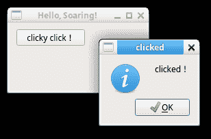

# 使用 Python 的桌面窗口、按钮和点击

> 原文：<https://dev.to/petercour/desktop-window-button-click-with-python-31k5>

Python 应用不需要只有命令行。你可以创建桌面软件。程序员语言:图形用户界面(GUI)

那你是怎么做的呢？你需要使用一个模块。有几个模块像 tkinter，wxwidgets，pyqt。PyQt 是个不错的选择。

如果你知道面向对象的编程概念，这是非常容易的。如果没有，请查看下面的参考资料。

所以让我们做一个桌面应用程序，但是对于现代桌面

[](https://i.giphy.com/media/iKHUw8sPI9ZZMpDQbW/giphy.gif)

### 举例

下面的程序创建了一个带有按钮的桌面窗口。如果您点击该按钮，将显示一个弹出窗口(QMessageBox)。在这个类中，我们设置了一些窗口属性。

```
#!/usr/bin/python3
from PyQt5 import QtCore
from PyQt5.QtWidgets import *

class MainWindow(QMainWindow):
    def __init__(self, name, title):
        super(MainWindow, self).__init__()
        self.w = 0
        self.h = 0
        self.init_ui(name, title)

    def init_ui(self, name, title):
        self.w = 200
        self.h = 100
        self.setObjectName(name)
        self.setWindowTitle(title) 
        self.resize(self.w, self.h) 

        self.btn_clickme = QPushButton(self)
        self.btn_clickme.setGeometry(QtCore.QRect(10, 10, 100, 24))
        self.btn_clickme.setObjectName('click_me')
        self.btn_clickme.setText('clicky click！')
        self.btn_clickme.clicked.connect(self.do_something)

    def do_something(self):
        QMessageBox.information(self, 'clicked', 'clicked！')

if __name__ == '__main__':
    import sys
    app = QApplication(sys.argv)
    n = 'Hello'
    t = 'Hello, Soaring!'
    ex = MainWindow(n, t)
    ex.show()
    sys.exit(app.exec_()) 
```

结果是:

[](https://res.cloudinary.com/practicaldev/image/fetch/s--c-newuBt--/c_limit%2Cf_auto%2Cfl_progressive%2Cq_auto%2Cw_880/https://thepracticaldev.s3.amazonaws.com/i/hfsjkbicdce2z1cqscc2.png)

资源:

*   [基础 PyQt 教程](https://pythonprogramminglanguage.com/pyqt-tutorials)
*   [完成 PyQT 课程&很多例子](https://gumroad.com/l/pysqtsamples)
*   [Python 教程](https://pythonbasics.org)