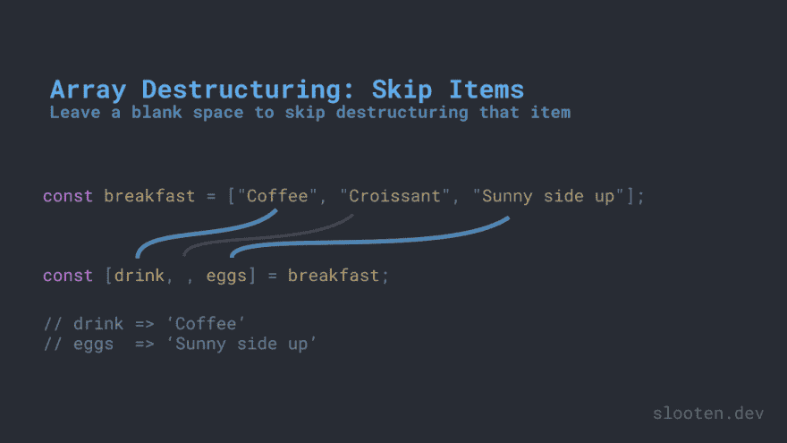

# 在 JavaScript 中析构数组

> 原文：<https://dev.to/marcoslooten/destructuring-arrays-in-javascript-2dih>

*这篇帖子也发表在我的网站[https://Marcos looten . com/blog/destructing-arrays-in-JavaScript/](https://marcoslooten.com/blog/destructuring-arrays-in-javascript/)*

您可能会遇到这样的情况，您希望将一些数组值存储在单独的变量中。听起来很简单，可能会想到类似`const secondValue = array[1]`的东西。但是我们有一种不同的方法:解构。这是一个更干净的语法，比旧的方法更简单，也更短。让我们看看我们能用析构做些什么。

## 给变量赋值

假设我们有一个包含以下元素的数组(这些元素总是按照相同的顺序排列):

```
const breakfast = ["Coffee", "Croissant", "Sunny side up"] 
```

Enter fullscreen mode Exit fullscreen mode

我们需要将这些值存储在单独的变量中，以便以后使用。“老”的方法是使用条目的索引，比如:

```
const drink = breakfast[0];
const bread = breakfast[1];
const eggs = breakfast[2];
// drink => 'Coffee'
// bread => 'Croissant'
// eggs => 'Sunny side up' 
```

Enter fullscreen mode Exit fullscreen mode

这并不太糟糕，也没有什么问题，只是数组析构更干净，更灵活，你可能会看到越来越多的代码使用析构语法。看看这个一行程序:

```
const [drink, bread, eggs] = breakfast;
// drink => 'Coffee'
// bread => 'Croissant'
// eggs => 'Sunny side up' 
```

Enter fullscreen mode Exit fullscreen mode

代码更少，可读性更好。你在一个数组中声明和赋值你的新变量，因为你在析构一个数组。第一个数组值将被赋给第一个变量，依此类推。

## 只给变量分配一些项

当然，我们并不总是希望使用数组中的所有内容。如果我们只需要前两项，很容易省略最后一个变量声明，只给两个变量赋值。但是如果你想要第一个和第三个值，跳过第二个呢？请看这个省略了一些值的例子:

```
const [drink, bread] = breakfast;
// drink => 'Coffee'
// bread => 'Croissant'

const [drink, , eggs] = breakfast;
// drink => 'Coffee'
// eggs => 'Sunny side up' 
```

Enter fullscreen mode Exit fullscreen mode

为了跳过一个元素，你可以跳过变量的声明和赋值。在第一种情况下，这很难看到，因为第一个元素也是前两个数组项。但实际上和`const [drink, bread, ] = breakfast;`是一样的，换句话说，通过在数组中有一个空的点来跳过最后一项。在第二个例子中，它更加清晰，因为我们跳过了中间的元素。一开始看起来有点奇怪，但是你会很快习惯的。

此图像可以帮助您直观地看到在析构中跳过的项目:

[](https://res.cloudinary.com/practicaldev/image/fetch/s--xWTeQhdY--/c_limit%2Cf_auto%2Cfl_progressive%2Cq_auto%2Cw_880/https://thepracticaldev.s3.amazonaws.com/i/8anuamfqq7v5gplvul44.png)

## 分配一些物品，保留其余的

最后，如果我们有很多数组项，我们需要前三个数组项，但是还想将其余的数组项保存在一个变量中以备后用，该怎么办？假设我们又有一个数组，包含同样的三个项目，还包含您点早餐的时间、为您点餐的服务员、总价和您的桌数:

`const breakfast = ["Coffee", "Croissant", "Sunny side up", "08:38", "Sally", 9.15, 7];`

我们希望有三个变量，前三项各有一个。我们也需要剩下的，但是没有前三项。我们也不关心将值存储在单独的变量中。在这种情况下，我们可以使用 rest 运算符(三个点:...):

```
const [drink, bread, eggs, ...meta] = breakfast;
// drink => 'Coffee'
// bread => 'Croissant'
// eggs => 'Sunny side up'
// meta => ["08:38", "Sally", 9.15, 7] 
```

Enter fullscreen mode Exit fullscreen mode

所以现在，常量“meta”将包含原始数组中所有未被析构为各自变量的剩余值的数组。rest 操作符和使用它的变量需要是析构中的最后一项。你可以在这里看到它:

[](https://res.cloudinary.com/practicaldev/image/fetch/s--Zbz70G_K--/c_limit%2Cf_auto%2Cfl_progressive%2Cq_auto%2Cw_880/https://thepracticaldev.s3.amazonaws.com/i/gatlzj7mlanizblem5e7.png)

## 奖金

额外收获:你也可以用析构来交换变量:

```
let x = 10;
let y = 20;

[x, y] = [y, x]
// x => 20
// y => 10 
```

Enter fullscreen mode Exit fullscreen mode

## 重述

这里有一个数组析构的快速备忘单:

```
 // Assigning array items to variables
const [a, b, c] = [123, 'second', true];
// a => 123
// b => 'second'
// c => true

// Skipping items
const [,b,] = [123, 'second', true];
// b => 'second'

// Assigning the first values, storing the rest together
const [a,b, ...rest] = [123, 'second', true, false, 42];
// a => 123
// b => 'second'
// rest => [true, false, 42]

// Swapping variables
let x = true;
let y = false;
[x, y] = [y, x]
// x => false
// y => true 
```

Enter fullscreen mode Exit fullscreen mode

想要了解此类文章的最新动态吗？请订阅我在[marcoslooten.com](https://marcoslooten.com/)的简讯。