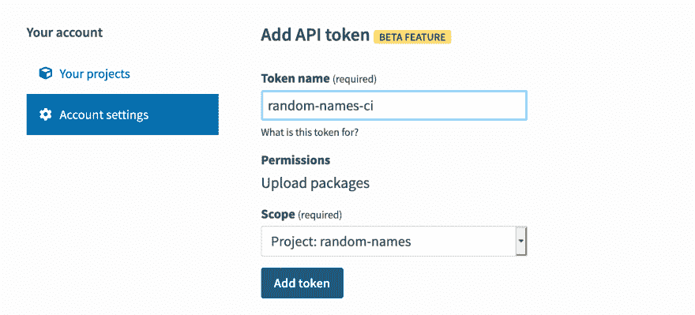
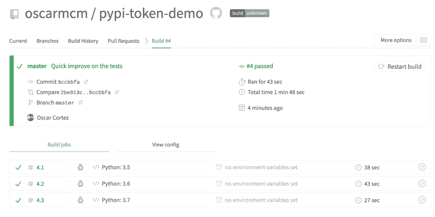
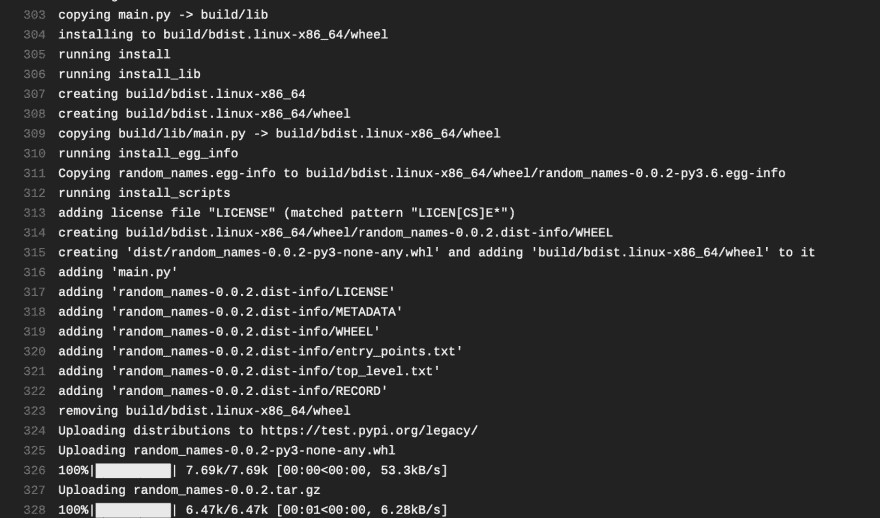

# 在 TravisCI 中使用 API 令牌分发 PyPI 包

> 原文：<https://dev.to/oscarmcm/distributing-pypi-packages-using-api-tokens-in-travisci-1n9i>

*PyPI* 包索引是使 **Python** 如此强大的工具之一，只需一个简单的命令，你就可以访问数千个很酷的库，为你的项目做好准备。

编写 **Python** 包并将它们部署到 *PyPI* 是开源社区共享库的一种方式。对于初学者来说，向 *PyPI* 提交一个包不是一件容易的事情，但是社区正在努力工作，为了使这个过程更容易，你可以阅读更多关于打包的内容，遵循官方 [Python 打包指南](https://packaging.python.org/tutorials/packaging-projects/)。

在这篇文章中，我将跳过一些关于打包的事情/步骤，并指导您在 *PyPI* 中使用最新的 [API 令牌](http://pyfound.blogspot.com/2019/07/pypi-now-supports-uploading-via-api.html)特性，用于您的持续集成和部署(CI/CD)。

为此，我们将使用 [PyPI 测试](https://test.pypi.org/)实例，这是在你的包中进行初始测试的更好选择，比如:测试文档是否正确呈现，或者你的`setup.py`中的[分类器](https://pypi.org/classifiers/)是否正确。

## 使用特拉维斯词

成功构建后， *Travis CI* 可以自动释放你的 **Python** 包到 *PyPI* 。对于最小配置，您可以在您的`.travis.yml`文件中使用下面的代码:

```
deploy:
  provider: pypi
  user: "Your  username"
  password: "Your  password" 
```

然而，正如你可能注意到的，这会将你的 *PyPI* 密码公之于众，这是一个坏主意。Travis 推荐的是加密密码或将凭证保存为 Travis 环境变量，你可以在 [Travis 部署文档](https://docs.travis-ci.com/user/deployment/pypi/)上了解更多信息。

### 获取 PyPI 令牌

所以，第一件要做的事，就是去[https://test.pypi.org/](https://test.pypi.org/)创建一个账户(如果你没有)或登录，之后，我们将需要我们的 *API 令牌*。如何获得？进入你的 *PyPI* 账户设置，选择“添加 API 令牌”。当您创建 API 令牌时，您可以选择它的范围:您可以创建一个令牌，用于上传到您维护或拥有的所有项目，或者您可以将其范围限制为一个项目。

[](https://res.cloudinary.com/practicaldev/image/fetch/s--tYjUCxjj--/c_limit%2Cf_auto%2Cfl_progressive%2Cq_auto%2Cw_880/https://thepracticaldev.s3.amazonaws.com/i/js4fdwiifbvbyvstc8zo.png)

### 如何使用代币

当将包上传到 *PyPI* 时，API 令牌提供了另一种认证方式(而不是用户名和密码)。

这些 API 令牌只能用于将包上传到 PyPI，而不是更一般的登录，因为复制令牌的窃贼将无法删除项目、删除旧版本或添加/删除合作者。

正如您在下面的截图中看到的，我已经成功地在 PyPI 上手动部署了演示项目的第一个版本:

[](https://res.cloudinary.com/practicaldev/image/fetch/s--7LnZ-eSM--/c_limit%2Cf_auto%2Cfl_progressive%2Cq_auto%2Cw_880/https://thepracticaldev.s3.amazonaws.com/i/xz68e9fukw7icfkui8a5.png)

现在我们需要为这个项目启用*特拉维斯*，所以转到并启用它，之后我们必须更改我们的`.travis.yml`文件中的以下内容:

*   将用户名设置为`__token__`。
*   将密码设置为令牌值，包括`pypi-`前缀。

为了更加安全，我们将把令牌存储为环境变量，转到 https://travis-ci.org/的**//设置**，现在我们的`.travis.yml`文件将如下所示:

```
deploy:
  provider: pypi
  user: __token__
  password: $TEST_PYPI_TOKEN
  server: https://test.pypi.org/legacy/
  distributions: "sdist  bdist_wheel"
  on:
    branch: staging
    condition: $TRAVIS_PYTHON_VERSION = "3.6" 
```

现在，每当我们将代码推送到*试运行*分支时， *Travis* 将触发自动部署到 *PyPI* 测试实例。对代码库做一些小的改动，更改`setup.py`版本号，然后推送到 *staging* 分支， *Travis* 将触发构建，如果一切正常，将新版本部署到 *PyPI* 。

[](https://res.cloudinary.com/practicaldev/image/fetch/s--FN3skg1A--/c_limit%2Cf_auto%2Cfl_progressive%2Cq_auto%2Cw_880/https://thepracticaldev.s3.amazonaws.com/i/j0n1h21o1ulv7in5rl86.png)

我们可以检查构建日志来查看部署过程是否正确启动:

[](https://res.cloudinary.com/practicaldev/image/fetch/s--Lqk_bq-x--/c_limit%2Cf_auto%2Cfl_progressive%2Cq_auto%2Cw_880/https://thepracticaldev.s3.amazonaws.com/i/hf1p4lgjx9aaqfsqf64y.png)

瞧，在第 *271* 行上，我们看到部署流程已启动，如果您展开该行，您可以看到以下日志:

[](https://res.cloudinary.com/practicaldev/image/fetch/s--HI4bPNNw--/c_limit%2Cf_auto%2Cfl_progressive%2Cq_auto%2Cw_880/https://thepracticaldev.s3.amazonaws.com/i/in5rcm8ljalsyfk8zvpy.png)

这意味着我们的新版本上传正确，现在我们可以在 *PyPI* 中看到它，使用新的 API 令牌与 *Travis* 一起自动部署:

[](https://res.cloudinary.com/practicaldev/image/fetch/s--RotIaiCq--/c_limit%2Cf_auto%2Cfl_progressive%2Cq_auto%2Cw_880/https://thepracticaldev.s3.amazonaws.com/i/ityi3uscghk93qsf7m98.png)

## 结论

这是 Python 包索引的一大进步，增加了新的多种特性的安全性，并减少了所有使其难以工作的特性，对于 **Python** 社区来说，这要感谢[打包工作组](https://wiki.python.org/psf/PackagingWG)和[开放技术基金](https://pyfound.blogspot.com/2019/03/commencing-security-accessibility-and.html)的资助。

你可以在官方的 [PSF 博客](http://pyfound.blogspot.com/2019/07/pypi-now-supports-uploading-via-api.html)上阅读更多关于 API 令牌的内容，或者帮助测试这个 [beta 特性](https://wiki.python.org/psf/WarehousePackageMaintainerTesting)。如果你想看这篇文章的西班牙语版本，你可以在[我的博客](https://oscarmcm.com/essays/2019/distributing-packages-via-pypi-tokens)上找到。源代码也可以在 GitHub 上获得[。](https://github.com/oscarmcm/pypi-token-demo)

就是这样！从这里你可以自动发布新的包版本，所以让我们开始吧，发布一些东西到 *PyPI* 🐍。

感谢 [@Darwing1210](https://twitter.com/Darwing1210/) 和 [@guadamzjj](https://twitter.com/guadamzjj/) 审阅本文。

来自🇳🇮.的❤️