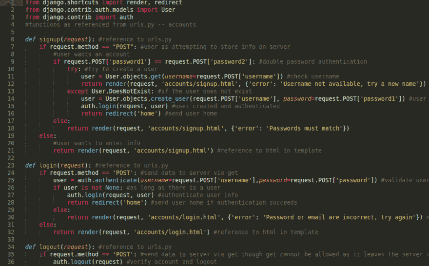
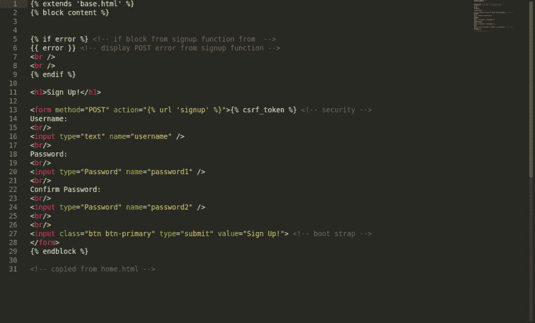

# Django 用户授权

> 原文：<https://dev.to/wesleyruede/django-user-auth-19b3>

今天我学习了 Django 的用户认证。其中有相当多的内容，所以我想我应该列出代码来与大家分享。
[T3】](https://res.cloudinary.com/practicaldev/image/fetch/s--TTW-_feu--/c_limit%2Cf_auto%2Cfl_progressive%2Cq_auto%2Cw_880/https://thepracticaldev.s3.amazonaws.com/i/08l25ddyhaxmnhmrpsew.png)

此外，这是一个用于发布数据的表单，因为 GET 是不安全的。一个人可以创建一个没有限制的用户名，绕过所有的安全措施。感谢 Kyle Agronick，他让我意识到，为了逻辑清晰，展示前端是必要的。这里是用户输入用户名和密码的地方:

正如你所看到的，我已经经历并记录了几乎所有的事情。这很容易理解。如果你有兴趣看到这段代码并理解我所经历的步骤，去看看回购:[https://github.com/wesley-ruede/product-hunt](https://github.com/wesley-ruede/product-hunt)

在设置中，你会发现我已经完成了开发用户认证的过程。祝大家编码愉快，并有美好的一天！