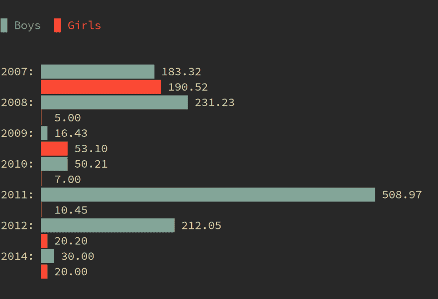

# 用 Python 在终端中绘制图形

> 原文：<https://dev.to/petercour/draws-graphs-in-the-terminal-with-python-31cg>

[](https://res.cloudinary.com/practicaldev/image/fetch/s--FNrUH7ao--/c_limit%2Cf_auto%2Cfl_progressive%2Cq_66%2Cw_880/https://thumbs.gfycat.com/AnguishedWeepyBluebottlejellyfish-small.gif)

如果您是高级 Linux 或 Mac 用户，您可能会经常使用该终端。

有时候你运行的**终端命令**会显示一个**进度条**。

像这样:

[](https://res.cloudinary.com/practicaldev/image/fetch/s--4zdY8FrK--/c_limit%2Cf_auto%2Cfl_progressive%2Cq_auto%2Cw_880/https://user-images.githubusercontent.com/45363/43405623-1a2cc4d4-93cf-11e8-8c96-b7134d8986a2.png)

想知道如何在终端中显示进度条吗？

您可以用[术语图](https://github.com/mkaz/termgraph)

如果您有这样一个简单的数据文件:

```
# Example Data Set 1
2007    183.32
2008    231.23
2009     16.43
2010     50.21
2011    508.97
2012    212.05
2014 1.0 
```

然后你可以这样画出来:

```
~  ~/.local/bin/termgraph data.txt

2007: ▇▇▇▇▇▇▇▇▇▇▇▇▇▇▇▇▇▇ 183.32
2008: ▇▇▇▇▇▇▇▇▇▇▇▇▇▇▇▇▇▇▇▇▇▇ 231.23
2009: ▇ 16.43
2010: ▇▇▇▇ 50.21
2011: ▇▇▇▇▇▇▇▇▇▇▇▇▇▇▇▇▇▇▇▇▇▇▇▇▇▇▇▇▇▇▇▇▇▇▇▇▇▇▇▇▇▇▇▇▇▇▇▇▇▇ 508.97
2012: ▇▇▇▇▇▇▇▇▇▇▇▇▇▇▇▇▇▇▇▇ 212.05
2014: ▏ 1.00 
```

## 来自 Python

是的，您希望从代码中实现这一点！

您可以像这样使用 Python 中的这个模块:

```
from termgraph import termgraph as tg

labels = ['2007', '2008', '2009', '2010', '2011', '2012', '2014']
data = [[183.32, 190.52], [231.23, 5.0], [16.43, 53.1], [50.21, 7.0], [508.97, 10.45], [212.05, 20.2], [30.0, 20.0]]
normal_data = [[48.059508408796894, 50.0], [60.971862871927556, 0.0],
               [3.080530401034929, 12.963561880120743],
               [12.184670116429496, 0.5390254420008624],
               [135.82632600258734, 1.4688443294523499],
               [55.802608883139285, 4.096593359206555],
               [6.737818025010781, 4.042690815006468]]
len_categories = 2
args = {'filename': 'data/ex4.dat', 'title': None, 'width': 50,
        'format': '{:<5.2f}', 'suffix': '', 'no_labels': True,
        'color': None, 'vertical': False, 'stacked': True,
        'different_scale': False, 'calendar': False,
        'start_dt': None, 'custom_tick': '', 'delim': '',
        'verbose': False, 'version': False}
colors = [91, 94]
tg.stacked_graph(labels, data, normal_data, len_categories, args, colors) 
```

更多信息:

*   [https://github . com/mkaz/term graph/blob/master/tests/test _ term graph . py](https://github.com/mkaz/termgraph/blob/master/tests/test_termgraph.py)
*   [https://pythonbasics.org/](https://pythonbasics.org/)
*   [https://pythonprogramminglanguage.com/](https://pythonprogramminglanguage.com/)