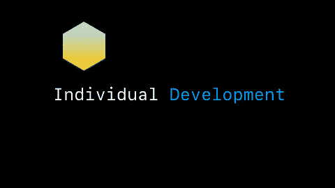

# 易于使用的微服务

> 原文：<https://dev.to/sendilkumarn/easy-microservices-with-kubernetes-and-istio-3nl3>

# 微服务很棒

[](https://res.cloudinary.com/practicaldev/image/fetch/s--NDvNDR3G--/c_limit%2Cf_auto%2Cfl_progressive%2Cq_66%2Cw_880/https://thepracticaldev.s3.amazonaws.com/i/kzmv4pbxxjgzy6yq5ztk.gif)

他们制作你的申请

*   模块化和松散耦合
*   更快的开发和更高的生产率
*   个人部署
*   粒状结垢
*   故障隔离

# 但是微服务维护起来很痛苦

由于有如此多的移动组件，微服务很难维护和识别瓶颈。

> 微服务将问题从应用程序内部转移到它们之间的层。

这使得出现问题时更难解决。因为网络并不总是理想的。

[](https://res.cloudinary.com/practicaldev/image/fetch/s--4GYR64Wm--/c_limit%2Cf_auto%2Cfl_progressive%2Cq_66%2Cw_880/https://thepracticaldev.s3.amazonaws.com/i/vgm0nt4ntdxt5s5vs0tj.gif)

此外，当我们为失败或混乱设计应用程序时，需要改变思维模式。

这导致了新的问题:

## 连接

将应用程序开发为微服务意味着。这些应用被分成多个小/微/纳米/宏服务。这些服务应该能够在任何地方运行。但是为了工作，这些服务应该相互通信。

这些小型服务应该相互连接。他们应该知道其他服务在哪里，以及如何与它们连接。即使服务运行不同的版本，它们也应该是兼容的。

它们应该是一致的和高度可用的。连接应该是智能的和可配置的。

## 安全

这些服务应该是安全的。对它们的请求应该得到适当的授权和认证。

服务之间的流量应该加密，这可以防止中间人攻击。对任何服务的请求都应该进行适当的审核。

## 控制

我们需要即时控制服务，就像只向一组客户和其他人提供新功能一样。每次当我们改变版本(升级或降级)时，我们不应该打开和关闭服务。相反，只需动态地启用和禁用它们，让您的最终用户看不到它们。

## 监视器

因为这些服务是自动伸缩的，所以监控或观察它们是很重要的。观察它们是否有任何问题、错误、异常、请求和响应之间的时间延迟。一旦我们发现这些瓶颈，我们应该能够快速修复和推出新版本。

虽然有许多新的应用程序、项目和产品被创建来解决微服务的问题。但是仍然保持高可用性、弹性和可靠性是很难解决的。

## Istio——游戏改变者。

不需要在每个服务中安装或配置组件。相反，它与您的服务一起独立运行。(是的，你没听错，它是单独运行的)*

[](https://res.cloudinary.com/practicaldev/image/fetch/s--nz5cNq0W--/c_limit%2Cf_auto%2Cfl_progressive%2Cq_66%2Cw_880/https://thepracticaldev.s3.amazonaws.com/i/k98aev7acha6paenctxl.gif)

> Istio 可以轻松地创建一个部署了负载平衡、服务到服务认证、监控等服务的网络，而无需对服务代码进行任何更改。— [Istio](https://istio.io)

Istio 有助于解决这些问题。Istio 帮助

*   在服务之间自动负载平衡[流量](https://istio.io/docs/concepts/what-is-istio/#traffic-management)
*   配置和[控制](https://istio.io/docs/reference/config/policy-and-telemetry/)服务之间的路由
*   提供认证和授权来保护这些服务
*   自动度量、日志和跟踪收集到[观察](https://istio.io/docs/concepts/what-is-istio/#observability)这些服务

最棒的是，你不需要改变现有的服务。Istio 是独立于平台的，可以在各种环境中运行。—点击查看 Istio 建筑

> *这里的单独是指它们不在您的应用程序中，而是单独运行。

# 代码代码代码

说够了，让我们谈谈代码。

我们将使用 [Kotlin Hipster](https://github.com/jhipster/jhipster-kotlin) 来生成应用程序。

KHipster 是在 [JHipster](https://jhipster.tech) 的基础上建造的。有了 KHipster，生成微服务不再是一件痛苦的事情。这是生成基于 Kotlin + Angular / React / Vue 的健壮微服务的简单快捷的方法。

> K(J)Hipster 是一个开发平台，用于生成、开发和部署 Spring Boot + Angular/React Web 应用程序和 Spring 微服务。

我们今天要做什么，

*   使用 hipster 生成微服务
*   为生成的 KHipster 微服务应用程序生成 Kubernetes & Istio 配置文件
*   代码走查
*   把它们部署在 GCP 上。(技术上在任何 Kubernetes 集群上)

# 用 KHipster 生成微服务

用 KHipster 生成微服务非常简单容易。让我们创建一个 JDL (JHipster 领域特定语言)文件。

```
$ mkdir hello-istio
$ cd hello-istio
$ touch app.jdl 
```

输入以下内容:

```
// Gateway application
application {
    config {
        baseName gateway,
        applicationType gateway,
        clientFramework react,
        serviceDiscoveryType no
    }
}

// Microservice Application 1
application {
    config {
        baseName application1,
        applicationType  microservice,
        serviceDiscoveryType no,
    }
} 
```

通过安装 KHipster(这是一个 NPM 库)来生成应用程序。)

```
$ npm install -g generator-jhipster-kotlin 
```

安装后运行`khipster import-jdl application.jdl`。

就这样，我们准备好了微服务应用。你可以在应用程序中添加实体，更多内容请点击这里查看关于 [JDL](https://www.jhipster.tech/jdl/) 和 [JDL 样本](https://github.com/jhipster/jdl-samples)的更详细指南。

# 生成 Kubernetes & Istio 配置文件

在`hello-istio`文件夹中创建一个新文件夹`k8s`。

```
$ khipster kubernetes 
```

注意:它会检查您是否安装了 Docker，因为我们需要 Docker 来创建和推送图像，并在以后使用它们。

与其他 KHipster / JHipster 命令一样，这将询问您一系列问题。让我们来回答这些问题。

让我们选择第一个问题的微服务应用。

```
? Which *type* of application would you like to dep?
    Monolithic Application
  > Microservice Application 
```

下一个问题是链接您必须为其生成配置文件的应用程序。如果你遵循这个示例文件夹结构，只需使用默认路径，否则(感谢你是有创造力的✨)使用你的微服务应用的文件夹。

```
? Enter the root directory where your gateway(s) and microservices are located (../) 
```

下一个问题是在这里选择各自的微服务应用。

```
? Which applications do you want to include in your configuration? (Press <space> to select, <a> to toggle all, <i> to invert selection)
❯◯ application1
 ◯ gateway 
```

由于微服务需要监控，这有助于开发人员和运营人员了解发生了什么以及故障在哪里。

JHipster 提供两种选择，一种是我们自己的 JHipster 控制台。另一个是普罗米修斯。出于这个例子的目的，我不会选择任何一个。

```
Do you want to set up monitoring for your applications? (Use arrow keys)
❯ No
  Yes, for logs and metrics with the JHipster Console (based on ELK and Zipkin)
  Yes, for metrics only with Prometheus (only compatible with JHipster >= v3.12) 
```

下一个问题是关于 Kubernetes 名称空间，让我们为此选择默认值。

```
? What should we use for the Kubernetes namespace? (default) 
```

因为我们需要创建一个 Docker 映像并将其推入 Docker 存储库。下一个问题是 Docker 存储库的名称。

```
? What should we use for the base Docker repository name? sendilkumarn 
```

让我们使用 docker push 命令推送 Docker 图像。

```
? What command should we use for push Docker image to the repository? (docker push) 
```

接下来的问题是我们是否需要配置 Istio。这里有三个选项供你选择。

*   根本没有 Istio
*   手动边车注射。
*   使用标签的自动边车注射

那么`Manual / Automatic sidecar injection`有什么区别呢？

*   在手动的情况下，部署箱规格被修改为具有边车相关的细节。
*   在自动化的情况下，边车在 pod 创建时注入。

让我们选择，自动注射。因此，我们不必担心在每个部署中添加这一点。

注:检查这里的详细信息边车注射。

```
? Do you want to configure Istio? (Use arrow keys)
  Not required
  Manual sidecar injection (ensure istioctl in $PATH)
❯ Label tag namespace as an automatic injection is already configured 
```

路由和负载平衡是 Istio 提供的最酷的特性之一。

它们位于您的服务之外，控制将请求路由到服务，并在服务或服务的各种版本之间对请求进行负载平衡。

下一个问题是我们是否需要生成 Istio 路由文件。让我们为路由文件选择 Yes。

```
? Do you want to generate Istio route files?
  No
❯ Yes 
```

路由文件帮助您配置路由请求、设置请求超时、切换到 Https、控制流量、断路和健康检查。

下一个问题是边缘服务的服务类型。让我们为此使用入口。

```
? Choose the kubernetes service type for your edge services
  LoadBalancer - Let a kubernetes cloud provider automatically assign an IP
  NodePort - expose the services to a random port (30000 - 32767) on all cluster nodes
❯ Ingress - create ingresses for your services. Requires a running ingress controller 
```

这里有三种选择

*   **负载平衡器** —这将为服务创建一个外部 IP，您可以使用该 IP 访问应用程序。
*   **节点端口** —这将使用集群 IP 并通过静态端口公开服务。
*   **入口** —这是一组允许服务入站连接的规则。

既然我们已经选择了`Ingress`，下一个问题就是说一个我们可以用来路由服务的 DNS。如果您有域名，您可以在这里使用它，否则在这里给出一个虚拟条目，并更改您的 etc/hosts 文件以匹配 IP 和域名。

```
? What is the root FQDN for your ingress services (e.g. example.com, sub.domain.co, www.10.10.10.10.xip.io, [namespace.ip]...)? (default.192.168.99.100.nip.io) sendilkumarn.com 
```

如果您没有 DNS，那么编辑您的`/etc/hosts`文件以得到这个，

```
x.x.x.x  sendilkumarn.com 
```

# 代码演练

是时候让🕰检查一下 KHipster 产生了什么。

```
.
├── README.md
├── application1
│   ├── application1-deployment.yml
│   ├── application1-destination-rule.yml
│   ├── application1-mysql.yml
│   ├── application1-service.yml
│   ├── application1-virtual-service.yml
│   └── jwt-secret.yml
├── gateway
│   ├── gateway-deployment.yml
│   ├── gateway-destination-rule.yml
│   ├── gateway-gateway.yml
│   ├── gateway-mysql.yml
│   ├── gateway-service.yml
│   ├── gateway-virtual-service.yml
│   └── jwt-secret.yml
├── istio
│   ├── grafana-gateway.yml
│   ├── jaeger-gateway.yml
│   └── kiali-gateway.yml
└── kubectl-apply.sh 
```

*   `application1`文件夹包含微服务应用的配置文件
*   `gateway`文件夹包含微服务网关的配置文件
*   `istio`文件夹包含 Istio 网关的配置文件
*   `kubectl-apply.sh`是一个将所有服务一起部署的 bash 脚本

在网关文件夹中，

`gate-deployment.yaml`包含网关应用部署的应用配置。

`gate-destination-rule.yml`包含与负载平衡和连接超时相关的网络定义。

```
apiVersion: networking.istio.io/v1alpha3
kind: DestinationRule
metadata:
  name: gateway-destinationrule
  namespace: default
spec:
  host: gateway
  trafficPolicy:
    loadBalancer:
      simple: RANDOM
    connectionPool:
      tcp:
        maxConnections: 30
        connectTimeout: 100ms
      http:
        http1MaxPendingRequests: 10
        http2MaxRequests: 100
        maxRequestsPerConnection: 10
        maxRetries: 5
    outlierDetection:
      consecutiveErrors: 5
      interval: 30s
      baseEjectionTime: 60s
  subsets:
    - name: v1
      labels:
        version: 'v1' 
```

在规范中，我们将主机称为门户应用程序。

然后我们定义交通政策

负载平衡器可以是简单的，也可以是一致的

简单—预配置。默认情况下，它支持

*   一系列
*   最小连接
*   随意
*   经历

我们在这里选择了随机。Istio 团队建议，如果我们没有任何健康配置，随机比循环更好。它检查健康的服务，并将请求路由到它。欲了解更多信息，请点击此处

`gateway-gateway.yml`包含了`Istio’s Ingress gateway`的配置。这将位于 Istio 创建的服务网格的边缘。它配置公开的端口和协议，并帮助连接到底层服务。

```
apiVersion: networking.istio.io/v1alpha3
kind: Gateway
metadata:
  name: gateway-gateway
  namespace: default
  labels:
    gateway: gateway-gateway
    istio: ingressgateway
spec:
  selector:
    istio: ingressgateway
  servers:
    - port:
        number: 80
        name: http
        protocol: HTTP
      hosts:
        - gateway.sendilkumarn.com
    - port:
        number: 80
        name: http2
        protocol: HTTP2
      hosts:
        - gateway.sendilkumarn.com
---
apiVersion: networking.istio.io/v1alpha3
kind: VirtualService
metadata:
  name: gateway-gw-virtualservice
  namespace: default
  labels:
    service: gateway-gw-virtualservice
spec:
  hosts:
    - gateway.sendilkumarn.com
  gateways:
    - gateway-gateway
  http:
    - match:
        - uri:
            prefix: /application1/
      route:
        - destination:
            host: application1
    - match:
        - uri:
            prefix: /
      route:
        - destination:
            host: gateway 
```

请注意，配置文件中的主机基于我们提供的 DNS 名称。这使得整个应用程序易于通过浏览器访问。

配置文件中还定义了一个虚拟服务。因为 Istio 中的入口网关不包含任何流量路由配置(这与 Kubernetes 所做的正好相反)。这里的虚拟服务有助于实现流量路由。

`gate-service.yml`包含微服务网关服务的配置。

`gate-mysql.yml`包含了`MySQL Database`的配置。(根据您在生成应用程序时选择的生产数据库，此文件可能会有所不同。)

`gate-virtual-service.yaml`包含虚拟服务的配置，有助于在网格中路由请求。

```
apiVersion: networking.istio.io/v1alpha3
kind: VirtualService
metadata:
  name: gateway-virtualservice
  namespace: default
spec:
  hosts:
    - gateway
  http:
    - route:
        - destination:
            host: gateway
            subset: 'v1'
          weight: 100
      retries:
        attempts: 3
        perTryTimeout: 2s 
```

同样，我们也为微服务应用提供了相同的配置。

Istio 文件夹包含将在`istio-system`名称空间内运行的服务的一些网关。

*   **-分析和监控**
***   **-端到端分布式追踪*****   **-服务网状可观测性&配置******

 ******哇，配置文件真多。但是 KHipster/ JHipster 让你的工作变得容易多了。`KHipster FTW`。

# 将应用程序部署到 GCP

现在有趣的部分是将生成的应用程序部署到运行在 Google Cloud 中的 Google Kubernetes 引擎上。

登录 Google Cloud 控制台，你可以创建一个新项目，也可以使用现有的项目。我用过的项目是`amazing-istio`

一旦创建了项目。在项目中创建一个 Kubernetes 集群。

安装[谷歌云 SDK](https://cloud.google.com/sdk/install) 。

```
gcloud container clusters create hello-istio --region=us-central1-a --machine-type=n1-standard-2 --num-nodes=8  --cluster-version=1.12.7-gke.22 
```

这里我们使用 gcloud 工具创建一个集群，集群名为`hello-istio`。在区域`us-central1-a`中，机器类型为`n1-standard-2`(根据需要选择)，节点数量为`8`。

上面的命令将启动 8 个节点，Kubernetes 集群。对于我们来说，玩这个简单的微服务应用程序绰绰有余。

另外，请注意— cluster-version 参数，它将 Kubernetes 集群设置为`version 1.12.7-gke.22`。

> 注意:如果你想改变这里的任何东西，请随意更改。
> 
> 您还可以使用 UI 来生成集群。

您的群集需要一段时间才能启动。让我们去拿一个☕️和一个🍪。

一旦集群启动并运行，让我们从您的云 shell(或)终端连接到集群。

```
gcloud container clusters get-credentials hello-istio --zone us-central1-a --project amazing-istio 
```

下一步，设置群集的管理权限。打开您的云 shell(或)终端，然后使用以下命令启用管理权限。

```
kubectl create clusterrolebinding cluster-admin-binding --clusterrole=cluster-admin --user=$(gcloud config get-value core/account) 
```

现在是在 Kubernetes 集群内部安装`Istio`的时候了。

最简单的安装方法是下载最新的 Istio

```
curl -L https://git.io/getLatestIstio | sh - 
```

它获取最新的 Istio 源。然后将 Istio 添加到路径中。

```
export PATH="$PATH:/home/<username>/istio-x.x.x/bin" 
```

> 检查 Kubernetes 版本与 Istio 版本的兼容性。

安装 Istio 要求的 CRDs

```
for i in istio-x.x.x/install/kubernetes/helm/istio-init/files/crd*yaml; do kubectl apply -f $i; done 
```

现在应用`istio-demo.yaml`文件在集群中创建 Istio 相关的东西。这将在集群中创建一个`istio-system`名称空间，并在集群中安装所有必需的组件。

```
kubectl apply -f istio-x.x.x/install/kubernetes/istio-demo.yaml 
```

您可以通过运行
来检查使用和安装情况

```
kubectl get pods -n istio-system 
```

这将显示在`istio-system`名称空间中运行的 pod 列表。

现在让我们转到本地生成的 K8s 配置文件，并开始部署它们。

当 KHipster/JHipster Kubernetes 完工时。据说它丢失了一些 docker 图片。现在我们必须创建 Docker 映像并将其推送到 Docker 存储库。然后，我们可以使用 Kubernetes 集群获取这些图像，并将其部署到 GCP。

要构建 Docker 映像，请在微服务网关和应用程序文件夹中运行以下命令。

```
./mvnw verify -Pprod dockerfile:build 
```

然后，我们必须标记构建的 Docker 映像，并将其推入 Docker 存储库。

```
docker image tag gate <docker-repo-name>/gateway
docker image push <docker-repo-name>/gateway
docker image tag gate <docker-repo-name>/application1 
docker image push <docker-repo-name>/application1 
```

一旦完成，前往 k8s 文件夹并运行

> 注意:如果您没有将集群连接到本地终端，请执行以下命令

```
$ gcloud container clusters get-credentials hello-istio --zone us-central1-a --project <your project name> 
```

```
$ ./kubectl-apply.sh 
```

这将把所有的服务和数据库部署到 Kubernetes 集群中。太好了，你已经把你的棒极了的微服务应用和 Istio 一起部署到 GKE 的 GCP 上了。

前往`gate.sendilkumarn.com (or) any URL`检查应用程序是否启动并运行。

祝贺🎉🎉🎉🎉。

> 如果这是你的第一次申请，请分享你的故事。

现在，您所需要的是考虑制作您的应用程序，而 JHipster 使您可以轻松地创建、开发和部署您的想法到产品中。

你可以在推特上关注我。

如果你喜欢这篇文章，请留下赞或评论。❤️******