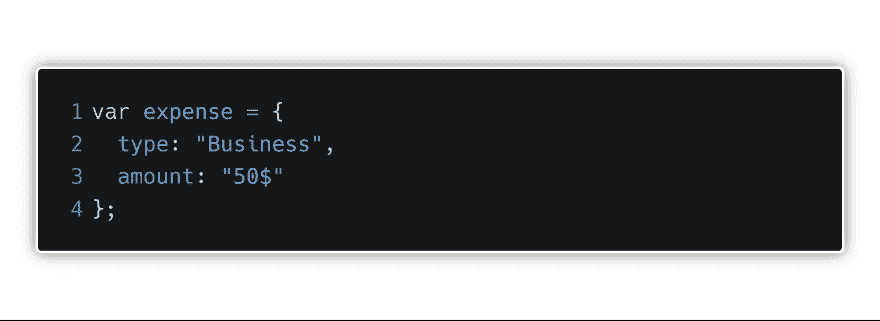
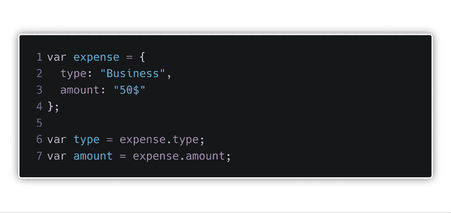
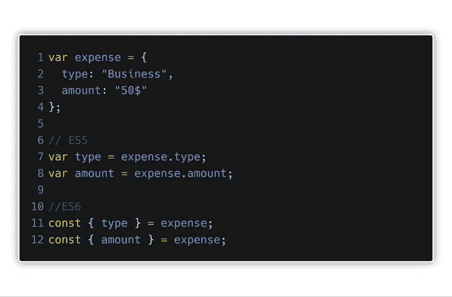
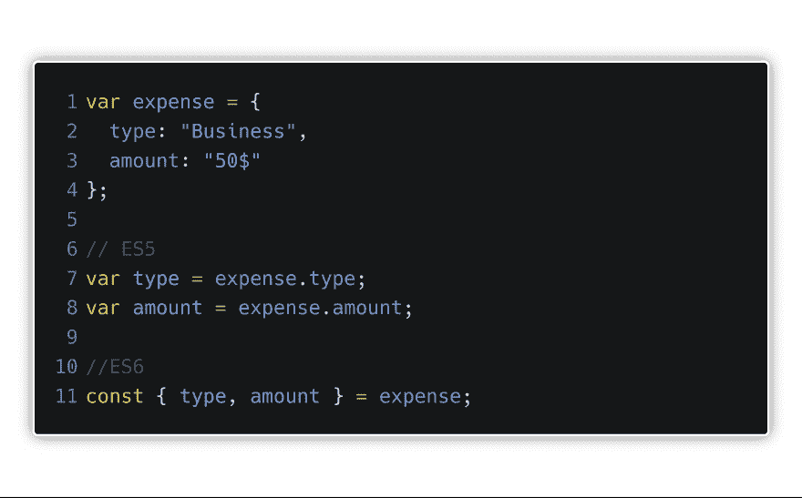
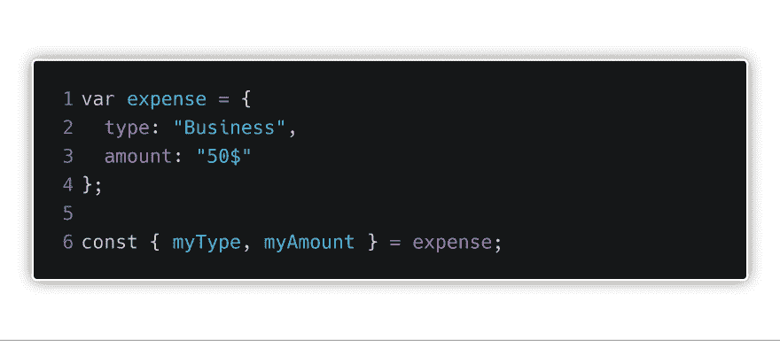
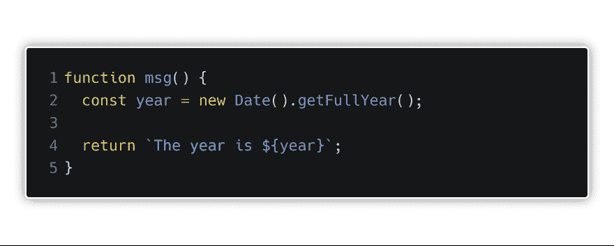
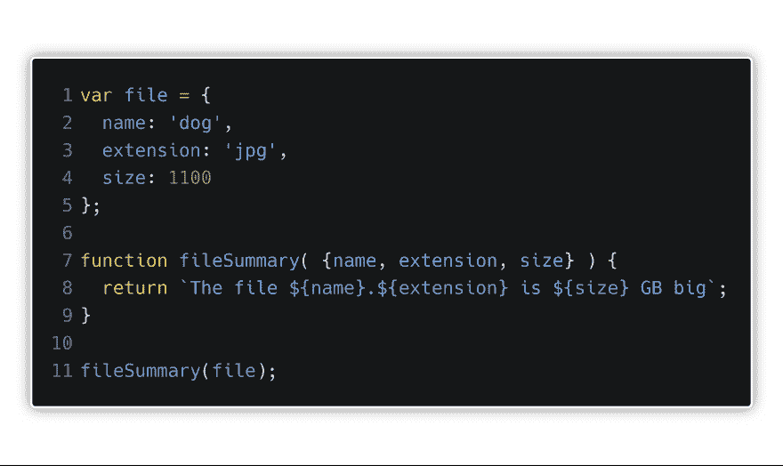
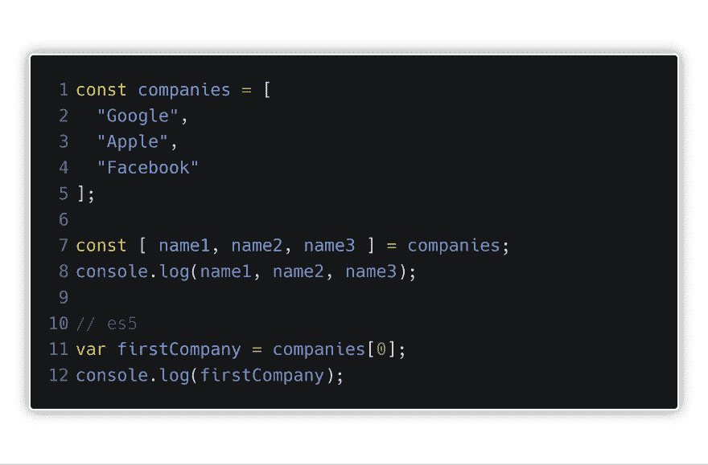
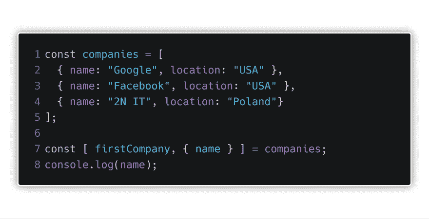

# 面向初学者的 ES6 第 6 部分(析构、模板字符串)

> 原文：<https://dev.to/2nit/es6-for-beginners-part-6-destructuring-template-strings-2cbc>

这是 ES6 教程的第六部分，由我们的 dev Bartosz 创建。所有之前的部分你都可以在这里找到:)。

## 解构

在本文中，我们将从使用 ES5 语法的代码开始。

想象一下，我们在项目的某个地方有这样一个简单的代码。现在，在我们代码的后面，我们要引用我们的对象并从中提取一些数据。我们可能会这样做。一个简单的点符号允许我们从对象中获取数据。

这是一个好方法吗？当然了。我们能做得更好吗？从 ES6 开始，就有办法了。你可能经常听说 DRY，意思是不要重复自己。在上面的例子中，正如你自己所看到的，我们重复了几次。两个**变量**，两个**费用**，两个**类型**，两个**金额**。这是 ES6 方便我们简化编写的地方。

我们用 ES6 写的和之前用的完全一样。这种写法意味着我们要从 expanse 对象中提取出 **type** 和 **amount** ，然后将它们赋给同名的 **const** 变量。我们必须记住，我们需要通过使用相同的变量名来准确地指定我们想要引用的内容。但是上面的例子中不是还有重复的吗？当然有。所以让我们进一步修改我们的代码。

如你所见，我们完全去掉了重复的部分。让我们检查一下控制台是否一切正常。

酷毙了。如果现在有效，那么如果我们把变量的名字改成另一个对象中不存在的名字，会有效吗？

不幸的是，但是不行。这种约定清楚地表明，变量名必须与它在对象中的名称相同。但是如果我们真的真的要用不同的变量名称呢？嗯，也有一个解决方案，但尝试自己解决它(一个小提示，使用冒号和新变量的名称)。

使用**析构**我们还能做什么？例如，我们可以提取传递给函数的参数。我们将从上面使用 ES5 编写的脚本开始。

好的，等一下。这个符号是什么？！这里我们正在处理 ES6 的另一个特性，**模板字符串**。

## 模板字符串

暂时我们将让**析构**来看看什么是模板字符串。
**模板字符串**，或者其他**模板文字**，只不过是 JavaScript 中的语法糖。这里，我们还会用两个例子。第一个可能是你以前用 JavaScript 做过的事情。

我们都预料到了这一点。然而，问题又一次出现了，你是否能写得更优雅一点。答案再次是你可以。

一切正常。此外，我们不必将自己局限于**年**变量。我们可以把任何表情放在 **{ }** 里。如果我们希望接收前一年的数据，只需将其更改为**{第一年}** ，以此类推。有可能它不够明显，但是我们使用反勾号来编写模板字符串。我们可以在数字 **1** 旁边的键盘上找到它们(在左边)。你只需要知道这些。它并不复杂，而且我认为它通常有助于提高代码的可读性。

## 解构

我们回到上一个例子。

如果我们知道**模板字符串**是什么，我们可以更进一步。接下来我们要做什么？当然，我们试图使用**析构**来使我们的代码更漂亮。

一切再次正常工作。而不是每次我们想引用一个对象的属性时都写下它的名字。你需要做的就是用一个参数调用函数，这个参数就是对象。在函数中，我们将传递我们想要在主体中引用的属性。一切都很美好，但是缩短代码并不是使用**析构**的唯一目的。经常使用数组的**析构**。当我们在**析构**对象时，我们正在获取属性。**析构数组**是关于分离单个元素。

下面是使用**析构**的另一种方法。数组和对象的**析构**的区别在于 **{ }** 被 **[ ]** 取代了。我鼓励每个人现在都尝试一下。之后，我们将看看**析构**数组和对象的混合。

在上面的例子中，我们有一个包含 3 个对象的数组。我们知道使用**析构**我们可以从第一个和第二个中提取数据。现在让我们看看它是怎么做的。
当然，我们从数组开始，因为它在我们的对象之外。**firstelementoarray**将是我们的第一个对象，在第一个 console.log 中，当然，我们会取回整个对象。如果我们添加到这个 **{ }** 并将名称**firstelementoarray**更改为一个对象的属性名称，在我们的例子中是**名称**，我们将获得它的值。简单吧？如果我们想访问该名称，但其他公司，我们会这样做，在以下方式。

它可能看起来有点混乱，但它并没有那么复杂。让我们从头开始。一开始，由于对象是“外部”，我们从 **{ }** 开始。现在，为了获得 location 属性，我们必须键入具有相同名称的变量，即 location **{ location }** 。这样，我们将得到所有的值，即 **[“美国”、“波兰”、“德国”]** 。然而，当我们的目标是只获得**【美国】**时，我们必须再次使用**析构**，**{ locations:[location one]}**。这样，我们就能进入谷歌的第一个位置。在这里我也鼓励你去玩...休息。

谢谢大家阅读:)。在 nex 的帖子中，我将讨论**异步 javascript** 。非常感谢您的所有反馈:)。