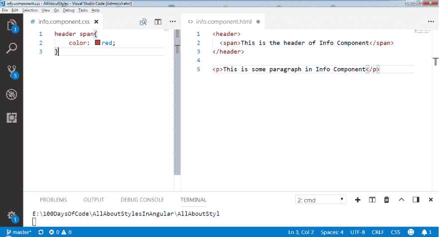
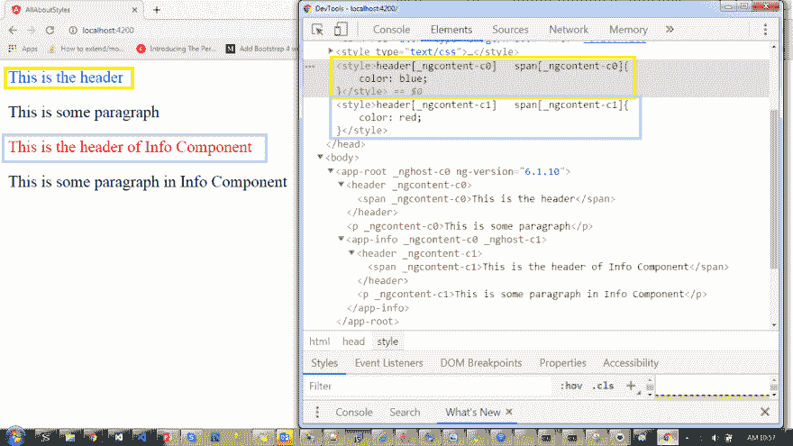

# 关于 Angular 风格你应该知道的一切

> 原文：<https://dev.to/themeticulist/everything-you-should-know-about-styles-in-angular-12ab>

### 在本文中我们将谈到

1.  如何在 Angular 中给组件添加样式。
2.  角度的全局样式。
3.  什么是*视图封装*属性，它如何影响组件样式。

所以让我们开始吧！！！

### **构件样式中的棱角**

为了理解这一点，让我们快速创建一个角度应用程序。
`> ng new StylesInNg`

下面是`app.component.html`和它的`css`文件。向该组件的`span`元素添加了蓝色样式。

[](https://res.cloudinary.com/practicaldev/image/fetch/s--XXTaZg9R--/c_limit%2Cf_auto%2Cfl_progressive%2Cq_auto%2Cw_880/https://thepracticaldev.s3.amazonaws.com/i/2vs9hlz2rb5ml6sgrbau.png)

现在，让我们添加另一个组件，做同样的事情，除了，而不是蓝色，这次让我们添加红色。

[](https://res.cloudinary.com/practicaldev/image/fetch/s--fCSUJbtJ--/c_limit%2Cf_auto%2Cfl_progressive%2Cq_auto%2Cw_880/https://thepracticaldev.s3.amazonaws.com/i/or1u8nnmhg3i3txskoni.png)

这是它在浏览器中的样子。

[](https://res.cloudinary.com/practicaldev/image/fetch/s--L9mrz0xv--/c_limit%2Cf_auto%2Cfl_progressive%2Cq_auto%2Cw_880/https://thepracticaldev.s3.amazonaws.com/i/v8gj4kibsneyqh8v6pxn.png)

看，`app.component`标题跨度元素是蓝色的，`info.component`标题跨度元素是红色的。
现在在同一张图片中观察他们的风格。

```
 <style>header[_ngcontent-c0]   span[_ngcontent-c0]{
    color: blue;
}</style>

<style>header[_ngcontent-c1]   span[_ngcontent-c1]{
    color: red;
}</style>

<app-root _nghost-c0="" ng-version="6.1.10">
  <header _ngcontent-c0="">
    <span _ngcontent-c0="">This is the header</span>
  </header>
  <p _ngcontent-c0="">This is some paragraph</p>
  <app-info _ngcontent-c0="" _nghost-c1="">
    <header _ngcontent-c1="">
      <span _ngcontent-c1="">This is the header of Info Component</span>
    </header>
    <p _ngcontent-c1="">This is some paragraph in Info Component</p>
  </app-info>
</app-root> 
```

注意属性`_nghost-c0 , _ngcontent-c1`，它们出现在 header、span 元素和它们各自的样式上。angular 使用这些属性将组件样式相互隔离。这被称为**模拟阴影 DOM** 。

总之，默认情况下，组件的所有元素都有一个由 angular 给定的特定属性，相同的属性被设置为它们的样式，从而在组件中创建样式隔离。

要更深入地了解这一点，你可以看这里。

### **G** 叶形棱角分明。

任何，。css 或者。angular.json 中的`styles[]`中添加的 sass 样式表被认为是全局样式。默认情况下，`styles.css`工作表出现在该数组中。

[](https://res.cloudinary.com/practicaldev/image/fetch/s--ElLpBUvw--/c_limit%2Cf_auto%2Cfl_progressive%2Cq_auto%2Cw_880/https://thepracticaldev.s3.amazonaws.com/i/cd1dhx6jv6w4u7ccwoy2.png)

#### 关于全局风格的几点看法。

1.  可以在 styles.css 中使用`@import`语句将样式表添加到全局样式中。
2.  在`styles[]`或`styles.css`中添加样式表会使它们成为全局的，这两者没有区别。
3.  与零部件样式不同，全局样式没有附着角度属性。
4.  组件样式替代全局样式。

### 见仁见智。

让我们先了解一下**影坛**。给`info.component`添加一个日期元素，打开 Chrome Dev Tools>Elements>Settings，勾选 *Show user agent shadow dom* 选项。检查开发工具中的日期元素。

[通过 GIPHY](https://giphy.com/gifs/m9jU8q7hEbhNBbNxrJ)

[](https://res.cloudinary.com/practicaldev/image/fetch/s--xhVgMYur--/c_limit%2Cf_auto%2Cfl_progressive%2Cq_auto%2Cw_880/https://thepracticaldev.s3.amazonaws.com/i/qheitx704ezzhbgcf2nv.png)

注意，`<input type="date">`元素内部有一个全新的 dom，这叫做影子 DOM。

#### *浏览器创建的并行 DOM，封装了 HTML 元素的标记、样式和行为(DOM 操纵)。*

Angular 模拟了影子 dom 的概念，默认情况下它封装了组件的标记、样式和行为，这被称为*模拟*类型的封装。

组件装饰器包含一个名为`encapsulation`的属性，用于设置`ViewEncapsulation`值。

有三种封装模式。

1.`ViewEncapsulation.Emulated`:【默认值】Angular 在这里创建一个仿真阴影 dom，并隔离组件样式。但是，在这种模式下，组件仍然可以继承全局样式。

2.`ViewEncapsulation.Native`:在这种模式下，组件不继承全局样式，组件样式也是孤立的。

3.在这种模式下，组件风格变得全球化，不再是孤立的。

下面是`app.component.html`代码。

```
<header>This is header</header>
<p>This is paragraph</p>
<app-content>
   <app-info></app-info>
</app-content> 
```

注意，组件不能继承其父组件的样式。在上面的 html 代码中，`<app-content>`组件不能继承`app.component`的样式，`<app-info>`组件也不能继承`<app-content>`组件的样式