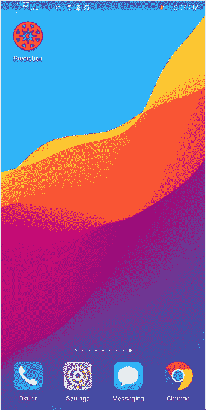
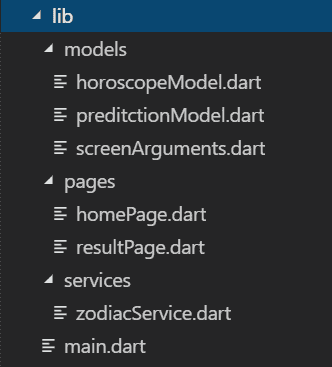

# 分享使用 Flutter 在创纪录的时间内开发近乎真实、漂亮的移动应用程序的经验

> 原文：<https://dev.to/atapas/experience-sharing-on-developing-a-near-realistic-beautiful-mobile-app-in-record-time-using-flutter-a1>

# 一些背景

我开发移动应用的经验非常有限。老实说，我很久以前就尝试过用 PhoneGap 做一些基本的东西，并用 Android SDK 开发了一些 T2 Hello World 风格的应用程序。但是没有一个渐进的成功让它成为一个有用的应用。

我已经对设置、构建、部署等的复杂性有了自己的理解。这导致我在过去尝试移动应用程序开发时非常不情愿。

最近我从谷歌上了解到了 [Flutter](https://flutter.dev/) 。引起我注意的是，

> 颤振-美丽的原生应用程序在创纪录的时间

我觉得，这句话太对了。在这里，我展示了我在 9 个小时左右(创纪录的时间，虽然不是连续的)开发出一个接近真实，(几乎)漂亮的原生应用程序的经验。)!

我会认为这是*创纪录的时间*,因为我从来没有任何工作经验，

*   作为编程语言的 Dart 及其 API。我必须学习，理解有用的 API 和代码。
*   构建任何与原生应用相关的东西。
*   设置= >开发= >移动应用程序的发布周期。

这篇文章是关于分享使用 Flutter 开发原生应用的快乐。我相信，如果你像我一样是初学者，你也会喜欢的。

# 这个 App 是关于什么的？

我不想再建一个 *Hello World* 了。我打算通过大量的实践，在短时间内学会以下内容:

*   了解所有的设置，而不会失去动力。
*   写好代码。
*   路由和导航，复杂吗？
*   布局与设计，我需要做设计师吗？
*   玩图像和风格，一定很容易！
*   使用 API 调用的服务器通信....
*   处理自定义图像/图标
*   包装和建筑
*   应用程序的安装
*   发布到 Play Store，乐趣就开始了。

我以前在使用 node-cli 开发[预测应用程序时享受了很多。打造一个*预测*手机 app 怎么样？互动是这样进行的:](https://blog.greenroots.info/a-step-by-step-guide-to-your-first-clicommand-line-interface-app-using-nodejs-cjvm6woau000mkvs1sd8u3qxm)

[](https://res.cloudinary.com/practicaldev/image/fetch/s--3KGysTyG--/c_limit%2Cf_auto%2Cfl_progressive%2Cq_66%2Cw_880/https://cdn.hashnode.com/res/hashnode/image/upload/v1559207835443/dVe-_XYEq.gif)

# 让我们一步一步来

以下是我从中学到的所有东西:

### 设置环境

我用过 Windows 10 操作系统，目的是在 Android 设备上开发和测试这款应用。然而，我最终也在 IOS 手机上测试了它**，没有改变任何源代码**。

设置环境，我只是按照这个: [Flutter 安装文档](https://flutter.dev/docs/get-started/install/windows)。一行一行地跟着它走。一切都会搞定的，我保证。

注意:如果你没有使用谷歌 Nexus 手机，你可能会觉得，你必须使用额外的驱动程序，你的操作系统连接到手机使用 USB 进行调试。你不需要做任何额外的事情。

### 设置编辑器进行编码和调试

我已经将 VS Code 配置为我的编辑器，用于编码和调试。下面是我用来设置它的链接:[颤振 VS 代码设置](https://flutter.dev/docs/get-started/editor?tab=vscode)

### 扑医生

继续运行`flutter doctor`命令以确保你在正确的轨道上。
[](https://res.cloudinary.com/practicaldev/image/fetch/s--hWfT1xWg--/c_limit%2Cf_auto%2Cfl_progressive%2Cq_auto%2Cw_880/https://cdn.hashnode.com/res/hashnode/image/upload/v1559240051056/adRdbFK4M.png)

### 代码结构

[Dart](https://dart.dev/) 是颤振背后的语言。在很多例子中，你会看到一个`main.dart`文件包含大量代码。随着应用程序的增长，这个文件变得难以管理。为了确保我不会落入这个陷阱，我将我的代码组织如下:

[](https://res.cloudinary.com/practicaldev/image/fetch/s--EIz0Pz4y--/c_limit%2Cf_auto%2Cfl_progressive%2Cq_auto%2Cw_880/https://cdn.hashnode.com/res/hashnode/image/upload/v1559240627351/PV2D9S8fo.png)

`main.dart`文件看起来像:

```
import 'package:flutter/material.dart';

import 'pages/homePage.dart';
import 'pages/resultPage.dart';

void main() => runApp(new PredictionApp());

class PredictionApp extends StatelessWidget {
  @override
  Widget build(BuildContext context) {
    return new MaterialApp(
      title: 'Prediction',
      theme: new ThemeData(
        primarySwatch: Colors.red,
      ),
      home: new HomePage(title: 'Prediction'),
       routes: <String, WidgetBuilder> {
        '/home': (BuildContext context) => new HomePage(),
        '/result' : (BuildContext context) => new ResultPage()
      },
    );
  }
} 
```

Enter fullscreen mode Exit fullscreen mode

### 路由

*预测* app 是一个多页 app。*主页*向用户询问信息。*结果页面*获取信息并显示给用户。还有一个返回*主页*的选项。嗯，我们需要**路由**。

`main.dart`文件中的这些行完成了这个任务:

```
routes: <String, WidgetBuilder> {
        '/home': (BuildContext context) => new HomePage(),
        '/result' : (BuildContext context) => new ResultPage()
} 
```

Enter fullscreen mode Exit fullscreen mode

### 布局、图片和样式

*预测*应用有多个*小工具*在使用中。比如，顶部的标题栏，内容的主体，有助于从用户那里收集信息的表单，按钮，图像，文本等。因此，以下倾向至关重要:

*   [小工具介绍](https://flutter.dev/docs/development/ui/widgets-intro)
*   [布局介绍](https://flutter.dev/docs/development/ui/layout/tutorial)
*   [学习互动](https://flutter.dev/docs/development/ui/interactive)

这些链接非常重要，信息丰富，值得关注。

### 服务器通讯

Flutter 使用基于插件的方法。默认情况下，框架本身并没有安装所有的东西。相反，我们需要安装我们需要的东西并导入到 dart 文件中来使用它。`Prediction`应用程序需要与[星座 API](https://github.com/tapaswenipathak/Horoscope-API) 交互，后者公开 HTTP 方法来获取数据。API 调用的响应格式是 *JSON* 。

为了支持这一点，我在`pubspec.yaml`文件中添加了以下依赖项:

```
http: ^0.12.0+2 
```

Enter fullscreen mode Exit fullscreen mode

并在`main.dart`文件中，将其与 Dart 语言本身提供的 json 解析器一起导入。

```
import 'package:http/http.dart' as http;
import 'dart:convert'; 
```

Enter fullscreen mode Exit fullscreen mode

这三行分别请求 API、接收 JSON 响应并解析:

```
final response = await http.get('http://horoscope-api.herokuapp.com/horoscope/' + predictionData.getDuration().toLowerCase() + '/' + zodiacSign);
final responseJson = json.decode(response.body); 
Horoscope horoscope = new Horoscope.fromJson(responseJson); 
```

Enter fullscreen mode Exit fullscreen mode

代码的最后一行解析响应 JSON，将值映射到模型(星座)属性。

`Horoscope`模型类就是这么简单:

```
class Horoscope {
  String horoscope;
  String sunsign;

  Horoscope({this.horoscope,this.sunsign});

  factory Horoscope.fromJson(Map<String, dynamic> parsedHoroscope){
      return Horoscope(
        horoscope: parsedHoroscope['horoscope'],
        sunsign : parsedHoroscope['sunsign']
      );
  }
} 
```

Enter fullscreen mode Exit fullscreen mode

### 处理自定义图像

我使用了许多自定义图像(主要是图标)来表示各种星座。包括自定义图像和图标都非常容易。

*   在`pubspec.yaml`文件的同一层创建一个名为`assets`的文件夹。
*   将所有图标和图像保存在`assets`文件夹中。
*   将以下条目添加到`pubspec.yaml`文件中，以包含资产文件夹中的所有图标和图像:

```
assets:
    - assets/ 
```

Enter fullscreen mode Exit fullscreen mode

如果您想包含选定的图标/图像，请分别指定名称。

### 调试、封装和构建

我使用了`Android Emulator`(作为设置的一部分安装的)和真实设备来调试应用程序。VS 代码的页脚栏显示了您连接到的设备，您可以在调试代码时选择一个设备。

[](https://res.cloudinary.com/practicaldev/image/fetch/s--Sg7Avaar--/c_limit%2Cf_auto%2Cfl_progressive%2Cq_auto%2Cw_880/https://cdn.hashnode.com/res/hashnode/image/upload/v1559243017538/xjf2BC7Uu.png)

要构建 APK，请使用以下命令:

```
flutter build apk 
```

Enter fullscreen mode Exit fullscreen mode

要在您的设备上安装 APK，请用 USB 连接设备并使用以下命令

```
flutter install -d DXXXXX0123456787 
```

Enter fullscreen mode Exit fullscreen mode

其中*dxxxxxx 0123456787*是您的设备 Id。

#### 关于部署 APK 的提示

*   您的应用程序可能使用互联网连接，如*预测*应用程序。确保在`android/app/src/main/AndroidManifest.xml`文件中添加以下行:

```
<uses-permission android:name="android.permission.INTERNET" /> 
```

Enter fullscreen mode Exit fullscreen mode

详见[本线程](https://github.com/flutter/flutter/issues/27883#issuecomment-495910150)。

*   你可能想定制应用程序的*启动图标*，比如在以`mipmap-`开头的文件夹下添加图标。这些可以位于，`android\app\src\main\res`下。然后修改`AndroidManifest.xml`文件指向图像/图标为

```
android:icon="@mipmap/icon"> 
```

Enter fullscreen mode Exit fullscreen mode

请注意，同样的文件可以被编辑以提供合适的应用程序名称和描述。

### 将应用发布到应用商店

如果到目前为止，你已经完成了 70%。请点击以下链接完成剩下的部分:

*   [安卓](https://flutter.dev/docs/deployment/android)
*   [IOS](https://flutter.dev/docs/deployment/ios)

就这些了。很简单，超级容易。最重要的是，纯粹的乐趣！

# 代码

随意克隆和增强来自 GitHub 的代码

[https://github.com/atapas/horoscope-app](https://github.com/atapas/horoscope-app)

您可以在以下视频(30 秒)中看到该应用的完整动作:

[https://www.youtube.com/watch?v=ZLYFX18TQCA](https://www.youtube.com/watch?v=ZLYFX18TQCA)

# 接下来是什么

接下来，我想与相机、蓝牙等硬件进行交互，并使用 Firebase 试用 [ML Vision。敬请期待！](https://pub.dev/packages/flutter_camera_ml_vision)

# 信用

*   由来自 www.flaticon.com 的 Freepik 制作的封面图标由 CC 3.0 授权

希望你喜欢这个开头。请告诉我你对移动应用程序开发或 flutter 的体验。我很乐意了解你对它的好恶。

继续阅读，继续关注，继续分享！

*这个故事最初是[发表在这里](https://blog.greenroots.info/experience-sharing-on-developing-a-near-realistic-beautiful-mobile-app-in-record-time-using-flutter-cjwb25ql2000efvs1ofac4azo)T3】*