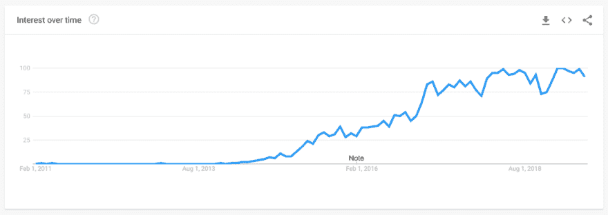
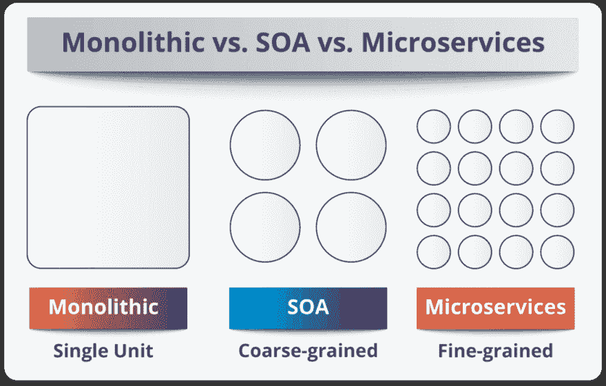

# 探索微服务架构:你需要知道什么

> 原文：<https://dev.to/pagely/exploring-microservices-architecture-what-you-need-to-know-4jg>

微服务架构(也称为“微服务”)是一种专注于构建单一功能模块的软件开发方法。这个术语是 2011 年创造的[，微服务方法在 2013 年底迅速流行起来:](https://en.wikipedia.org/wiki/Microservices#Introduction)

微服务的进步部分是由网飞、亚马逊、Twitter、谷歌和优步等科技巨头宣传其好处推动的。

## 微服务是怎么回事？

为什么会有人对微服务感兴趣？为了回答这个问题，我们需要简单地探索一下软件架构的发展。

### 巨石

不久以前，大多数软件都是“单一的”整体设计意味着用户界面和数据访问代码被组合成一个独立的程序。

单片软件设计有一些缺点。最值得注意的是，由于独石的自包含、相互依赖的性质，程序中任何地方的故障都可能导致整个应用程序崩溃。此外，还有其他问题:

*   **敏捷度降低。**应用程序的代码库一次全部发布。开发人员需要编码和部署整个堆栈。重新构建整个应用程序需要时间，并且会降低新功能的交付速度。
*   **复杂。**大型应用程序变得更加难以理解和使用。由于容易被忽视的依赖性，变化的副作用可能不明显，从而导致难以解开的“神秘和魔法”。
*   **可扩展性较差。**扩展变成了添加新实例来运行整个代码库，而不是添加实例来扩展应用程序中可能比其他应用程序更常用的各个部分。该应用程序的不均衡使用会导致一些资源被浪费，而另一些资源会使服务器不堪重负。

### 面向服务的架构

为了克服这些问题，面向服务的架构(SOA)在 21 世纪早期和中期被引入并流行起来。SOA 将应用程序视为并行运行的连接服务的集合。每个服务都是自包含的，并且代表一个具有期望结果的特定业务活动。

这种方法有助于解决单片软件设计固有的许多缺点:

*   **易于维护。**不同的服务可以在不影响其他服务的情况下更新。
*   **平台独立性。**您可以通过组合使用不同解决方案的服务来创建应用程序。
*   **可靠性[提高](https://pagely.com/blog/wordpress-data-reliability/)。**定位问题和调试小服务比整块服务更容易，单个服务宕机通常不会导致整个应用宕机。
*   **可扩展性。**随着需求的增加，单个服务可以通过添加服务器资源来扩展。

微服务架构(MSA)是 SOA 的一种变体。事实上，有些人认为 MSA 和 SOA 根本不是真正不同的东西，所以“微服务”这个术语是多余的。然而，这个术语似乎会一直存在下去。

## 什么是微服务？

[根据 Jerry Andrews](https://www.quora.com/What-are-the-alternatives-to-microservices/answer/Jerry-Andrews?ch=10&share=47420578&srid=QhZeq) 的说法，当人们谈论 MSA 时，他们通常指的是包含以下特征的软件设计:

*   服务通常依赖其他服务来完成它们的目标
*   服务被集装箱化
*   异步通信通过消息传递或作业队列来处理，同步通信通过 HTTP 和 JSON 消息来处理
*   实例管理自动化
*   自动缩放组件

对于确切的定义还存在一些争议，有些人可能会对这里重复的定义特征的某些方面提出异议。

SOA 和 MSA 也因粒度服务的不同而有所区别:

*来源:* [Dzone](https://dzone.com/articles/microservices-vs-soa-whats-the-difference)

个别服务的概念化方式也存在差异。SOA 从不同的角度看待服务:

*   商业服务
*   企业服务
*   应用服务程序
*   基础设施服务

相比之下，MSA 将服务视为纯粹的功能性服务(不像 SOA 那样从不同的角度看待它们)。微服务可能是为离散功能服务创建的，例如:

*   证明
*   电子邮件发送
*   账户管理
*   帐户创建
*   演员表
*   信息发送

## 微服务的优势

单个微服务的独立性质带来了[多种优势](https://skelia.com/articles/5-major-benefits-microservice-architecture/):

*   **简单。**微服务架构通常更简单，因此更易于构建和维护。
*   自主的跨职能团队。更小的团队可以更快地做出技术决策。
*   技术的灵活性。与 SOA 方法一样，微服务允许多种解决方案协同工作。
*   **灵活性[可扩展性](https://pagely.com/kb/en/what-is-horizontal-scaling/)。**微服务可以独立扩展，因此可以在需要的地方添加额外的资源。
*   **代码可以重复使用。**例如，在 [Pagely](https://pagely.com) 这里，我们能够使用一些 Pagely 制造的微服务来支持我们新的无服务器托管解决方案 [NorthStack](https://northstack.com) 。

*来源:* [骨骼](https://skelia.com/articles/5-major-benefits-microservice-architecture/)

## 微服务的缺点

虽然许多公司都在重构他们的 monoliths 以支持微服务方法，但微服务并不总是正确的答案。这不是每个人都应该使用的设计应用程序的完美方法。在许多情况下，特派任务生活津贴的好处大于坏处，但有时不是因为:

*   微服务会带来复杂性。monolith 的复杂性来自于理解不同代码如何交互的挑战性，MSA 的复杂性来自于将越来越多的代码分割成单独的服务。五六个服务不难管理，但是二十个、三十个或更多就难了！
*   **微服务需要改变文化和流程。**采用微服务的公司将需要采用敏捷的编码方法，并且通常需要创建一个开发运维团队。
*   微服务可能成本高昂。网络通话不是免费的，需要付费。此外，打碎整块石头的劳动成本会产生不必要的费用。
*   **微服务可能会引入安全问题。**每条网络间通信路径都会产生新的安全风险，需要加以解决和监控。

*来源:* [时代发展](https://www.tiempodev.com/blog/disadvantages-of-a-microservices-architecture/)

## 从整体服务转向微服务

许多应用程序开始时都是一个整体，但是随着它们的成熟，应该被分割成微服务的瓶颈变得明显起来。这个重构过程被称为“打破整体”这两种架构方法不是“非此即彼”的事情，也不是“对错”的事情——许多流行的应用程序都是整体微服务的混合体。

## 从零开始:整体架构与微服务架构

虽然微服务提供了超越整体的独特优势，但从头开始构建软件，然后转向微服务方法有时可能更有意义:

*   将应用程序开发为微服务通常比采用整体方法要慢(最初)
*   随着单片软件的成熟，大局更加清晰，应该拆分出来做微服务的功能会更加明显。
*   一个设计良好的整体可以很容易地被分解成微服务。

如果开发时间不成问题，那么从一开始就采用微服务方法可以避免后期重构的工作量和费用。您可以权衡吸收从微服务开始的时间成本与推迟这些成本并从整体开始的利弊。正确的答案将取决于公司及其项目的优先级。