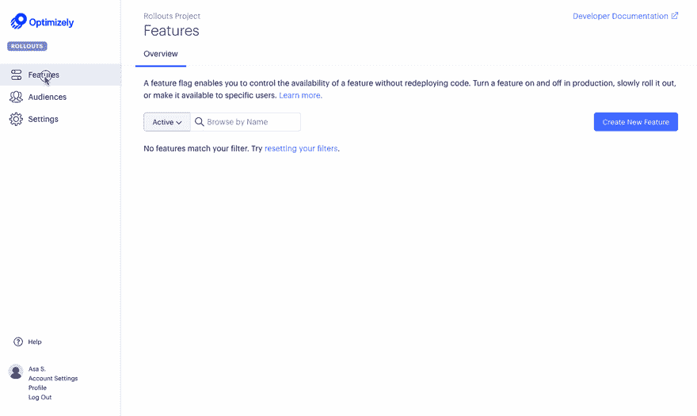
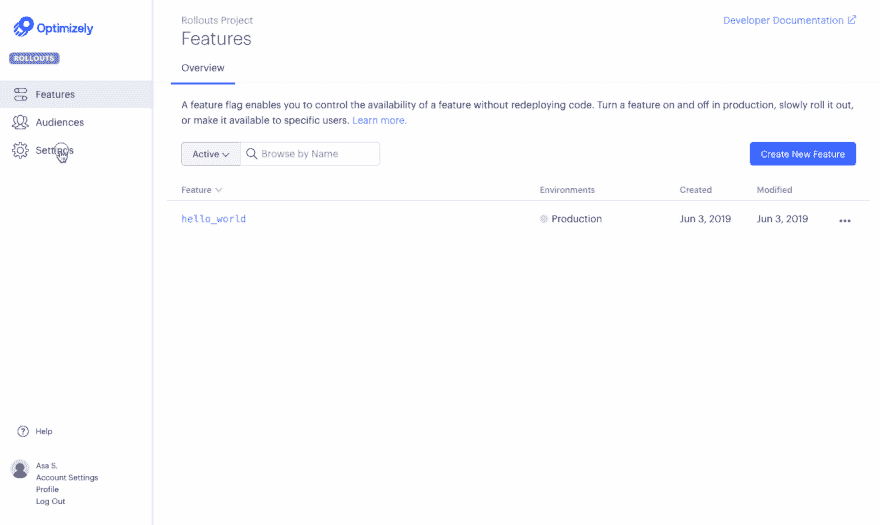

# 节点表达中的特征标志

> 原文：<https://dev.to/asaschachar/feature-flags-in-node-express-419c>

特性标志允许你慢慢地逐步展示一个特性，而不是进行一次冒险的大爆炸式的发布，并且在持续集成和持续交付环境中使用时非常有用。

在 Optimizely，我们通常使用[特性标志](https://www.optimizely.com/optimization-glossary/feature-flags/)来降低复杂部署的风险，比如推出新的 API。

然而，构建一个特性标记系统通常不是你公司的核心竞争力，而且会分散你对其他开发工作的注意力。

我是 Asa，Optimizely 的开发者代言人。在这篇 8 步博客文章中，我将展示如何通过使用优化的推出方式在 Express 中逐个客户地推出一个功能来获得强大功能标志的价值:一个完全免费的产品。

注意:如果您没有 Express 应用程序，我们建议您使用 [express-generator](https://expressjs.com/en/starter/generator.html) 创建一个

## 1。设置特征标志界面

创建一个免费的优化推出帐户。

在展开界面中，导航至“功能>创建新功能”并创建一个名为“hello_world”的功能标志。

[](https://res.cloudinary.com/practicaldev/image/fetch/s--vrg6EcLe--/c_limit%2Cf_auto%2Cfl_progressive%2Cq_66%2Cw_880/https://cdn-images-1.medium.com/max/2514/0%2AABRd6ZbG5T_ItaDs.gif)

要将您的“hello_world”功能连接到您的应用程序，请找到您的 SDK 密钥。导航到“设置>数据文件”并复制 SDK 键值。

[](https://res.cloudinary.com/practicaldev/image/fetch/s--68IC5Oae--/c_limit%2Cf_auto%2Cfl_progressive%2Cq_66%2Cw_880/https://cdn-images-1.medium.com/max/2514/0%2ARCw9o30U5qDPtXzX.gif)

## 2。安装快速推出中间件

Node Express 中间件允许您使用 JavaScript 在代码库中设置特性切换。

使用 npm:

```
npm install --save @optimizely/express 
```

或者使用纱线:

```
yarn add @optimizely/express 
```

使用 express 中间件，首先在 Express 服务器启动时配置 SDK。我们建议将它放在 app.js 或 index.js 文件顶部的其他导入附近。另外，记得用上面找到的 SDK 密钥替换。