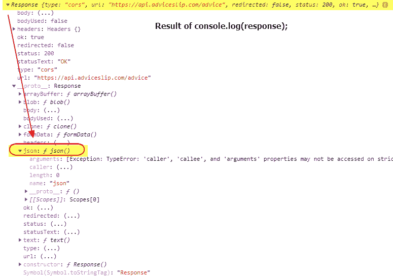

# 获取 API 101

> 原文：<https://dev.to/yogesnsamy/fetch-api-101-4mi9>

<u>鸣谢</u>:这篇分享是基于我在 Udemy 上学习超级牛逼的[网络忍者的 JavaScript 课程。](https://www.udemy.com/modern-javascript-from-novice-to-ninja/)

<u>先决条件</u>:一些(或更多)关于 [*承诺*的好知识是理解*获取*](https://scotch.io/tutorials/javascript-promises-for-dummies) 所必需的。

# 什么是*取*？

简单地说，这是从服务器获取数据/资源的现代方式。*取*是由*许诺*引擎盖下支持的。
它取代了 [XMLHttpRequest 对网络进行异步调用的使用。](https://www.w3schools.com/xml/xml_http.asp)

由于它的新功能， [*fetch* 还不能在所有的浏览器上运行。](https://developer.mozilla.org/en-US/docs/Web/API/Fetch_API)

# 调用*获取*

要使用*获取*，只需输入`fetch()`并使用以下参数之一:

*   一个 API 端点——例如 *`fetch("https://jsonplaceholder.typicode.com/todos/1");`*
*   一个本地资源——例如 *`fetch("todos/vela.json");`*

*fetch* 返回一个承诺，该承诺要么解决要么拒绝，我们使用`.then()`和`.catch()`来处理

因此， *fetch* 调用看起来会像下面这样:

```
fetch()
  .then(response => {
    //promise resolved, do something with result
  })
  .catch(err => {
    //promise rejected, handle the error
  }); 
```

# 访问*获取*响应

当承诺兑现时，**我们还不能访问我们想要的数据**。

例如，让我们运行下面的代码，它每次都会随机检索一条建议:

```
fetch('https://api.adviceslip.com/advice')
  .then(response => {
    //promise resolved, do something with result
    console.log('Resolved: ', response);
  })
  .catch(err => {
    //promise rejected, handle the error
    console.log('Rejected: ', err);
  }); 
```

代码返回一个*响应*对象。我们现在必须调用*响应*对象上可用的 *json* 方法来访问返回的数据。
[](https://res.cloudinary.com/practicaldev/image/fetch/s--Iqa-eDJ3--/c_limit%2Cf_auto%2Cfl_progressive%2Cq_auto%2Cw_880/https://thepracticaldev.s3.amazonaws.com/i/4b3owty0pedcwe7b8f3c.png)

# 在*响应*对象上调用 *json* 方法

如上图， *json* 是*响应*对象上的一个方法(我们可以通过展开 ***proto*** key 来看)。

我们需要在*响应*对象上调用 *json* 方法来获取我们需要的数据。

当调用 *json* 方法时，将返回另一个承诺，该承诺可以被解决或拒绝。因此，我们需要将第一个调用链接到另一个调用，以操作结果数据。

方法如下:

```
fetch('https://api.adviceslip.com/advice')
  .then(response => {
    //promise resolved, do something with result
    console.log('Resolved: ', response);
    //new code
    return response.json(); 
  })
  //new code
  .then(data => {
    console.log(data);
  })
  .catch(err => {
    //promise rejected, handle the error
    console.log('Rejected: ', err);
  }); 
```

输出:
[](https://res.cloudinary.com/practicaldev/image/fetch/s--qnxmS85O--/c_limit%2Cf_auto%2Cfl_progressive%2Cq_auto%2Cw_880/https://thepracticaldev.s3.amazonaws.com/i/6nii7d4f392hjxf8v2c1.png)

这就是女士们先生们，简而言之 *fetch* 的工作原理！

# 使用*获取*时要记住的三个步骤

1.  呼叫`fetch("xyz");`
2.  在响应上调用`response.json()`
3.  对数据做些什么

# 注意*响应*的 HTTP 状态代码

请注意， ***获取*不会失败，即使我们调用了不正确的端点/资源**。

比如调用一个不存在的路由像*[【https://api.adviceslip.com/】**advice xx**](https://api.adviceslip.com/)*不会让执行跳转到 *catch* 块！在这种情况下，仍然返回一个 *resolve* ，但是带有 HTTP 响应代码 **404** (而不是 **200** )。
[](https://res.cloudinary.com/practicaldev/image/fetch/s--X-Oy_k8c--/c_limit%2Cf_auto%2Cfl_progressive%2Cq_auto%2Cw_880/https://thepracticaldev.s3.amazonaws.com/i/nrq2r9ocd07mr5wye0eb.png)

所以在调用 *json* 之前，检查*响应*的 HTTP 状态码是个好主意。例如使用下面的代码:

```
fetch('https://api.adviceslip.com/advice<strong>xx</strong>')
  .then(response => {
    //promise resolved, do something with result
    console.log('Resolved: ', response);
//new code
    if (response.status === 200) {
      return response.json();
    }
    throw new Error('Resource not found');
  })
  //new code
  .then(data => {
    console.log(data);
  })
  .catch(err => {
    //promise rejected, handle the error
    console.log('Rejected: ', err);
  }); 
```

输出:
[](https://res.cloudinary.com/practicaldev/image/fetch/s--PE-OM5kY--/c_limit%2Cf_auto%2Cfl_progressive%2Cq_auto%2Cw_880/https://thepracticaldev.s3.amazonaws.com/i/6weyqpvihqxo0eawwqhy.png)

请查看堆栈溢出上的这个条目，了解关于*获取*和捕获错误的详细信息:[https://Stack Overflow . com/questions/38235715/fetch-reject-promise-and-catch-the-error-if-status-is-not-ok](https://stackoverflow.com/questions/38235715/fetch-reject-promise-and-catch-the-error-if-status-is-not-ok)