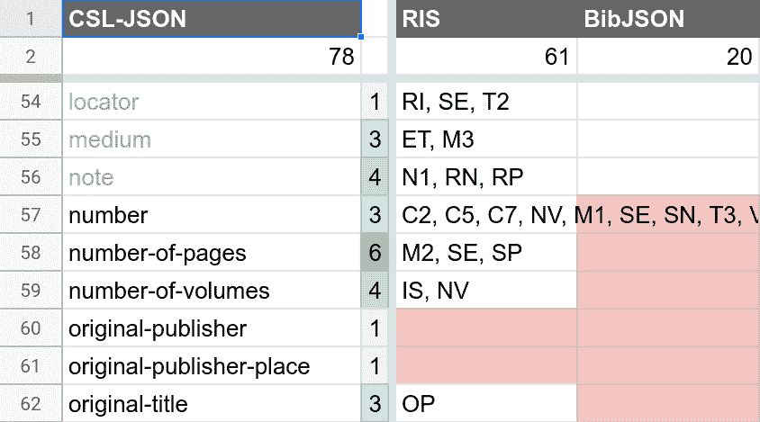

# 完成并检查两个映射

> 原文：<https://dev.to/citation-js/finishing-and-checking-both-mappings-4k8i>

在[的上一篇文章](https://dev.to/citation-js/creating-a-ris-mapping-from-the-original-specification-1kfo)中，我解释了我是如何开始实现我在互联网档案中找到的 RIS 规范的，结果却发现有一个更老的规范，有时似乎更常见。

现在，我已经实现了旧的规范，幸运的是它没有那么复杂。我注意到的一点是，有很多多余的标签:对于标题，有`TI`、`T1`、`CT`，通常还有`BT`；期刊名称有`JO` & `JF`，缩写期刊名称有`JA``J1`&`J2`。虽然我可以想象出这些标签之间在含义上的细微差别，但是这些含义并没有被记录下来，而且也不容易理解。无论如何，这对于实现来说不是问题。

我还更新了新规范的实现，修复了一些错误并添加了一些映射。此外，因为在现实生活中似乎有一些实现混合了这两种规范，所以我创建了一个基于新规范的实现，如果需要的话，它可以遵从旧规范——以及一些 Wikipedia 和 Zotero 在某处获得的随机属性，它们不在任何一种规范中。

结果如何？首先，上一篇文章中给我带来问题的例子现在看起来好多了:

```
{ issue: '1',
  page: '230-265',
  type: 'article-journal',
  volume: '47',
  title: 'On computable numbers, with an application to the Entscheidungsproblem',
  author: [{ family: 'Turing', given: 'Alan Mathison' }],
  issued: { 'date-parts': [[ 1937 ]] },
  'container-title': 'Proc. of London Mathematical Society' } 
```

当我第一次尝试时，唯一缺少的是页面范围的结尾，因为新规范中的`SP`是整个页面范围，而在旧规范中，你需要`SP`和`EP`。我不得不手动修复它——这不是问题，只是在重新运行脚本时需要记住的事情。

另一件要检查的事情是如何从上面看映射，没有所有类型特定的诡计。我保存了一个(公开的)电子表格，其中有从 CSL-JSON 到各种不同格式的映射，所以我添加了 RIS 映射。所以，理智检查。有意义吗？

[](https://res.cloudinary.com/practicaldev/image/fetch/s--dWry6MYR--/c_limit%2Cf_auto%2Cfl_progressive%2Cq_auto%2Cw_880/https://thepracticaldev.s3.amazonaws.com/i/v3uwmjcx11fp62v5slz0.png)

*没有*，一点也没有！RIS 标签`SE`被映射到 10 个不同的 CSL 变量，CSL `number`变量被映射到 9 个不同的 RIS 标签。对我来说，这没有任何意义，即使考虑到我知道条目类型之间存在一些差异这一事实。

剩下的问题是，它有用吗？即使它看起来没有意义，如果其他实现以类似的程度遵循规范，输出仍然是有意义的。我知道 Zotero 并没有完全遵循它——所有*被*实现的规范异常都归因于古怪的 EndNote 怪癖，而不是古怪的*规范*怪癖。

这让我想知道 EndNote 的实现在多大程度上遵循了规范。然而，我没有尾注，所以这是一个行动呼吁！你能通过将你的 RIS 出口提交给[一个 CC0 许可的回购](https://github.com/citation-js/ris-examples/tree/master/EndNote)来帮我清理 RIS 云吗？最好是各种参考类型——文章、书籍、章节、会议论文、网页、软件、专利、账单、地图、艺术品，任何你能找到的。出于法律原因，请用`[... omitted]`替换摘要和其他版权内容。

与此同时，我将从其他渠道收集 RIS 的出口数据，如 Zotero 和 Mendeley 以及谷歌学术、BMC 和 PubMed Central 等网站。如果你知道任何其他来源，请让我知道！