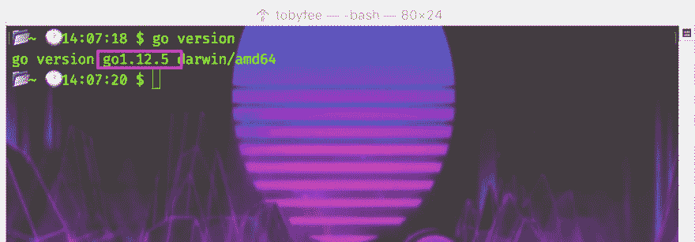
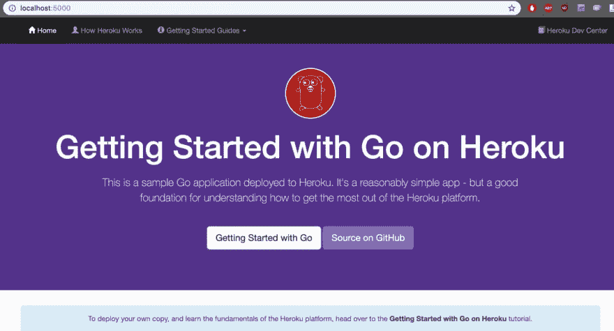

# Go 的第一步

> 原文：<https://dev.to/heroku/first-steps-with-go-4ggl>

这本指南是为一个理想的人而写的，我称之为“真正的初学者”:可能已经用其他语言写过东西，但刚刚开始学习围棋的人。如果你已经是一名 go 开发者，并且只是想知道如何部署到 Heroku，那么已经有了一个 rad 指南！

我将在几个步骤中使用命令行界面(CLI ),但我将彻底解释每个步骤。不需要预先的命令行知识，也没有编写 Go 的经验。您应该对 Heroku 和一般的平台即服务(PaaS)环境有所了解。好消息[我写了一篇关于 PaaS 的文章](https://dev.to/heroku/demystifying-platform-as-a-service-paas-55nh):)

# 你会需要的

1.  一台电脑
2.  一个 [Heroku 账号](https://signup.heroku.com/)

这个过程使用免费软件，像这样的小演示(以及更多)在 Heroku 上总是免费的。

# 1。安装 Go

我将讲述如何在你的 Windows 或 OSX 电脑上安装 Go。如果你运行的是 Linux，你可以从 Go Install 页面自己解决这个问题。

对于 Windows 或 OSX，这个过程非常简单，因为 Go 团队已经提供了安装程序。这是 macOS 的安装程序，这是 T2 的 Windows 安装程序。

让我们确保我们确实安装了正确的版本。我将使用命令行。

*这些截图来自 OSX 终端，但同样的命令在 Windows Powershell 上也能工作*

如果你运行`go version`

注意，如果你像这个作者一样在几个月前安装了 Go，你应该检查一下这个版本！Heroku 要求 1.12 以上版本，今年才发布！

# 2。安装 Heroku

如果你已经注册了一个 Heroku 账户，系统会提示你安装 Heroku 所需的本地工具(“Heroku Toolbelt”或者,“Heroku CLI ”,因为它是一个命令行界面),但是为了确保你已经安装了，运行`heroku -v`

如果看到类似`-bash: heroku: command not found`的消息，说明你没有安装 Heroku！安装 Heroku 比安装 Go 更容易，Heroku 开发中心有标准化的安装程序。

好消息，如果你安装了一段时间！Heroku CLI 会在您每次运行命令时检查更新。

# 3。获取 Go 演示

对于第一个演示，我们希望在下一个教程中创建我们的 fist Go 应用程序之前，确保所有部分都正常工作。为了减少可能出现的问题，我们将从一个已经在 Heroku 上运行的应用程序开始。GitHub 上有一个来自 Heroku 团队的。

要在本地获取它，首先在命令行上导航到要存储代码的文件夹。上面列出的命令行步骤可以在任何地方运行，但在这种情况下，我们希望确保我们将这个项目保存在正确的位置。如果你在从命令行导航目录和文件时遇到困难[https://learn.co/lessons/bash-navigation-osx](https://learn.co/lessons/bash-navigation-osx)它是为 OSX 写的，但在 Linux 和 Windows Powershell 上也能很好地工作！

好的，一旦你进入正确的文件夹，运行:

`git clone [git@github.com](mailto:git@github.com):heroku/go-getting-started.git`

Git 可能会要求您登录以获取存储库。

# 4。看到它在本地工作

我们将从构建我们的应用程序开始，这将获取依赖关系(引用一些代码来使我们的应用程序的代码工作)并将我们的代码编译成可以运行的东西。要构建我们的演示应用程序，请导航到我们刚刚下载的目录

`cd go-getting-started`

然后用

`go build -o bin/go-getting-started -v`

您将看到构建过程的一些输出，这里有一个示例:

如果你的终端是黑白的，不要担心，我只是非常酷。而[背景在这里](https://twitter.com/coffem0m/status/1126246835977240577) :)

这是 Heroku 的超能力之一:它旨在作为一种在云中的容器内运行你的应用程序的方式，但是你可以在你的笔记本电脑上模拟整个过程。在同一个目录中，在 Go 完成构建之后，只需运行:

`heroku local`

在本地启动我们的应用程序！这个过程完成后，在浏览器中打开 [http://localhost:5000/](http://localhost:5000/)

# 5。在 Heroku 云中运行演示应用程序

好了，我们的应用程序正在本地运行，是时候把它上传到云端了。打开您的终端:

哦，哇，这是什么？没有命令提示符，只有一些状态信息？终端仍在运行本地服务器，用 ctrl+c 关闭它

现在，使用以下内容为你的应用程序创建一个新列表:

`heroku create`

你会看到一个为你的应用程序生成的名字和网址(Heroku 不是创造了这么好的名字吗？)和应用程序的 URL，该 URL 显示我们的 go 应用程序，我们需要推送它！

注意，您还会看到生成了一个 git 地址。您可以将 heroku 的代码作为第二个 git 远程存储库来管理，当您想要更新应用程序时，可以将它推送到这个存储库。让我们现在就做吧！

`git push heroku master`

会把我们的应用推上 Heroku。如果你以前使用过 git 和 Github，你会注意到比你通常推送到存储库时发生的多得多，因为 Heroku 把你的推作为构建你的应用的信号。稍后更新应用程序时，这不会花费很长时间，但在云中创建一个全新的应用程序只需一分钟，最终您会看到:

`remote: Verifying deploy... done.`

现在你可以运行`heroku open`进入你的直播网站。

*因为这看起来应该和上面的本地版本一样，所以我不会把图片放两次:)*

# 下一步

我们现在有了一个部署管道，可以通过 Heroku 容器将我们的 go 应用程序发送到云端。我的下一篇文章将介绍如何写 Go 来真正做一些有趣的事情！