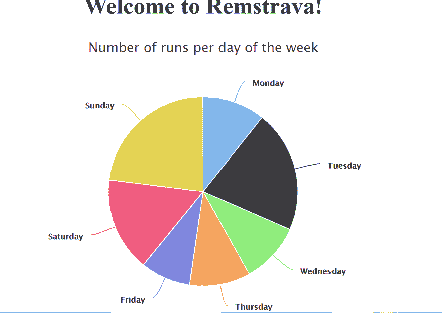
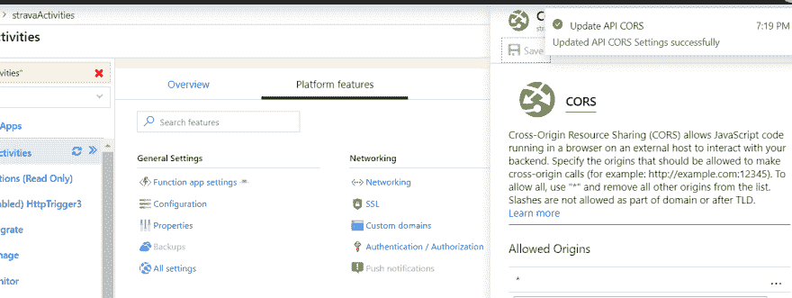

# 100 天代码的第一周

> 原文：<https://dev.to/remster85/first-week-of-100-days-of-code-hoi>

你好，欢迎来到我的第一篇文章！

我喜欢跑步和编码，将两者联系在一起的一个方法是参加围绕 Strava api 的 100 天编码游戏:这是最受跑步者欢迎的社交平台。

我参加挑战已经一周了，是时候总结和分享反馈了。

到目前为止，我已经:

*   一个静态的 [API](https://stravaactivities.azurewebsites.net/api/ActivitiesSample) 公开了一个普通跑步者的活动列表
*   在 azure[http://remstrava.azurewebsites.net](http://remstrava.azurewebsites.net)上运行的网站:
    *   显示每周活动明细的单一饼图
*   带有 Visual Studio 代码的本地环境设置，具有以下扩展名:
    *   Azure 帐户
    *   Azure 应用服务
    *   Azure 函数
    *   括号对颜色

[](https://res.cloudinary.com/practicaldev/image/fetch/s--gvsi6qFe--/c_limit%2Cf_auto%2Cfl_progressive%2Cq_66%2Cw_880/https://user-images.githubusercontent.com/23420546/59983514-ab49b400-95ee-11e9-85f5-f3534aa1ea50.gif)

到目前为止，这并不多，以下是我的反馈:

*   使用 azure cloud、angular + highchart、typescript 学习曲线
*   在我的个人台式机和笔记本电脑之间来回切换
*   框架选择是有问题的，我可以使用 power bi 来实现这个目的
*   在我意识到应该构建解决方案之前，部署花费了 30 多分钟

到目前为止，我面临的两个挑战是:
1)在我的 API 中引入 CORS。虽然我已经从门户网站激活了 Azure 函数 CORS，但在发布

[](https://res.cloudinary.com/practicaldev/image/fetch/s--6-VkOh-d--/c_limit%2Cf_auto%2Cfl_progressive%2Cq_auto%2Cw_880/https://user-images.githubusercontent.com/23420546/59983289-daaaf180-95eb-11e9-824f-5f57850be3ad.png) 后并没有考虑到它，我不得不在我的 api 的响应中手动添加标题，如下:

```
 headers  = {
                "Access-Control-Allow-Origin": "*",
                "Access-Control-Allow-Methods": "Get, Post, Options"
        }
        return func.HttpResponse(str, headers=headers) 
```

这应该显示在响应标题
[](https://res.cloudinary.com/practicaldev/image/fetch/s--8oloJoez--/c_limit%2Cf_auto%2Cfl_progressive%2Cq_auto%2Cw_880/https://user-images.githubusercontent.com/23420546/59983420-40e44400-95ed-11e9-9701-190dbd3638a0.png) 中

否则，您会遇到跨源资源共享错误..

**编辑** 2020-05-04:点网功能 App 级别的 CORS 设置已经足够。

2)从 API 中检索数据后更新 highchart，技巧是使用 Highcharts.charts 并确保组件已经可用。

```
 //TODO should type the data
   updateData(data : any){  
      Highcharts.charts[0].series[0].setData(data);
   } 
```

我在这里分享我每天的进展。

下周见。