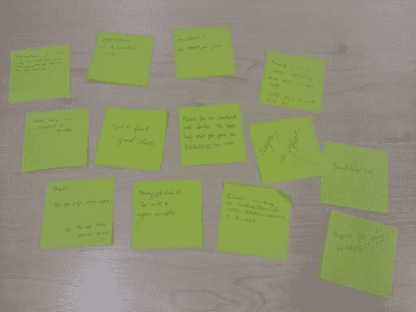
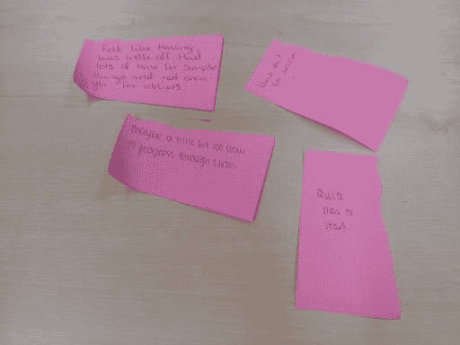
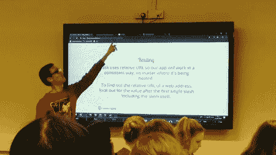

# 我从成为代码第一中学到的五件事:女孩教练

> 原文：<https://dev.to/darrenvong/five-things-i-learnt-from-being-a-code-first-girls-instructor-16n8>

对于当时在社交媒体上不太活跃的人来说，我仍然惊讶于我是如何偶然发现这条推文的，这就是一切是如何开始的:

液体错误:内部

快进到写这篇文章的时候，我已经成为谢菲尔德 Python 课程的 [Code First: Girls](https://www.codefirstgirls.org.uk/) (CF:G)讲师两年多了！

对于那些以前没有听说过 CF:G 的人来说，这是一个非营利性的社会企业(在英国和爱尔兰)，旨在鼓励更多的女性追求科技职业，并旨在缩小该领域的整体性别差距。目前，他们有一个持续的目标，到 2020 年教育 20，000 名女性编码，并且在撰写本文时刚刚超过目标的一半！

对于那些很了解我的人来说，他们知道我有多喜欢谈论我与 CF:G 的关系，所以这真的是我需要写的一篇迟到的文章！随着我们接近 2019 年的中点，我觉得现在是时候反思和分享我成为讲师以来学到的五件事了。

# 1。即时反馈很重要

你有没有参加过这样的课程:一旦你完成了课程，他们会要求你提供建设性的反馈？虽然课程结束时的反馈对下次课程的改进仍然非常有价值，但这些改进对那些参加课程的人来说是无益的！

为了确保参加课程的学生能够从课程中获得最佳体验，我们的讲师团队采取了更加积极主动的方法来获取反馈。每次会议开始时，我们都会给每个人发红色和绿色的便利贴。在整个过程中，学生们可以在笔记本电脑的背面贴上红色的便利贴，表示他们需要关于刚才内容的帮助，或者贴上绿色的便利贴，表示他们对目前为止的一切都很满意。

这真的很有效，因为它给了我们关于谁需要帮助的清晰、直观的反馈，以及关于我们是否以正确的速度进行事情的一般指示。

在课程结束时，我们要求学生在绿色便利贴上留下一件他们喜欢和/或认为我们在课程中做得很好的事情，以及一件我们可以在红色便利贴上做得更好的事情。通过这样做，我们基本上得到了课程结束时的反馈，因此可以在下次课程中及时改进我们做得不好的地方。这意味着现在的学生和未来的学生都将从改进中受益，所以这是一个双赢的局面！

<figure>

[](https://res.cloudinary.com/practicaldev/image/fetch/s--sLAdum5l--/c_limit%2Cf_auto%2Cfl_progressive%2Cq_auto%2Cw_880/https://thepracticaldev.s3.amazonaws.com/i/7hw37kofgnj6bvjc2d99.jpg)
[T6】](https://res.cloudinary.com/practicaldev/image/fetch/s--Vv7RLiaN--/c_limit%2Cf_auto%2Cfl_progressive%2Cq_auto%2Cw_880/https://thepracticaldev.s3.amazonaws.com/i/hnwah09a1cll4tdx1l7i.jpg)

<figcaption>Instant feedback with post-it notes.</figcaption>

</figure>

# 2。以初学者的心态教学

作为一名开发人员，我不得不承认，我们经常倾向于在一些语言泡沫中谈论事情，我们自动假设其他人都会理解。

将充满术语的技术概念解释分解到更低的层次是确保每个人都能理解课程内容的基本技能。对我来说，这当然不是一个容易的过程，但通过这样做，它有助于巩固我自己对编码基础的理解，我起初认为我很了解这些基础。毕竟，如果我不能用通俗的语言来解释它们，我可能就没有很好地理解这个概念。

我给你举个例子。假设一个学生有下面这段(非常做作的)Python 代码，并问:“为什么它不在命令行中打印任何东西？”

```
def print_message(message):
    print(message)

print_message 
```

Enter fullscreen mode Exit fullscreen mode

我们可以给出的一个可能的解释是:“哦，那是因为你没有调用这个函数。在你能看到任何东西之前，你必须用一个字符串参数做到这一点！”

初学我:
[](https://res.cloudinary.com/practicaldev/image/fetch/s--s8J9Mer7--/c_limit%2Cf_auto%2Cfl_progressive%2Cq_66%2Cw_880/http://i.giphy.com/media/a0FuPjiLZev4c/giphy.gif)

虽然这对我来说很有意义，但作为一名开发人员，我可以保证对于一些初学者来说，这听起来像是一堆胡言乱语。

我发现分解一个解释的一个好方法是后退一步，看看我在第一次解释尝试中会使用多少技术词汇。然后，仔细阅读这些单词，并思考以下内容:

*   有没有更简单的选择来表达同样的意思？换成那个，重复这个过程两到三次。
*   解释是不是全是缩略语？完整地拼写出来，并解释它们是什么！
*   第一个的解释*真的需要这个词吗？如果没有，请删除它。*

对于上面的最后一点——在书面解释中，像“显而易见”、“简单”、“琐碎”这样的词是很少需要的，应该去掉。我发现它们对初学者来说居高临下，令人生厌。除了让一些学生因为第一次没有理解而感到愚蠢之外，它什么也没有实现，这不是我们想要促进的气氛。

如果你对我给定例子的初学者友好的解释感兴趣，请在评论中告诉我！

# 3。在课堂上与学生交谈

在我没有在最前面传递内容的会议中，我发现四处走动并与学生交谈有助于判断每个人对内容的理解程度。

与学生交谈也能确保那些害羞不敢说话的人得到帮助！你可能会惊讶地听到，几乎每次，当我问学生们是否需要帮助时，他们都会有一个关于我们正在做什么的问题。当我们讨论更棘手的话题时，这种方法特别有效，因为一些学生远远落后，他们太专注于解决当前的问题，而忘记了我们可以帮助他们。在这种情况下与他们交谈确实帮助他们赶上了班级。

在他们真的没有任何问题的情况下，这是一个与他们联系并开始交谈的好机会，这可以打破严格的师生关系。我认为这一点很重要，这样他们就可以放心地以导师或朋友的身份与我们交谈，而不是想到要与另一位他们在大学里很可能经历过的尴尬而可怕的讲师交谈。

# 4。从“为什么”开始，而不是“如何”

根据经验和过去的反馈，为了帮助学生对事物如何运作有更深的理解，我发现在直接进入如何做某事之前，从我们为什么做某些事情开始更直观。

<figure>

[](https://res.cloudinary.com/practicaldev/image/fetch/s--4hqedfDW--/c_limit%2Cf_auto%2Cfl_progressive%2Cq_auto%2Cw_880/https://thepracticaldev.s3.amazonaws.com/i/7i9t5k83kzfwyxiulwti.jpg)

<figcaption>Me trying to explain why relative URLs are used in web frameworks.</figcaption>

</figure>

因为我们实际上只有六周的 Python 课程，所以对于初学者来说，有时会感觉像是一个大的主题大杂烩！特别是，由于该课程针对的是非技术背景的人，教授的主题需要时间让他们理解。在这个下沉的过程中，他们很容易忘记以前的课程。

在介绍一个新概念时，从“为什么”开始，并使用解释链接回以前课程中教授的概念，这将帮助学生看到更大的画面，并建立一个更好的思维模型，了解到目前为止教授的所有内容如何协同工作。这将有助于他们记住这些概念，并将它们更有效地应用到他们的课程项目中。

# 5。会后跟进

从经验来看，无论我们在课堂上讲得有多好，也不是每个人都能理解当时的所有内容，尤其是当所涉及的话题开始脱离基础的时候。有时，也许我给出的解释可以更好，这就是在一次会议后跟进可以帮助澄清的地方。

在其他时候，所涵盖的主题对于一些人来说太多了，以至于无法在会议中立即点击，因为我们都以不同的速度学习。学生们进入了他们不知道他们不知道什么的阶段，在课堂上问你任何问题。在这种情况下，根据过去的反馈，学生们发现，在两节课中间进行一个小型的脑筋急转弯练习有助于他们更好地理解所教的内容。

就我个人而言，由于我们在课堂上的时间有限，我也喜欢在这些脑筋急转弯中加入他们以前在课堂上可能没有见过的小事情，这样他们也可以学习新的做事方法。

* * *

关于教别人如何编码，你还有什么其他的小技巧吗？如果读完这篇文章后，你对成为 CF:G 教练感兴趣，或者你想知道我成为教练后学到了什么，请在评论中告诉我！