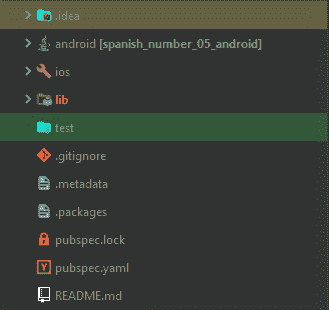

# 颤振工程结构

> 原文：<https://dev.to/jay_tillu/flutter-project-structure-1lhe>

和往常一样，我会非常直截了当，尽量让文章简短、简洁、精确。这样你很快就能学会这些东西。😉

要完全理解 flutter，我们需要理解它的项目结构，这样我们才能知道哪个文件和文件夹做什么，以及它们为什么存在。

## 我们主要使用的文件和文件夹

* * *

*   此部分包含我们在开发应用程序时主要使用的文件和文件夹。

#### Android 和 iOS 目录

*   ***Android*** 和 ***iOS*** 目录分别保存一个完整的 Android 和 iOS app，里面都是各自的文件。无论何时你想实现任何特定于平台的特性，你都可以通过进入这些目录来实现。

#### lib 目录

*   ***lib*** 目录保存了所有用于运行应用程序的 dart 代码。

#### pubspec.yaml

*   pubspec.yaml 是一个特殊的文件。它包含了你的 *app 名称*、*描述*、 *SDK 版本*、*依赖*，以及其他重要的东西。

#### 测试目录

*   ***测试*** 目录用于在 dart 中编写测试，类似于使用 Espresso 在 Android 中编写测试。

### 我们主要不碰的文件和文件夹

*   在 99.99%的情况下，我们不会碰这些文件。因为手动编辑它们会破坏整个项目(预计。gitignore 和 README.md😉).

*   。idea 目录包含所有项目特定的设置。设置主要以 XML 文件的形式存储。我们通常不碰这些文件夹。

*   的。gitignore file 是一个文本文件，它告诉 Git 要忽略项目中的哪些文件或文件夹。

*   。元数据，。packages，pubspec.lock 是 flutter 自己生成的。这些文件由框架本身内部使用。我们通常不碰它们。因为它们执行内部任务。

*   README.md 是一个 markdown 文件，主要用于版本控制，如 Git，用于表示其他文件的信息。

对项目结构的人来说就是这样。如果我错过了什么，请随时告诉我。我很乐意向你学习。此外，请查看 dart 和 flutter 部分，在我们的出版物中了解更多信息。

在那之前，继续热爱你的工作，继续愉快地工作。我一定会在下一篇文章中介绍您。😊

> 想和我联系吗？以下是链接。我很乐意成为你的朋友。T3】😊
> [推特](https://twitter.com/jay_tillu)
> [脸书](https://www.facebook.com/jaytillu.1314/)
> [insta gram](https://www.instagram.com/jay.tillu/)
> [Medium](https://medium.com/jay-tillu)
> 或者直接发邮件给我[jayviveki13@gmail.com](mailto:jayviveki13@gmail.com)