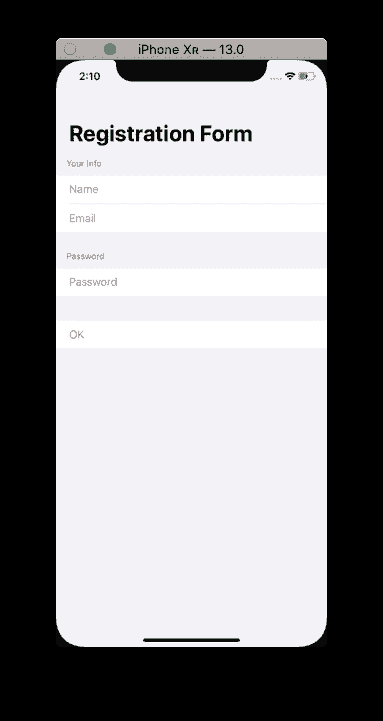
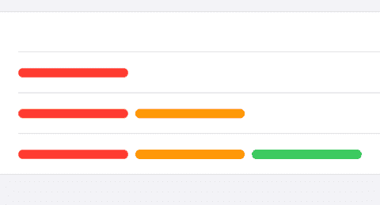

# 使用 SwiftUI 简化表单

> 原文：<https://dev.to/kevinmaarek/forms-made-easy-with-swiftui-3b75>

在本帖中，我们将使用 SwiftUI 构建一个注册表单。

[](https://res.cloudinary.com/practicaldev/image/fetch/s--awPJknEX--/c_limit%2Cf_auto%2Cfl_progressive%2Cq_66%2Cw_880/https://thepracticaldev.s3.amazonaws.com/i/fbscdtvza9e1o2u0y1lg.gif)

让我们从创建一个新的 Xcode 项目开始:选择一个单视图应用程序，不要忘记选中“使用 SwiftUI”。

[](https://res.cloudinary.com/practicaldev/image/fetch/s--c7yuZ0Lz--/c_limit%2Cf_auto%2Cfl_progressive%2Cq_auto%2Cw_880/https://thepracticaldev.s3.amazonaws.com/i/2gcylgksp7relfts3nyc.png)

Xcode 为你创建了一个内容视图，我们将使用这个结构作为我们的主视图。首先，我们将添加注册字段值。我们来说说姓名、电子邮件和密码。我们需要为我们的值使用属性包装器`@State`。如果你不知道@State property wrapper 是什么，我强烈推荐阅读我的[帖子](https://dev.to/kevinmaarek/property-wrappers-in-swiftui-34ok)关于 Properties Wrappers。
这是我们现在应该有的:

```
struct ContentView : View {

    @State private var name: String = ""
    @State private var email: String = ""
    @State private var password: String = ""

    var body: some View {
        Text("Hello World!")
    }
} 
```

Enter fullscreen mode Exit fullscreen mode

现在，在我们的视图中，我们希望创建一个包含表单的 NavigationView。

```
struct ContentView : View {

    @State private var name: String = ""
    @State private var email: String = ""
    @State private var password: String = ""

    var body: some View {
        NavigationView {
            Form {
                Text("Hello World!")
            }
            .navigationBarTitle(Text("Registration Form"))
        }
    }
} 
```

Enter fullscreen mode Exit fullscreen mode

现在，如果您构建并运行，您应该会看到:

[](https://res.cloudinary.com/practicaldev/image/fetch/s--xHZaWOF2--/c_limit%2Cf_auto%2Cfl_progressive%2Cq_auto%2Cw_880/https://thepracticaldev.s3.amazonaws.com/i/fuhtxi7l5zbc4z9pi9hm.png)

如您所见，表单对象创建了一个`List`，其中的每个`View`都将是一个单元格，就像我们这里的文本`Hello World!`。

在这个表单中，我们将删除 Hello World 文本并添加一些部分，实际上是三个部分。一个用于名称和邮件文本字段，另一个用于密码，最后一个用于我们的行动号召验证按钮。一个节有 3 个参数:一个页眉、一个页脚和内容(视图)。这里，我们将为前两个部分设置标题:

```
struct ContentView : View {

    @State private var name: String = ""
    @State private var email: String = ""
    @State private var password: String = ""

    var body: some View {
        NavigationView {
            Form {
                Section(header: Text("Your Info")) {
                    TextField($name, placeholder: Text("Name"))
                    TextField($email, placeholder: Text("Email"))
                }
                Section(header: Text("Password")) {
                    TextField($password, placeholder: Text("Password"))
                }
                Section {
                    Button(action: {
                                print("register account")
                            }) {
                                Text("OK")
                            }
                }
            }
            .navigationBarTitle(Text("Registration Form"))
        }
    }
} 
```

Enter fullscreen mode Exit fullscreen mode

这将导致:
[](https://res.cloudinary.com/practicaldev/image/fetch/s--cfxUjidH--/c_limit%2Cf_auto%2Cfl_progressive%2Cq_auto%2Cw_880/https://thepracticaldev.s3.amazonaws.com/i/lizllxbx2qmf6iua9nxf.png)

就是这样。我们现在有了一个用 SwiftUI 制作的简单表单。注意，我们用一个`$`来传递字段值，这样我们就有了一个双向绑定:文本字段读取和写入我们传递给它们的值。

现在，让我们试着给它添加一些东西...
我想添加一个密码安全级别的指示器。

首先，我们将为密码安全级别创建一个枚举:

```
enum PasswordLevel: Int {
    case none = 0
    case weak = 1
    case ok = 2
    case strong = 3
} 
```

Enter fullscreen mode Exit fullscreen mode

还有一个观点:

```
struct SecureLevelView : View {
    var level: PasswordLevel
    var body: some View {
        HStack {
            RoundedRectangle(cornerRadius: 8).foregroundColor(self.getColors()[0]).frame(height: 10)
            RoundedRectangle(cornerRadius: 8).foregroundColor(self.getColors()[1]).frame(height: 10)
            RoundedRectangle(cornerRadius: 8).foregroundColor(self.getColors()[2]).frame(height: 10)
        }
    }

    func getColors() -> [Color] {
        switch self.level {
        case .none:
            return [.clear, .clear, .clear]
        case .weak:
            return [.red, .clear, .clear]
        case .ok:
            return [.red, .orange, .clear]
        case .strong:
            return [.red, .orange, .green]
        }
    }
} 
```

Enter fullscreen mode Exit fullscreen mode

我们可以用一个级别初始化我们的视图，根据级别，它将显示正确的颜色，如下所示:

[](https://res.cloudinary.com/practicaldev/image/fetch/s--ubKYoteQ--/c_limit%2Cf_auto%2Cfl_progressive%2Cq_auto%2Cw_880/https://thepracticaldev.s3.amazonaws.com/i/kpna60db4hc4it47d7dk.png)

从上到下:。无(无颜色)。弱，。好的，。

现在，我们将创建一个处理保存和检查密码的类，而不是简单的密码值。我们需要这个类是可绑定的，这样它可以通知视图保护级别的变化。

```
class PasswordChecker: BindableObject {
    public let didChange = PassthroughSubject<PasswordChecker, Never>()
    var password: String = "" {
        didSet {
            self.checkForPassword(password: self.password)
        }
    }

    var level: PasswordLevel = .none {
        didSet {
            self.didChange.send(self)
        }
    }

    func checkForPassword(password: String) {
        if password.count == 0 {
            self.level = .none
        } else if password.count < 2 {
            self.level = .weak
        } else if password.count < 6 {
            self.level = .ok
        } else {
            self.level = .strong
        }
    }
} 
```

Enter fullscreen mode Exit fullscreen mode

别忘了进口联合收割机。

该类有两个属性:密码和级别。它也有一个 didChange 属性以符合 BindableObject。如果你不知道什么是可绑定对象，这里的是我解释这是什么和它如何工作的帖子。
这里我们想要的是在密码的 didSet 上更新密码级别，这样当密码的值被更新时，我们根据设置的密码来设置级别。设置好级别后，我们希望通知视图密码级别已经更改，这样它就可以更新 SecureLevelView。

所以在这里，在`checkForPassword`方法中，我选择制定简单的规则:保护级别取决于密码中的字符数，但是您可能需要使用实际的规则，用正则表达式检查大写字母、数字或特殊字符。

现在我们想在我们的视图中使用这个类，我们只需要删除 password 属性并用一个`PasswordChecker`替换它。

```
struct ContentView : View {

    @State private var name: String = ""
    @State private var email: String = ""
    @ObjectBinding var passwordChecker: PasswordChecker = PasswordChecker()

    var body: some View {
        NavigationView {
            Form {
                Section(header: Text("Your Info")) {
                    TextField($name, placeholder: Text("Name"))
                    TextField($email, placeholder: Text("Email"))
                }
                Section(header: Text("Password")) {
                    TextField($passwordChecker.password, placeholder: Text("Password"))
                    if !self.passwordChecker.password.isEmpty {
                        SecureLevelView(level: self.passwordChecker.level)
                    }
                }
                Section {
                    Button(action: {
                                print("register account")
                            }) {
                                Text("OK")
                            }
                }
            }
            .navigationBarTitle(Text("Registration Form"))
        }
    }
} 
```

Enter fullscreen mode Exit fullscreen mode

当密码为空时，我选择隐藏 SecureLevelView。

现在我们有的是:
[](https://res.cloudinary.com/practicaldev/image/fetch/s--vJuKNfYq--/c_limit%2Cf_auto%2Cfl_progressive%2Cq_66%2Cw_880/https://thepracticaldev.s3.amazonaws.com/i/1lxvh4j3dc04jie0l78f.gif)

我想要的最后一个功能是一个开关，让用户接受条款和条件。
我添加了一个新的@State 布尔属性:

```
@State private var terms: Bool = false 
```

Enter fullscreen mode Exit fullscreen mode

并且在章节:

```
 if self.passwordChecker.level.rawValue >= 2 {
                        Toggle(isOn: $terms) {
                            Text("Accept the terms and conditions")
                        }
                        if self.terms {
                            Button(action: {
                                print("register account")
                            }) {
                                Text("OK")
                            }
                        }
                    } 
```

Enter fullscreen mode Exit fullscreen mode

含义:如果密码保护级别高于`ok` ( `ok`或`strong`)，我们会显示“接受条款和条件”开关，只有当开关打开时，才会显示验证按钮。

我同意，这是一个可怕的 UX。但是现在您知道了如何使用 combine 构建简单的表单，并在用户输入时动态显示信息。

[](https://res.cloudinary.com/practicaldev/image/fetch/s--awPJknEX--/c_limit%2Cf_auto%2Cfl_progressive%2Cq_66%2Cw_880/https://thepracticaldev.s3.amazonaws.com/i/fbscdtvza9e1o2u0y1lg.gif)

希望你喜欢这个小帖子。你可以在我的 github 上的这里下载完整的源代码。

编码快乐！